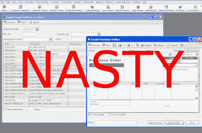

# 征服企业！

> 原文：<https://www.sitepoint.com/conquering-the-enterprise/>

## 什么是企业软件

企业软件多年来一直受到抨击。“那是为什么？”为什么为大型组织构建软件已经成为无聊的代名词？有些人说它很无聊，因为它没有回报。为“邪恶”公司工作很难保持兴奋。在我看来，这不是正确的态度。我想说，帮助数百万人管理他们的银行交易比构建另一个 Twitter 分析器有更大的价值。让我们至少不要拒绝为了钱而构建企业软件的想法。相反，让我们稍微思考一下什么是企业软件，以及 Ruby 是否可以成为构建企业软件的良好平台。

什么是企业软件？马丁·福勒的定义是:

*   企业应用程序是关于大量复杂数据的显示、操作和存储，以及使用这些数据的业务流程的支持或自动化。[【1】](#reference)

本质上，它是公司用来管理业务的软件。这里没有说它必须丑陋或过于复杂。没必要看起来像这样。

## 我们准备好了吗？

为了成为开发企业应用程序的良好平台，Ruby 必须为以下挑战提供补救措施:集成、领域建模和部署。

### 综合

如果你认为开发一个新的应用程序很难，试着把它和其他的集成起来。这是极其困难的。你通常无法控制其他系统。这意味着您必须处理他们自制的(或不存在的)API，您需要支持他们的新版本，并处理他们的停机时间。很艰难。但是我有一些好消息要告诉你——例如，用 C#编写集成代码并没有更好。

在过去几年里，所有主要融合手段的情况都有了显著改善。ActiveMQ？没问题。使用 Oracle、MSSQL 和 Sybase 数据库已经成为可能。但是即使它有所改进，您可能仍然会遇到一些没有 Ruby 适配器可用的技术。谢天谢地，这个问题有一个很好的解决方案:JRuby。一切都与 Java 集成，这使得 JRuby 成为应对所有集成问题的“银弹”。

### 领域建模

企业系统倾向于包含一大组表达重要领域的业务规则。配置规则并根据收集的数据做出决策通常是这些系统的目的。Ruby 是领域建模的好解决方案吗？确实是。Ruby 是一种高级语言；它可读性极强，并且具有一些元编程特性，这使得它非常适合于实现内部领域特定语言(DSL)。我认为 Ruby 是比 Java 或 C#更好的领域建模语言。

### 部署

部署在几年前可能是个问题。EY (Engine Yard)和 Heroku 是非常棒的解决方案，对于那些希望摆脱 IT 运营部门、将软件转移到云端的公司来说，效果非常好。然而，并不是每个人都想这么做。一些公司仍然有 Windows 服务器。他们仍然手动部署(这是一个拖放过程)。对于这样的公司，EY 和 Heroku 不是一个选择。管理另一个堆栈来部署 Ruby 应用程序？这是不可能的。使用他们现有的基础设施至关重要。这是 JRuby 真正大放异彩的另一个领域。对于这些公司来说，拥有一个可以放入 Tomcat 文件夹中的自包含可部署包有着巨大的不同。

## 他们准备好了吗？

如果我们承认 Ruby 平台对于构建企业应用程序已经足够成熟，我们能让大型企业也这么做吗？以我的经验来看，他们中的一些人真的很想尝试。他们正努力使他们的过程更有效率，更频繁地交付，更少的错误。很难。这就是为什么他们正在寻找能够实现这一目标的技术和平台。我坚信 Ruby 平台可以成为其中之一。

## 其他链接

对于那些对构建企业软件感兴趣的人，我强烈推荐以下书籍:

*   马丁·福勒。企业应用架构模式。这本书是每个开发者的必读之作，不管他或她的经验如何。甚至那些对企业软件完全不感兴趣的人也会发现这本书极其有用。
*   格雷格·霍佩和鲍比·伍尔夫。企业集成模式:设计、构建和部署消息传递解决方案。
*   埃里克·埃文斯。领域驱动设计:解决软件核心的复杂性。

有几本关于 JRuby 的好书:

*   查尔斯·O·纳特、托马斯·恩内博、尼克·西格尔、奥拉·比尼和伊恩·迪斯。使用 JRuby:将 Ruby 引入 Java。
*   乔·考特纳。用 JRuby 部署:使用 JVM 交付可伸缩的 Web 应用程序。

我写了几个和题目相关的帖子:

*   [面向 ruby 爱好者的信息系统介绍](https://www.sitepoint.com/introduction-to-messaging-systems-for-rubyists/)
*   Rails 开发者的 DDD。第 1 部分:分层架构。
*   Rails 开发者的 DDD。第 2 部分:实体和值

## 参考

马丁·福勒。企业应用架构模式。

## 分享这篇文章