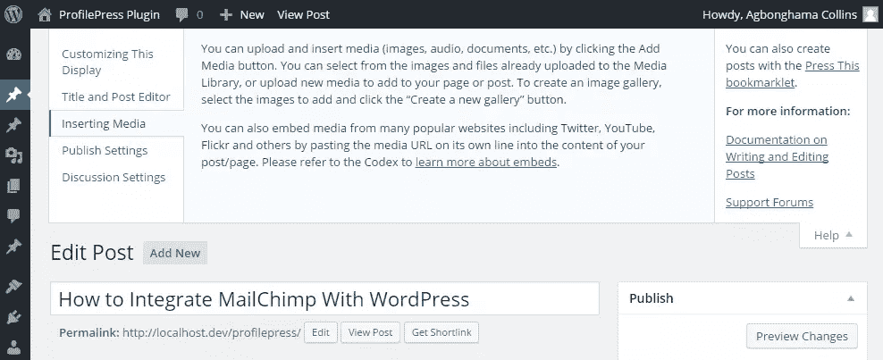

# 向自定义帖子类型屏幕添加上下文帮助选项卡

> 原文：<https://www.sitepoint.com/contextual-help-tab-custom-post-types/>

这个小小的“帮助”标签位于 WordPress 管理面板的右上角，当点击它时，会显示关于各种管理页面以及它们如何工作的有用信息，它被称为上下文帮助标签。

它是*上下文相关的*，因为它显示的信息与当前正在查看的管理页面相关。

例如，在编辑后屏幕中单击上下文帮助选项卡时，会显示有关如何执行多项任务的信息，包括以下示例:

*   如何自定义屏幕显示
*   如何输入文章标题和内容
*   如何将媒体文件插入文章内容
*   如何打开或关闭评论和 pings



如果你是一个插件或主题开发者，这将有助于为你的用户提供快速的文档，从而减少客户的支持问题。*如果你想学习主题开发，看看 SitePoint Premium 上的 [WordPress 主题开发](https://www.sitepoint.com/premium/courses/wordpress-theme-development-2931)课程*

创建自定义帖子类型和主题或插件设置页面时，不存在默认的上下文帮助选项卡。因此，在本教程中，您将学习如何向上述管理页面添加一个。

## 向帖子类型屏幕添加上下文帮助选项卡

[WP_Screen](https://codex.wordpress.org/Class_Reference/WP_Screen) 类的`add_help_tab()`和`set_help_sidebar`方法用于在管理页面的帮助选项卡中添加上下文帮助菜单和侧栏。

下面的函数将向管理页面的上下文帮助选项卡添加三个菜单。

目前，`sp_help_tabs`函数不会出现在任何管理页面上，因为您还没有定义它将在哪个页面上显示。

```
function sp_help_tabs() {

    $screen = get_current_screen();

    $screen->add_help_tab(
        array(
            'id'      => 'sp_overview',
            'title'   => 'Overview',
            'content' => '<p>Overview of your plugin or theme here</p>'
        )
    );

    $screen->add_help_tab(
        array(
            'id'      => 'sp_faq',
            'title'   => 'FAQ',
            'content' => '<p>Frequently asked questions and their answers here</p>'
        )
    );

    $screen->add_help_tab(
        array(
            'id'      => 'sp_support',
            'title'   => 'Support',
            'content' => '<p>For support, shoot us a mail via me@w3guy.com</p>'
        )
    );
} 
```

下面是添加到管理页面时上下文帮助选项卡的屏幕截图。


函数`get_current_screen()`返回当前正在查看的管理页面的一个`WP_Screen`对象，其值保存到`$screen`变量中。

接受以下参数的`add_help_tab()`方法被调用三次，为屏幕的上下文帮助添加三个菜单。

*   **id** :标签页的唯一 id。它必须是 HTML 安全的，不应该包含空格。
*   **标题**:标签页的标题。
*   **内容**:帮助页签的内容。可以是纯文本或 HTML。
*   **回调**:输出该页面内容时要调用的函数。

从上面的参数描述中，您可以看到第三和第四个参数是相关的——它们处理选项卡内容的显示。前者是一个包含纯文本或 HTML 格式内容的字符串，而后者是一个回调函数，用于回显或打印选项卡内容。

回调函数接受两个参数`$screen`和`$tab`，其中前者是当前页面的`WP_Screen`对象，后者是一个由`add_help_tab()`参数及其值组成的数组。

如果您希望在特定条件下显示选项卡内容，这两个参数会很方便。例如，您可能已经有了需要输出的内容，这使得只输出字符串更容易。但是，您可能需要操作一些东西来获取该内容，这使得回调的使用更加合适。

使用`callback`的例子:

```
function sp_help_tabs() {

    $screen = get_current_screen();

    $screen->add_help_tab(
        array(
            'id'       => 'sp_overview',
            'title'    => 'Overview',
            'callback' => function ( $screen, $tab ) {
                echo '<p>Overview of your plugin or theme here.</p>';
            }
        )
    );
} 
```

在上面的代码中，一个匿名函数被用作回调函数。命名函数也可以这样使用:

```
function sp_help_tabs() {

    $screen = get_current_screen();

    $screen->add_help_tab(
        array(
            'id'       => 'sp_overview',
            'title'    => 'Overview',
            'callback' => 'overview_content'
        )
    );
}

function overview_content( $screen, $tab ) {
    echo '<p>Overview of your plugin or theme here.</p>';
} 
```

`content`和`callback`都可以组合在一起，前者显示在后者之前。

```
function sp_help_tabs() {

    $screen = get_current_screen();

    $screen->add_help_tab(
        array(
            'id'       => 'sp_overview',
            'title'    => 'Overview',
            'content'  => '<p>Overview of your plugin or theme here.</p>',
            'callback' => function () {
                echo '<p>More detailed description of the plugin coming soon.</p>';
            }
        )
    );
} 
```

要将侧栏添加到屏幕的上下文帮助中，使用`WP_Screen`的`set_help_sidebar`方法，如下所示:

```
function sp_help_tabs() {

    $screen = get_current_screen();

    $screen->add_help_tab(
        array(
            'id'      => 'sp_overview',
            'title'   => 'Overview',
            'content' => '<p>Overview of your plugin or theme here</p>'
        )
    );

    $screen->add_help_tab(
        array(
            'id'      => 'sp_faq',
            'title'   => 'FAQ',
            'content' => '<p>Frequently asked questions and their answers here</p>'
        )
    );

    $screen->add_help_tab(
        array(
            'id'      => 'sp_support',
            'title'   => 'Support',
            'content' => '<p>For support, shoot us a mail via me@w3guy.com</p>'
        )
    );

    // Add a sidebar to contextual help.
    $screen->set_help_sidebar( 'This is the content you will be adding to the sidebar.' );
} 
```

要将上下文帮助选项卡添加到`book`自定义帖子类型屏幕，将`sp_help_tabs`功能与`load-edit.php`和`load-post.php`动作挂钩。然后，做一个有条件的检查，以确保你在一个`book` CPT 中，就像这样:

```
add_action( "load-edit.php", 'sp_help_tabs' );
add_action( "load-post.php", 'sp_help_tabs' );

function sp_help_tabs() {

    $screen = get_current_screen();

    $screen_ids = array( 'edit-book', 'book' );

    if ( ! in_array( $screen->id, $screen_ids ) ) {
        return;
    }

    $screen->add_help_tab(
        array(
            'id'      => 'sp_overview',
            'title'   => 'Overview',
            'content' => '<p>Overview of your plugin or theme here</p>'
        )
    );

    $screen->add_help_tab(
        array(
            'id'      => 'sp_faq',
            'title'   => 'FAQ',
            'content' => '<p>Frequently asked questions and their answers here</p>'
        )
    );

    $screen->add_help_tab(
        array(
            'id'      => 'sp_support',
            'title'   => 'Support',
            'content' => '<p>For support, shoot us a mail via me@w3guy.com</p>'
        )
    );

    // Add a sidebar to contextual help.
    $screen->set_help_sidebar( 'This is the content you will be adding to the sidebar.' );
} 
```

功能`sp_help_tabs()`与`load-edit.php`和`load-post.php`动作挂钩，因为您希望上下文帮助选项卡显示在文章类型列表(列出属于该文章类型的文章的页面)和文章编辑(编辑、保存和发布文章的管理页面)屏幕中。

为了确保将上下文帮助选项卡添加到`book`自定义文章类型屏幕，您在函数中使用了`if`条件语句来确保当前屏幕 ID 是`edit-book`或`book`。*注意`load-edit.php`和`load-post.php`动作挂钩中的屏幕 ID 分别为`edit-book`和`book`。*

如果您希望在`book`发布列表和`edit-book`屏幕中显示的上下文帮助选项卡不同，将包含选项卡内容的两个函数与`load-edit.php`和`load-post.php`挂钩，如下所示:

```
add_action( 'load-edit.php', 'post_listing_screen_help_tab' );

/**
 * This will be added to the admin page listing all post in "book" CPT.
 */
function post_listing_screen_help_tab() {

    $screen = get_current_screen();

    if ( 'edit-book' != $screen->id ) {
        return;
    }

    $screen->add_help_tab(
        array(
            'id'      => 'book_review',
            'title'   => 'Book Reviews',
            'content' => '<p>How to add a book review here</p>'
        )
    );

    // Add a sidebar to contextual help.
    $screen->set_help_sidebar( 'This is the content you will be adding to the sidebar.' );
}

add_action( 'load-post.php', 'post_edit_screen_help_tab' );

/**
 * This will be added to the admin page for editing a post belonging to "book" CPT.
 */
function post_edit_screen_help_tab() {

    $screen = get_current_screen();

    if ( 'book' != $screen->id ) {
        return;
    }

    $screen->add_help_tab(
        array(
            'id'      => 'edit_book_review',
            'title'   => 'Book Review Edit',
            'content' => '<p>How to edit a book review entry.</p>'
        )
    );

    // adds a sidebar to contextual help.
    $screen->set_help_sidebar( 'This is the content you will be adding to the sidebar.' );
} 
```

## 将上下文帮助选项卡添加到设置页面

添加一个帮助标签到插件或者主题设置页面和上面添加的文章类型页面的过程是一样的。
唯一的区别是包含上下文帮助选项卡设置的函数将被挂钩到的`action hook`，在本例中是由`add_menu_page()`返回的`hook_suffix`。如果您正在创建一个顶级菜单，或者`add_submenu_page()`如果它是一个子菜单。

下面的代码为我们的演示插件和添加到插件设置页面的上下文帮助选项卡创建了一个顶级菜单。

```
add_action( 'admin_menu', 'register_plugin_page' );

function register_plugin_page() {

    $hook_suffix = add_submenu_page( 'plugins.php', 'SitePoint Plugin', 'SitePoint', 'manage_options', 'sp-config', 'sp_plugin_page' );

    add_action( "load-$hook_suffix", 'sp_help_tabs' );
}

function sp_plugin_page() {
    /* Code for the settings page will go here */
}

function sp_help_tabs() {

    $screen = get_current_screen();

    $screen->add_help_tab(
        array(
            'id'      => 'sp_overview',
            'title'   => 'Overview',
            'content' => '<p>Overview of your plugin or theme here</p>'
        )
    );

    $screen->add_help_tab(
        array(
            'id'      => 'sp_faq',
            'title'   => 'FAQ',
            'content' => '<p>Frequently asked questions and their answers here</p>'
        )
    );

    $screen->add_help_tab(
        array(
            'id'      => 'sp_support',
            'title'   => 'Support',
            'content' => '<p>For support, shoot us a mail via me@w3guy.com</p>'
        )
    );

    $screen->set_help_sidebar( 'This is the content you will be adding to the sidebar.' );
} 
```

由`add_menu_page()`返回的`hook_suffix`被保存到`$hook_suffix`变量中，然后与`load`前缀一起形成一个`load-$hook_suffix`动作，该动作用于将我们的上下文帮助标签`sp_help_tabs()`包含到插件设置页面中。

## 结论

在本教程中，我们学习了什么是上下文帮助标签，它的重要性，以及如何在 WordPress 文章类型和插件/主题设置页面中实现，希望能减少支持问题和技术客户帮助！

如有任何问题或投稿，请在下方留言评论！

## 分享这篇文章