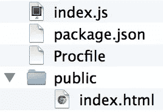

# 使用 Javascript 和在{X}上控制网页

> 原文：<https://www.sitepoint.com/controlling-web-pages-javascript-onx/>

我的手机丢了。我把它放在购物中心的沙发上，回来时发现它不见了。有人通过可怕的偷窃艺术得到了一部新手机。我通过网络将 JavaScript 代码远程发送到我的手机上，每当我发短信时，它就会将设备的坐标发送给我。我追踪它到一家时时乐餐厅，直到他们关掉手机，它永远消失了。我给自己买了一部新手机，但在一个功能强大的应用程序中看到了新的潜力，我很少使用这个应用程序，直到在{X}上调用它。

在这篇文章中，我将分享一个与我丢失手机的恐怖故事相比非常不同的应用程序的使用。我将向您展示如何使用您的 Android 设备向实时网页发送远程指令。我将使用远程控制 HTML 演示的例子，但是概念可以扩展到做许多有趣的事情。

我们将使用以下技术:

*   安卓设备
*   [于{X}日](http://onx.ms/ "on{X} - automate your life")
*   [Node.js](http://nodejs.org/ "node.js")
*   [快递](http://expressjs.com/ "Express - node.js web application framework")
*   [插座。IO](http://socket.io/ "Socket.IO: the cross-browser WebSocket for realtime apps.")
*   [Deck.js](http://imakewebthings.com/deck.js/ "deck.js » Modern HTML Presentations")
*   [Heroku](http://heroku.com/ "Heroku | Cloud Application Platform")

如果你没有安卓手机，也不用担心！理论上，您可以使用任何其他能够进行 HTTP 调用的设备来处理相同类型的节点/套接字。我们将要释放的木卫一魔法。本文假设读者对 Node.js 和 JavaScript 有所了解，但是提供的源代码仅供参考。

## 什么是插座。木卫一？

在我们深入讨论这个问题之前，我先解释一下是什么插座。IO 会，因为它将出现在接下来的几个代码片段中。插座。IO 是一个 JavaScript 库，支持服务器和客户端之间的实时通信。它允许您在服务器和客户机上定义事件。例如,`io.sockets.emit('eventthathappened')`创建了一个应用程序可以响应的新事件。要对事件做出反应，只需建立一个类似于–`socket.on('eventthathappened', function(){})`的事件处理程序。

聊天程序是一个常见的套接字示例。IO 应用。服务器监听来自任何客户端的传入消息，并在运行聊天应用程序的所有客户端上即时显示它们。当页面打开时，我们将使用它来即时响应来自 Android 设备的信号。

## 设置服务器

该演示的目录结构如下图所示。所有的服务器端代码都存储在主 JavaScript 文件`index.js`中。前端 HTML、CSS、JS 存储在`public`文件夹中。



`package.json`文件定义了节点应用程序的依赖关系和其他元信息。该文件的内容如下所示。请注意，Express 和 Socket。`dependencies`中需要 IO 模块。

```
{
  "name": "androidremotecontrol",
  "version": "0.0.1",
  "dependencies": {
    "express": "3.1.x",
    "socket.io": "latest"
  },
  "engines": {
    "node": "0.10.x",
    "npm": "1.2.x"
  }
}
```

由于这个演示打算在 Heroku 上进行，我们需要一个`Procfile`，其内容如下所示(非常简单！).

`web: node index.js`

### 节点服务器

存储在`index.js`中的节点服务器如下所示。

```
var http = require('http'),
    express = require('express'),
    app = express(),
    server = require('http').createServer(app),
    io = require('socket.io').listen(server),
    port = process.env.PORT || 5000;

app.use(express.bodyParser());

app.get('/', function(request, response) {
  response.sendfile('public/index.html');
});

app.post('/nudging', function(request, response) {
  io.sockets.emit('nudge'+ request.body.nudged);
  response.json({success: true});
});

app.get(/^(.+)$/, function(req, res) {
  res.sendfile('public/' + req.params[0]);
});

server.listen(port, function() {
  console.log('Listening on ' + port);
});

io.configure(function() {
  io.set('transports', ['xhr-polling']);
  io.set('polling duration', 10);
});
```

从`index.js`开始的以下几行用于导入套接字。IO 并设置服务器的端口。

```
io = require("socket.io").listen(server),
port = process.env.PORT || 5000;
```

为了插座。为了在 Heroku 上工作，我发现我必须添加这些额外的行来配置 xhr-polling，而不是依赖于 WebSockets(您的环境可能不需要这些)。这些行告诉服务器，如果对`GET`或`POST`请求没有具体的响应，在用空响应回答之前等待 10 秒钟。

```
io.configure(function () {
  io.set("transports", ["xhr-polling"]);
  io.set("polling duration", 10);
});
```

### 控制演示幻灯片

这个演示使用了 Deck。JS，但是可以随意替换任何其他 HTML 演示模板，只要它有 JS 调用来在幻灯片之间移动。为了甲板。JS，简单下载解压到`public`文件夹。

节点服务器中最重要的路径是允许我们与演示幻灯片交互的`POST`请求。这条路线如下所示。

```
app.post('/nudging', function(request, response) {
  io.sockets.emit('nudge'+ request.body.nudged);
  response.json({success: true});
});
```

前面的代码根据请求中发送的 JSON 数据调用`io.sockets.emit('nudgeleft')`或`io.sockets.emit('nudgeright')`。这里要强调的一点是，路由用 JSON 响应。如果不这样做，您的请求将会超时，因为它们会等待服务器的响应。此时，您可以在本地运行服务器，或者将其推送到 Heroku 进行部署。

#### 正在配置套接字。超正析象管(Image Orthicon)

额外的 JavaScript 已添加到`public/js/magic.js`中的演示文稿，如下所示:

```
(function() {
  var socket = io.connect(window.location.hostname);

  socket.on('nudgeleft', function() {
    $.deck('next');
  });

  socket.on('nudgeright', function() {
    $.deck('prev');
  });
}());
```

第一条线连接到我们的插座。在`window.location.hostname`的 IO 服务器。出于演示的目的，我们将保持简单，将所有内容放在一个域中。这两个事件处理程序监听任何向左或向右挪动幻灯片的请求。如果它注意到这些，我们就跑甲板。JS 的`prev`或`next`功能移动载玻片。

## on{X}秘制酱料

on{X}是一个 Android 应用程序，允许您控制您的 Android 设备，并通过 JavaScript API 对收到的文本消息、GPS 定位、电池寿命等事件做出响应。在这个演示中，我们将使用它在轻推发生时发送那些服务器请求。

### {X}开始使用

1.  将应用程序下载到您的设备:[https://www.onx.ms/#!downloadAppPage](https://www.onx.ms/#!downloadAppPage "on{X} - automate your life")。
2.  下载时，在桌面浏览器上转到 [https://www.onx.ms](https://www.onx.ms "on{X} - automate your life") ，使用您的脸书帐户登录{X}(别担心，这只是用来在您的设备和{X}上同步代码)。
3.  您将被带到{X}的仪表板。如果你感兴趣的话，你可以去 recipes 探索已经存在的令人兴奋的代码片段，但是在本教程中，我们将直接研究定制代码。
4.  单击页面左上角的编写代码链接，打开代码编辑器。
5.  让窗口开着，我们要在里面添加一些代码。

### 在{X}上编码

如上所述，on{X}有一个 JavaScript API，可以让您调用和检测 Android 设备上的许多事件。对于这个演示，我们主要关注`device.gestures.on`方法。

要做的第一件事是返回到在{X}上打开代码编辑器的窗口，您将看到“规则名称:”，将其重命名为更友好的名称，如“微移演示控件”。我的 on{X}代码如下所示。请注意，您将需要用自己的服务器替换 http://androidremotecontrol.herokuapp.com。

```
device.gestures.on('nudgeLeft', function() {
  device.notifications.createNotification('the phone was nudged left').show();
  device.ajax({
    url: 'http://androidremotecontrol.herokuapp.com/nudging',
    type: 'POST',
    dataType: 'json',
    data: '{"nudged":"left"}',
    headers: {'Content-Type':'application/json'}
  }, function onSuccess(body, textStatus, response) {
    console.info('successfully received http response!');
  }, function onError(textStatus, response) {
    var error = {};
    error.message = textStatus;
    error.statusCode = response.status;
    console.error('error: ',error);
  });
});

device.gestures.on('nudgeRight', function() {
  device.notifications.createNotification('the phone was nudged right').show();
  device.ajax({
    url: 'http://androidremotecontrol.herokuapp.com/nudging',
    type: 'POST',
    dataType: 'json',
    data: '{"nudged":"right"}',
    headers: {'Content-Type':'application/json'}
  }, function onSuccess(body, textStatus, response) {
    console.info('successfully received http response!');
  }, function onError(textStatus, response) {
    var error = {};
    error.message = textStatus;
    error.statusCode = response.status;
    console.error('error: ',error);
  });
});

device.gestures.startDetection(900000);

device.screen.on('on', function () {
  // Start gestures detection for 1 minute
  device.gestures.startDetection(900000);
});
```

`device.gestures.on`组件用于设置事件处理程序。每当{X}检测到向左微移，就会调用`nudgeLeft`处理程序。我们有一行代码，基本上在你的手机上显示一个通知，显示手机被向左轻推。你不需要这个，但我用它来测试，以确保检测到微移。该行代码如下所示。

```
device.notifications.createNotification('the phone was nudged left').show();
```

接下来，我们使用 on{X}的`device.ajax`方法向服务器发送 JSON 数据。注意，数据类型被显式定义为 JSON。没有这个，数据就不能正确发送。

目前，`onSuccess`回调函数只是用来记录 HTTP 响应是否成功。这映射到我们之前在节点服务器中设置的`response.json({success: true})`。如果您愿意，您可以在此成功电话中添加更多内容，为{X}提供更多数据。类似地，`onError`回调用于记录发生的任何错误。

接下来，我们开启对这些手势的检测 900，000 毫秒。这将在您首次在设备上启用代码时运行。您可能希望这段代码运行的时间超过 900，000 毫秒。我目前个人设置的方式是，每次设备屏幕出现时打开它。因此，如果你想控制你的幻灯片，只需打开屏幕，你有 900 秒的疯狂时间。从我发现，而发展，你必须提供这个功能的时间限制。如果你找到其他方法，请在评论中告诉我。我很乐意更新它。

一旦您更新了代码以匹配您的服务器地址，并且一切准备就绪，请单击“保存并发送到手机”,以便通过网络将其发送到您的手机。从那里，打开你的演示网址，打开你的 Android 设备的屏幕，尝试左右轻推。如果一切顺利，你会看到你的幻灯片来回切换！

### 查看{X}个日志

如果你想查看{X}上的日志文件，你可以在 Android 手机上打开该应用，选择你添加的规则，然后选择“查看日志”。或者，当您登录到您的规则页面，选择规则并单击“日志”选项卡时，您可以在{X}网站上看到它们。

### 安全呢？

这种方法无论如何都不安全。如果其他人知道了你的演示地址和你发送的请求，他们可以很容易地从世界任何地方切换你的幻灯片。对于这一点和任何其他想法，你想出了有关插座。IO 和{X}上，请记住，您会希望在某个地方为像这样过于普通的东西添加一层安全性。

## 结论

这个演示背后的想法是，用 JavaScript，Socket。IO 和一个非常漂亮的 Android 应用程序，你可以用你的手机以任何方式影响网页。左右滑动演示幻灯片仅仅是开始。你可以根据你的位置、你是否有应用程序在运行、你的电池是否快没电了等等来改变网页显示的内容。如果您确实在{X}和 Socket 上创建了一个小实验。木卫一，我很想听听。去写点什么吧！

### 代码

这个演示的所有代码都在 [GitHub](https://github.com/patcat/androidremotecontrol "patcat/androidremotecontrol - GitHub") 上。我的跑步版本也可以在 [Heroku](http://androidremotecontrol.herokuapp.com/ "JavaScript Beyond the Web") 上下载。

## 分享这篇文章