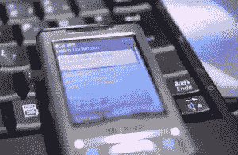
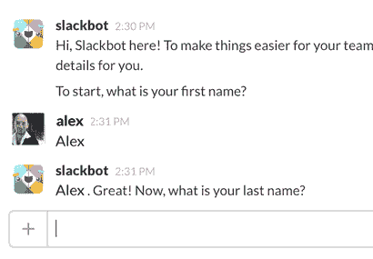
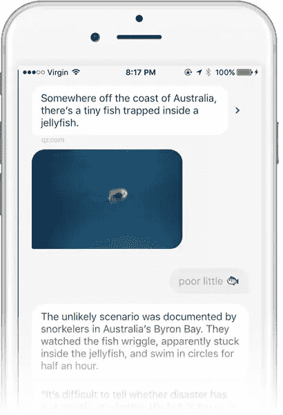
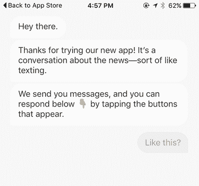
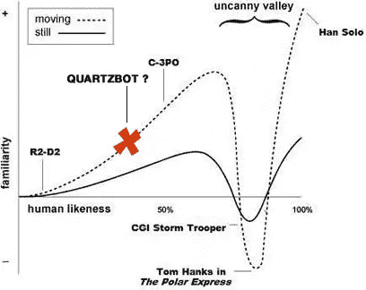

# 对话界面，R2-D2 和避免恐怖谷

> 原文：<https://www.sitepoint.com/conversational-uis-r2-d2-and-avoiding-the-uncanny-valley/>

第一个“*杀手级手机应用*是什么？我说的是第一个有成群结队的人第一次买手机只是为了用的非语音产品？

是谷歌地图吗？也许是 YouTube 应用程序？珠光宝气？法姆维尔？脸书？

<small>短信:第一杀手级 app。</small>

不——尽管它们可能很重要，但我认为最初的杀手级应用应该是[短信](https://en.wikipedia.org/wiki/Short_Message_Service)(或短信)。互相发送短信听起来并不创新或令人兴奋，但从 90 年代早期开始，短信推动了手机市场，同时为电话网络提供商提供了利润丰厚的收入来源。

人们喜欢短信有三个原因。

1.  这是私人的。
2.  很简单。
3.  感觉很熟悉。

我们大概都在课堂上传过纸条，贴在冰箱门上。短信只是让我们在世界各地传递它们。

许多最初的大型台式电脑在线服务都采用了同样的聊天方式——ICQ、T2、雅虎 IM、T4、AIM 和 MSN Messenger。即使在今天, [Facebook Messenger](https://www.messenger.com/) 、 [Whatsapp](https://www.whatsapp.com/) 、 Twitter 和 [Slack](https://slack.com/) 每天都有数十亿用户互相发送短信。

我们能说什么呢？人类 ***真的*** 喜欢这种格式。

## 对话式用户界面的诞生

在过去的三年里，一种新的用户界面出现了。Slack 是最早意识到这种“T0”人对人的“T1”聊天模式同样适用于“T2”人对应用程序的“T3”互动的公司之一。

Slack 没有使用标准的账户创建注册表格，而是使用了他们的“Slackbot ”,就像一个热情的酒店礼宾一样。

这完全说得通。他们*想要*你聊天——为什么不从你使用该应用的第一时间开始聊天呢？这个想法流行起来，并被复制了很多次。

## 石英:聊天新闻应用

<small>石英 app</small>

Quartz 是一款新的新闻应用程序(目前仅支持 iOS ),它将对话式用户界面的理念提升到了一个新的高度。

虽然 Slack 是一个聊天客户端，只是在聊天的地方进行扩展，但 Quartz 将新闻事件压缩成一种类似短信的格式。这有点像让一个朋友给你发报纸片段，让你在火车上读。你可以向你的朋友询问故事的更多细节，或者告诉他们继续。

虽然我还不完全确信石英是赢家，但 T2 是一种非常新颖的呈现新闻的方式。这是我见过的最不杂乱的新闻用户界面。每当你阅读一条新信息并做出是/否的决定时——Quartz 会处理剩下的事情。

很有意思。

<small>石英对话界面</small>

一个引人注目的小 UI 触摸是“打字”指示器，它出现在 Quartz 向屏幕发布新消息之前——语音气泡内的三个击鼓点(见上面的动画)。

我们都熟悉这个想法。在现实世界的对话中，我们可以用肢体语言发出我们要说话的信号。从 1996 年的 ICQ 到今天的 Slack，在聊天应用中，我们可以看到对方正在回复。这是一个有用的协议。

但这是一个 ***应用*** 对我们说话——而不是朋友或同事。

现在让我们坦率地说:我们都含蓄地明白，这一切都是为了我们的利益而上演的“UX 戏剧”。甚至我 10 岁的女儿也马上选了它。没有人敲打真正的键盘。这是假装的。

## 那么，我们对此有何感想？

我不确定你，但我对自己的直觉反应感到惊讶。

我的设计师大脑告诉我，我应该不屑一顾，尖刻刻薄。“*呸！你怎么敢用这种无力的 UI 客厅把戏来减缓我的体验！*(是的，我的‘设计师大脑’听起来像莫里亚蒂教授)。

但我的 UX 自我开始不情愿地喜欢上了它——起初我不明白为什么。

### 所以，我为什么不讨厌这个呢？

我现在认为有两个原因可以解释它的作用。

**1)。**一部分是期待。就像电梯上的到达钟声一样，当我们能够在新内容到达之前为其做好准备时，它就不会那么刺耳了。“回复鼓”(我创造了这个短语)出现在屏幕上的时间不超过一秒钟，所以很少有时间真正不耐烦。但是我们看着那个地方。

**2)。虽然我知道这是一个骗局，但我忍不住把“Quartzbot”看得更像一个人，而不是它被美化的 tweet-stream。那个微小的细节至少部分地*超越了我的理性理解，那就是这只是花哨的代码。***

 *这反过来改变了我阅读每条信息的方式。在仔细阅读短信方面，我们都训练有素。一条短信通常很短，但往往充满了潜台词、弦外之音和隐藏的含义。例如，你的伴侣用“`Fine.`”或“`ok..`”来回复你的短信，“你知道事情很可能不是很好或很好。但是'【T2]'就是另一回事了。

石英设法欺骗我们大脑的这一部分阅读新闻。这种魔力会持续吗？我很想在接下来的几周内看到。

## 30 摇滚与恐怖谷

30 岩石:弗兰克解释了恐怖谷

在令人难忘的《30 摇滚》的第[集里，弗兰克给](https://en.wikipedia.org/wiki/Succession_%2830_Rock%29)[精彩地解释了“恐怖谷”](https://www.youtube.com/watch?v=c6HNh-NeFv8)的机器人理论。

随着对人类的人工描绘变得越来越逼真，它们达到了不再可爱并变得令人毛骨悚然的地步。

**特雷西** : *在《星球大战》中告诉我*

弗兰克 : *好的。我们喜欢 R2-D2…和 C3PO。*(在图表上指向下方)

崔西 : *他们很好。*

**弗兰克** : *这里我们有一个像韩索罗*这样的真人(指着图表顶部)

崔西 : *他表现得好像不在乎…但他在乎！*

弗兰克 : *但是在这里我们有一个 CGI 冲锋队…* (指着谷底) *…或者《极地特快》里的汤姆·汉克斯*”

崔西 : *我害怕！让我离开那里！*

弗兰克 : *这就是问题所在。你现在在山谷里。出不去了。*

<small>作为星球大战的恐怖谷</small>

恐怖谷的概念也适用于这些对话用户界面，这是有道理的。也许“Quartzbot”(或不管它叫什么)有点可爱，因为它设法落在了图表中相对简单、“不令人毛骨悚然”的 R2-D2 部分。

但是，当对话式用户界面开始变得更加复杂并逐渐进入“低谷”时，看看会发生什么将会很有趣。

*原载于 [SitePoint 设计简讯](https://www.sitepoint.com/newsletter/)* 。

## 分享这篇文章*