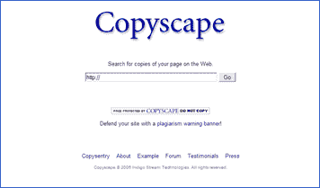

# Copyscape 网站抄袭搜索

> 原文：<https://www.sitepoint.com/copyscape-website-plagiarism-search/>

克里斯最近提出了[内容盗窃的难题](https://www.sitepoint.com/spammers-in-a-cut-throat-industry/)以及如何应对。

我们当然也有抄袭艺人的时候，一般来说，我们发现这是一个双重问题。

1.  意识到你的内容已经被抓取了
2.  做点什么

快速找到你抓取的内容是最重要的。如果谷歌或雅虎蜘蛛先无意中发现被抓取的内容，损害就已经造成了。如果您不是该内容的第一个已知出现者，则可能很难恢复信任。

常识告诉你，谷歌是你找到剽窃内容的第一站，但一个很棒的工具似乎没有多少人知道，那就是[copy scape——一个免费的、专门构建的反剽窃搜索工具](http://www.copyscape.com/)。只需给 Copyscape 你的内容的网址，它会做繁重的工作，并向你报告。

大概 Copyscape 最酷的一点是，它不需要你像谷歌那样，从你的内容中输入“关键词”(标题、段落等)来匹配剽窃。Copyscape 同时分析整个页面，似乎可以很容易地检测匹配的页面、段落、段落，甚至匹配的句子。我追踪到的一些副本被隐藏的 CSS 深深地掩盖了，但是 Copyscape 没有被愚弄。

好了，你已经找到了偷窃的地点。现在怎么办？

很容易感到有点孤独和无助，但通常并不像你想象的那么绝望。Copyscape 提供 whois 信息以及应对剽窃的实用建议。

有必要记住，知识产权窃贼通常依赖其他更大、更有信誉的组织(他们的 ISP、Adsense、Commision Junction)来运作，所以他们通常不想在战斗中拿自己的服务器/收入冒险。如果你彬彬有礼，但非常清楚，他们往往会很快让步。

同样值得一提的是 Copyscape 的商业服务，名为 [CopySentry](http://www.copyscape.com/signup.php?o=a) ，它可以自动监控网络上你的内容的盗版，然后通过电子邮件向你报告结果。我还不能直接担保这项付费服务，但如果你的内容是你的关键资产之一，这似乎是一种非常划算的保护方式。

不管怎样，免费服务对任何运营内容网站的人来说都是非常有用的。

## 分享这篇文章