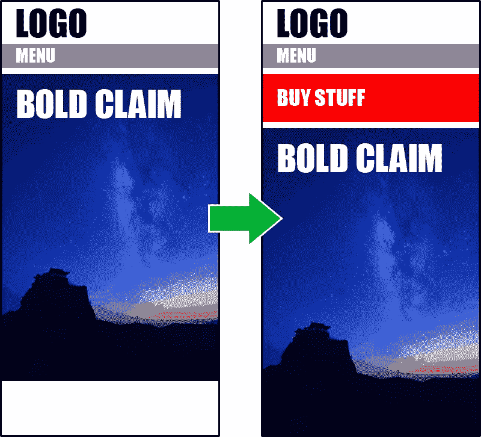

# 核心网络活力:谷歌网络性能指标指南

> 原文：<https://www.sitepoint.com/core-web-vitals/>

谷歌希望人们有良好的网络体验，所以它在搜索结果中将快速网站排在更高的位置。当然，这是一个粗略的简化，但是，假设你在比较两个内容和受众相似的网站，速度更快的那个*应该会在搜索结果中显示得更靠前。但谷歌如何衡量这一点一直有点像猜谜游戏，所以它引入了核心网站活力，为网站所有者和开发者提供一些急需的清晰度。*

不幸的是，*“性能”*是几十个指标的总称……*第一个字节的时间、开始渲染、CPU 使用率、JavaScript 堆大小、第一次内容丰富的绘制、第一次有意义的绘制、第一次 CPU 空闲、DOM 加载、页面完全加载、交互时间、每秒样式重新计算*等等。

不同的工具返回不同的结果集，很难知道从哪里开始。

谷歌的 Web Vitals 计划旨在简化绩效评估，并帮助您专注于最重要的改进。核心 Web Vitals 是反映真实世界用户体验的关键性能指标。一些是由 Chrome DevTools 中的 Lighthouse 面板、 [PageSpeed Insights](https://developers.google.com/speed/pagespeed/insights/) 和[谷歌搜索控制台](https://search.google.com/search-console/)报告的。

[web-vitals JavaScript 库](https://github.com/GoogleChrome/web-vitals)可以帮助衡量访问您网站的真实用户的更真实的指标。结果可以发布到 Google Analytics 或其他端点，以供进一步分析。

谷歌建议使用第 75 百分位，即记录同一指标的多个结果，从最好到最差排序，然后在四分之三点分析数据。因此，四分之三的网站访问者将体验到这种性能。

当前的核心网页要素是**最大内容绘画**、**首次输入延迟**和**累积布局移动**，它们相应地评估加载、交互性和视觉稳定性。

## 最大含量涂料(LCP)

LCP 衡量加载性能— *内容出现的速度*。

像页面加载和`DOMContentLoaded`这样的历史指标在这方面很困难，因为它们并不总是用户体验的指标。例如，闪屏几乎可以立即出现，但是由 Ajax 请求加载的可用内容可能需要更长时间才能出现。

最大内容绘制(LCP)报告视口内可见的最大图像或文本块的渲染时间。低于 2.5 秒的时间被认为是好的，高于 4.0 秒的时间被认为是差的。

LCP 中考虑的元素类型有:

*   ``元素
*   `<image>`一个`<svg>`内的元素
*   一个`<video>`元素的海报图像
*   使用 CSS `url()`属性加载背景图像的元素
*   包含文本节点的块级元素。

最大的元素在内容加载时确定，大小计算为其在浏览器视口中的可见尺寸。

LCP 可能受到以下因素的影响:

*   服务器响应时间
*   资源加载时间
*   呈现阻塞 CSS 或 JavaScript
*   客户端规模的处理时间

LCP 改进可能通过以下方式实现:

1.  使用内容交付网络(CDN)将请求路由到更近的服务器
2.  通过最小化昂贵的渲染时进程的数量来优化服务器响应
3.  最小化资产的文件大小
4.  在本地缓存资产，并且可能使用服务工作者首先返回本地版本。

## 第一输入延迟(FID)

FID 衡量响应速度——页面对用户动作的响应速度。

此指标记录用户与页面交互(点击、轻拍、按键等)的时间。)到浏览器开始处理该事件处理程序的时间。小于 100 毫秒的延迟被认为是好的，大于 300 毫秒的延迟被认为是差的。

只有当一个应用服务于一个真实的用户时，FID 才能被准确地测量。此外，它只测量事件处理中的延迟，而不是运行处理程序或更新 UI 所花费的时间。

因此，Google 和各种工具使用总阻塞时间(TBT)作为替代指标，可以在没有实际用户输入的情况下计算出来。TBT 测量以下各项之间的总时间:

1.  第一次内容丰富的绘画(FCP) —页面内容的任何部分呈现的时间，以及
2.  交互时间(TTI) —页面能够可靠地响应用户输入的时间(没有长时间的任务正在运行，并且没有超过两个 GET 请求有待解决)。

FID/TBT 的改进可能通过以下方式实现:

1.  减少 JavaScript 执行时间，通常是通过推迟非关键代码
2.  分解长期运行的任务
3.  使用 [web workers](https://developer.mozilla.org/Web/API/Worker) 在后台线程中运行任务
4.  按需加载第三方 JavaScript。

## 累积布局偏移(CLS)

CLS 衡量视觉稳定性，即浏览页面时内容的意外移动。

CLS 评估了那些内容在没有警告的情况下移动的恼人情况——通常是在当前滚动位置上方的广告或图像完成加载后 DOM 发生变化。这个问题在移动设备上尤其明显，可能会导致你找不到位置或点击错误的链接。

CLS 的计算方法是乘以:

1.  影响分数:视口中不稳定元素的总面积(将移动的元素)。影响分数为 0.5 表示总共有一半视口的元素将被置换。
2.  距离分数:视口内任何单个元素移动的最大距离。距离分数为 0.25 表示至少有一个元素移动了视口的四分之一(水平或垂直)。

考虑以下示例，该示例在徽标、菜单和英雄图像呈现后不久加载广告:

徽标和菜单不会移动，它们是稳定的元素。广告被添加到 DOM 中，它的起始位置不会改变，所以它也是稳定的。然而，英雄形象会移动:

1.  主角在 360 x 720 的视口中是 360 x 510 像素。因此，其影响系数为(360 x 510) / (360 x 720) = 0.71
2.  它在 720px 视口高度中移动 90 个垂直像素，因此它的距离分数为 90 / 720 = 0.125

因此，CLS 是 0.71 x 0.125 = 0.089

低于 0.1 的 CLS 分数被认为是好的，高于 0.25 的分数被认为是差的。在这种情况下，CLS 正好在可接受的范围内，因为尽管大面积受到影响，但它移动了相对较小的距离。然而，更大的广告需要更多的关注。

CLS 算法不记录在任何用户交互之后 500 毫秒的布局移动，该用户交互可能触发 UI 改变或视口调整大小。因此，您的页面不会因为操作所必需的界面更新、过渡和动画而受到惩罚，例如从汉堡图标打开全屏菜单。

Chrome DevTools 中的**渲染**面板(菜单>更多工具>渲染)提供了一个**布局移动区域**选项。选中该框并刷新页面—布局变化以蓝色突出显示。您也可以在**网络**面板中修改网速来减缓加载速度。

FID/TBT 的改进可能通过以下方式实现:

1.  通过添加具有`width`和`height`属性的维度、 [CSS `aspect-ratio`属性](https://developer.mozilla.org/Web/CSS/aspect-ratio)或[旧填充技巧](https://www.sitepoint.com/maintain-image-aspect-ratios-responsive-web-design/)来为图像、视频和 iframe 元素保留空间
2.  加载网页字体时避免 FOUT(非样式文本的闪烁)和 FOIT(不可见文本的闪烁)。预加载或使用类似大小的备用字体会有所帮助
3.  在初始页面加载期间，不要在现有内容上插入 DOM 元素，例如时事通讯注册和类似的通知框
4.  使用 CSS `transform`和`opacity`制作成本更低的动画。

## 性能优先级

核心网站指标将随着时间的推移而演变，但评估 LCP、FID 和 CLS 指标可以帮助确定最关键的问题。首先解决快速简单的问题——它们通常有最大的投资回报:

*   激活服务器压缩和 HTTP/2 或 HTTP/3
*   通过设置 HTTP 到期头，确保使用浏览器缓存
*   [提前预载](https://developer.mozilla.org/docs/Web/HTML/Preloading_content)资产
*   连接和缩小 CSS 和 JavaScript
*   移除未使用的资产
*   考虑使用 CDN 或更好的主机
*   使用合适的图像大小和格式
*   优化图像和视频文件大小(专业 CDN 可以提供帮助)

site point book[Jump Start Web Performance](https://www.sitepoint.com/premium/books/jump-start-web-performance/)提供了几十个技巧来提高网站速度，降低成本，让用户满意。

## 分享这篇文章