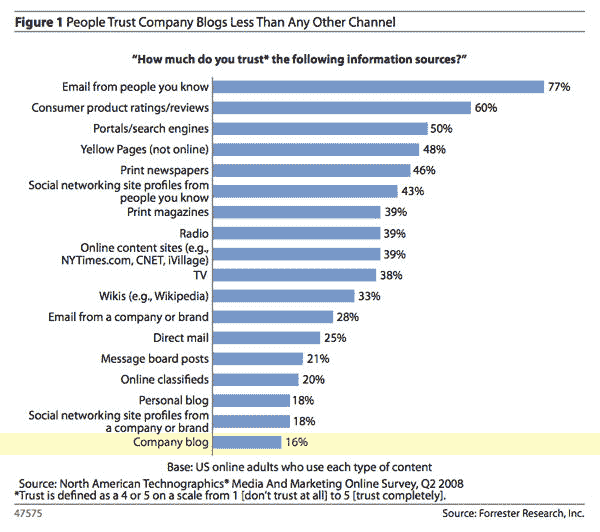

# 企业博客:你做错了

> 原文：<https://www.sitepoint.com/corporate-blogging-youre-doing-it-wrong/>

Forrester Research 分析师 Josh Bernoff 的一份新报告发现，只有 16%的美国成年网民认为公司博客是一个可信的信息来源。虽然博客的普通读者比普通的在线读者更信任公司博客，但 Forrester 发现公司博客是网上最不可信的产品和服务信息来源。

Bernoff 指出，许多消费者认为企业博客是公司网站的延伸，因此只是公司营销目标的另一个出口。这并不奇怪，因为 Forrester 早先对财富 500 强博客的研究发现绝大多数事实上是公司营销努力的延伸。

在这项研究中，Forrester 发现，56%的公司只是重新发布新闻稿或已经公开的新闻，而 70%的公司则严格遵循与其核心产品线相关的商业话题。难怪 2/3 的企业博客没有评论。

博客*可以*成为你公司网络战略中成功而有用的一部分。七月，我们将企业博客作为[如何直接与你的客户](https://www.sitepoint.com/how-to-speak-directly-to-your-customers/)对话的头号技巧——这是你*应该*努力去做的事情。我们建议你不要只写你的公司或产品。“相反，提供对你的行业、你的方法和你的想法的见解，”我们写道。我们引用了网络商务软件公司 37signals 的博客[信号对噪声](http://www.37signals.com/svn/)，作为一个成功的企业博客的范例。

> “信号与噪音”之所以成功，是因为 37signals 的员工都在博客上发表文章，他们不仅写公司的产品，还写一般的设计和开发实践。他们提供商业建议，他们喜欢的东西的链接，如何管理时间的技巧，以及对他们个人和职业生活的见解。通过这样做，37signals 已经能够与他们的社区建立联系，并将客户转化为铁杆粉丝，为他们宣传他们的产品。”

37signals 还在我们的名单中列出了真正拥有企业博客的 15 家公司和另外 14 家公司，你应该看看他们的博客，看看如何以正确的方式创建企业博客。

Bernoff 在他的报告中提供了类似的建议，关于如何使你的公司博客更有活力，并为自己的成功做好准备。他列出了七条建议来帮助创建一个成功的企业博客，避免“信任陷阱”

*   **记录客户的问题。**–博客是回应客户问题的绝佳场所。
*   写博客给你的粉丝们。——贝诺夫表示，这对许多公司来说是行不通的，只有那些已经拥有大批粉丝的公司。但我们不太确定。当然，对于一家从事无聊业务的公司(比如制造消声器——Bernoff 的例子)来说，这要困难得多，但写博客是扩大粉丝群并将粉丝转化为狂热分子的好方法。
*   关于社区核心问题的博客。——围绕你的博客创建一个社区，让你的客户联系起来，这是一个好主意。
*   因为你是名人，所以写博客。杰夫·贝索斯、马克·库班、唐纳德·川普——如果你有知名度，你应该已经在写博客了。
*   对于 B2B 公司，让你的员工参与进来。37signals 的每个人都为他们的公司博客做出贡献，对于许多公司来说，博客是企业文化的一部分。微软、Sun、Adobe 和其他公司为他们的员工提供了一个博客平台，取得了巨大的成功。
*   在媒体方面，利用博客来扩大内容和受众。–贝诺夫认为，对于媒体公司来说，博客可以扩大影响范围。对于像《纽约时报》这样的报纸来说，这无疑是正确的，它现在在 Bits(科技)和 Caucus(政治)这两个网络上最受欢迎的博客。另一方面，对于非媒体公司来说，博客可以是一种控制新闻周期的方式，通过直接与客户对话来绕过媒体。
*   **在博客上发表意见。**–Bernoff 称这是“最弱的理由”，但我们实际上认为这可能是最重要的一点。企业博客需要有自己的声音。从长远来看，与客户交谈而不是盯着他们的对话型博客会更成功。

Forrester 关于信任和企业博客的报告[可以免费获得](http://www.forrester.com/corporateblogging)。

## 分享这篇文章