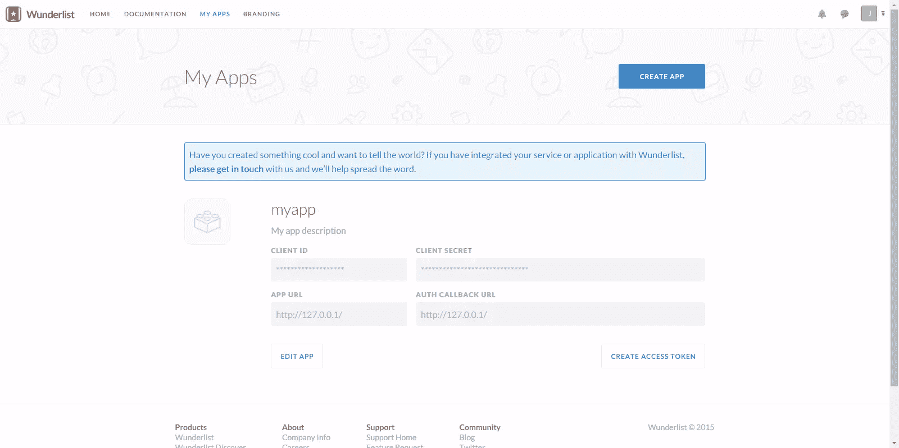

# 神童的 API 速成与狂饮

> 原文：<https://www.sitepoint.com/crash-course-of-wunderlists-api-with-guzzle/>

Wunderlist 是最流行的任务管理和列表管理应用之一。它允许你创建列表，然后你可以添加任务，这些任务很容易*检查*并且内置了各种功能。它拥有适用于所有主要操作系统的原生应用程序，并且您的所有数据都可以通过云有效地同步。如果你想让自己有条不紊的话，这是一款非常好的软件，即使是免费版，你也可以做很多事情。


如今，大多数 web 应用程序都为开发人员提供 API 来集成他们自己的应用程序(甚至像 Trello 这样的免费应用程序)。2015 年，神童终于也做到了:他们的 API 被公之于众[，并被完整记录](https://developer.wunderlist.com/documentation)。

在这篇文章中，我们将看看他们的 API，看看我们如何通过编程与 Wunderlist 应用程序进行交互。为此，我们将启动一个非常小的 PHP 应用程序，其背后没有任何类型的框架，只是一些由 Composer 出于测试目的而收集的原始 PHP 文件。由于没有官方的 PHP SDK，我们将利用 Guzzle 来执行对各个端点的 HTTP 请求。

此外，如果你很好奇，看看这个[演示库](https://github.com/upchuk/wunderlist-api-demo)，它包含一些基本代码，允许你加载给定列表中的所有任务，然后使用 Ajax 逐个检查它们。类似于 Wunderlist 的核心功能，但同样没有任何框架或样式。

## 操场

在我们项目的根文件夹中，我们可以有一个 composer.json 文件，如下所示:

```
{
    "require": {
        "php": ">=5.5.0",
        "guzzlehttp/guzzle": "~6.0"
    },

    "autoload": {
        "psr-4": {
            "Wunderlist\\": "src/"
        }
    },

    "require-dev": {
        "symfony/var-dumper": "~2.7"
    }
} 
```

如你所见，我们将使用 Guzzle 6，它符合 PSR-7 标准，我们想要创建的任何类都将放入命名空间为`Wunderlist`的`src/`文件夹中。我们也可以继续创建该文件夹。最后，我们使用 [Symfony VarDumper](https://www.sitepoint.com/var-dump-introducing-symfony-vardumper/) 组件在开发时将变量打印到屏幕上。

还是在项目的根文件夹内，让我们添加三个文件:`index.php`、`keys.php`、`.gitignore`。

在里面`index.php`我们将玩 API。我们将使用`keys.php`来存储任何访问令牌，它将在`.gitignore`文件中被引用，这样它就不会被提交给存储库。

作为开始，应该是这样的:

```
vendor/*
keys.php 
```

从[到](https://gist.github.com/Swader/7844111)的规则，你可以随意扩展。

## 奇迹列表应用程序

在开始使用 API 之前，我们需要进入我们的 [Wunderlist 帐户](https://developer.wunderlist.com/apps)并创建一个新的应用程序。这样做时，我们需要指定一个应用程序 URL 和一个应用程序回调 URL，OAuth 流将使用它们来允许用户授予对您的应用程序的访问权限。我们不会在这里深入讨论，所以我们可以添加一些虚拟 URL。

然而，要对应用程序进行身份验证，我们需要单击*创建访问令牌*按钮，这将生成一个管理员访问令牌，可用于作为我们自己的用户对 API 进行身份验证(实际上，我们现在正在为自己构建一个 Wunderlist 应用程序)。



## 神童阶层

一旦保存了应用程序，我们就可以返回 PHP 应用程序，将以下内容粘贴到`keys.php`文件中:

```
<?php

$client_id = 'your-client-id';
$access_token = 'the-access-token-you-generated-earlier'; 
```

以上信息可以从你的 Wunderlist 帐户中检索。然后我们将在`index.php`中需要这个文件，并全局使用这些变量。这不是一个最佳实践，但是对于我们的小演示来说，为了使事情简单明了，这是可行的。为了更好地解决加载凭证的问题，您可以使用[这种方法](https://github.com/vlucas/phpdotenv)来代替。

接下来，让我们在应用程序的`src/`文件夹中创建一个名为`WunderlistClient`的类:

```
<?php

namespace Wunderlist;

use GuzzleHttp\ClientInterface;
use Psr\Http\Message\ResponseInterface;

class WunderlistClient {

    /**
     * @var ClientInterface
     */
    private $client;

    /**
     * Constructor
     *
     * @param ClientInterface $client
     */
    public function __construct(ClientInterface $client) {
        $this->client = $client;
    } 
```

我们的类现在所做的就是将 Guzzle 客户端作为一个参数，并将其设置为一个私有变量。然后，我们将使用该类通过添加负责各种端点和任务的方法来调用 Wunderlist API。

回到我们的`index.php`文件，我们现在可以这样做:

```
<?php

require 'vendor/autoload.php';
require_once 'keys.php';

use GuzzleHttp\Client;
use Wunderlist\WunderlistClient as Wunderlist;

$guzzle = new Client(
    [
        'base_uri' => 'https://a.wunderlist.com/api/v1/',
        'headers' => [
            'Content-Type' => 'application/json',
            'X-Client-ID' => $client_id,
            'X-Access-Token' => $access_token,
        ]
    ]
);
$wunderlist = new Wunderlist($guzzle); 
```

我们首先实例化一个新的 Guzzle 客户端。我们设置 API 的`base_uri`和一些必要的头(最重要的是认证)。在请求体中以 JSON 形式发送数据时，需要 JSON 内容类型头。然后，我们创建一个新的`WunderlistClient`类实例，并将 Guzzle 客户端传递给它。

接下来，我们将使用`$wunderlist`对象发出请求并返回要检查的响应。

## 使用 Wunderlist API 返回数据

首先，让我们请求我们帐户上的所有清单。在`WunderlistClient`类中，我们可以添加这个公共方法:

```
/**
 * Returns all the lists
 *
 * @return array
 */
public function getLists() {
    $response = $this->client->get('lists');
    $this->checkResponseStatusCode($response, 200);
    return json_decode($response->getBody(), true);
} 
```

我们使用 Guzzle 向相关端点发出请求，并使用一个名为`checkResponseStatusCode()`的私有方法来验证请求是否成功。如果调用者不能捕捉到这种情况，后者将抛出一个异常(我们稍后会看到)。

此外，您会注意到，在 Guzzle 6 中，我们不再有解码来自 JSON 的响应的方法，而是将一个[流](http://guzzle.readthedocs.org/en/latest/psr7.html#streams)作为响应体。由于预期的数据不是很大，我们可以用自己的`__toString()`方法将它转储到一个字符串中，然后解码。

让我们也快速看一下我们的`checkResponseStatusCode()`方法:

```
/**
 * Check the response status code.
 *
 * @param ResponseInterface $response
 * @param int $expectedStatusCode
 *
 * @throws \RuntimeException on unexpected status code
 */
private function checkResponseStatusCode(ResponseInterface $response, $expectedStatusCode)
{
    $statusCode = $response->getStatusCode();

    if ($statusCode !== $expectedStatusCode) {
        throw new \RuntimeException('Wunderlist API returned status code ' . $statusCode . ' expected ' . $expectedStatusCode);
    }
} 
```

一旦这一切就绪，我们就可以从`index.php`调用`getLists()`并转储结果的所有内容:

```
try {
  $lists = $wunderlist->getLists();
  dump($lists);
}
catch(\Exception $exception) {
  dump($exception);
} 
```

在浏览器中加载文件应该允许我们检查返回的关于我们帐户中所有列表的所有信息。干净利落。

一旦我们拥有了所有的列表，并找出了我们想要的一个列表的 ID，我们就可以返回关于它的更多信息:

```
/**
 * Returns a specific list
 *
 * @param int $id
 *
 * @return mixed
 */
public function getList($id) {
    if (!is_numeric($id)) {
        throw new \InvalidArgumentException('The list id must be numeric.');
    }

    $response = $this->client->get('lists/' . $id);
    $this->checkResponseStatusCode($response, 200);
    return json_decode($response->getBody(), true);
} 
```

这里我们做一个基本的检查，看看 ID 是否是数字，确保请求成功，并从 Wunderlist API 返回 JSON 解码的响应。现在，在`index.php`里面:

```
try {
  $list = $wunderlist->getList($id);
  dump($list);
}
catch(\Exception $exception) {
  dump($exception);
} 
```

我们应该看到一些关于列表本身的信息。

但是如果我们想加载这个列表中的所有任务呢？我们可以实现这样的东西:

```
/**
 * Return all the tasks of a given list
 *
 * @param int $list_id
 *
 * @return array()
 */
public function getListTasks($list_id) {
    if (!is_numeric($list_id)) {
        throw new \InvalidArgumentException('The list id must be numeric.');
    }

    $response = $this->client->get('tasks', ['query' => ['list_id' => $list_id]]);
    $this->checkResponseStatusCode($response, 200);
    return json_decode($response->getBody());
} 
```

为了指定我们希望为哪个列表返回任务，我们需要将它的 ID 作为查询参数传递给 GET 请求。剩下的和之前差不多。在`index.php`中，我们可以从这个列表中调试与(未完成的)任务相关的所有数据:

```
try {
  $tasks = $wunderlist->getListTasks($id);
  dump($tasks);
}
catch(\Exception $exception) {
  dump($exception);
} 
```

## 使用 Wunderlist API 创建和更新数据

到目前为止，我们发出的所有请求都是获取加载信息的调用。让我们尝试使用 API 创建和更新一些资源。首先，我们可以像这样创建一个任务:

```
/**
 * Creates a new task
 *
 * @param string $name
 * @param int $list_id
 * @param array $task
 *
 * @return mixed
 */
public function createTask($name, $list_id, $task = []) {
    if (!is_numeric($list_id)) {
        throw new \InvalidArgumentException('The list id must be numeric.');
    }
    $task['name'] = $name;
    $task['list_id'] = $list_id;
    $response = $this->client->post('tasks', ['body' => json_encode($task)]);
    $this->checkResponseStatusCode($response, 201);
    return json_decode($response->getBody());
} 
```

新任务的数据需要作为 JSON 在 POST 请求体中发送。为了在`index.php`中使用这个方法，我们可以这样做:

```
try {
  $created = $wunderlist->createTask('My new task', 'the-list-id');
  dump($created);
}
catch(\Exception $exception) {
  dump($exception);
} 
```

这是我们发送给 Wunderlist 的任务中需要存在的唯一两个强制参数，但是我们当然可以在作为第三个参数传递给我们的方法的数组中添加更多参数。有关更多信息，请随时查看相关文档页面。

如果一切顺利，Wunderlist 发回一个状态 201 ( *创建了*)。我们在这里返回的是与我们刚刚创建的任务相关的一组信息。如果我们加载`index.php`，这就是我们可以在浏览器中看到的。

现在，为了更新我们创建的任务，我们需要向其端点发送一个补丁请求，其中只包含我们希望更改的数据和当前版本(这是为了确保不同的应用程序不会覆盖彼此的数据)。因此，通过为任务的`completed`属性发送布尔值 TRUE，我们实际上将它标记为选中。我们可以创建专门用于完成任务的方法:

```
/**
 * Completes a task
 *
 * @param int $task_id
 * @param int $revision
 * @return mixed
 */
public function completeTask($task_id, $revision) {
    if (!is_numeric($task_id)) {
        throw new \InvalidArgumentException('The list id must be numeric.');
    } elseif (!is_numeric($revision)) {
        throw new \InvalidArgumentException('The revision must be numeric.');
    }

    $response = $this->client->patch('tasks/' . $task_id, ['body' => json_encode(['revision' => (int) $revision, 'completed' => true])]);
    $this->checkResponseStatusCode($response, 200);
    return json_decode($response->getBody());
} 
```

我们修补的端点包含任务的 ID，我们将我们希望在任务上更改的值的 JSON 表示作为请求体发送。如前所述，这需要包含资源的最新修订，我们可以从我们之前编写的`getListTasks()`方法中学习到。

假设我们知道`index.php`中任务的最新版本和 ID，我们可以像这样完成一个任务:

```
try {
  $response = $wunderlist->completeTask($task_id, $revision);
  dump($response)
}
catch(\Exception $exception) {
  dump($exception);
} 
```

如果一切顺利，我们在主体中得到的响应就是任务的 JSON 表示，我们可以将它解码成一个数组。

## 结论

当然，还有更多的端点，每个端点都有更多的用途。请继续查看文档页面，了解您可以做的所有事情。

与 Wunderlist 集成的一个非常重要的方面是允许用户授权访问他们自己的 Wunderlist 帐户。你可以使用我们之前提到的 OAuth 流程来实现这一点——这里有一些关于如何实现这一点的教程。

最后，如果你好奇，看一下[库](https://github.com/upchuk/wunderlist-api-demo)，在那里你可以找到我们在本文中讨论的内容的一个超级小的扩展，你可以用它提供一个列表 ID，把它的任务打印在屏幕上，然后通过 Ajax 一个接一个地检查它们。看起来很丑，但你应该能抓住重点。

你写了一个神童应用了吗？给我们看看！

## 分享这篇文章