# 制作一个清晰、多彩的 160 x 600px 像素的广告

> 原文：<https://www.sitepoint.com/create-a-clean-colorful-160-x-600px-advertisement/>

为了达到你的企业需要的在线曝光水平，你需要设计一个强大的、引人注目的广告活动，不管你卖的是什么或提供什么。为此，最广泛使用的广告选项是横幅广告。如果你没有尝试横幅广告，你就错过了一个获得新客户和新业务的重要机会。所以，今天我们要在 Photoshop 中设计一个醒目的 160 x 600px 横幅广告。我们将使用一些有趣的技术和混合选项来创建这个广告。所以，让我们开始吧！

**最终结果:[(下载分层设计文件。](https://www.sitepoint.com/wp-content/uploads/2013/03/160x600-Advertisement.zip) )**

### 第一步

打开 Photoshop，新建一个宽 160 像素、高 600 像素的文件。

[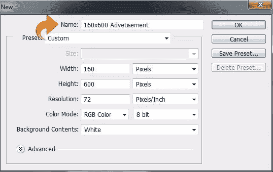](https://www.sitepoint.com/wp-content/uploads/2013/03/Step-110.jpg)

### 第二步

对于背景，选择矩形工具，使用颜色#3080cd 创建一个矩形。

[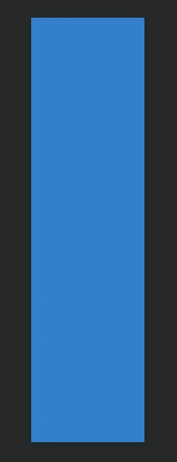](https://www.sitepoint.com/wp-content/uploads/2013/03/Step-2.jpg)

### 第三步

现在，点击“图层”>“图层样式”>“内部阴影”

[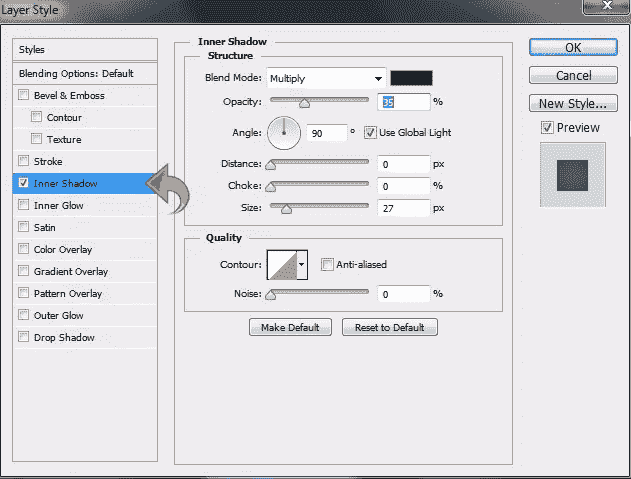](https://www.sitepoint.com/wp-content/uploads/2013/03/Step-31.jpg)

### 第四步

点击“图层”>“图层样式”>“内部发光”，保持如下设置。

[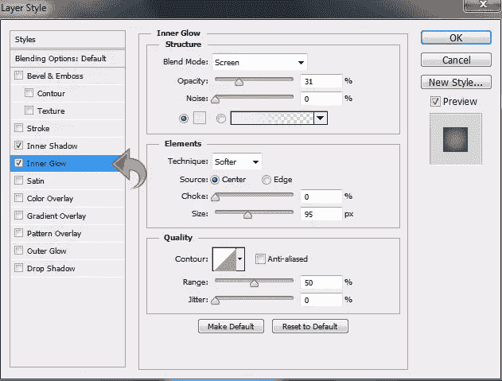](https://www.sitepoint.com/wp-content/uploads/2013/03/Step-41.jpg)

### 第五步

点击“图层样式”,使用以下设置为背景添加纹理图案。

[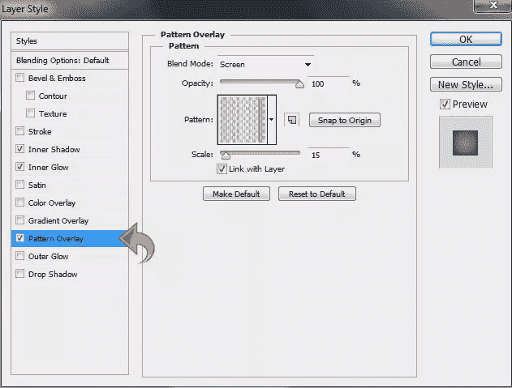](https://www.sitepoint.com/wp-content/uploads/2013/03/Step-51.jpg)

### 第六步

现在，创建一个新层(“层”>“新建”>“层”)并选择钢笔工具创建一个形状使用颜色#f4f4f4。

[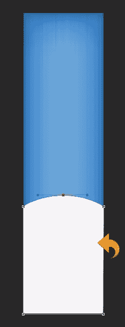](https://www.sitepoint.com/wp-content/uploads/2013/03/Step-61.jpg)

### 第七步

点击“图层样式”,给上面的形状添加一些阴影。使用以下设置。

[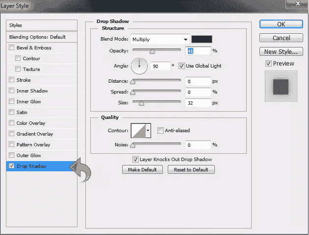](https://www.sitepoint.com/wp-content/uploads/2013/03/Step-71.jpg)

### 第八步

复制上面的形状(右键点击图层，选择“复制图层”)，填充颜色#282828。

[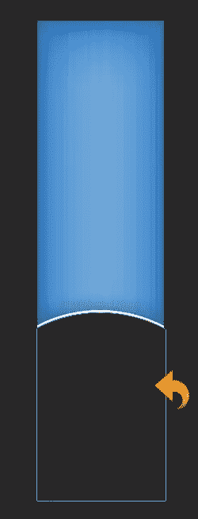](https://www.sitepoint.com/wp-content/uploads/2013/03/Step-81.jpg)

### 第九步

点击“图层样式”,给上面的形状添加一些图案。使用下面显示的设置。

[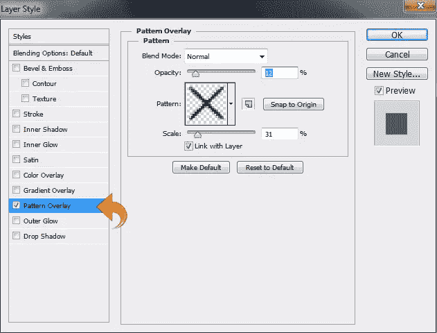](https://www.sitepoint.com/wp-content/uploads/2013/03/Step-91.jpg)

### 第十步

重复同样的过程，在顶部创建相同的形状。保持颜色和风格一致，稍微改变一下阴影设置。使用下面的设置。

[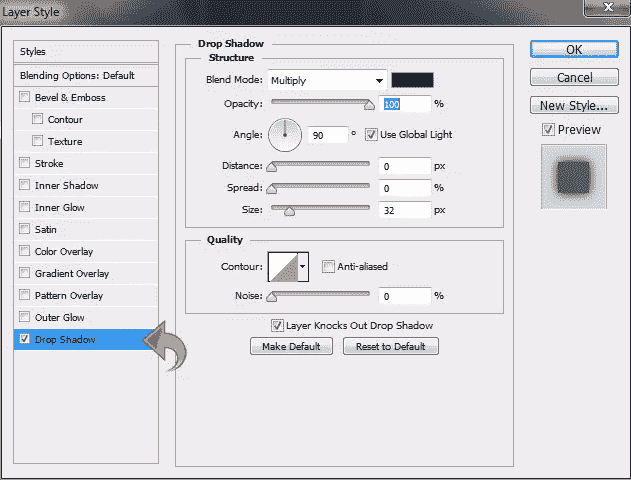](https://www.sitepoint.com/wp-content/uploads/2013/03/Step-101.jpg)

### 步骤 11

现在添加标题，选择“文字工具”，使用颜色#d9d9d9 添加标题。然后，点击“图层样式”>“阴影”

[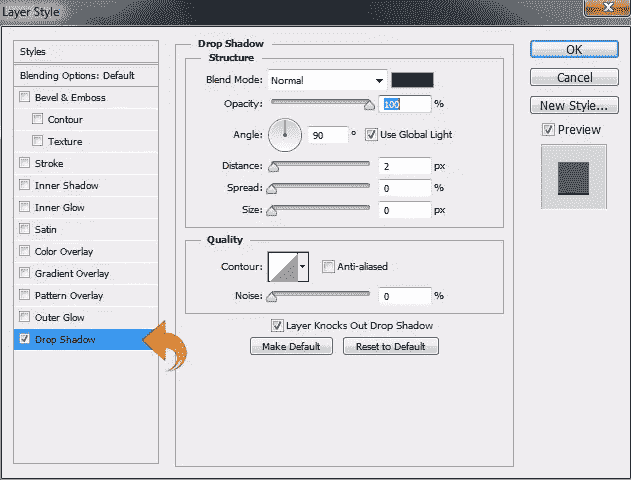](https://www.sitepoint.com/wp-content/uploads/2013/03/Step-112.jpg)

### 步骤 12

再次选择“文字工具”，使用颜色#f7f7f7 和#64a2d8 添加文本的其余部分。然后，给文本添加一些阴影。

### 第十三步

现在，将礼物图标粘贴在白色文字下，并使用以下设置添加一些阴影。

[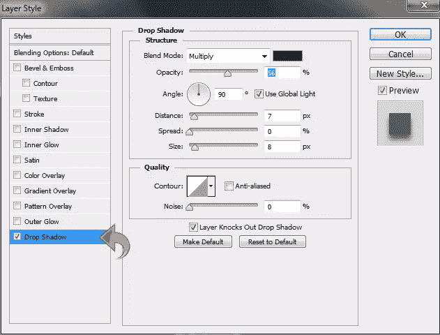](https://www.sitepoint.com/wp-content/uploads/2013/03/Step-131.jpg)

### 步骤 14

现在，让我们从“阅读更多”按钮开始。选择圆角矩形工具，使用# b7b7b7 颜色创建一个小矩形。

### 第十五步

点击“图层样式”,在按钮底部添加斜面和浮雕、渐变叠加、图案叠加和一些阴影。使用下列值。

[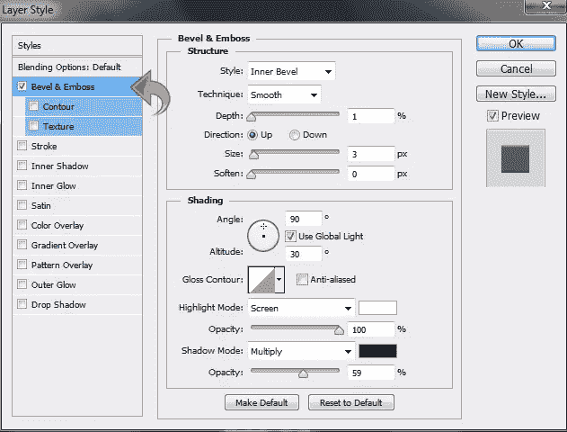](https://www.sitepoint.com/wp-content/uploads/2013/03/Step-15a.jpg)

[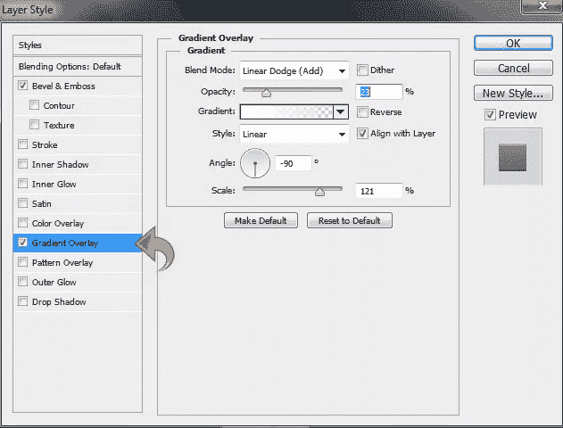](https://www.sitepoint.com/wp-content/uploads/2013/03/Step-15b.jpg)

[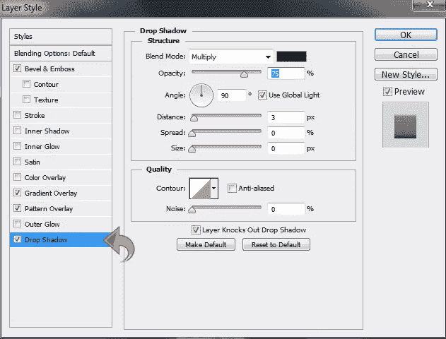](https://www.sitepoint.com/wp-content/uploads/2013/03/Step-15d.jpg)

### 第十六步

Now, add the button text, so select the type tool and add text using color #787878.

### 步骤 17

点击“图层样式”为上面的文字添加一些内阴影和投影。使用下面的设置。

[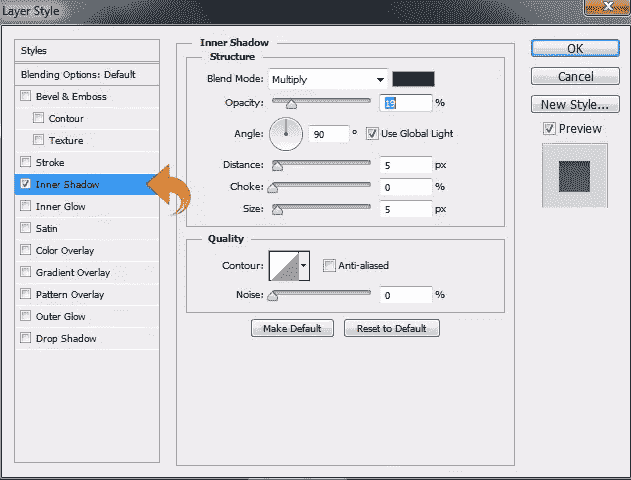](https://www.sitepoint.com/wp-content/uploads/2013/03/Step-17a.jpg)

[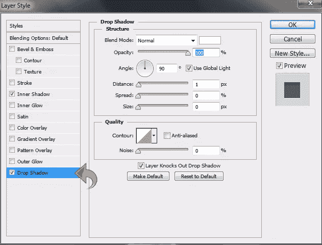](https://www.sitepoint.com/wp-content/uploads/2013/03/Step-17b.jpg)

我们完了！我希望你们喜欢这个教程。我很快会带着更多有趣的东西回来。保重！

## 分享这篇文章