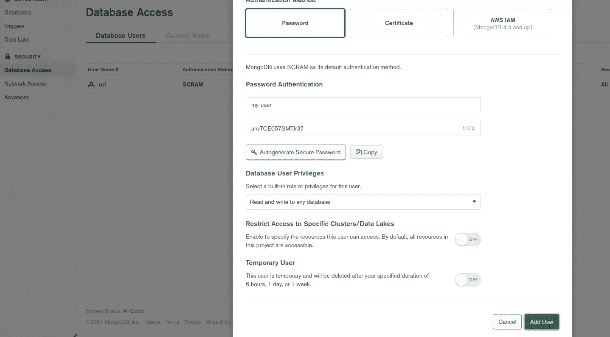
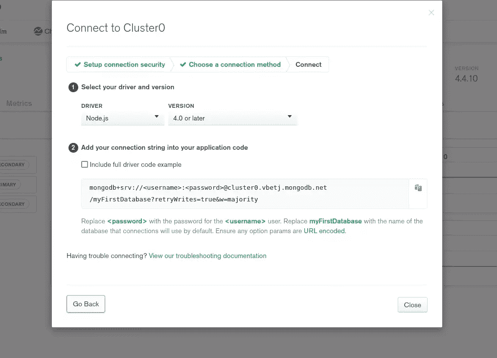
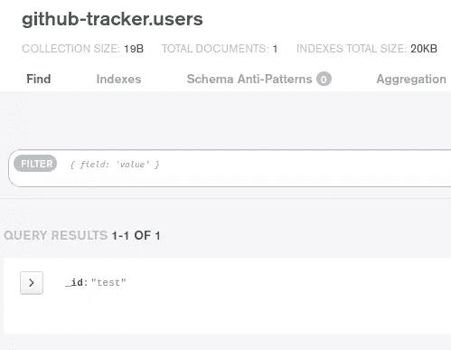
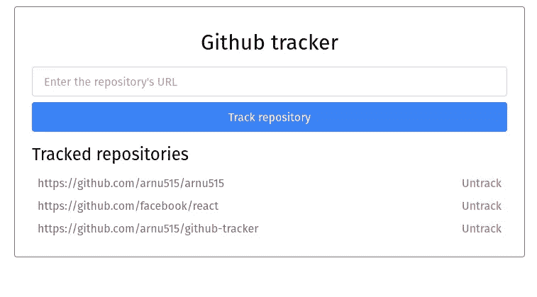
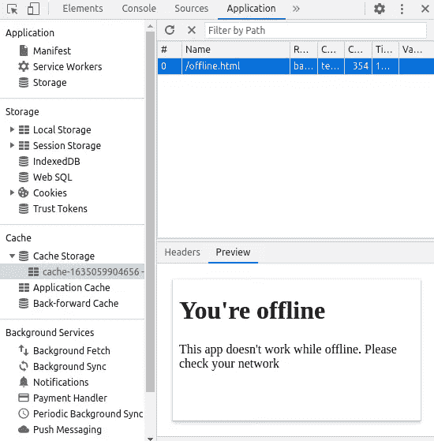

# 创建一个 GitHub 追踪器，以苗条的方式推送通知

> 原文：<https://www.sitepoint.com/create-a-github-tracker-with-push-notifications-in-svelte/>

在本文中，您将学习如何构建一个 GitHub 跟踪器，当被跟踪的存储库中出现新问题时，它会通过发送推送通知来通知用户。

如果你选择加入，GitHub 已经通过电子邮件发送通知，但是许多研究表明**推送通知比电子邮件**更好地到达用户。按照本教程构建 GitHub 跟踪器后，您将学会如何:

*   添加一名服务人员，并将跟踪器转换为 [PWA](https://web.dev/pwa)
*   订阅推送通知
*   使用 GitHub 的 API
*   通过 [Vercel](https://vercel.com) 云函数发送推送事件
*   使用 [EasyCron](https://easycron.io) 定期获取新问题

## 先决条件

阅读本文需要一些技巧和服务:

*   [Node.js](https://nodejs.org) 和 npm 已安装
*   先前[苗条](https://svelte.dev)的知识
*   一个免费的 [GitHub](https://github.com) 账户，因为我们使用的是 [GitHub API](https://api.github.com)
*   一个免费的 [MongoDB Atlas](https://cloud.mongodb.com) 帐户，可以在云中使用 MongoDB
*   一个免费的 [Vercel](https://vercel.com) 账户，用于部署应用程序和云功能

## 什么是推送通知？

让我们来看看这些所谓的“推送通知”是什么。

您必须熟悉定期通知。这些是出现在你屏幕上的文本小气泡，用来通知你一些事情。推送通知是类似的，除了它们*不是按需生成*，而是在接收到推送事件时生成*。当应用程序关闭时，推送通知会起作用*，而常规通知需要你打开应用程序。**

 *像 Chrome 这样的现代网络浏览器通过使用一种叫做服务工作者的东西来支持推送通知。服务工作者是独立于浏览器主线程运行的小 JavaScript 片段，因此，如果您的应用程序安装为 PWA(渐进式 web 应用程序),则可以离线运行。

推送通知在聊天应用程序中用于在用户有未读消息时通知用户，在游戏中用于通知用户游戏事件，在新闻网站中用于通知用户突发文章，以及用于许多其他目的。

在应用中显示推送通知有四个步骤:

1.  用`window.Notification.requestPermission()`请求许可
2.  将您的应用程序转换为 PWA 并安装它
3.  订阅推送事件
4.  收到推送事件后，发送通知

## 步骤 1:创建跟踪器

让我们用 Svelte with [Vite.js](https://vitejs.com) 代替本文中的 Rollup。顾名思义，Vite 比 Rollup 更快，并且还提供了对环境变量的内置支持。要使用 Svelte 和 Vite 创建新项目，请运行以下命令:

```
npm init vite 
```

选择要成为`svelte`的框架。如果愿意，可以使用 TypeScript。我将使用常规的 JavaScript。

接下来，将`cd`添加到项目文件夹中，您可以将 [TailwindCSS](https://tailwindcss.com) 添加到您的应用程序中，并使用以下命令安装所有依赖项:

```
npx svelte-add tailwindcss

# Install packages
yarn install # or npm install 
```

最后，在您喜欢的代码编辑器中打开项目，运行`npm run dev`或`yarn dev`在 [http://localhost:3000](http://localhost:3000) 上启动应用程序。

### 跟踪器将如何工作

我们将使用 GitHub API 获取问题列表，并对用户跟踪的存储库进行请求。用户的跟踪库和他们的用户名将存储在 MongoDB 数据库中。

第一步是提示用户输入用户名。创建`src/lib/UsernamePrompt.svelte`，它将是这样做的组件。这是我的表单用户界面，但是你可以随意设计:

```
<script> let username = "";
  async function submit() {
    // TODO
  } </script>

<form
  on:submit|preventDefault="{submit}"
  class="mx-auto min-w-[350px] max-w-[1100px] w-[50%] border border-gray-500 rounded my-4 px-6 py-4"
>
  <h1 class="text-center text-3xl m-4">Enter a username</h1>
  <p class="text-center text-xl m-4">Enter a username to use this tracker</p>

  <input
    type="text"
    class="rounded px-4 py-2 border border-gray-300 w-full outline-none"
    placeholder="Username"
    aria-label="Username"
    bind:value="{username}"
  />

  <button
    class="mt-4 border border-transparent bg-blue-500 text-white rounded px-4 py-2 w-full"
  >
    Submit
  </button>
</form> 
```

像这样在`App.svelte`中添加该组件:

```
<script> import UsernamePrompt from "./lib/UsernamePrompt.svelte"; </script>

<UsernamePrompt /> 
```

接下来，让我们添加主追踪器 UI。创建文件`src/lib/Tracker.svelte`并在其中添加以下代码:

```
<script> let repo = "";
  function track() {
    // TODO
  }

  function untrack(repo) {
    // TODO
  } </script>

<form
  on:submit|preventDefault={track}
  class="mx-auto min-w-[350px] max-w-[1100px] w-[50%] border border-gray-500 rounded my-4 px-6 py-4"
>
  <h1 class="text-center text-3xl m-4">GitHub tracker</h1>

  <input
    type="text"
    class="rounded px-4 py-2 border border-gray-300 w-full outline-none"
    placeholder="Enter the repository's URL"
    aria-label="Repository URL"
    bind:value={repo}
  />
  <button
    class="mt-2 border border-transparent bg-blue-500 text-white rounded px-4 py-2 w-full"
    >Track repository</button
  >

  <h2 class="mt-4 text-2xl">Tracked repositories</h2>
  <ul class="m-2 list-decimal">
    <!-- We'll use a loop to automatically add repositories here later on. -->
    <li class="py-1 flex items-center justify-between">
      <a class="text-gray-500 hover:underline" href="https://github.com/test/test"
        >https://github.com/test/test</a
      >
      <button class="text-red-500 cursor-pointer" on:click={() => untrack("")}
        >Untrack</button
      >
    </li>
  </ul>
</form> 
```

为了测试你的组件，*暂时*在`App.svelte`用新的`Tracker`组件替换掉`UsernamePrompt`组件:

```
<script> // import UsernamePrompt from "./lib/UsernamePrompt.svelte";
  import Tracker from "./lib/Tracker.svelte"; </script>

<!-- <UsernamePrompt /> -->
<Tracker /> 
```

您的屏幕现在应该看起来像这样:


*注意:记得把`App.svelte`恢复到之前的代码！*

## 步骤 2:设置云函数

我们需要一个后端服务器向我们的应用程序发送推送事件。这意味着您需要创建一个新的(可能)ExpressJS 项目，然后单独部署它。对于刚刚尝试推送通知的人来说，这将是一个令人头疼的问题。

[威赛尔云功能](https://vercel.com/docs/concepts/functions/introduction)来救援了！云功能就像快捷路线。它们可以运行代码，并在你获取它的 URL 时给你一个响应。Vercel 支持云功能；你只需要在`api`文件夹中创建文件。您将使用云函数与 MongoDB 进行交互，因为在客户端公开秘密从来都不是一件好事。

首先，确保您在 [MongoDB Atlas](https://cloud.mongodb.com) 中有一个集群。MongoDB 有一个免费的计划( *M0* )，所以如果你还没有的话，一定要创建一个。现在，转到 Atlas 仪表盘侧边栏中的**数据库访问**选项卡。点击右侧的绿色按钮**添加一个新的数据库用户。输入用户的详细信息(不要忘记密码)，然后创建用户。**



要连接到数据库，您需要连接字符串。将新的用户和密码保存在某个地方，然后进入集群概述。点击右侧的**连接**按钮，选择**连接您的应用**作为连接方式。您应该会看到类似下面的连接字符串。



现在您已经有了连接字符串，您可以连接到您的数据库，但是首先，您需要将当前应用程序部署到 [Vercel](https://vercel.com) 。最简单的方法是使用 [GitHub](https://github.com) 。

创建一个新的 [GitHub 库](https://github.com/new)，并把你的代码放进去。接下来，前往你的 [Vercel 仪表板](https://vercel.com/dashboard)，点击**新项目**按钮。导入你的 GitHub 库，确保框架是 **Vite** ，添加一个名为`MONGODB_URL`的环境变量。将其值设置为 MongoDB 数据库的连接字符串。

一旦您的网站已经部署，您需要将本地开发命令从`yarn dev`更改为`vercel dev`。运行该命令时，如果要求您链接到一个现有的项目，请单击 **yes** 。

*注意:如果您还没有安装 Vercel CLI，请务必使用`npm i -g vercel`安装。*

像我一样，如果你在使用`vite`和`vercel dev`时遇到问题，一定要在 [Vercel 仪表板](https://vercel.com/dashboard)中将你项目的*开发命令*从`vite`改为`vite --port $PORT`。

这将允许我们在本地使用带有正确环境变量的云函数。

让我们添加一个助手文件，它将允许我们在不打开太多连接的情况下访问 MongoDB。创建文件`api/_mongo.js`并将以下代码放入其中。目录中以`_`为前缀的文件将被*而不是*视为云函数。这允许我们在单独的文件中添加助手和其他逻辑:

```
const { MongoClient } = require("mongodb");

const mongo = new MongoClient(process.env.MONGODB_URL);

// Export the connection promise
export default mongo.connect(); 
```

导出连接承诺而不是主客户端本身将防止我们拥有多余的连接，因为我们是在一个无服务器的平台上工作。

### 使用 CommonJS 代替 ESModules

注意我是如何使用`require`而不是`import`的？这是因为，在撰写本文时，Vercel 云函数*不支持 JavaScript 文件中的 ESModule `import`语句。相反，您需要使用 CommonJS `require`语句。*

这里有一个问题。如果你看到我们应用程序的`package.json`，你会注意到它有一行`"type": "module"`。这意味着项目中的每个 JavaScript 文件都是一个 EsModule。这不是我们想要的，所以要将`api`目录中的所有文件标记为 CommonJS 文件，这样我们就可以使用`require`语句，创建`api/package.json`并在其中添加这一行:

```
{
  "type": "commonjs"
} 
```

这将允许我们在`api`目录中使用`require`语句。使用以下命令安装 MongoDB 连接驱动程序:

```
# Don't forget to CD!
cd api
npm i mongodb # or use yarn 
```

## 步骤 3:添加功能

追踪器，到目前为止，并没有真正的工作，所以让我们来解决这个问题。

### 证明

对于身份验证，我们需要将用户输入的用户名存储在 MongoDB 数据库中。

创建一个文件`/api/storeusername.js`。这将是一个云函数，并将映射到`http://localhost:3000/api/storeusername`。将以下代码放入其中:

```
const mongoPromise = require("../src/lib/mongo");
// All cloud functions must export a function that takes a req and res object.
// These objects are similar to their express counterparts.
module.exports = async (req, res) => {
  // TODO
}; 
```

接下来，像这样获得 MongoDB 客户机:

```
module.exports = async (req, res) =>
  // Wait for the client to connect
  const mongo = await mongoPromise;
} 
```

从请求体中提取`username`:

```
// ...
const { username } = req.body;

// Check if the username is valid
if (typeof username !== "string" || !username.trim()) {
  res.status(400).json({ message: "Please send the username" });
  return;
} 
```

接下来，您需要将这个用户名存储在数据库中:

```
// Get the collection
const usersCol = mongo.db().collection("users");
// Check if the username already exists in the database
if (await usersCol.findOne({ _id: username })) {
  res.status(400).json({ message: "User already exists!" });
  return;
}
// We want the username to be the identifier of the user
await usersCol.insertOne({ _id: username });

// Everything went well :)
res.status(200).json({ message: "Username recorded" }); 
```

最后，`api/storeusername.js`文件应该是这样的:

```
const mongoPromise = require("./_mongo");

module.exports = async (req, res) => {
  const mongo = await mongoPromise;

  const { username } = req.body;
  if (typeof username !== "string" || !username.trim()) {
    res.status(400).json({ message: "Please send the username" });
    return;
  }

  // Get the collection
  const usersCol = mongo.db().collection("users");

  // Check if the username already exists in the database
  if (await usersCol.findOne({ _id: username })) {
    res.status(400).json({ message: "User already exists!" });
    return;
  }

  // We want the username to be the identifier of the user
  await usersCol.insertOne({ _id: username });

  // Everything went well :)
  res.status(200).json({ message: "Username recorded" });
}; 
```

用`vercel .`把你的应用部署到 Vercel，或者推送到 GitHub，你的无服务器功能应该是活的！您可以通过以下命令使用 cURL 来测试它:

```
curl -X POST -H "Content-Type: application/json" -d '{"username": "test"}' https://your-app.vercel.app/api/storeusername 
```

这应该会在`users`集合中创建一个新文档，其中`_id`字段是我们刚刚给出的用户名。



现在剩下的就是在前端获取这个函数。在`src/lib/UsernamePrompt.svelte`中，在`submit`函数中，首先你需要向云函数发送一个请求，然后把用户名放在`localStorage`中，这样我们就知道用户是经过认证的。您可以使用`fetch`功能发送请求:

```
async function submit() {
  const res = await fetch("/api/storeusername", {
    body: JSON.stringify({ username }),
    headers: {
      "Content-Type": "application/json",
    },
    method: "POST",
  });
  const data = await res.json();
  if (!res.ok) alert(data.message);
  else {
    // Store the username in localStorage
    localStorage.setItem("username", username);
    // Reload the page
    window.location.reload();
  }
} 
```

我们正在重新加载页面，因为在`App.svelte`中，当页面被加载时，我们需要检查`localStorage`中是否有用户名。如果有，我们可以跳过`UsernamePrompt`屏幕。为此，将此代码添加到`App.svelte`的`script`标签中:

```
<script> import { onMount } from "svelte";
  import UsernamePrompt from "./lib/UsernamePrompt.svelte";
  import Tracker from "./lib/Tracker.svelte";

  let isLoggedIn = false;
  onMount(() => {
    // If there is a username in the localStorage, set isLoggedIn to true
    isLoggedIn = !!localStorage.getItem("username");
  }); </script> 
```

上面的代码将检查用户名的`localStorage`，如果存在的话，将`isLoggedIn`设置为`true`。接下来，我们要做的就是更新 DOM。在`App.svelte`的`script`标签下，加上这个:

```
{#if !isLoggedIn}
<UsernamePrompt />
{:else}
<Tracker />
{/if} 
```

### 跟踪和取消跟踪存储库

现在，让我们为跟踪器的实际跟踪功能添加功能。如果你打开`Tracker.svelte`，你会注意到有两个功能——T1 和 T2。这些功能应该通过将存储库添加到数据库中来分别跟踪和取消跟踪存储库。

但在此之前，你需要添加几个云功能。一个用来跟踪存储库，另一个用来取消跟踪，最后一个用来获取用户跟踪的存储库。

让我们一个一个地解决它们。

## 跟踪存储库

创建文件`api/trackrepo.js`。这将被映射到`/api/trackrepo`:

```
const mongoPromise = require("./_mongo");

module.exports = async (req, res) => {
  const mongo = await mongoPromise;
  // TODO
}; 
```

当用户想要跟踪一个存储库时，他们将向这个函数发送一个`POST`请求，在请求体中包含存储库的名称和他们的用户名。该函数将在`users`集合的`trackedRepos`字段中添加存储库的名称。添加一些代码以从正文中获取这些字段:

```
const { username, repo } = req.body;
if (typeof username !== "string" || typeof repo !== "string") {
  res.status(400).json({ message: "Invalid body" });
  return;
} 
```

最后，通过将存储库添加到数据库中，添加跟踪存储库的代码:

```
// Get the users collection
const usersCol = mongo.db().collection("users");
let user = await usersCol.findOne({ _id: username });
if (!user) {
  res.status(400).json({ message: "User not found" });
}
// Add repository to user's tracked repositories
user.trackedRepos = !user.trackedRepos ? [repo] : [...user.trackedRepos, repo];
// Helps avoid duplicates
user.trackedRepos = [...new Set(user.trackedRepos)];
// Save changes to DB
user = await usersCol.updateOne({ _id: username }, { $set: user });
res.status(200).json({ user }); 
```

这就是`api/trackrepo.js`应该有的样子:

```
const mongoPromise = require("./_mongo");

module.exports = async (req, res) => {
  const mongo = await mongoPromise;

  const { username, repo } = req.body;
  if (typeof username !== "string" || typeof repo !== "string") {
    res.status(400).json({ message: "Invalid body" });
    return;
  }

  const usersCol = mongo.db().collection("users");
  const user = await usersCol.findOne({ _id: username });
  if (!user) {
    res.status(400).json({ message: "User not found" });
  }
  user.trackedRepos = !user.trackedRepos
    ? [repo]
    : [...user.trackedRepos, repo];
  user.trackedRepos = [...new Set(user.trackedRepos)];
  await usersCol.updateOne({ _id: username }, { $set: user });
  res.status(200).json({ user });
}; 
```

现在是时候在追踪器中使用这个功能了。打开`src/lib/Tracker.svelte`并将`track()`功能改为:

```
function track() {
  // If there is no username, reload the page and end the function
  if (!localStorage.getItem("username")) return window.location.reload();

  fetch("/api/trackrepo", {
    body: JSON.stringify({ username: localStorage.getItem("username"), repo }),
    headers: { "Content-Type": "application/json" },
    method: "POST",
  })
    .then(async (r) => {
      // Return the data and the response itself
      return { r, data: await r.json() };
    })
    .then(({ r, data }) => {
      if (!r.ok) alert(data.message);
      else console.log("Repository tracked");
    });
  trackedRepos = [...trackedRepos, repo];
  repo = "";
} 
```

现在，当您在输入中输入一个存储库并单击 **Track** 时，它应该会保存在数据库中。

### 取消追踪储存库

让我们添加一个云函数来取消对存储库的跟踪。创建文件`api/untrackrepo.js`。这将被映射到`/api/untrackrepo`:

```
const mongoPromise = require("./_mongo");

module.exports = async (req, res) => {
  const mongo = await mongoPromise;
  // TODO
}; 
```

这个云函数的请求体将与`trackrepo`函数的请求体相同——用户的`username`和`repo`:

```
const { username, repo } = req.body;
if (typeof username !== "string" || typeof repo !== "string") {
  res.status(400).json({ message: "Invalid body" });
  return;
} 
```

接下来是从用户的`trackedRepos`中删除存储库的代码:

```
const usersCol = mongo.db().collection("users");
const user = await usersCol.findOne({ _id: username });
if (!user) {
  res.status(400).json({ message: "User not found" });
}
if (!Array.isArray(user.trackedRepos)) {
  user.trackedRepos = [];
} else {
  // Remove the repo from the user's list of tracked repos.
  user.trackedRepos = user.trackedRepos.filter((r) => r !== repo);
}
// Save changes
await usersCol.updateOne({ _id: username }, { $set: user });
res.status(200).json({ user }); 
```

这就是`api/untrackrepo.js`应该有的样子:

```
const mongoPromise = require("./_mongo");

module.exports = async (req, res) => {
  const mongo = await mongoPromise;

  const { username, repo } = req.body;
  if (typeof username !== "string" || typeof repo !== "string") {
    res.status(400).json({ message: "Invalid body" });
    return;
  }

  const usersCol = mongo.db().collection("users");
  const user = await usersCol.findOne({ _id: username });
  if (!user) {
    res.status(400).json({ message: "User not found" });
  }
  if (!Array.isArray(user.trackedRepos)) {
    user.trackedRepos = [];
  } else {
    user.trackedRepos = user.trackedRepos.filter((r) => r !== repo);
  }
  await usersCol.updateOne({ _id: username }, { $set: user });
  res.status(200).json({ user });
}; 
```

现在是时候在前端利用这个云功能了。在`src/lib/Tracker.svelte`的`untrack()`功能中，添加以下代码:

```
function untrack(repo) {
  // If there is no username, reload the page and end the function
  if (!localStorage.getItem("username")) return window.location.reload();

  fetch("/api/untrackrepo", {
    body: JSON.stringify({ username: localStorage.getItem("username"), repo }),
    headers: { "Content-Type": "application/json" },
    method: "POST",
  })
    .then(async (r) => {
      // Return the data and the response itself
      return { r, data: await r.json() };
    })
    .then(({ r, data }) => {
      if (!r.ok) alert(data.message);
      else console.log("Repository untracked");
    });
  trackedRepos = trackedRepos.filter((r) => r !== repo);
} 
```

您会注意到它与`track()`函数非常相似，因为字面上是一样的；只是网址更新了。您现在还不能真正测试这一点，因为我们没有显示被跟踪的库的列表，所以让我们来解决这个问题。

### 列出跟踪的存储库

这部分很简单。您只需要从数据库中获取用户跟踪的存储库，并在前端显示它。创建一个云函数`api/listrepos.js`并添加以下代码:

```
const mongoPromise = require("./_mongo");

module.exports = async (req, res) => {
  const mongo = await mongoPromise;
  const username = req.query.username;
  if (typeof username !== "string" || !username.trim()) {
    res
      .status(401)
      .json({ message: "Please send `username` in the querystring." });
    return;
  }

  const usersCol = mongo.db().collection("users");
  const user = await usersCol.findOne({ _id: username });
  if (!user) {
    res.status(400).json({ message: "User not found" });
  }
  let repositories = [];
  if (Array.isArray(user.trackedRepos)) {
    repositories = user.trackedRepos;
  }
  res.status(200).json({ repositories });
}; 
```

因为将使用 HTTP `GET`请求调用云函数，所以不能在其中放置主体，所以我们使用查询字符串来传递用户名；由于`user.trackedRepos`可以是`null`，我们确保返回一个数组。接下来，是时候在前端使用这个云功能了！在`src/lib/Tracker.svelte`文件中创建一个名为`fetchRepos`的`async`函数。这个函数将负责使用我们刚刚创建的云函数从数据库中获取用户的跟踪存储库:

```
async function fetchRepos() {
  // If there is no username, reload the page and end the function
  if (!localStorage.getItem("username")) return window.location.reload();

  const res = await fetch(
    "/api/listrepos?username=" + localStorage.getItem("username")
  );
  const data = await res.json();
  if (!res.ok) alert(data.message);
  else return data.repositories;
} 
```

当组件被挂载时，我们需要获取这个函数。这可以通过使用细长的`onMount`挂钩来完成。当组件被挂载时，我想将上述函数的返回值设置为一个名为`trackedRepos`的变量，这样我们就可以在 DOM 中使用它了:

```
import { onMount } from "svelte";

let trackedRepos = [];
onMount(async () => {
  trackedRepos = await fetchRepos();
}); 
```

现在我们已经可以访问用户的跟踪库，让我们更新`Tracker.svelte`中的 HTML 模板，以显示跟踪库的准确列表:

```
<!-- ... -->
  <ul class="m-2 list-decimal">
    {#each trackedRepos as repo}
      <li class="py-1 flex items-center justify-between">
        <a class="text-gray-500 hover:underline" href="https://github.com/{repo}"
          >https://github.com/{repo}</a
        >
        <button class="text-red-500 cursor-pointer" on:click={() => untrack(repo)}
          >Untrack</button
        >
      </li>
    {/each}
  </ul>
<!-- ... --> 
```

我们仍然需要重新加载页面才能看到任何更改。让我们通过在每次点击`track`或`untrack`按钮时更新 DOM 来解决这个问题:

```
function track() {
  // ...
  trackedRepos = [...trackedRepos, repo];
  repo = "";
}

function untrack(repo) {
  // ...
  trackedRepos = trackedRepos.filter((r) => r !== repo);
} 
```

下面是`Tracker.svelte`应该有的样子:

```
<script> import { onMount } from "svelte";

  let trackedRepos = [];
  onMount(async () => {
    trackedRepos = await fetchRepos();
  });

  async function fetchRepos() {
    if (!localStorage.getItem("username")) return window.location.reload();

    const res = await fetch("/api/listrepos?username=" + localStorage.getItem("username"));
    const data = await res.json();
    if (!res.ok) alert(data.message);
    else return data.repositories;
  }

  let repo = "";
  function track() {
    if (!localStorage.getItem("username")) return window.location.reload();

    fetch("/api/trackrepo", {
      body: JSON.stringify({ username: localStorage.getItem("username"), repo }),
      headers: { "Content-Type": "application/json" },
      method: "POST"
    })
      .then(async r => {
        // Return the data and the response itself
        return { r, data: await r.json() };
      })
      .then(({ r, data }) => {
        if (!r.ok) alert(data.message);
        else console.log("Repository tracked");
      });
    trackedRepos = [...trackedRepos, repo];
    repo = "";
  }

  function untrack(/** @type string*/ repo) {
    // If there is no username, reload the page and end the function
    if (!localStorage.getItem("username")) return window.location.reload();

    fetch("/api/untrackrepo", {
      body: JSON.stringify({ username: localStorage.getItem("username"), repo }),
      headers: { "Content-Type": "application/json" },
      method: "POST"
    })
      .then(async r => {
        // Return the data and the response itself
        return { r, data: await r.json() };
      })
      .then(({ r, data }) => {
        if (!r.ok) alert(data.message);
        else console.log("Repository untracked");
      });
    trackedRepos = trackedRepos.filter(r => r !== repo);
  } </script>

<form
  on:submit|preventDefault={track}
  class="mx-auto min-w-[350px] max-w-[1100px] w-[50%] border border-gray-500 rounded my-4 px-6 py-4"
>
  <h1 class="text-center text-3xl m-4">GitHub tracker</h1>

  <input
    type="text"
    class="rounded px-4 py-2 border border-gray-300 w-full outline-none"
    placeholder="Enter the repository's URL"
    aria-label="Repository URL"
    bind:value={repo}
  />
  <button
    class="mt-2 border border-transparent bg-blue-500 text-white rounded px-4 py-2 w-full"
    >Track repository</button
  >

  <h2 class="mt-4 text-2xl">Tracked repositories</h2>
  <ul class="m-2 list-decimal">
    {#each trackedRepos as repo}
      <li class="py-1 flex items-center justify-between">
        <a class="text-gray-500 hover:underline" href="https://github.com/{repo}"
          >https://github.com/{repo}</a
        >
        <button class="text-red-500 cursor-pointer" on:click={() => untrack(repo)}
          >Untrack</button
        >
      </li>
    {/each}
  </ul>
</form> 
```

这里有一个应用程序现在应该如何出现的截图。



## 步骤 4:使应用程序可安装

推送通知仅在*安装的应用*上受支持。是的，你可以使用*支持的浏览器*——即 Chrome 和其他基于 Chrome 的浏览器，将网络应用作为常规应用安装。

要让一个应用程序可以安装，你需要把它转换成一个[渐进式网络应用程序](https://web.dev/pwa)。这是一个分为三步的过程:

1.  添加服务人员
2.  让你的应用程序脱机工作
3.  添加一个`manifest.json`文件

如果三个步骤都完成了，当你访问应用程序时，地址栏会出现一个**安装**按钮。

### 添加服务人员

服务工作者是可以在后台运行的 JavaScript 文件，脱离浏览器的主线程。这使得他们可以离线运行，在后台运行和下载大文件。它们主要用于缓存请求和监听事件，这两者我们都会用到。

要添加服务人员，您需要添加一个公开可用的 JavaScript 文件，就像任何 CSS 文件一样。名字其实并不重要，但通常会被命名为`service-worker.js`或`sw.js`。这个文件应该像你的 CSS 一样公开发布，所以把它放在`public`目录下。

服务人员通过监听事件来工作。为了缓存文件，所以你的应用程序离线工作，你会听到`install`、`activate`和`fetch`事件。当安装服务工作者时，调用`install`事件。当服务工作器运行时，`activate`事件被调用，每当有网络请求时，`fetch`事件被调用。可以使用`self.addEventListener()`添加事件监听器。让我们创建一个`public/service-worker.js`文件，并向其中添加以下代码:

```
self.addEventListener("install", (event) => {
  console.log("Installed SW");
});

self.addEventListener("activate", (event) => {
  console.log("Activated SW");
});

self.addEventListener("fetch", (event) => {
  console.log("Fetch:", event.request);
}); 
```

剩下的就是登记这个服务人员了。我们将在`App.svelte`的`onMount`函数中这样做。在`onMount`内部的回调末尾添加这段代码:

```
if ("serviceWorker" in navigator) {
  // Service worker supported
  navigator.serviceWorker.register("/service-worker.js");
} 
```

上面的代码首先在浏览器中检查服务工作者支持，然后注册我们的服务工作者。需要注意的是，`register()`函数中的路径是相对于您的域、*的路径*，而不是项目文件夹的路径*——这意味着服务工作者应该可以在`http://localhost:3000/service-worker.js`访问，事实就是这样，因为它在`public`目录中。*

现在，如果您*重新加载页面*并打开控制台，您应该会看到上面的消息。

### 让我们的应用程序离线工作

要使应用程序离线工作，您需要使用服务人员缓存其内容。由于我们的应用程序向云功能发出请求，因此在没有网络的情况下，它实际上不能做太多事情。因此，与其显示一个缓存的、无功能的应用程序版本，不如显示一个表明我们离线的页面。创建一个`public/offline.html`文件，并将以下代码放入其中:

```
<!DOCTYPE html>
<html lang="en">
  <head>
    <meta charset="UTF-8" />
    <meta http-equiv="X-UA-Compatible" content="IE=edge" />
    <meta name="viewport" content="width=device-width, initial-scale=1.0" />
    <title>You're offline</title>
  </head>
  <body>
    <h1>You're offline</h1>
    <p>This app doesn't work while offline. Please check your network</p>
  </body>
</html> 
```

你可以随意定制这个页面。您现在需要缓存这个页面。缓存也是一个三步过程，使用我们听到的上述三个服务工作者事件。它是这样工作的:

1.  打开缓存，使用`cache.add`将所需路线添加到缓存中。这发生在`install`期间。

2.  旧的缓存会被删除，因此只有最新的缓存会保存到用户的计算机上。这使用更少的存储。这发生在`activate`期间。

3.  我们拦截任何网络请求，并检查这些请求是否是*页面导航*——也就是改变路由。如果请求成功，那当然很好，但是如果请求失败，我们将向用户显示`offline.html`页面。这发生在`fetch`期间。

让我们实施第一步。打开服务工作者文件，并更改`install`事件的处理程序，如下所示:

```
let CACHE_NAME = "cache-" + Date.now();

self.addEventListener("install", event => {
  console.log("Installed SW");
  event.waitUntil(
    caches.open(CACHE_NAME).then(cache => {
      return cache.add("/offline.html");
    });
  );
  self.skipWaiting();
}); 
```

`event.waitUntil()`是一个类似于`await`关键字的函数。`addEventListener`的回调不能是异步的，所以为了实现这个功能，我们应该使用`event.waitUntil()`并向它传递一个承诺，这样这个承诺就会被等待。

`self.skipWaiting()`告诉浏览器我们已经完成了`install`流程，因此激活服务人员。说到`activate`，现在让我们添加删除任何旧缓存的代码:

```
self.addEventListener("activate", (event) => {
  console.log("Activated SW");
  event.waitUntil(
    // Loop through the cache
    caches.keys().then((keys) => {
      // We must return a promise so it gets awaited
      return Promise.all(
        keys.map((k) => {
          // If the key doesn't match the name of the current cache, delete it
          if (k !== CACHE_NAME) return caches.delete(k);
        })
      );
    })
  );
}); 
```

这样，`offline.html`页面应该被缓存。为了仔细检查，通过按下`F12`打开开发者工具，并选择**应用**选项卡。在侧边栏上，应该有一个**缓存存储**选项卡。点击它，你会注意到`/offline.html`。



现在剩下要做的就是在没有网络的时候提供这个文件:

```
self.addEventListener("fetch", (event) => {
  console.log("Fetch:", event.request);

  // We only want to send /offline.html when the user is navigating pages,
  // not when they're requesting something else like CSS files or API requests.
  if (event.request.mode !== "navigate") return;

  event.respondWith(
    fetch(event.request).catch(() => {
      return caches.open(CACHE_NAME).then((cache) => {
        return cache.match("offline.html");
      });
    })
  );
}); 
```

`event.respondWith()`函数将使用传递给它的任何`Response`对象来响应网络获取请求。在这种情况下，我们首先获取请求，如果请求失败，这很可能是因为互联网问题，我们将发送由服务人员缓存的`offline.html`页面。

现在刷新页面，关闭 Wi-Fi 或以太网。当你刷新时，你应该看到我们的离线页面，而不是默认的 chrome“无网络”页面。不幸的是，这个离线页面没有恐龙游戏，但是它可以让我们将应用程序安装为 PWA。

服务人员应该是这样的:

```
let CACHE_NAME = "cache-" + Date.now();

self.addEventListener("install", (event) => {
  console.log("Installed SW");
  event.waitUntil(
    caches.open(CACHE_NAME).then((cache) => {
      return cache.add("/offline.html");
    })
  );
  self.skipWaiting();
});

self.addEventListener("activate", (event) => {
  console.log("Activated SW");
  event.waitUntil(
    // Loop through the cache
    caches.keys().then((keys) => {
      // We must return a promise so it gets awaited
      return Promise.all(
        keys.map((k) => {
          // If the key doesn't match the name of the current cache, delete it
          if (k !== CACHE_NAME) return caches.delete(k);
        })
      );
    })
  );
});

self.addEventListener("fetch", (event) => {
  console.log("Fetch:", event.request);

  // We only want to send /offline.html when the user is navigating pages,
  // not when they're requesting something else like CSS files or API requests.
  if (event.request.mode !== "navigate") return;

  event.respondWith(
    fetch(event.request).catch(() => {
      return caches.open(CACHE_NAME).then((cache) => {
        return cache.match("offline.html");
      });
    })
  );
}); 
```

### 添加`manifest.json`文件

[`manifest.json`](https://web.dev/add-manifest/) 或 web 清单包含一些关于应用程序的有用信息——比如应用程序的名称、主题颜色、描述、图标等等。这个文件通常被称为`manifest.json`，并且必须使用 HTML 中的`<link>`标签*链接*到你的网站，就像你链接 CSS 文件一样。让我们为应用程序添加一个清单。请随意使用[发生器](https://manifest-generator.com/)来处理这个问题:

```
{
  "background_color": "#ffffff",
  "description": "Notifies you of new issues and PRs in GitHub repositories",
  "display": "standalone",
  "icons": [
    {
      "src": "/icons/icon-128x128.png",
      "sizes": "128x128",
      "type": "image/png"
    },
    {
      "src": "/icons/icon-144x144.png",
      "sizes": "144x144",
      "type": "image/png"
    },
    {
      "src": "/icons/icon-152x152.png",
      "sizes": "152x152",
      "type": "image/png"
    },
    {
      "src": "/icons/icon-192x192.png",
      "sizes": "192x192",
      "type": "image/png"
    },
    {
      "src": "/icons/icon-256x256.png",
      "sizes": "256x256",
      "type": "image/png"
    },
    {
      "src": "/icons/icon-512x512.png",
      "sizes": "512x512",
      "type": "image/png"
    },
    {
      "src": "/icons/maskable_icon.png",
      "sizes": "640x640",
      "type": "image/png",
      "purpose": "any maskable"
    }
  ],
  "name": "GitHub Tracker",
  "orientation": "portrait",
  "short_name": "GH Tracker",
  "start_url": "/",
  "theme_color": "#000000"
} 
```

你需要为应用程序下载一堆图标。这些图标大小不同，由不同的操作系统使用。你可以从[源代码库](https://github.com/arnu515/github-tracker)或者通过[这个链接](https://minhaskamal.github.io/DownGit/#/home?url=https://github.com/arnu515/github-tracker/blob/master/public/icons)下载它们。务必将 ZIP 文件解压到`public/icons`。

接下来，您需要将清单和图标添加到`index.html`文件中。您可以通过在其中添加以下代码来实现这一点:

```
<!DOCTYPE html>
<html lang="en">
  <head>
    <meta charset="UTF-8" />
    <link rel="icon" href="/favicon.ico" />
    <meta name="viewport" content="width=device-width, initial-scale=1.0" />
    <title>GitHub Tracker</title>
    <meta
      name="description"
      content="Tracks GitHub repositories for new Issues/PRs and send you notifications"
    />

    <link rel="manifest" href="/manifest.json" />
    <meta name="description" content="Svelte PWA starter template" />
    <meta name="theme-color" content="#333333" />

    <meta name="apple-mobile-web-app-capable" content="yes" />
    <meta name="apple-mobile-web-app-status-bar-style" content="black" />
    <meta name="apple-mobile-web-app-title" content="Svelte PWA" />
    <link rel="apple-touch-icon" href="/icons/icon-152x152.png" />
  </head>
  <body>
    <div id="app"></div>
    <script type="module" src="/src/main.js"></script>
  </body>
</html> 
```

通过按下`F12`打开 Chrome 开发工具，并前往 **Lighthouse** 标签，创建一个新的审计。现在，您应该在 PWA 部分获得“可安装”的分数。这意味着您已经成功地将您的网站转换为 webapp，现在您可以通过单击地址栏上的按钮来安装它。


## 步骤 5:订阅推送通知

在发送推送通知之前，我们需要获得用户的许可。您可以使用`Notification.requestPermission()`方法来实现。这个方法是*异步*，返回一个*字符串*，可以等于`default`、`denied`和`granted`。当用户在通知提示上按下 **X** ，按下**拒绝**或按下**允许**时，分别返回这些信息。我们将使用`App.svelte`中的`onMount`钩子来调用这个函数:

```
onMount(async () => {
  isLoggedIn = !!localStorage.getItem("username");
  if ("serviceWorker" in navigator) {
    navigator.serviceWorker.register("/service-worker.js");
  }
  const status = await Notification.requestPermission();
  if (status !== "granted")
    alert(
      "Please allow notifications to make sure that the application works."
    );
}); 
```

您现在应该会看到一个弹出窗口，要求您允许应用程序中的通知。既然我们有发送通知的权限，让我们使用服务工作器来订阅推送事件。这可以使用维修工人的`pushManager.subscribe()`功能来完成。您可以在服务人员中进行，也可以在`App.svelte`中注册服务人员后进行。我会选择后者，所以如果你也想这么做，只需用下面的代码替换`onMount`中的`navigator.serviceWorker.register`函数:

```
navigator.serviceWorker.register("/service-worker.js");
const reg = await navigator.serviceWorker.ready;
reg.pushManager.subscribe({ userVisibleOnly: true }); 
```

如果你打开控制台，你会注意到一个错误，说`applicationServerKey`不见了。推送通知需要服务器向其发送推送消息，这些服务器使用 VAPID 密钥进行身份验证。这些密钥标识服务器，并让浏览器知道推送消息是有效的。我们将使用 Vercel 云函数来发送推送消息，所以我们需要设置它。

### 创建推送消息服务器

我们将使用[网络推送](https://www.npmjs.com/package/web-push) npm 包来帮助我们生成密钥和发送推送事件。要安装它，请将`cd`放到`api`文件夹中，并运行以下命令:

```
npm i web-push 
```

记得把`cd`放到`api`文件夹，否则`web-push`包会被安装到苗条的应用里。

要发送推送通知，您需要生成一个公钥和私钥对。为此，使用`node`命令打开节点 REPL，并运行以下命令:

```
$ node
> const webPush = require("web-push");
> webPush.generateVAPIDKeys()
{
  publicKey: "XXXXXXX",
  privateKey: "XXXXXX"
} 
```

复制这两个键，并将它们作为环境变量存储在 Vercel 上。一定要用`VAPID_PRIVATE_KEY`和`VAPID_PUBLIC_KEY`这样有纪念意义的名字来称呼它们。


现在，我们可以开始研究云函数了。创建文件`api/vapidkeys.js`。这个文件将负责向客户端发送*公共* VAPID 密钥。你应该*永远不要*分享私有密钥。在`api/vapidkeys.js`中，首先我们需要初始化`web-push`:

```
const webPush = require("web-push");

webPush.setVapidDetails(
  "YOUR_VERCEL_DOMAIN",
  process.env.VAPID_PUBLIC_KEY,
  process.env.VAPID_PRIVATE_KEY
); 
```

确保用你的 Vercel 应用的域名替换`YOUR_VERCEL_DOMAIN`。接下来，让我们导出一个函数，将公共 VAPID 密钥返回给请求者:

```
module.exports = (_, res) => {
  res.send(process.env.VAPID_PUBLIC_KEY);
}; 
```

完成后，您现在可以更新`App.svelte`中的`onMount`函数，首先获取云函数以获得公钥，然后在`subscribe`函数中使用公钥:

```
let sub;
onMount(async () => {
  // ...
  if ("serviceWorker" in navigator) {
    // Service worker supported
    navigator.serviceWorker.register("/service-worker.js");
    const reg = await navigator.serviceWorker.ready;
    sub = await reg.pushManager.getSubscription();
    if (!sub) {
      // Fetch VAPID public key
      const res = await fetch("/api/vapidkeys");
      const data = await res.text();
      sub = await reg.pushManager.subscribe({
        userVisibleOnly: true,
        applicationServerKey: data,
      });
    }
    console.log(sub);
  }
  // ...
}); 
```

请注意，如果我们没有订阅推送通知，我们将只获取乏味的键*。如果打开控制台，您应该会看到登录到控制台的订阅。*


提供的端点**对我们来说非常重要**。该端点将允许我们使用`web-push`通知该用户。让我们创建一个云函数来将这个端点存储在数据库中。创建文件`api/storeendpoint.js`:

```
const mongoPromise = require("./_mongo");

module.exports = async (req, res) => {
  const mongo = await mongoPromise;
  const usersCol = mongo.db().collection("users");
  // TODO
}; 
```

让我们从正文中获取`subscription`和用户名:

```
const { username, subscription } = req.body;
if (typeof username !== "string" || typeof subscription !== "object") {
  res.status(400).json({ message: "Invalid body" });
  return;
} 
```

让我们将它添加到数据库中:

```
await usersCol.updateOne({ _id: username }, { $set: { subscription } }); 
```

下面是最终的云函数应该是什么样子:

```
const mongoPromise = require("./_mongo");

module.exports = async (req, res) => {
  const mongo = await mongoPromise;
  const usersCol = mongo.db().collection("users");
  const { username, subscription } = req.body;
  if (typeof username !== "string" || typeof subscription !== "string") {
    res.status(400).json({ message: "Invalid body" });
    return;
  }
  await usersCol.updateOne(
    { _id: username },
    {
      $set: {
        subsciption,
      },
    }
  );
  res.status(204).end();
}; 
```

每次我们订阅推送通知时都应该调用这个函数。让我们使用一个[细长的反应块](https://svelte.dev/tutorial/reactive-statements)来调用这个云函数，每次`sub`变量有一个值*并且*变量为真。在`App.svelte`中的`<script>`标签结束之前添加以下代码:

```
// ...
$: if (sub && isLoggedIn) {
  // Push notifs have been subscribed to, and there's a username in localStorage
  const username = localStorage.getItem("username");
  fetch("/api/storeendpoint", {
    body: JSON.stringify({ username, subscription: sub.toJSON() }),
    headers: {
      "Content-Type": "application/json",
    },
    method: "POST",
  });
} 
```

刷新页面，您应该看到当前浏览器的推送端点和键存储在 MongoDB 数据库的`subscription`对象中。

你所要做的就是处理服务工人中的`push`事件，并创建一个云函数来检查 GitHub 的新问题和 PRs。

先做后者吧。创建一个新的云函数`api/fetchgh.js`。该函数将负责检查 GitHub 并发送推送通知:

```
const mongoPromise = require("./_mongo");
const webPush = require("web-push");

webPush.setVapidDetails(
  "YOUR_VERCEL_DOMAIN",
  process.env.VAPID_PUBLIC_KEY,
  process.env.VAPID_PRIVATE_KEY
);

module.exports = async (req, res) => {
  const mongo = await mongoPromise;
  const usersCol = mongo.db().collection("users");
}; 
```

让我们从数据库中获取所有用户，这样我们就知道要获取哪些回购:

```
const users = await usersCol.find().toArray(); 
```

接下来，创建两个变量来存储当前获取的存储库，以及包含任何新问题或 PRs 的存储库:

```
const alreadyFetchedRepos = [];
const reposWithIssues = []; 
```

对于每个用户，让我们检查他们的跟踪库是否有任何新问题。为了确保一个存储库只被检查一次，我们将把该存储库添加到`alreadyFetchedRepos`，并且我们将把任何有新问题的存储库添加到`reposWithIssues`。为此，我们需要循环访问`users`数组中的每个用户，并获取要获取的存储库列表。这将通过检查他们的`trackedRepos`是否有重复来完成。一旦完成，我们将为每个存储库调用`fetchRepo`函数。如果有新问题，`fetchRepo`将返回一个布尔值— `true`，否则返回`false`:

```
for await (let user of users) {
  // Make sure to fetch each repo ONCE.
  const reposToFetch = user.trackedRepos.filter(
    (i) => !alreadyFetchedRepos.includes(i)
  );
  await Promise.all(
    reposToFetch.map(async (repo) => {
      const hasNewIssues = await fetchRepo(repo, user._id);
      alreadyFetchedRepos.push(repo);
      if (hasNewIssues) reposWithIssues.push(repo);
    })
  );
} 
```

由于`fetchRepo`是异步的，我每次都使用`map`返回承诺，并使用`Promise.all`等待它们。这是因为`for`循环是异步的。如果没有等待承诺，变数可能会`undefined`，所以一定要等待承诺！

现在来看一下`fetchRepo`函数。这个函数将获取我们上次从数据库中检查 GitHub API 的时间。这是为了只从 GitHub 获取最新的问题。然后，它获取任何新问题的 GitHub API，并返回一个布尔值(如果有的话):

```
async function fetchRepo(repo) {
  const mongo = await mongoPromise;
  const fetchedCol = mongo.db().collection("fetched");
  const lastFetchedDoc = await fetchedCol.findOne(
    {},
    { sort: { createdAt: -1 } }
  );
  const timestamp = lastFetchedDoc ? lastFetchedDoc.createdAt : null;

  const { data: issues } = await axios.get(
    `https://api.github.com/repos/${repo}/issues?state=open${
      timestamp ? "&since=" + timestamp : ""
    }`
  );
  if (Array.isArray(issues)) {
    await fetchedCol.insertOne({ createdAt: new Date() });
  }
  if (Array.isArray(issues) && issues.length > 0) return true;

  return false;
} 
```

完成后，我们需要向任何跟踪了有任何新问题的存储库的用户发送推送通知。这可以使用`web-push`来完成。将这几行代码添加到导出函数的末尾:

```
for await (let user of users) {
  // TODO
} 
```

首先，我们需要检查是否有任何用户的跟踪回购有新的问题。这可以通过`Array.some`方法完成。`Array.some()`确定指定的回调函数是否为数组中的任何元素返回`true`，因此我们可以很容易地使用它来检查:

```
if (user.trackedRepos.some((i) => reposWithIssues.includes(i))) {
  // TODO
} 
```

最后，我们发送通知:

```
await webPush.sendNotification(user.subscription); 
```

下面是云函数的外观:

```
const mongoPromise = require("./_mongo");
const webPush = require("web-push");
const axios = require("axios");

webPush.setVapidDetails(
  "https://github-tracker-arnu515.vercel.com",
  process.env.VAPID_PUBLIC_KEY,
  process.env.VAPID_PRIVATE_KEY
);

async function fetchRepo(repo) {
  const mongo = await mongoPromise;
  const fetchedCol = mongo.db().collection("fetched");
  const lastFetchedDoc = await fetchedCol.findOne(
    {},
    { sort: { createdAt: -1 } }
  );
  const timestamp = lastFetchedDoc ? lastFetchedDoc.createdAt : null;

  const { data: issues } = await axios.get(
    `https://api.github.com/repos/${repo}/issues?state=open${
      timestamp ? "&since=" + timestamp : ""
    }`
  );
  if (Array.isArray(issues)) {
    await fetchedCol.insertOne({ createdAt: new Date() });
  }
  if (Array.isArray(issues) && issues.length > 0) return true;

  return false;
}

module.exports = async (req, res) => {
  const mongo = await mongoPromise;
  const usersCol = mongo.db().collection("users");
  const users = await usersCol.find().toArray();
  const alreadyFetchedRepos = [];
  const reposWithIssues = [];

  for await (let user of users) {
    // Make sure to fetch each repo ONCE.
    const reposToFetch = user.trackedRepos.filter(
      (i) => !alreadyFetchedRepos.includes(i)
    );
    await Promise.all(
      reposToFetch.map(async (repo) => {
        const hasNewIssues = await fetchRepo(repo, user._id);
        alreadyFetchedRepos.push(repo);
        if (hasNewIssues) reposWithIssues.push(repo);
      })
    );
  }

  for await (let user of users) {
    // Send push notifications
    if (user.trackedRepos.some((i) => reposWithIssues.includes(i))) {
      await webPush.sendNotification(user.subscription, "new-issues");
    }
  }

  // And we're done!
  res.status(200).json({ reposWithIssues, fetched: alreadyFetchedRepos });
}; 
```

### 收听`push`事件

剩下要做的就是在服务工作器中监听`push`事件。打开服务工作器并添加以下代码:

```
self.addEventListener("push", (event) => {
  console.log(event.data.text());
}); 
```

当您调用云函数时，可能使用 cURL，您应该看到浏览器控制台中记录的`new-issue`。这不是很有帮助，所以我们让它发送一个通知:

```
self.addEventListener("push", (event) => {
  // Double check the push event
  if (event.data.text() === "new-issue") {
    event.waitUntil(
      self.registration.showNotification("New issues", {
        body: "One or more tracked repositories have new issues or pull requests.",
      })
    );
  }
}); 
```

从 MongoDB 中删除`fetched`集合，再次调用云函数。现在，您应该会收到来自 web 浏览器的通知。


使用`vercel .`或通过推送到 GitHub 部署应用程序，将应用程序安装为 PWA，并通过转到`https://YOUR_VERCEL_APP/api/fetchgh`运行云功能，您应该会收到通知，即使您尚未打开应用程序！

如果您没有收到通知，或者您从 web push 得到一个`410`错误，请确保在您被询问时允许在提示中出现通知`forever`。


## 步骤 6:创建 CRON 作业

如果我们必须手动调用云函数，跟踪器就不是真正的跟踪器，对吗？我们用 [EasyCron](https://easycron.com) 每小时自动调用云函数。

转到 EasyCron 仪表板，创建一个新的 Cron 作业。对于 URL，输入`https://YOUR_VERCEL_DOMAIN/api/fetchgh`，并选择一个间隔。我会每小时都去，但你可以随意定制。


## 结论

有了它，你应该在每次你跟踪的库中有新的问题/PR 时收到通知。如果你在某个地方遇到了问题，可以随意查看一下[源代码](https://github.com/arnu515/github-tracker)或[现场版](https://github-tracker-five.vercel.app)。

## 分享这篇文章*