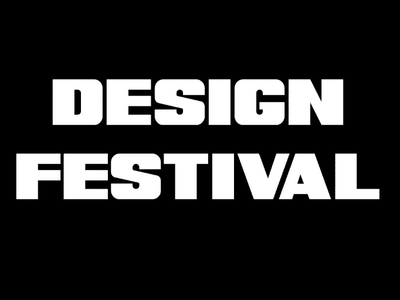
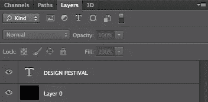
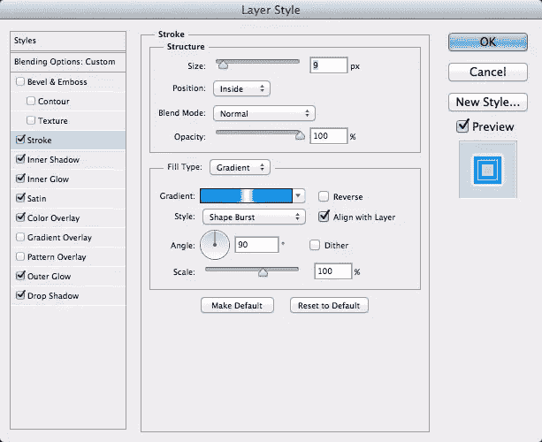
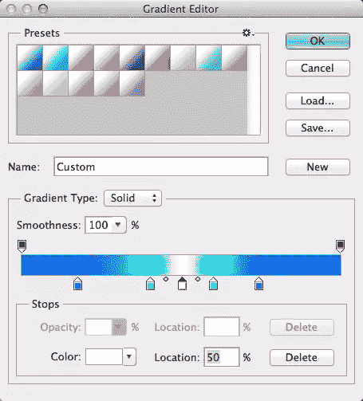
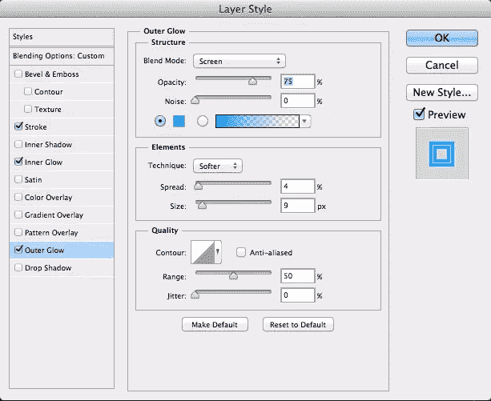
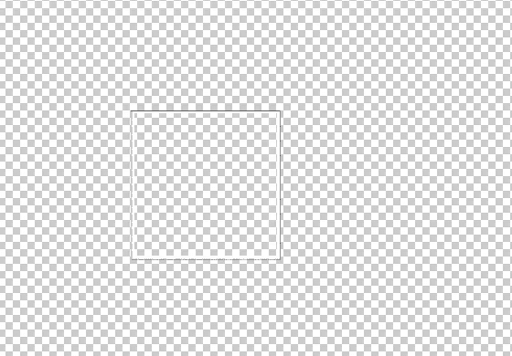
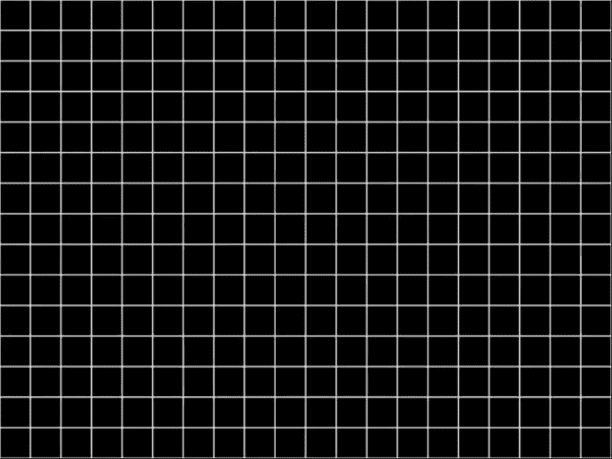
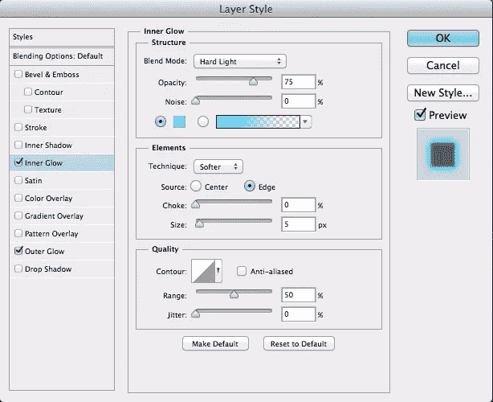
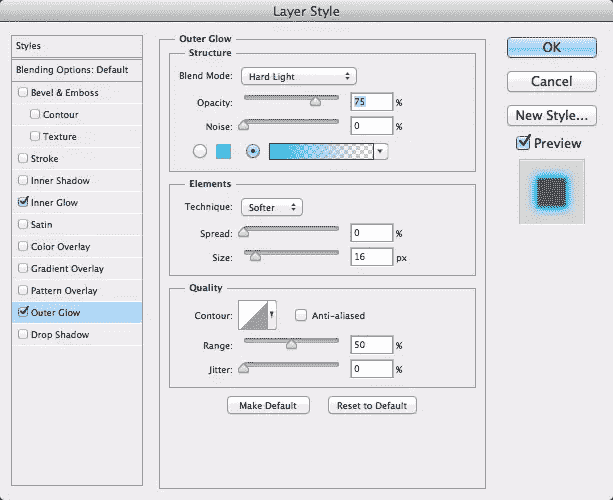
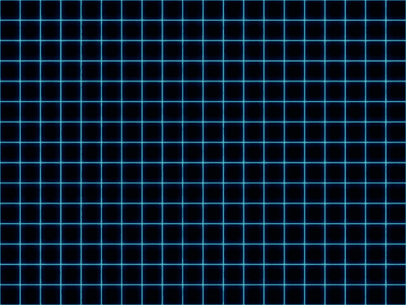

# 在 Photoshop 中创建霓虹复古文本效果

> 原文：<https://www.sitepoint.com/create-a-neon-retro-text-effect-in-photoshop/>

对于任何图形艺术家来说，创造反映特定风格的外观都是一项重要的技能。知道如何创造各种各样的风格会让你成为一个多才多艺的设计师，可以处理各种各样的项目。能够处理广泛的项目也让你更有市场。而且，更具市场竞争力会让你更容易找到好工作。对于任何一个设计师来说，一个有用的技能就是创造伟大的标题和文本效果的能力。在本教程中，我们将使用一些不同的技术来创建一个复古的未来文本效果。

首先，创建一个宽度为 1024 像素、高度为 768 像素的新文档。用黑色填充背景层。

选择文本工具，并选择一种复古风格的字体。你可以在网上找到所有的免费字体，但是所有不同风格的免费字体的一个很好的来源是 dafont.com。我选的字体叫超级复古 M54，作者是穆罕默德·拉赫曼。选择白色作为颜色。

为了产生正确的视觉效果，我们需要将文字图层的填充减少到 0。您的文字将暂时不可见，直到我们开始添加图层样式到我们的文本。

双击类型图层，弹出图层样式对话框。首先，我们将在文本中添加一个笔划，这将添加定义。选择一个内部笔画，并根据您的字体大小，使笔画大小为 8 到 10 倍。我们需要将笔画上的填充类型设置为渐变。

我们需要创建一个自定义的渐变来获得我们的笔画的正确外观。点击渐变图标。确保中心为白色，边缘渐变为中蓝色(#0064fb)。这将给出一个圆形的、立体的笔划的外观。在白色和中蓝色之间，选择两者之间的浅绿色(#00ffea)过渡。第一个渐变都不起作用，但最后一个，形状爆发，遵循文本本身的轮廓。

接下来，我们需要添加一个内部发光。将颜色设置为浅蓝色(#24bfff)，并将混合模式设置为“屏幕”将技巧设置为“柔和”，将源设置为“边缘”将阻风门设置为 45，大小设置为 15。扼流抑制辉光并使其更加刚性，减少内部辉光的褪色。

接下来，创建一个外部辉光，如霓虹灯通常发出的柔和辉光。将光晕设置为中浅蓝色(#00a2ff)，并将混合模式设置为“屏幕”将不透明度设置为 75%。将跨页设置在 3 到 5px 之间，将大小设置在 7 到 10px 之间。根据文字的大小，您可能需要调整每个光晕的大小。

接下来，我们将创建一个发光的网格来显示该类型，给该类型一个线框-未来主义的外观，这是几十年前的典型。打开一个新文档，选择矩形工具。按住 Shift，画一个完美的正方形。在选项栏中点击描边，添加 3 到 5px 的描边。为了让我们的效果生效，我们需要移除背景。双击背景层，关闭其可见性或将其完全删除。在正方形图层上，将填充量降低到 0%。

接下来，按住 command 键单击方形图层，将其作为选区加载。Photoshop CS6 会自动将笔画添加为选区的一部分，这正是我们想要的。进入“编辑”>“定义模式”给你的图案起一个描述性的名字，比如“网格”或者“网格线”

回到排版文档，新建一个图层，填充白色。将填充设置为 0%。双击图层以显示无填充图层的图层样式。选择图案叠加选项，用我们刚刚创建的空心正方形图案填充图层。更改大小，使网格大小合理，并均匀填充图层。我隐藏了文字层，以便更容易看到。

要保持图案可编辑，请右键单击图案层，然后选择“转换为智能对象”现在图层是一个智能对象，我们可以对它应用一组新的图层样式。选择“内部发光”，使用浅蓝色(#00e4ff)，并将混合模式更改为“强光”尺寸保持在 5px。

然后，使用中等亮度的蓝色(#009cff)应用外部发光，并将混合模式更改为“强光”将大小设置为 15 到 16px 左右。

这将创建一个发光的网格，我们将在我们的类型掩盖。您可以调整外部光晕大小，以获得更大、更强的光晕效果。

接下来，选择文字图层，按住 Command/Ctrl 键并单击图层图标，将文本作为选区加载。上至“选择”>“修改”>“收缩”，将收缩设置为 5px。这将在你的文本形状中选择一个区域，但是要足够的收缩它，这样它就不会影响到外部线条显示的区域。

在选择仍然有效的情况下单击网格层。然后单击“图层”面板底部的图层蒙版图标，在文本形状中创建图层蒙版。

为了给文字本身增加一点润色，在其他图层之上新建一个图层。选择白色作为前景色，并选择画笔工具。选择 15 到 20px 的软边笔刷。在你输入的任意角落，单击你的文本。这应该在你的文本上创造一个柔和的光泽。确保每次点击时改变画笔的大小，因为不同的大小看起来更真实。

白色有点刺眼，太显眼了，所以右键单击网格层，选择“复制图层样式”，选择你刚刚创建的笔刷层，右键单击图层，选择“粘贴图层样式”

### 结论

创造文字效果真的能引起人们对你作品的注意。能够快速简单地执行不同的风格将会节省你的时间，让你赚更多的钱，并且会让每个项目变得更好。保持你的作品的可编辑性意味着如果措辞改变了，你不必回去完全重做你的作品，这也可以节省你的时间。

## 分享这篇文章