# 在 Illustrator 中创建有说服力的横幅广告

> 原文：<https://www.sitepoint.com/create-a-persuasive-banner-advertisement-in-illustrator/>

引人注目的网络广告每年赢得数十亿美元的在线销售额。一个普通的、容易被人遗忘的广告和一个给人留下强烈的正面印象以确保销售的广告之间的区别通常只是几个像素或一些额外的点睛之笔。你的网络广告应该设计得聪明、谨慎、深思熟虑。在你的设计过程中，记住那些迫使人们点击它并更多地了解你的产品和服务的关键视觉因素。

而且，信不信由你，Photoshop 并不是唯一一个可以帮你组合出一个看起来很犀利的广告的软件。

今天，我将向您展示如何在 Adobe Illustrator 中制作自己的网页横幅广告。作为一个例子，我将制作一个虚拟网上商店的横幅。我们开始吧！

首先，我们来看看最后的结果。你可以[在这里](https://www.sitepoint.com/wp-content/uploads/2012/11/banner-ad.zip)下载完成的广告。

### [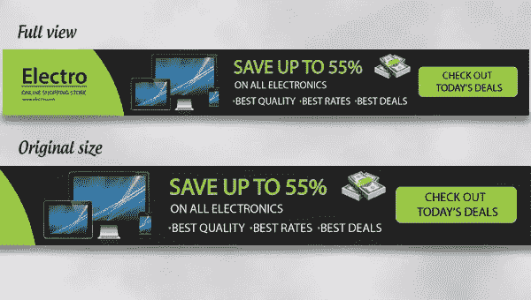](https://www.sitepoint.com/wp-content/uploads/2012/11/Final-result.jpg)

### 第一步

在 Adobe Illustrator 中创建新文档，宽度为 728 像素，高度为 90 像素。

### 第二步

选择矩形工具来绘制一个 728 像素乘 90 像素的矩形，使你的“填充”更深的灰色阴影，并设置“笔画”为无。

[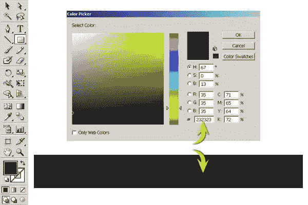](https://www.sitepoint.com/wp-content/uploads/2012/11/21.jpg)

### 第三步

创建一个新层。选择椭圆工具画一个较大的圆，如下所示。将你的“填充”设置为绿色，并将“描边”设置为“无”。

[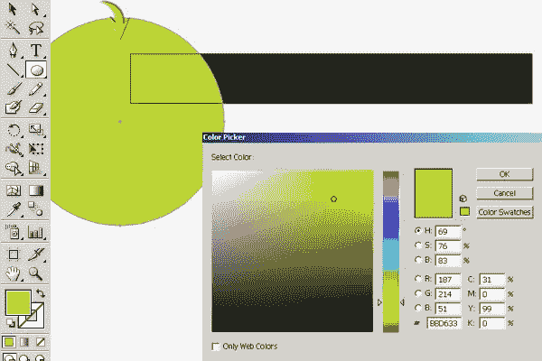](https://www.sitepoint.com/wp-content/uploads/2012/11/31.jpg)

### 第四步

现在，通过点击这些层上的环形目标并按下“Shift”键来选择矩形和椭圆层。之后，选择形状生成器工具；把它的箭头放在圆上超出矩形的部分。你会注意到一个带“+”号的箭头，现在当你按“Alt”键时，会出现“-”号。现在，单击减去圆中不需要的部分。

[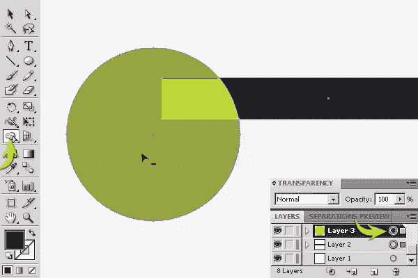](https://www.sitepoint.com/wp-content/uploads/2012/11/4.jpg)

[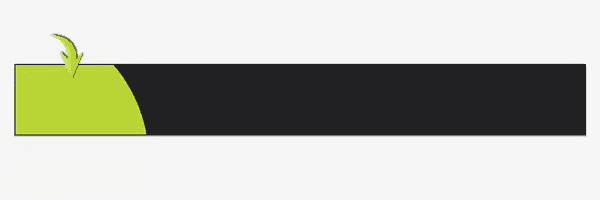](https://www.sitepoint.com/wp-content/uploads/2012/11/4b.jpg)

### 第五步

复制这个形状，并减少其宽度使用选择工具(“V”)。改变它的“填充”颜色为不同的绿色，如下所示。

[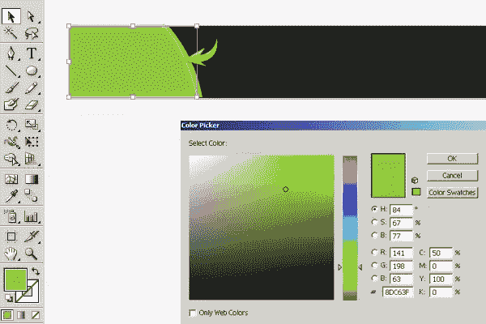](https://www.sitepoint.com/wp-content/uploads/2012/11/51.jpg)

### 第六步

接下来，我们将添加品牌名称。创建一个新的层，并选择文字工具键入所需的品牌名称。我用的是“Myriad Pro”字体。使用#282828 作为你的填充颜色。

[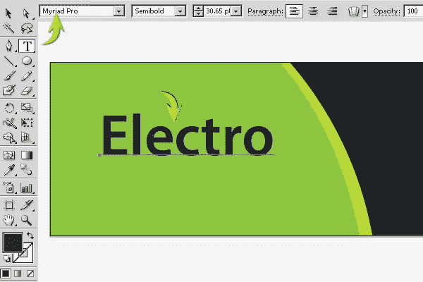](https://www.sitepoint.com/wp-content/uploads/2012/11/61.jpg)

### 第七步

复制文字图层，将原来的文字填充改为纯白，向下拖动一步，达到下图的效果。

[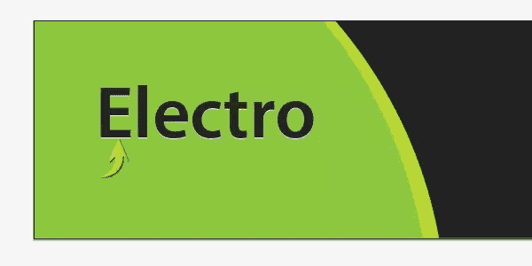](https://www.sitepoint.com/wp-content/uploads/2012/11/71.jpg)

### 第八步

选择线条工具在品牌名称下面画一条线，将“填充”设置为无，选择 1 磅的笔画。

[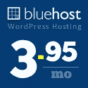](https://www.sitepoint.com/wp-content/uploads/2012/11/8.jpg)

### 第九步

用同样的字体写下你想要的副标题。

[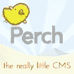](https://www.sitepoint.com/wp-content/uploads/2012/11/9.jpg)

### 第十步

现在，在一个新层上写报价。使用#8DC63F 作为您的填充颜色，并使用#A9D161 作为此文本的笔触。

[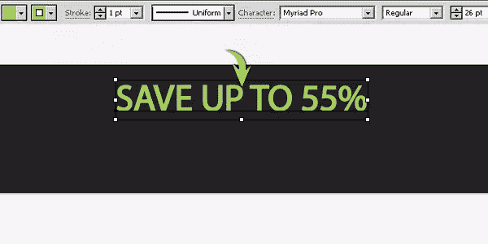](https://www.sitepoint.com/wp-content/uploads/2012/11/101.jpg)

复制这个文本层，改变原始层的“填充”为黑色，设置描边为“无”，并向下拖动副本一步。

[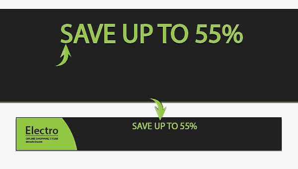](https://www.sitepoint.com/wp-content/uploads/2012/11/10b.jpg)

### 步骤 11

在 Illustrator 中打开货币图标文件，复制它，并将其粘贴到新图层上的文档中。使用选择工具(“V”)调整大小和位置。

复制图标层，通过“对象”>“变换”>“反射”垂直反射在此应用以下设置。

[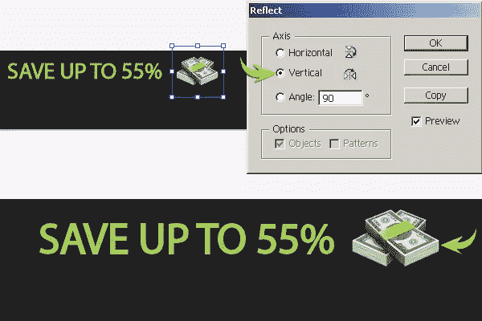](https://www.sitepoint.com/wp-content/uploads/2012/11/11b.jpg)

### 步骤 12

使用 14pt 大小的“Myriad Pro”字体添加文本。

[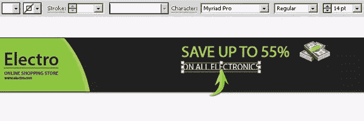](https://www.sitepoint.com/wp-content/uploads/2012/11/121.jpg)

### 第十三步

这里，我用椭圆工具制作了简单的项目符号。

### 步骤 14

接下来，添加您想要在广告中显示的图像。可以如下图定位。我用我的一些屏幕模型作为例子。

[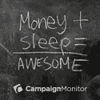](https://www.sitepoint.com/wp-content/uploads/2012/11/14.jpg)

### 第十五步

现在，我们将调用操作按钮。选择如下设置的圆角矩形工具，画一个如下图所示的矩形。使用颜色#8DC63F 作为“填充”颜色，使用颜色#C5DE90 作为 1 磅笔画。

[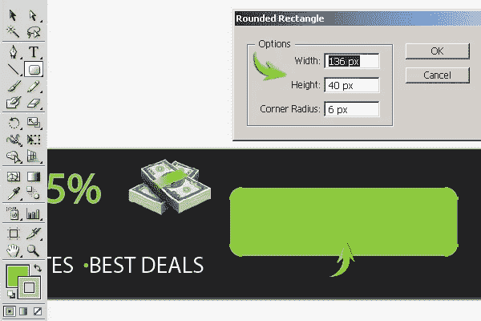](https://www.sitepoint.com/wp-content/uploads/2012/11/151.jpg)

### 第十六步

复制矩形，改变其填充颜色为黑色，并设置其中风为无。将这一层放在原来的矩形下面，向右下方拖动，形成按钮的阴影。

[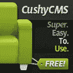](https://www.sitepoint.com/wp-content/uploads/2012/11/16.jpg)

### 步骤 17

要使按钮高亮显示，设置#FBE00B 为填充颜色，并使用钢笔工具绘制如下所示的形状。按照步骤 4 中的说明，使用形状生成器工具将其限制在按钮上。

### 步骤 18

将高光层的不透明度降低到 40%。

[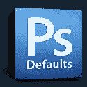](https://www.sitepoint.com/wp-content/uploads/2012/11/18.jpg)

### 步骤 19

接下来，在按钮上键入一些文本。

[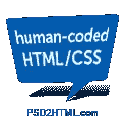](https://www.sitepoint.com/wp-content/uploads/2012/11/19.jpg)

### 步骤 20

复制文本层，将原始文本层的填充改为白色，并向下拖动一步。

[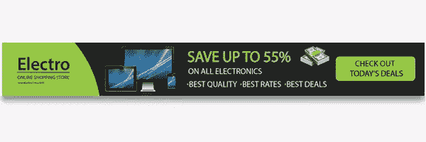](https://www.sitepoint.com/wp-content/uploads/2012/11/20b.jpg)

[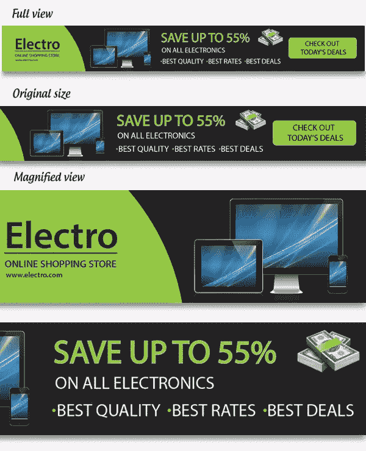](https://www.sitepoint.com/wp-content/uploads/2012/11/20c.jpg)

就是这样。我们的网络横幅广告已经准备好了。我希望你们喜欢这个教程，并学到一些有用的东西。

## 分享这篇文章