# 在 InDesign 中创建时尚的垂直名片

> 原文：<https://www.sitepoint.com/create-a-sleek-vertical-business-card-in-indesign/>

有很多方法可以在网上给人留下深刻印象和进行介绍，但名片仍然非常重要，不管未来的新兴技术如何，一张引人注目的有形名片将始终在吸引新客户方面发挥关键作用。独特而吸引人的名片设计可以帮助你脱颖而出，以真实、有形的方式展示你的价值和才能。让你的名片引人入胜、与众不同的一个方法是设计一个垂直的名片，而不是通常预期的水平名片。

因此，今天，我们将在 InDesign 中创建一个吸引人的垂直名片。我们将使用一些有用的技术、工具和技巧来完成这项工作。让我们开始陈述。

**最终结果:** **( [下载完成的、分层的 InDesign 文件。](https://www.sitepoint.com/wp-content/uploads/2013/04/Vertical-business-card.zip) )**

### 第一步

打开 InDesign，单击“文件”>“新建”>“文档”，将页数设置为 2。取消对页。您可以使用打印机喜欢的尺寸；我将宽度设置为 2 英寸，高度设置为 3.5 英寸，边距为 0.5 英寸，出血量为 0.125 英寸

[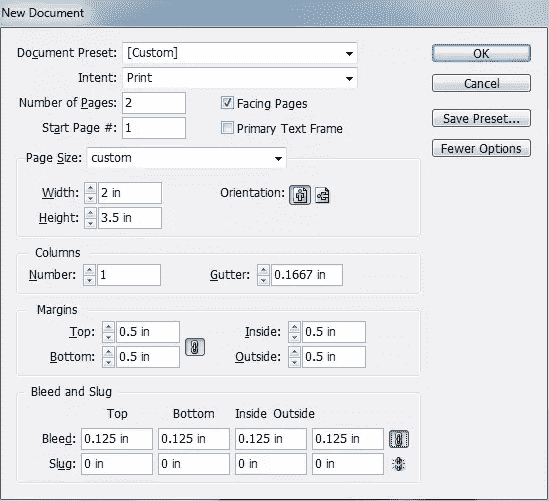](https://www.sitepoint.com/wp-content/uploads/2013/04/Step-1.jpg)

### 第二步

现在，选择矩形工具，用深色色板创建一个矩形(C=0 M=0 Y=0 K=92)。

[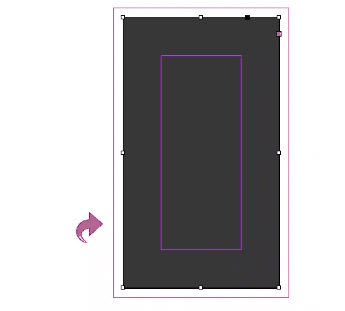](https://www.sitepoint.com/wp-content/uploads/2013/04/Step-2.jpg)

### 第三步

选择线条工具，用上面矩形中使用的颜色创建一条垂直线。然后，用色样(C=0 M=0 Y=0 K=93)添加一个 4pt 的“白钻”描边。

[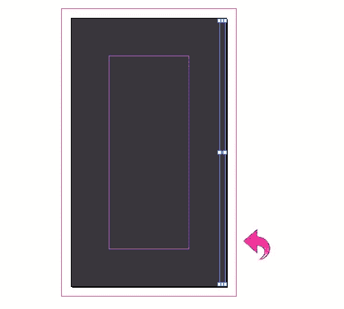](https://www.sitepoint.com/wp-content/uploads/2013/04/Step-3.jpg)

### 第四步

重复同样的过程，用这些线填充背景。

[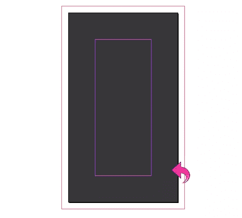](https://www.sitepoint.com/wp-content/uploads/2013/04/Step-4.jpg)

### 第五步

在我们开始设计元素之前，让我们将屏幕模式改为“预览”,以便我们可以正确地看到细节。现在，创建一个新层(使用层面板)，然后选择钢笔工具，并创建一个路径如下。用色样填充(C=9 M=75 Y=100 K=7)。

### 第六步

选择上面的图层，点击效果添加一些阴影。使用以下设置。

### 第七步

再次选择钢笔工具，创建另一个路径，用纸色样填充(C=0 M=0 Y=0 K=0)。然后，点击“效果”,使用之前使用的相同值添加阴影。

[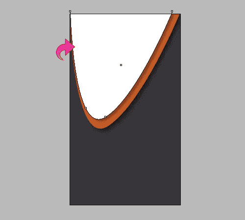](https://www.sitepoint.com/wp-content/uploads/2013/04/Step-7.jpg)

### 第八步

重复同样的过程，用相似的颜色和阴影创建更多的路径。

[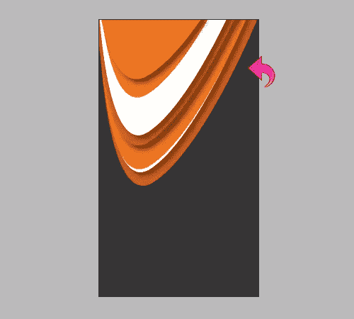](https://www.sitepoint.com/wp-content/uploads/2013/04/Step-8.jpg)

### 第九步

现在，让我们从底部开始。选择钢笔工具，创建一个路径，并用色样填充(C=9 M=75 Y=100 K=7)。

[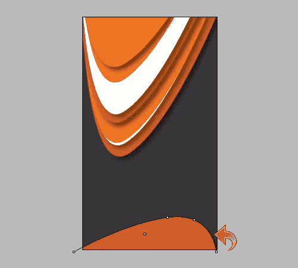](https://www.sitepoint.com/wp-content/uploads/2013/04/Step-9.jpg)

### 第十步

用颜色(C=9 M=75 Y=100 K=7)和(C=1 M=67 Y=100 K=0)再创建两条路径。然后，点击“效果”添加一些阴影。使用下面显示的值。

[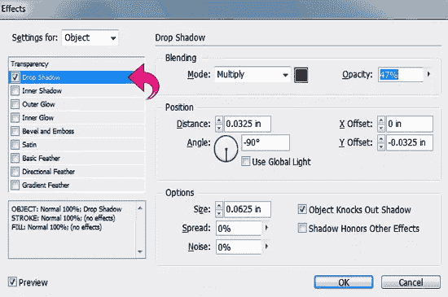](https://www.sitepoint.com/wp-content/uploads/2013/04/Step-10.jpg)

### 步骤 11

现在，让我们添加标题文本。选择文字工具并使用纸张样本添加文本(C=0 M=0 Y=0 K=0)。

[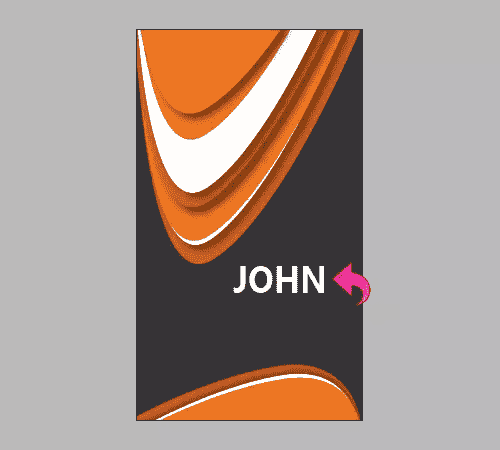](https://www.sitepoint.com/wp-content/uploads/2013/04/Step-11.jpg)

### 步骤 12

选择上面的图层，点击“效果”,使用下面的设置添加阴影和内阴影。

[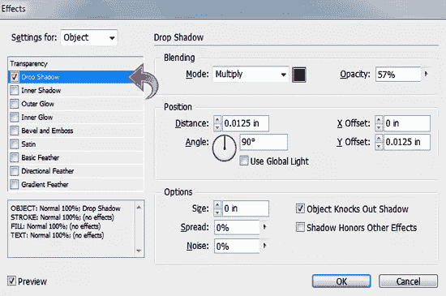](https://www.sitepoint.com/wp-content/uploads/2013/04/Step-12a.jpg)

[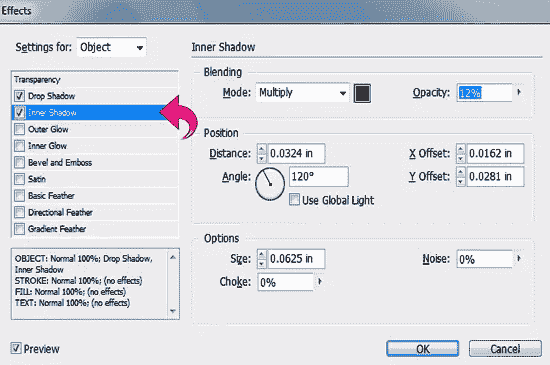](https://www.sitepoint.com/wp-content/uploads/2013/04/Step-12b.jpg)

### 第十三步

重复同样的过程，并添加更多的文字。前面的已经做完了！

[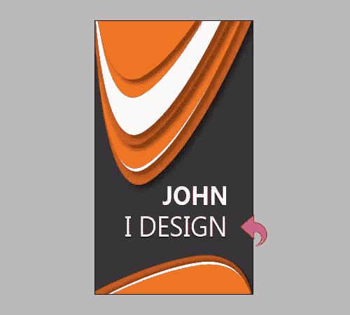](https://www.sitepoint.com/wp-content/uploads/2013/04/Step-13.jpg)

### 步骤 14

现在，让我们从另一边开始。创建一个新层，并选择矩形工具创建一个矩形使用相同的打印机友好的尺寸，你之前选择的。

[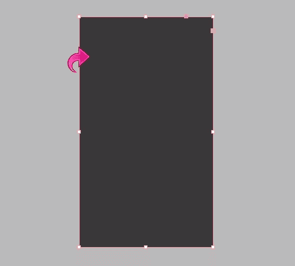](https://www.sitepoint.com/wp-content/uploads/2013/04/Step-14.jpg)

### 第十五步

选择线条工具，用 4pt“白色菱形”笔画添加线条，方法和上面一样。

[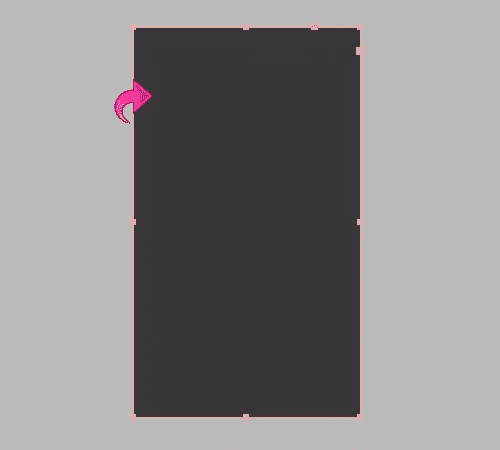](https://www.sitepoint.com/wp-content/uploads/2013/04/Step-15.jpg)

### 第十六步

选择钢笔工具创建一个路径，并用色样填充(C=1 M=67 Y=100 K=0)。

[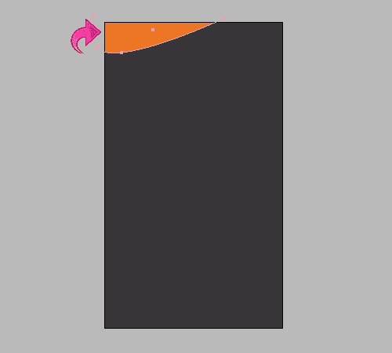](https://www.sitepoint.com/wp-content/uploads/2013/04/Step-16.jpg)

### 步骤 17

重复同样的过程，创建其余的路径，并添加一些阴影。

[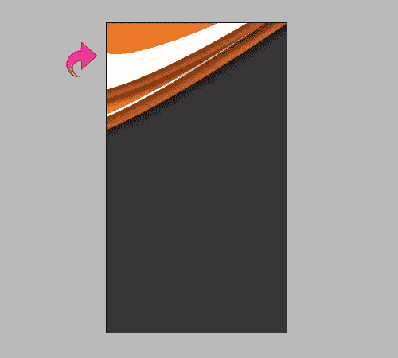](https://www.sitepoint.com/wp-content/uploads/2013/04/Step-17.jpg)

### 步骤 18

选择文字工具，用纯白纸样本添加文本，并添加内阴影和投影。使用与卡片另一面文字相同的设置。

[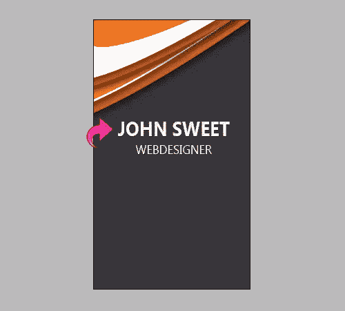](https://www.sitepoint.com/wp-content/uploads/2013/04/Step-18.jpg)

### 步骤 19

重复相同的过程，并添加一些额外的文本。

[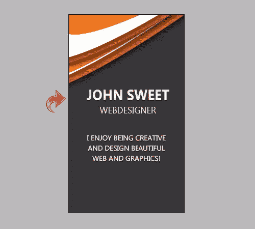](https://www.sitepoint.com/wp-content/uploads/2013/04/Step-191.jpg)

### 步骤 20

现在，选择线条工具，在文本之间创建一个分隔线。用灰色样本(C=0 M=0 Y=0 K=83)给线条添加一个 3pt 的“白色菱形”描边。

### 步骤 21

选择矩形工具，用颜色创建一个小矩形(C=0 M=0 Y=0 K=94)。

[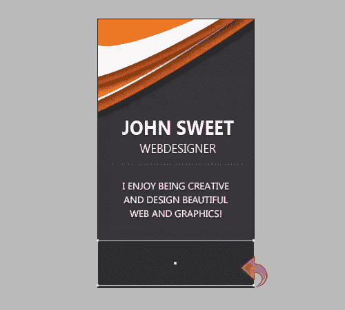](https://www.sitepoint.com/wp-content/uploads/2013/04/Step-211.jpg)

### 步骤 22

现在，选择文字工具，将联系方式添加到设计中。

[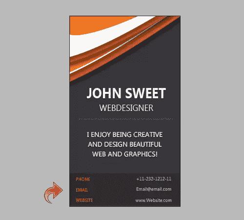](https://www.sitepoint.com/wp-content/uploads/2013/04/Step-221.jpg)

### 步骤 23

选择线条工具，使用深色色样(C=0 M=0 Y=0 K=93)创建 1 磅描边的分割线。

我们已经完成了垂直名片的制作。看起来很帅！我希望你喜欢这个过程。

## 分享这篇文章