# 在 Illustrator 中创建拼接徽章

> 原文：<https://www.sitepoint.com/create-a-stitched-badge-in-illustrator/>

当涉及到验证一个品牌、一个公司或一个证书时，徽章起着至关重要的作用。但是，这应该有技巧地进行，因为赢得信誉不是来自炫耀性的展示，这往往会产生与预期效果相反的效果。徽章设计应该微妙但有创意，独特，视觉上吸引人，以培养你正在寻找的即时识别和影响力。

在本教程中，我将带您了解在 Adobe Illustrator 中设计徽章的过程。我们将使用各种形状工具，钢笔工具，文字工具，以及效果菜单中的一些其他选项来实现最终的效果。我希望你能从自己的徽章设计中获得一些灵感。我们开始吧！

**资源:**

[自由简约的纹理](http://www.graphicsoulz.com/premium-item/5-high-quality-minimalist-textures/ "free textures")

[桦树标准字体](http://fontzone.net/font-details/birchstd "birchstd font")

[海滨度假村 NF 字体](http://www.fontspace.com/nicks-fonts/seaside-resort-nf "seaside resort nf font")

[亚伯拉罕·林肯字体](http://www.losttype.com/font/?name=Abraham%20Lincoln "Abraham Lincoln font")

[通道倾斜 2 字形](http://www.fonts2u.com/channel-slanted-2.font "channel slanted 2 font")

**最终结果:([下载完成的插画文件](https://www.sitepoint.com/wp-content/uploads/2013/07/Badge.zip)。)** 

### 第一步

在 Adobe Illustrator 中创建一个宽度为 600 像素、高度为 500 像素的新文档。

[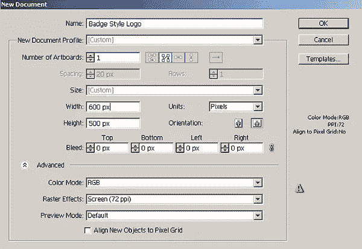](https://www.sitepoint.com/wp-content/uploads/2013/07/1.jpg)

### 第二步

首先，我们将画出我们徽章的基本形状。选择深灰色(#231F20)作为填充和描边颜色。从顶部控制栏中选择 3 磅的描边粗细。现在，选择矩形工具并单击画布以查看选项窗口。输入 185 像素的宽度和 175 像素的高度，点击“确定”得到一个矩形。将这一层标记为“徽章”。

[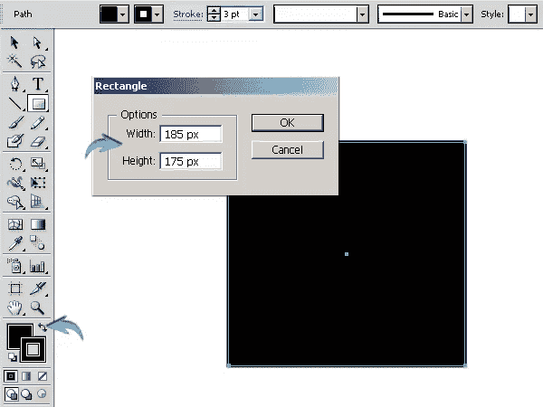](https://www.sitepoint.com/wp-content/uploads/2013/07/2.jpg)

### 第三步

现在，使用钢笔工具(“P”)在矩形的底部中点添加一个锚点。

选择直接选择工具(“A”)并向下拖动这个新的锚点，以获得您想要的长度。

### 第四步

我想把徽章的角弄圆。为此，通过单击相应层右侧的环形目标来选择徽章层。现在，进入“效果”>“风格化”>“圆角”，输入一个 8px 的半径。

[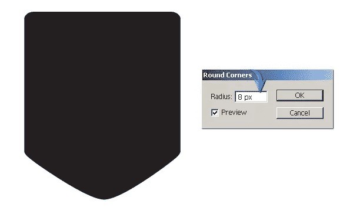](https://www.sitepoint.com/wp-content/uploads/2013/07/4.jpg)

### 第五步

接下来，我们将添加几笔徽章，给它一个漂亮的框架。选择徽章层，进入“窗口”>“外观”或按“Shift + F6”打开外观窗口。双击内容以查看其项目。现在，单击笔划以选择它，并点击外观面板右上角的选项方块。选取“添加新笔画”以在前一笔画之上获得新笔画。现在，改变新笔画的颜色为白色，并打开它的笔画面板。这里做两个调整:增加它的粗细到“6.5 磅”，选择“内侧对齐笔画”。

[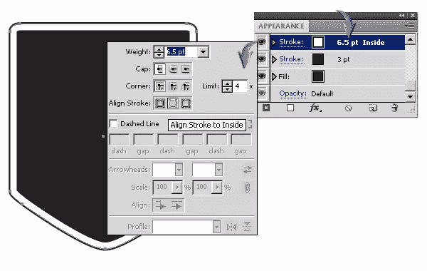](https://www.sitepoint.com/wp-content/uploads/2013/07/5.jpg)

### 第六步

在前两个笔画之上再添加一个新笔画。将其颜色改为黑色，并在“描边”面板中选择 5pt 的粗细。确保它在内部对齐，如步骤 5 所示。

[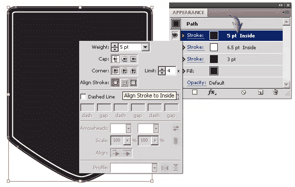](https://www.sitepoint.com/wp-content/uploads/2013/07/6.jpg)

### 第七步

在其余的上面添加一个新的笔画，将其颜色改为白色。选择一个 2 磅的重量，再次选择“内侧对齐笔画”得到如下所示的效果。

[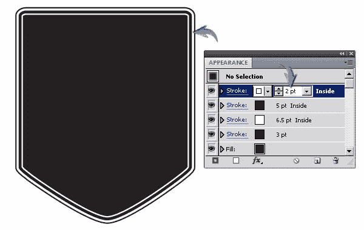](https://www.sitepoint.com/wp-content/uploads/2013/07/7.jpg)

### 第八步

接下来，我们将为徽章制作丝带。选择#F41616 作为填充颜色，并选择白色。从顶部控制栏中选择 1 磅重的笔画。现在，选择矩形工具并点击画布打开矩形选项窗口。输入 195 像素的宽度和 40 像素的高度，然后按“确定”。这将是丝带的前面；如下图所示放置。

[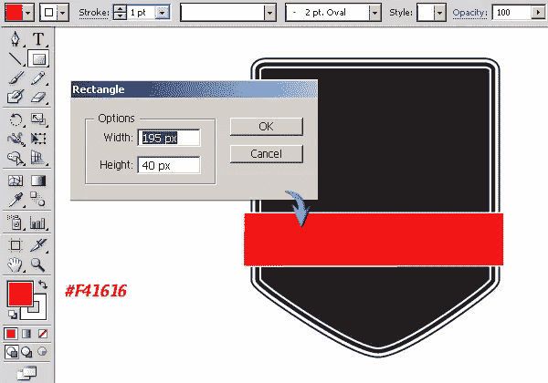](https://www.sitepoint.com/wp-content/uploads/2013/07/8.jpg)

复制此矩形；改变其填充颜色为黑色，并将笔画设置为“无”。将它放在原来的 ribbon 层下面，向下拖动 1-2 步，使用选择工具(“V”)增加它的宽度。

### 第九步

现在，选择文字工具(“T”)在功能区上添加文本。我们将使用白色填充颜色“无”作为笔画，然后我们将输入所需的文本。我在这里用了“桦树 Std”字体。您可以使用“字符”面板来调整字体设置。

[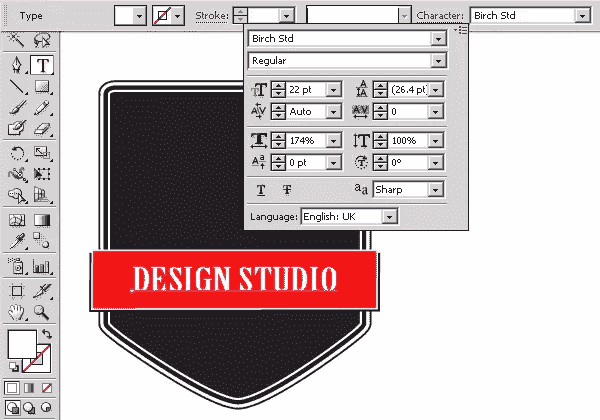](https://www.sitepoint.com/wp-content/uploads/2013/07/9.jpg)

### 第十步

要使文本阴影，复制文本层，并改变原来的图层填充颜色为黑色。使用选择工具(“V”)将其向右下方拖动一步。

[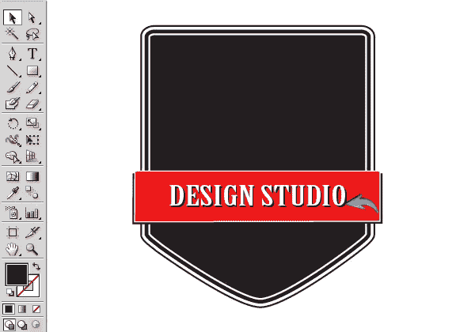](https://www.sitepoint.com/wp-content/uploads/2013/07/10.jpg)

### 步骤 11

用白色填充水平画一个细矩形，使用我们为文本使用的相同技术制作它的阴影，并把它放在色带的左侧。复制两个矩形，并将它们放置在色带的右侧。为了清楚起见，请看下面。

[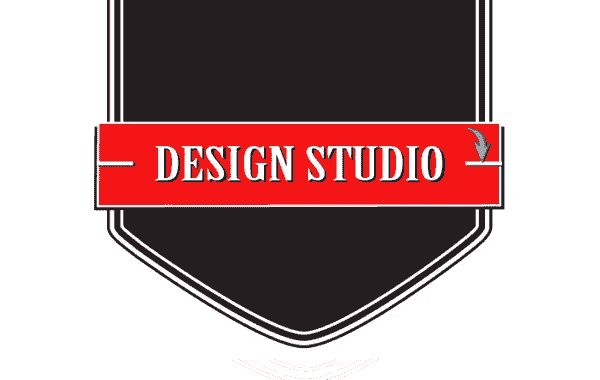](https://www.sitepoint.com/wp-content/uploads/2013/07/11.jpg)

### 步骤 12

接下来，我们将制作丝带的侧面。选择#ED1515 作为你的填充颜色，并选择一个白色的笔触(1 磅重)。选择钢笔工具(“P”)绘制如下所示的形状。把它放在丝带最前面的层下面。

[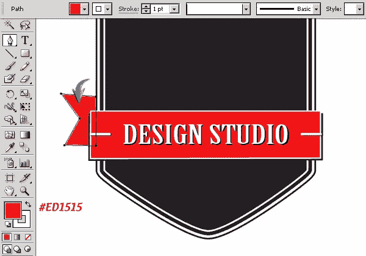](https://www.sitepoint.com/wp-content/uploads/2013/07/12.jpg)

创建它的阴影，并向下拖动两步。

[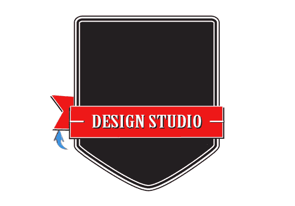](https://www.sitepoint.com/wp-content/uploads/2013/07/12b.jpg)

### 第十三步

复制丝带的侧面和它的阴影层，选择它们，然后进入“对象”>“变换”>“反射”。垂直反射并将它们放置在色带右侧的后面。

[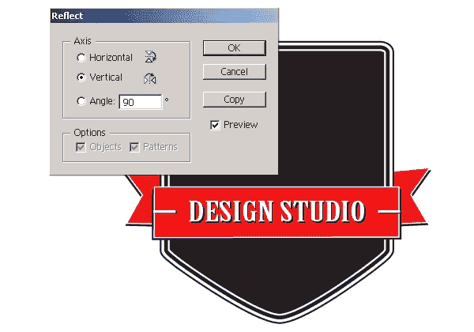](https://www.sitepoint.com/wp-content/uploads/2013/07/13.jpg)

### 步骤 14

在其余层之上新建一层。选择白色作为填充颜色，并使用文字工具(“T”)键入标题文本。我在这里用了“海滨度假村 NF”字体。

[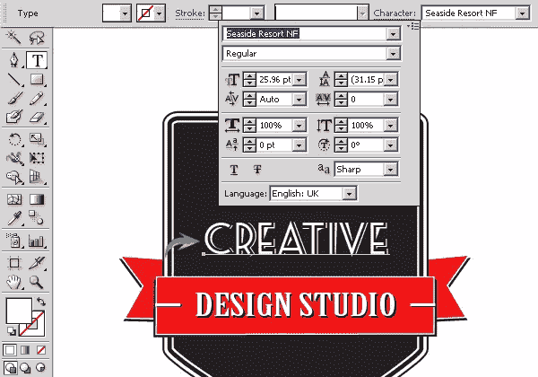](https://www.sitepoint.com/wp-content/uploads/2013/07/14.jpg)

### 第十五步

选择标题层，进入“效果”>“扭曲”>“弧线”。拖动弯曲滑块到 26%，然后按“确定”。您可以随时通过在“外观”面板(“Shift + F6”)中编辑来重新调整弧线设置。

[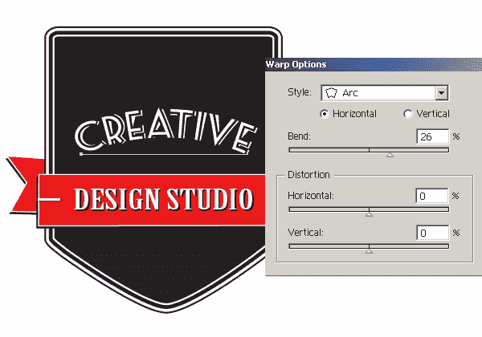](https://www.sitepoint.com/wp-content/uploads/2013/07/15.jpg)

### 第十六步

现在，我们将在标题上方添加更多文本。我使用了“亚伯拉罕·林肯”字体，设置如下。

[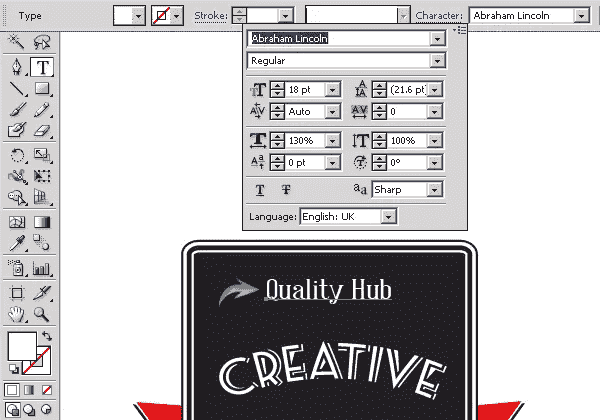](https://www.sitepoint.com/wp-content/uploads/2013/07/16.jpg)

### 步骤 17

对于功能区下面的文本，我使用了“通道倾斜 2”字体，设置如下。

[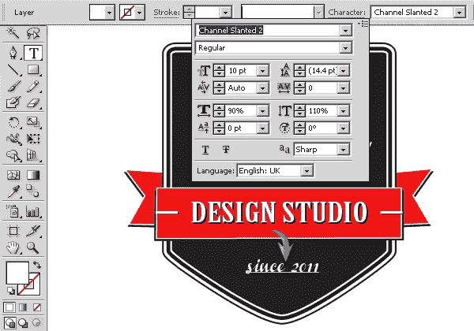](https://www.sitepoint.com/wp-content/uploads/2013/07/17.jpg)

### 步骤 18

接下来，使用钢笔工具用白色填充绘制如下所示的三角形。使用选择工具(“V”)沿顶部和底部文本调整大小和位置。

[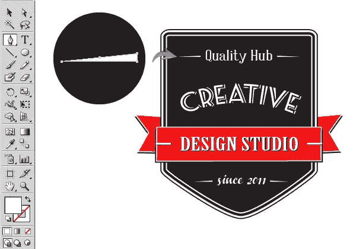](https://www.sitepoint.com/wp-content/uploads/2013/07/18.jpg)

### 步骤 19

现在我们将装饰标题文本。在其余的图层上画一个白色的矩形。设置其填充颜色为“无”，并给它一个 1 磅的白色中风。现在，选择这一层，并编辑笔画面板。选中虚线选项，并为虚线输入 4pt，为间隙输入 4pt，以获得预期的缝合效果。

[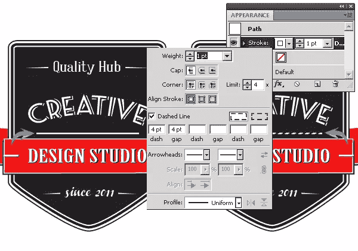](https://www.sitepoint.com/wp-content/uploads/2013/07/19.jpg)

### 步骤 20

选择这个缝合层，并应用下面的弧形设置，使其与我们的标题文本对齐。

[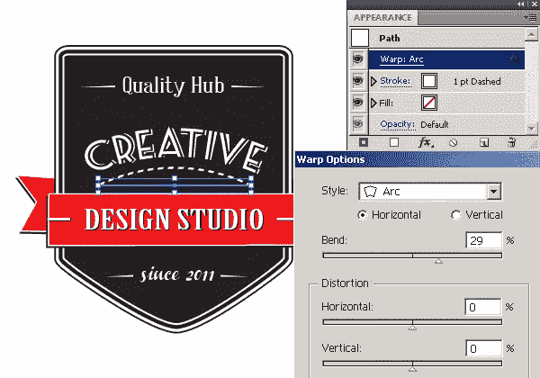](https://www.sitepoint.com/wp-content/uploads/2013/07/20.jpg)

复制缝合层，并增加其大小，将其放置在标题文本之上。

**最终结果:**

就是这样！我希望你喜欢这个徽章的创作，并学到了一些有用的东西。我将等待你的反馈。

## 分享这篇文章