# 在 Illustrator 中创建时尚的心形 3D 礼品盒

> 原文：<https://www.sitepoint.com/create-a-stylish-heart-shaped-3d-gift-box-in-illustrator/>

情人节可能一年只有一次，但浪漫是全年的，可以创造温暖、浪漫、情感的设计师从 1 月到 12 月都会很忙。无论你是一名设计师，还是仅仅是一名配偶或伴侣，不要等到二月才向你特别的人送去一些心意。

在本教程中，我将带领你在 Illustrator 中创建一个华丽的 3D 礼品盒的过程。你还将通过几个简单的步骤学会如何制作一颗水晶心。我们将使用钢笔工具，渐变工具，以及效果菜单下的一些其他选项来实现最终的效果。所以，让我们开始吧！

**最终结果:([下载完成的矢量文件。](https://www.sitepoint.com/wp-content/uploads/2013/02/3D-Gift-Box.zip) )** 

[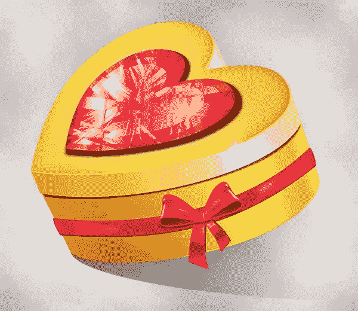](https://www.sitepoint.com/wp-content/uploads/2013/02/Final-result.jpg)

### 第一步

在 illustrator 中创建新文档，宽度为 600 像素，高度为 450 像素。

[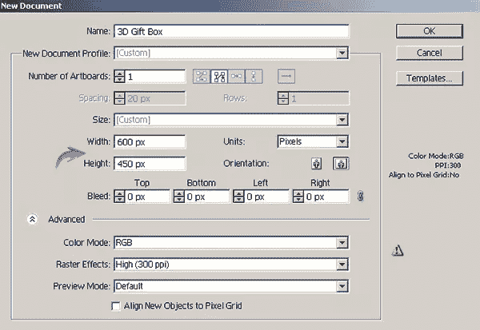](https://www.sitepoint.com/wp-content/uploads/2013/02/1.jpg)

### 第二步

首先，我们将画出心形。选择钢笔工具绘制如下所示的半心形。设置描边为“无”并使用任何填充颜色，因为我们稍后将在形状上应用渐变。

[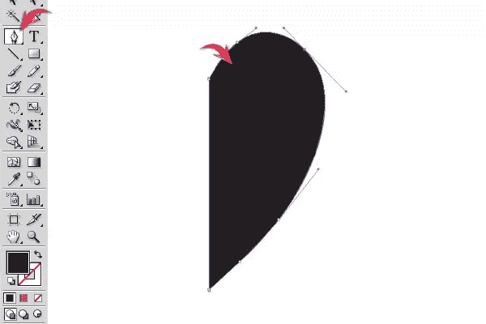](https://www.sitepoint.com/wp-content/uploads/2013/02/2.jpg)

选择心形，点击图层面板右上角的方块，从选项中选择“复制路径”。现在，选择这个复制的图层，进入“对象”>“变换”>“反射”垂直反射它，并将其放置在前面的形状旁边，以完成心脏。

现在选择两半，并在路径查找器面板中选择“统一”形状模式(Shift + Ctrl + F9)。

[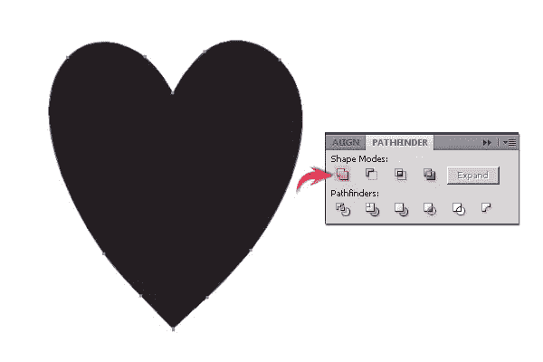](https://www.sitepoint.com/wp-content/uploads/2013/02/2c.jpg)

### 第三步

现在，选择心脏，按下图层右侧的环形目标，进入“效果”>“3D”>“旋转”在此应用以下设置。

[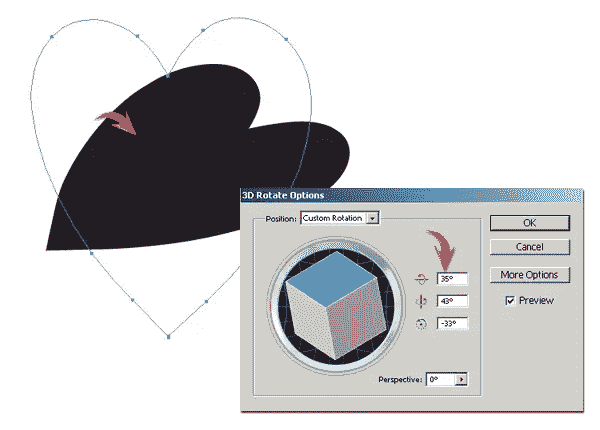](https://www.sitepoint.com/wp-content/uploads/2013/02/3.jpg)

之后，进入“对象”>“展开”现在你可以很容易地编辑形状和改变它的颜色。

### 第四步

选择形状，并应用以下渐变。要得到和我一样的渐变，选择#FFF97D 作为你的填充颜色，并把它拖到样本面板；你可以把它标为 gold1。同样，选择#F8D965 和#E0B74F 填充颜色并拖动到色板上，分别标记为 gold2 和 gold3。选择心形和渐变工具，继续从样本中选择你最近保存的颜色来制作渐变。将 gold1 放在中心，gold3 放在边缘，gold2 放在 gold1 和 3 之间。

[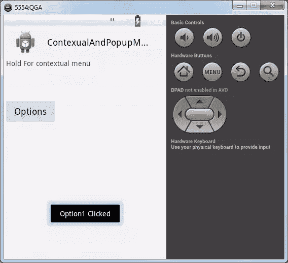](https://www.sitepoint.com/wp-content/uploads/2013/02/4.jpg)

要突出显示心脏的下边框，复制形状，将其拖到原始图层下方，使用颜色#FFF1A1 给它 1 磅的描边，并将其向下拖一步，如下所示。

[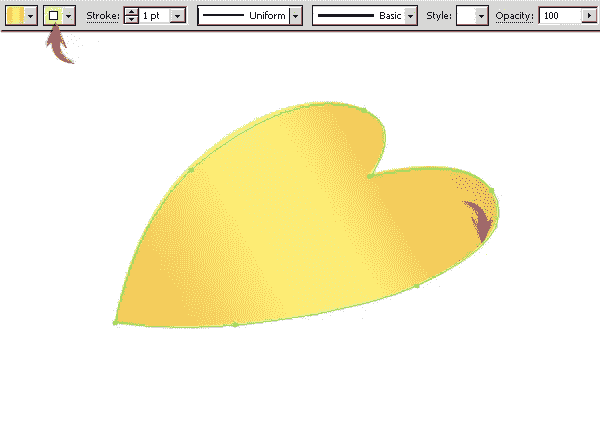](https://www.sitepoint.com/wp-content/uploads/2013/02/4b.jpg)

### 第五步

使用钢笔工具绘制以下形状来完成 3d 框。在心脏层的下面新建一层。

[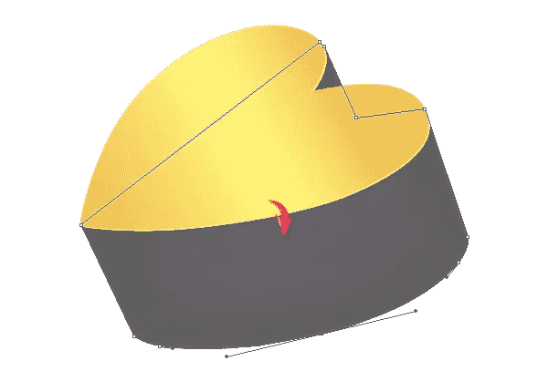](https://www.sitepoint.com/wp-content/uploads/2013/02/5.jpg)

### 第六步

选择框，并应用以下梯度给它。

[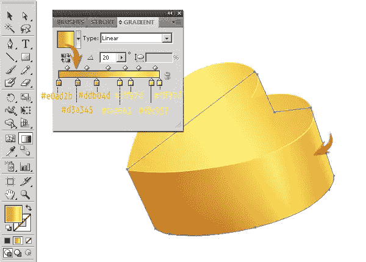](https://www.sitepoint.com/wp-content/uploads/2013/02/6.jpg)

复制盒子图层，使用颜色#EDC10A 给它 1 磅的描边。将此图层放在原始图层的下方，使用选择工具(“V”)将其向下拖动一步。

[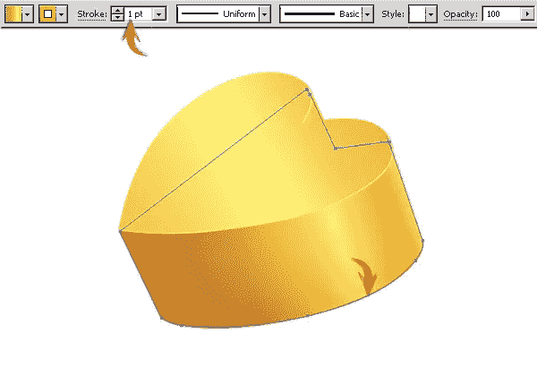](https://www.sitepoint.com/wp-content/uploads/2013/02/6b.jpg)

### 第七步

要做一个盒盖，在心形层的下面和盒子的上面画出下面的形状。

[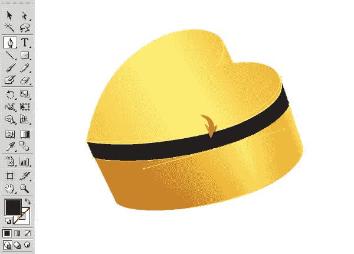](https://www.sitepoint.com/wp-content/uploads/2013/02/7.jpg)

### 第八步

将下面的渐变应用到这个新形状。

[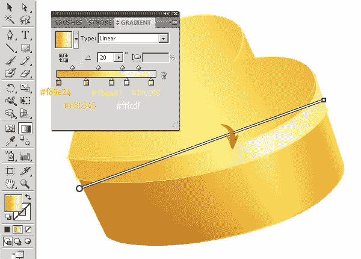](https://www.sitepoint.com/wp-content/uploads/2013/02/8.jpg)

制作一个三角形来完成盖子，并应用相同的梯度。

[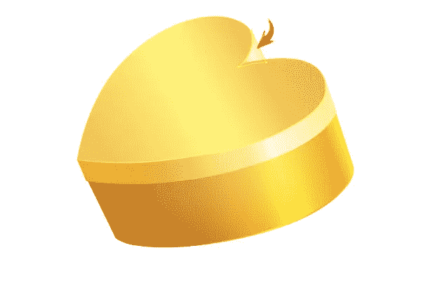](https://www.sitepoint.com/wp-content/uploads/2013/02/8b.jpg)

### 第九步

复制前盖层，改变其填充颜色为黑色，将其放置在原来的层下面，并向下拖动一点。现在选择它，进入“效果”>“模糊”>“高斯模糊”使用以下设置。

[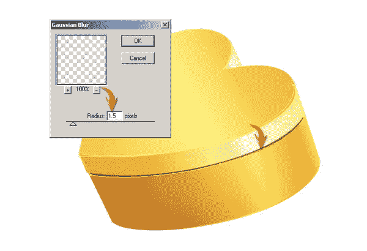](https://www.sitepoint.com/wp-content/uploads/2013/02/9.jpg)

### 第十步

现在选择心脏，进入“效果”>“风格化”>“内心发光”使用以下设置为你的内心发光。

[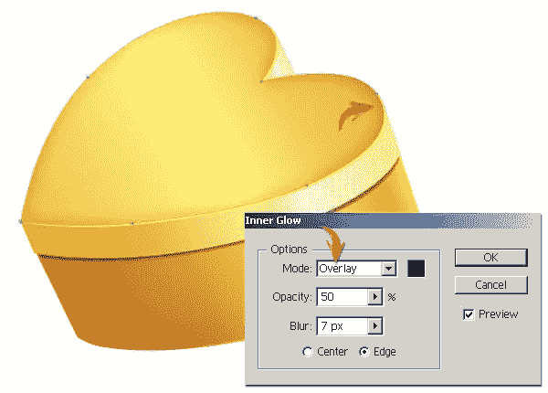](https://www.sitepoint.com/wp-content/uploads/2013/02/10.jpg)

### 步骤 11

要制作阴影，您可以使用椭圆工具或钢笔工具。在其余层下面的一个新层上画它。改变其混合模式为“乘”，减少其不透明度为 60%。

[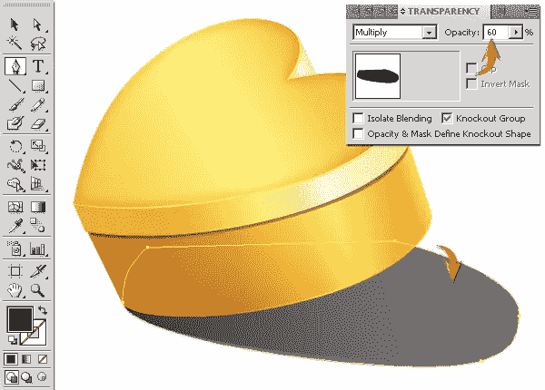](https://www.sitepoint.com/wp-content/uploads/2013/02/11.jpg)

现在，应用下面的黑色到透明渐变。

[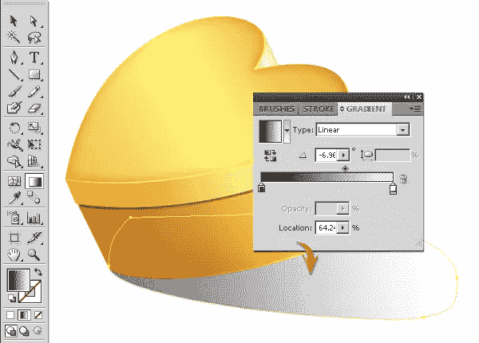](https://www.sitepoint.com/wp-content/uploads/2013/02/11b.jpg)

### 步骤 12

接下来，我们将通过在盖子上创建一个心形钻石来装饰盒子。复制心形，使用选择工具(“V”)缩小它的大小，然后如下图所示放置它。现在，给它应用苹果渐变。您可以通过单击样本左下角的“样本库菜单”图标来找到此渐变。从选项中选择【渐变】>【水果蔬菜】>【苹果】。

[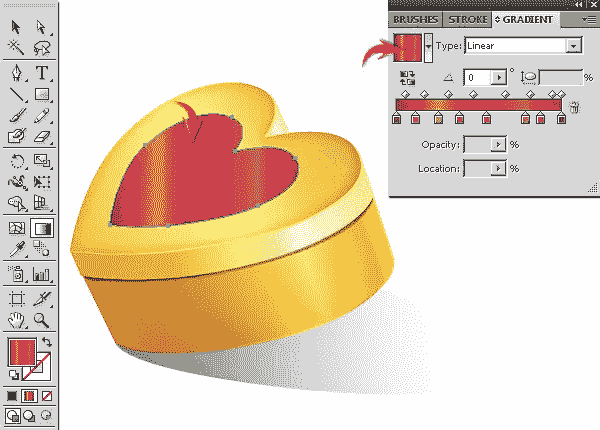](https://www.sitepoint.com/wp-content/uploads/2013/02/12.jpg)

### 第十三步

在顶部新建一层，用之前使用的“苹果”渐变绘制几个随机三角形。

一旦你完成了，复制这一层，并使用选择工具(“V”)旋转它，以获得更密集的外观。选择两个图层，将它们收集到一个新图层中。

[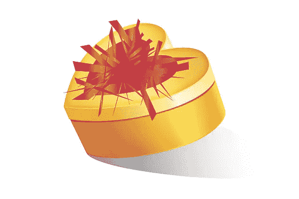](https://www.sitepoint.com/wp-content/uploads/2013/02/13b.jpg)

### 步骤 14

复制步骤 12 中创建的调整大小的心形，并将其拖动到三角形层上。将其填充设置为无。现在，选择这个心脏层和三角形层，然后进入“对象”>“剪贴蒙版”>“制作”这将限制三角形的心脏。

[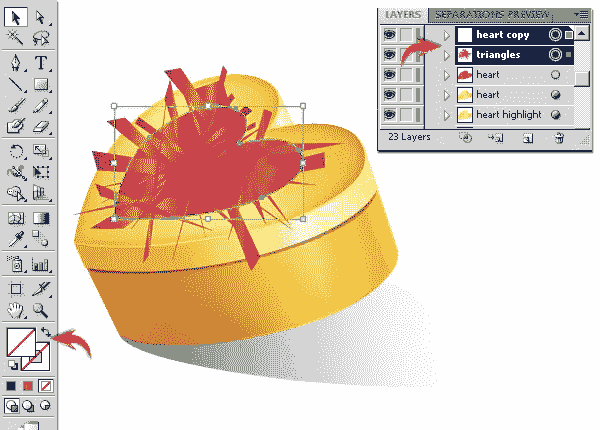 ](https://www.sitepoint.com/wp-content/uploads/2013/02/14.jpg) [ 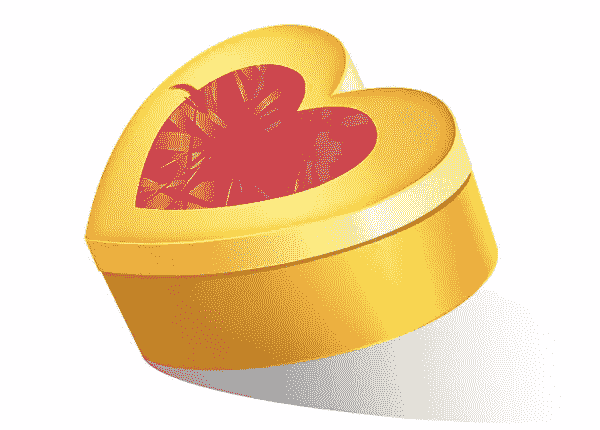](https://www.sitepoint.com/wp-content/uploads/2013/02/14b.jpg)

### 第十五步

复制三角形层，减少其大小一点，并改变其混合模式为“颜色减淡”在透明度面板，以获得如下所示的效果。

[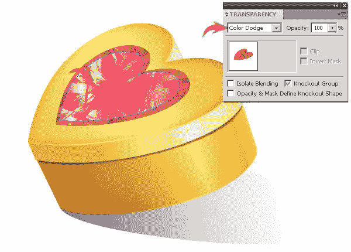](https://www.sitepoint.com/wp-content/uploads/2013/02/15.jpg)

### 第十六步

现在，复制原来的三角形层，把它拖到其余层的上面，并把它的混合模式改为“柔光”

[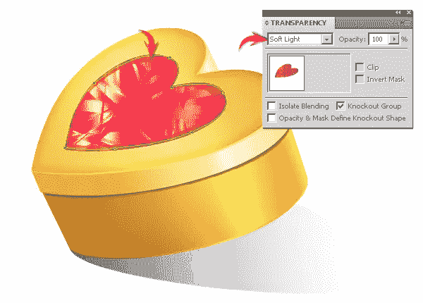](https://www.sitepoint.com/wp-content/uploads/2013/02/16.jpg)

### 步骤 17

复制这一层，减少其大小，并改变其混合模式为“屏幕”，以获得类似于我的效果。

[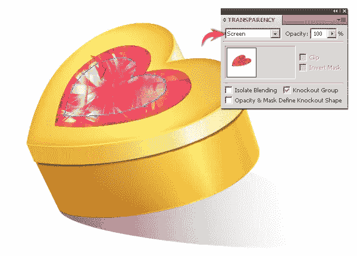](https://www.sitepoint.com/wp-content/uploads/2013/02/17.jpg)

### 步骤 18

复制基础心脏层，改变其填充颜色为#6D0000，增加其大小，向下拖动一点，并把它放在盒子层。

[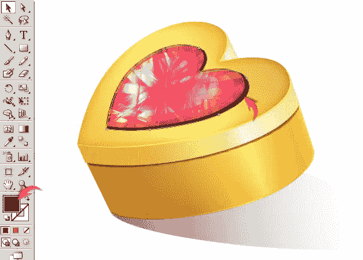](https://www.sitepoint.com/wp-content/uploads/2013/02/18.jpg)

使用第 9 步中解释的制作盒盖阴影的方法制作它的阴影。

[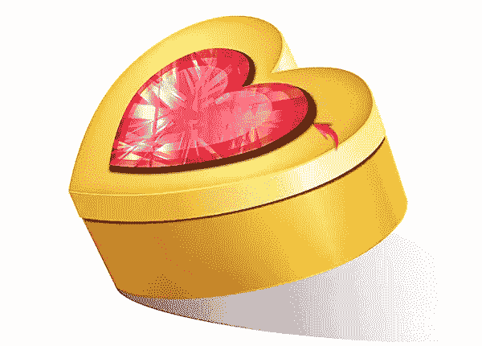](https://www.sitepoint.com/wp-content/uploads/2013/02/18b.jpg)

### 步骤 19

接下来，我们将在盒子上添加一些火花。用白色填充的星形工具画一个星形。复制星星。现在，选择原来的星星，进入“效果”>“扭曲和变形”>“折叠和膨胀”在此使用以下值。之后，选择复制的星星，应用下面的设置作为高斯模糊，收集两个星星图层到一个新图层，就完成了。

[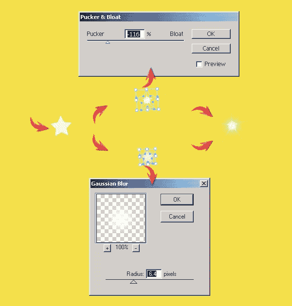](https://www.sitepoint.com/wp-content/uploads/2013/02/19.jpg)

把它放在你喜欢的礼品盒上。

[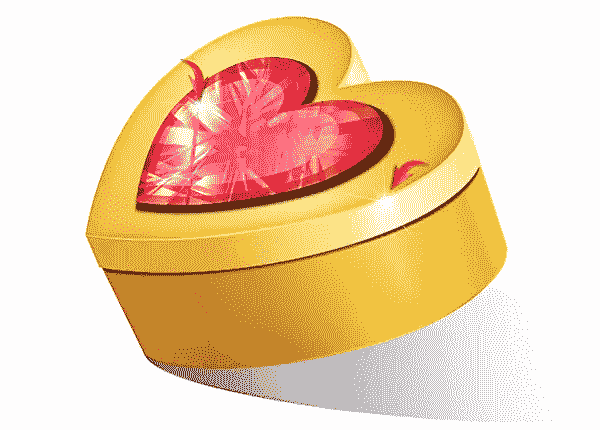](https://www.sitepoint.com/wp-content/uploads/2013/02/19b.jpg)

### 步骤 20

礼盒准备好了。然而，你可以进一步用丝带或任何你想要的东西来装饰它。试用您的盒子并分享结果。

[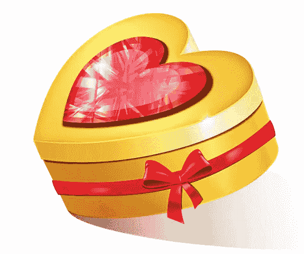](https://www.sitepoint.com/wp-content/uploads/2013/02/20.jpg) 
我希望你喜欢这个教程，并学到一些新东西。请分享你的想法！

## 分享这篇文章