# 在 Photoshop 中创建风格化的艺术照片效果

> 原文：<https://www.sitepoint.com/create-a-stylized-artful-photo-effect-in-photoshop/>

我们都知道 Photoshop 是一个功能强大、用途广泛的工具，但是当它被用于其最初的预期目的——照片编辑——时，它才处于最佳状态。只需几处精心的改进，您就可以将枯燥、普通的照片变成时尚的杰作。如果你有很好的照片编辑技巧，你可以很容易地以惊人的速度给你的照片和项目添加专业的修饰。

今天，我们将创建一个动态的照片效果，你可以在你的照片上使用，给他们一个令人印象深刻的，专业的，风格化的外观。为了达到这种效果，我们将使用一些有趣的混合选项和调整技术。那么，我们开始吧。

首先，让我们看看我们的最终结果:

[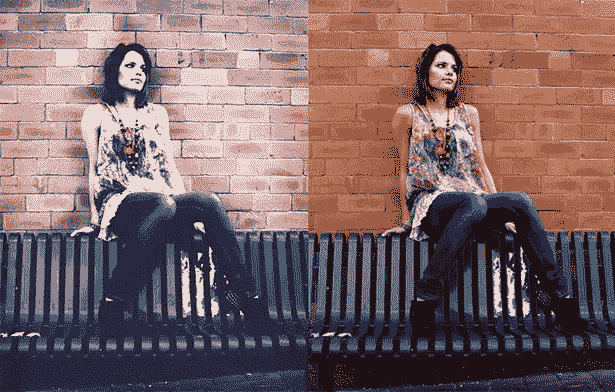](https://www.sitepoint.com/wp-content/uploads/2013/02/Final-result1.jpg)

**资源:**

[少女形象](http://tigg-stock.deviantart.com/art/Tamarin-stock-7-172131260)由[随机行事](http://randomactscreative.com/)

### 第一步

打开 Photoshop，新建一个宽 600 像素、高 680 像素的文件。

[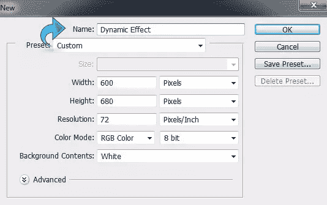](https://www.sitepoint.com/wp-content/uploads/2013/02/Step-11.jpg)

### 第二步

打开资源图像并粘贴到我们的画布上。

[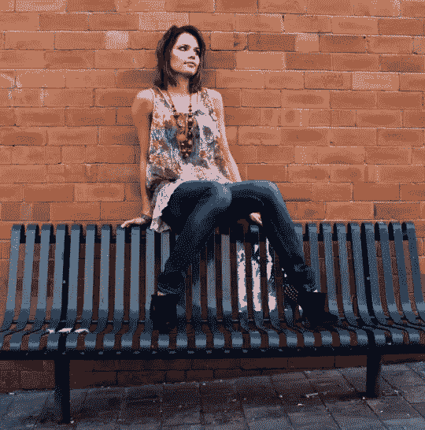](https://www.sitepoint.com/wp-content/uploads/2013/02/Step-21.jpg)

### 第三步

现在，复制图像层，并添加一个内部阴影使用以下设置。

[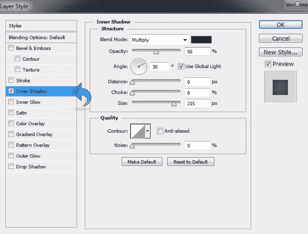](https://www.sitepoint.com/wp-content/uploads/2013/02/Step-31.jpg)

### 第四步

新建一个图层，使用油漆桶工具填充颜色#767676。

[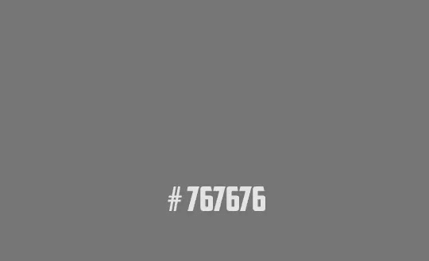](https://www.sitepoint.com/wp-content/uploads/2013/02/Step-41.jpg)

### 第五步

改变混合模式为“叠加”，在图像上使用减淡和加深工具(“减淡”在亮的部分，“加深”在暗的部分)。

[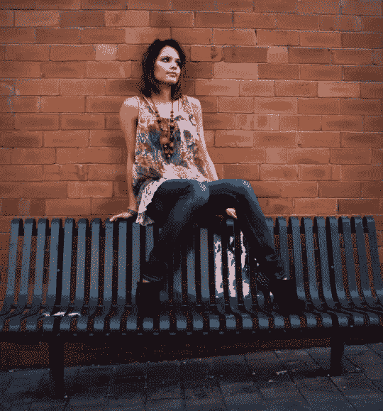](https://www.sitepoint.com/wp-content/uploads/2013/02/Step-51.jpg)

### 第六步

现在，让我们从调整开始，点击“图层”>“新建调整图层”>“色阶”

[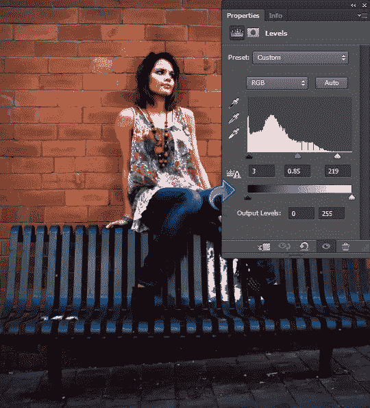](https://www.sitepoint.com/wp-content/uploads/2013/02/Step-61.jpg)

### 第七步

点击“图层”>“新调整图层”>“曲线”模拟如下所示的设置。

[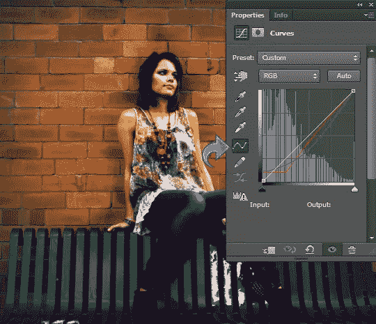](https://www.sitepoint.com/wp-content/uploads/2013/02/Step-7a.jpg)

[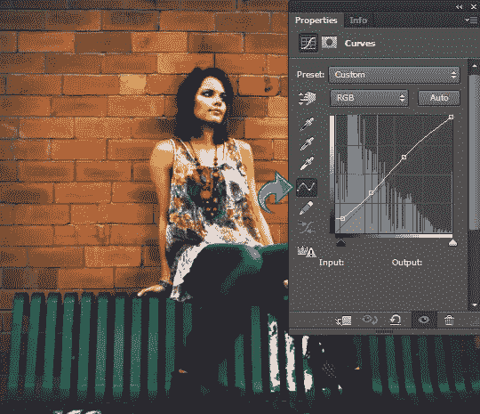](https://www.sitepoint.com/wp-content/uploads/2013/02/Step-7b.jpg)

[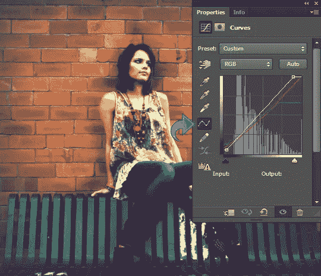](https://www.sitepoint.com/wp-content/uploads/2013/02/Step-7c.jpg)

### 第八步

现在，点击“图层”>“新建调整图层”>“选择性颜色”

[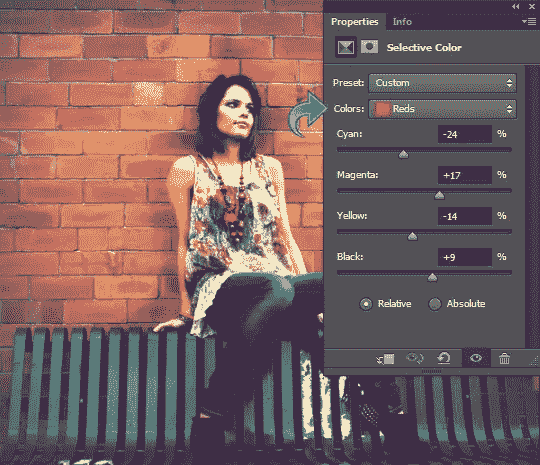](https://www.sitepoint.com/wp-content/uploads/2013/02/Step-81.jpg)

### 第九步

点击“图层”>“新调整图层”>“亮度/对比度”

### 第十步

新建一个图层，使用油漆桶工具填充颜色#946f66。

[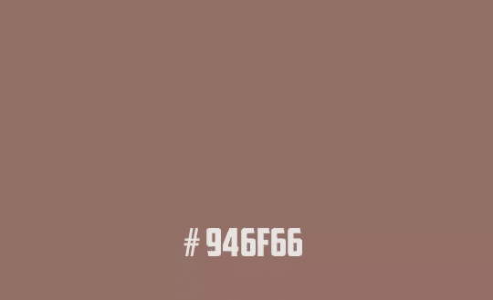](https://www.sitepoint.com/wp-content/uploads/2013/02/Step-10.jpg)

### 步骤 11

将上面图层的混合模式改为“色相”，不透明度降低到 50%。

[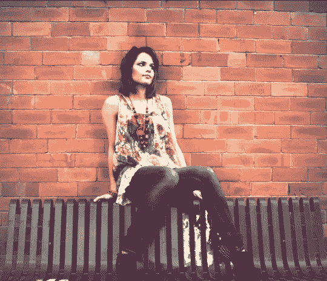](https://www.sitepoint.com/wp-content/uploads/2013/02/Step-111.jpg)

### 步骤 12

现在，点击“图层”>“新调整图层”>“色彩平衡”

[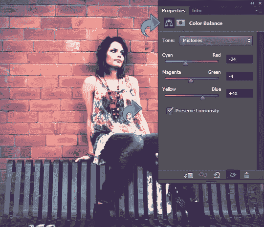](https://www.sitepoint.com/wp-content/uploads/2013/02/Step-121.jpg)

### 第十三步

点击“图层”>“新调整图层”>“照片滤镜”

[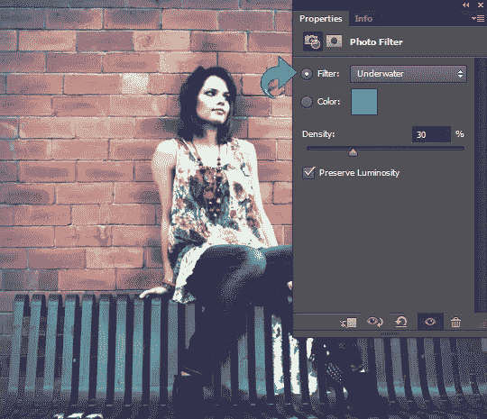](https://www.sitepoint.com/wp-content/uploads/2013/02/Step-13.jpg)

### 步骤 14

现在，点击“图层”>“新调整图层”>“黑白”

[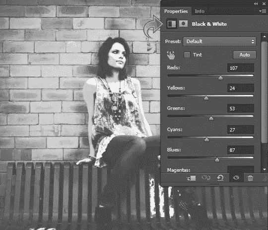](https://www.sitepoint.com/wp-content/uploads/2013/02/Step-141.jpg)

### 第十五步

现在，将上面图层的混合模式改为“叠加”

### 第十六步

现在，只需将上面图层的不透明度降低到 55%，就大功告成了。

[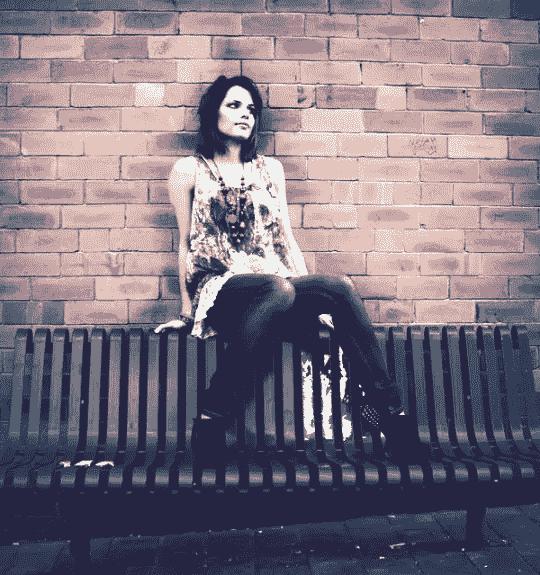](https://www.sitepoint.com/wp-content/uploads/2013/02/Step-161.jpg)

我希望你们喜欢这个教程。我会带着更多的教程回来。让我知道你的想法！

## 分享这篇文章