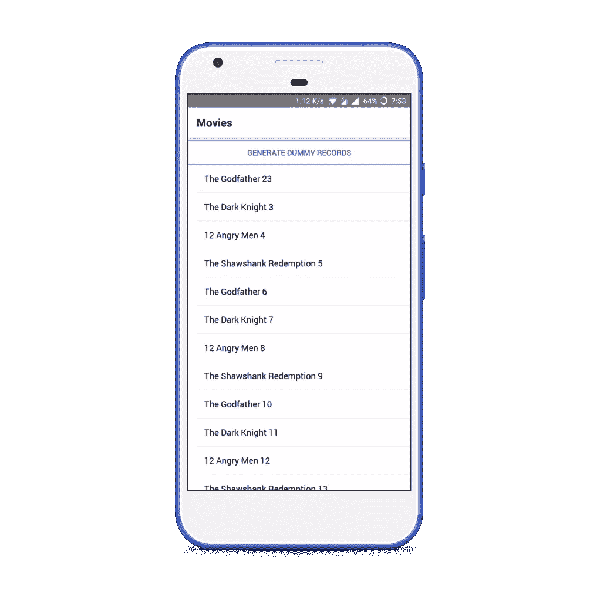

# 使用 WatermelonDB 创建一个离线优先的 React 本地应用程序

> 原文：<https://www.sitepoint.com/create-an-offline-first-react-native-app-using-watermelondb/>

**React Native 针对不同的移动 app 用途，有不同的数据库存储机制。使用异步存储或安全存储可以轻松处理简单的结构，如用户设置、应用程序设置和其他键值对数据。**

其他应用程序——如 Twitter 克隆——从服务器获取数据并直接显示给用户。它们维护数据缓存，如果用户需要与任何文档交互，它们直接调用 API。

因此，并不是所有的应用程序都需要数据库。

*想从头开始学习 React Native？这篇文章是从我们的优质图书馆摘录的。使用 SitePoint Premium 获得 React 本地书籍的完整收藏，涵盖基础知识、项目、技巧和工具&。[现在就加入，每月仅需 9 美元](https://www.sitepoint.com/premium/products/Z2lkOi8vbGVhcm5hYmxlL1Byb2R1Y3QvMzA3?utm_source=blog&utm_medium=articles)。*

## 当我们需要一个数据库时

诸如 [Nozbe](https://play.google.com/store/apps/details?id=com.nozbe.mobile) (一个待办应用) [Expense](https://itunes.apple.com/us/app/expense-spending-tracking-made-easy/id1020335225) (一个追踪器)和 [SplitWise](https://play.google.com/store/apps/details?id=com.Splitwise.SplitwiseMobile) (用于应用内购买)等应用程序需要离线工作。为此，他们需要一种在本地存储数据并与服务器同步的方法。这种类型的应用程序被称为**离线优先**应用程序。随着时间的推移，这些应用程序收集了大量数据，直接管理这些数据变得越来越困难，因此需要一个数据库来有效地管理这些数据。

## 反应本机中的选项

开发应用程序时，选择最符合您要求的数据库。如果有两个选项可用，那么选择文档更好、对问题的响应更快的选项。以下是 React Native 可用的一些最著名的选项:

*   [WatermelonDB](https://github.com/Nozbe/WatermelonDB) :开源的反应式数据库，可以和任何底层数据库一起使用。默认情况下，它使用 SQLite 作为 React Native 中的底层数据库。
*   SQLite ( [React Native](https://github.com/andpor/react-native-sqlite-storage) ， [Expo](https://docs.expo.io/versions/latest/sdk/sqlite) ):最古老、最常用、久经考验且广为人知的解决方案。它适用于大多数平台，所以如果你已经在另一个移动应用开发框架中开发了一个应用，你可能已经对它很熟悉了。
*   Realm ( [React Native](https://realm.io/docs/javascript/latest/) ):一个开源解决方案，但它也有一个企业版，具有许多[其他功能](https://realm.io/pricing)。他们做得很好，许多[知名公司](https://realm.io/customers)都在使用它。
*   FireBase ( [React Native](https://firebase.google.com/docs/firestore/library-integrations#react_native_firebase) ，Expo):专门针对移动开发平台的 Google 服务。它提供了许多功能，存储只是其中之一。但是它确实需要你留在他们的生态系统中来利用它。
*   RxDB :网络实时数据库。它有很好的文档，在 GitHub 上有很好的评级(> 9K 星)，也是反应性的。

## 先决条件

我假设您了解基本的 React Native 及其构建过程。我们将使用 [react-native-cli](https://facebook.github.io/react-native/docs/getting-started#the-react-native-cli-1) 来创建我们的应用程序。

我还建议在设置项目时设置一个 Android 或 iOS 开发环境，因为你可能会面临许多问题，调试的第一步是保持 IDE (Android Studio 或 Xcode)打开以查看日志。

*注意:你可以在查看安装依赖项的官方指南以获得更多信息。由于官方的指导方针非常简洁明了，我们在这里就不讨论这个话题了。*

要设置虚拟设备或物理设备，请遵循以下指南:

*   [使用物理设备](https://facebook.github.io/react-native/docs/getting-started#using-a-physical-device)
*   [使用虚拟设备](https://facebook.github.io/react-native/docs/getting-started#using-a-virtual-device)

*注意:有一个更加 JavaScript 友好的工具链叫做 [Expo](https://expo.io) 。React 原生社区也开始推广它，但我还没有遇到一个使用 Expo 的大规模、生产就绪的应用程序，并且 [Expo port](https://github.com/Nozbe/WatermelonDB/issues/40#issuecomment-431283126) 目前对那些使用 Realm 这样的数据库的人不可用，或者在我们的情况下，使用 WatermelonDB。*

## 应用程序要求

我们将创建一个带有标题、海报图像、类型和上映日期的电影搜索应用程序。每部电影都会有很多评论。

该应用程序将有三个屏幕。

**主页**将显示两个按钮——一个用于生成虚拟记录，另一个用于添加新电影。在它下面，将有一个搜索输入，可用于从数据库中查询电影名称。它会在搜索栏下方显示电影列表。如果搜索任何名字，列表将只显示搜索到的电影。


点击任何一部电影都会打开一个**电影仪表盘**，在这里可以查看所有的评论。可以编辑或删除电影，也可以在此屏幕上添加新的评论。


第三个屏幕是**电影表单**，用于创建/更新电影。


源代码可以在 [GitHub](https://github.com/drex44/MovieDirectory) 上获得。

## 我们为什么选择 WatermelonDB(功能)

我们需要创建一个离线优先的应用程序，所以数据库是必须的。

### 西瓜的特点

让我们来看看 WatermelonDB 的一些特性。

完全可观察到的
西瓜的一大特点是它的反应性。任何物体都可以用 observables 来观察，只要数据发生变化，它就会自动重新渲染我们的组件。我们不必为使用 WatermelonDB 做任何额外的努力。我们包装简单的 React 组件并增强它们，使它们具有反应性。根据我的经验，*它只是无缝地工作*，我们不必关心其他任何事情。我们对对象进行更改，我们的工作就完成了！它在应用程序的所有地方都被保存和更新。

**SQLite under the hood for React Native**
在现代浏览器中，即时编译用于提高速度，但在移动设备中不可用。此外，移动设备的硬件速度比电脑慢。由于所有这些因素，JavaScript 应用程序在移动应用程序中运行较慢。为了克服这一点，WatermelonDB 直到需要时才获取任何东西。它使用延迟加载和 SQLite 作为独立线程上的底层数据库，以提供快速响应。

**同步原语和同步适配器**
虽然 WatermelonDB 只是一个本地数据库，但是它也提供了同步原语和同步适配器。这使得它很容易与我们自己的任何后端数据库一起使用。我们只需要在后端遵守 WatermelonDB 同步协议，并提供端点。

其他功能包括:

*   使用流静态类型化
*   适用于所有平台

## 开发环境和 WatermelonDB 设置(v0.0)

我们将使用`react-native-cli`创建我们的应用程序。

*注意:你可以在 ExpoKit 或 Expo 中使用它。*

如果您想跳过这一部分，那么克隆源 repo 并检查`v0.0`分支。

开始新项目:

```
react-native init MovieDirectory
cd MovieDirectory 
```

安装依赖项:

```
npm i @nozbe/watermelondb @nozbe/with-observables react-navigation react-native-gesture-handler react-native-fullwidth-image native-base rambdax 
```

下面是已安装的依赖项及其用途的列表:

*   一个 UI 库，将用于我们的应用程序的外观和感觉。
*   `react-native-fullwidth-image`:显示全屏响应图像。(有时，计算宽度和高度并保持长宽比可能会很麻烦。所以最好使用现有的社区解决方案。)
*   我们将要使用的数据库。
*   `@nozbe/with-observables`:包含将在我们的模型中使用的装饰器(`@`)。
*   `react-navigation`:用于管理路线/画面
*   `react-native-gesture-handler`:对`react-navigation`的依赖。
*   `rambdax`:用于创建虚拟数据时生成一个随机数。

打开您的`package.json`并用以下代码替换`scripts`:

```
"scripts": {
    "start": "node node_modules/react-native/local-cli/cli.js start",
    "start:ios": "react-native run-ios",
    "start:android": "react-native run-android",
    "test": "jest"
} 
```

这将用于在各自的设备中运行我们的应用程序。

### 设置 WatermelonDB

我们需要添加一个 Babel 插件来转换我们的 decorators，所以将其作为一个开发依赖项安装:

```
npm install -D @babel/plugin-proposal-decorators 
```

在项目的根目录下创建一个新文件`.babelrc`:

```
// .babelrc
{
  "presets": ["module:metro-react-native-babel-preset"],
  "plugins": [["@babel/plugin-proposal-decorators", { "legacy": true }]]
} 
```

现在，针对您的目标环境使用以下指南:

*   ios
*   机器人

在 Android Studio 中打开`android`文件夹，同步项目。否则，在第一次运行应用程序时，它会给你一个错误。如果你的目标是`iOS`，做同样的事情。

在我们运行应用程序之前，我们需要链接`react-native-gesture`处理程序包(一个对`react-navigation`的依赖)和`react-native-vector-icons`(一个对`native-base`的依赖)。默认情况下，为了保持应用程序的二进制大小较小，React Native 不包含支持本机功能的所有代码。因此，每当我们需要使用一个特定的特性时，我们可以使用`link`命令来添加本机依赖项。因此，让我们联系我们的依赖关系:

```
react-native link react-native-gesture-handler
react-native link react-native-vector-icons 
```

运行应用程序:

```
npm run start:android
# or
npm run start:ios 
```

如果您收到缺少依赖项的错误，请运行`npm i`。

到此为止的代码可以在 [v0.0](https://github.com/drex44/MovieDirectory/tree/v0.0) 分支下找到。


## 辅导的

由于我们将创建一个数据库应用程序，许多代码将是后端的，我们将无法在前端看到太多。这可能看起来很长，但是要有耐心，跟随教程直到最后。你不会后悔的！

WatermelonDB 工作流可以分为三个主要部分:

*   **模式**:用于定义数据库表模式。
*   **模型**:ORM 映射的对象。我们将在整个应用程序中与它们进行交互。
*   **Actions** :用于对我们的对象/行执行各种 CRUD 操作。我们可以使用数据库对象直接执行一个动作，或者我们可以在模型中定义函数来执行这些动作。在模型中定义它们是更好的实践，我们将只使用它。

让我们开始使用我们的应用程序。

## 初始化数据库模式和 WatermelonDB (v0.1)

我们将在应用程序中定义模式、模型和数据库对象。我们在应用程序中看不到什么，但这是最重要的一步。在这里，我们将检查我们的应用程序在定义了所有内容后是否工作正常。如果出了什么问题，这个阶段就很容易调试了。

### 项目结构

在根目录下创建一个新的`src`文件夹。这将是我们所有 React 本地代码的根文件夹。`models`文件夹用于存放所有与数据库相关的文件。它将作为我们的**道**(数据访问对象)文件夹。这是一个术语，用于某种类型的数据库或其他持久性机制的接口。`components`文件夹将包含我们所有的 React 组件。`screens`文件夹将包含我们应用程序的所有屏幕。

```
mkdir src && cd src
mkdir models
mkdir components
mkdir screens 
```

### (计划或理论的)纲要

转到`models`文件夹，创建一个新文件`schema.js`，并使用以下代码:

```
// schema.js
import { appSchema, tableSchema } from "@nozbe/watermelondb";

export const mySchema = appSchema({
  version: 2,
  tables: [
    tableSchema({
      name: "movies",
      columns: [
        { name: "title", type: "string" },
        { name: "poster_image", type: "string" },
        { name: "genre", type: "string" },
        { name: "description", type: "string" },
        { name: "release_date_at", type: "number" }
      ]
    }),
    tableSchema({
      name: "reviews",
      columns: [
        { name: "body", type: "string" },
        { name: "movie_id", type: "string", isIndexed: true }
      ]
    })
  ]
}); 
```

我们定义了两个表——一个用于电影，另一个用于电影评论。代码本身不言自明。两个表都有相关的列。

注意，按照 WatermelonDB 的命名约定，所有 id 都以后缀`_id`结尾，日期字段以后缀`_at`结尾。

`isIndexed`用于给一列添加一个索引。索引加快了按列查询的速度，但创建/更新速度和数据库大小略有下降。我们将在`movie_id`之前查询所有评论，因此我们应该将其标记为索引。如果您想对任何布尔列进行频繁的查询，您也应该对它进行索引。然而，你不应该索引日期(`_at`)列。

### 模型

创建一个新文件`models/Movie.js`并粘贴以下代码:

```
// models/Movie.js
import { Model } from "@nozbe/watermelondb";
import { field, date, children } from "@nozbe/watermelondb/decorators";

export default class Movie extends Model {
  static table = "movies";

  static associations = {
    reviews: { type: "has_many", foreignKey: "movie_id" }
  };

  @field("title") title;
  @field("poster_image") posterImage;
  @field("genre") genre;
  @field("description") description;

  @date("release_date_at") releaseDateAt;

  @children("reviews") reviews;
} 
```

在这里，我们用每个变量映射了`movies`表的每一列。请注意我们是如何将评论与电影对应起来的。我们在关联中定义了它，并且使用了`@children`而不是`@field`。每个评论都有一个`movie_id`外键。这些评论外键值与`movie`表中的`id`相匹配，以将评论模型链接到电影模型。

同样对于 date，我们需要使用`@date`装饰器，这样 WatermelonDB 将为我们提供`Date`对象，而不是一个简单的数字。

现在创建一个新文件`models/Review.js`。这将用于映射电影的每个评论。

```
// models/Review.js
import { Model } from "@nozbe/watermelondb";
import { field, relation } from "@nozbe/watermelondb/decorators";

export default class Review extends Model {
  static table = "reviews";

  static associations = {
    movie: { type: "belongs_to", key: "movie_id" }
  };

  @field("body") body;

  @relation("movies", "movie_id") movie;
} 
```

我们已经创建了所有我们需要的模型。我们可以直接使用它们来初始化我们的数据库，但是如果我们想要添加一个新的模型，我们必须再次改变初始化数据库的位置。因此，为了克服这一点，创建一个新文件`models/index.js`并添加以下代码:

```
// models/index.js
import Movie from "./Movie";
import Review from "./Review";

export const dbModels = [Movie, Review]; 
```

因此，我们只需在`models`文件夹中进行更改。这使得我们的 DAO 文件夹更有条理。

### 初始化数据库

现在要使用我们的模式和模型来初始化我们的数据库，打开`index.js`，它应该在我们的应用程序的根目录中。添加以下代码:

```
// index.js
import { AppRegistry } from "react-native";
import App from "./App";
import { name as appName } from "./app.json";

import { Database } from "@nozbe/watermelondb";
import SQLiteAdapter from "@nozbe/watermelondb/adapters/sqlite";
import { mySchema } from "./src/models/schema";
import { dbModels } from "./src/models/index.js";

// First, create the adapter to the underlying database:
const adapter = new SQLiteAdapter({
  dbName: "WatermelonDemo",
  schema: mySchema
});

// Then, make a Watermelon database from it!
const database = new Database({
  adapter,
  modelClasses: dbModels
});

AppRegistry.registerComponent(appName, () => App); 
```

我们使用底层数据库的模式创建一个适配器。然后我们传递这个适配器和我们的`dbModels`来创建一个新的数据库实例。

最好在这个时候检查我们的应用程序是否工作正常。因此，运行您的应用程序并检查:

```
npm run start:android
# or
npm run start:ios 
```

我们没有对 UI 进行任何更改，所以如果一切正常，屏幕看起来将与以前相似。

到这部分为止的所有代码都在 [v0.1](https://github.com/drex44/MovieDirectory/tree/v0.1) 分支下。

## 添加动作和虚拟数据生成器(v0.2)

让我们在应用程序中添加一些虚拟数据。

### 行动

为了执行 CRUD 操作，我们将创建一些操作。打开`models/Movie.js`和`models/Review.js`，更新如下:

```
// models/Movie.js
import { Model } from "@nozbe/watermelondb";
import { field, date, children } from "@nozbe/watermelondb/decorators";

export default class Movie extends Model {
  static table = "movies";

  static associations = {
    reviews: { type: "has_many", foreignKey: "movie_id" }
  };

  @field("title") title;
  @field("poster_image") posterImage;
  @field("genre") genre;
  @field("description") description;

  @date("release_date_at") releaseDateAt;

  @children("reviews") reviews;

  // add these:

  getMovie() {
    return {
      title: this.title,
      posterImage: this.posterImage,
      genre: this.genre,
      description: this.description,
      releaseDateAt: this.releaseDateAt
    };
  }

  async addReview(body) {
    return this.collections.get("reviews").create(review => {
      review.movie.set(this);
      review.body = body;
    });
  }

  updateMovie = async updatedMovie => {
    await this.update(movie => {
      movie.title = updatedMovie.title;
      movie.genre = updatedMovie.genre;
      movie.posterImage = updatedMovie.posterImage;
      movie.description = updatedMovie.description;
      movie.releaseDateAt = updatedMovie.releaseDateAt;
    });
  };

  async deleteAllReview() {
    await this.reviews.destroyAllPermanently();
  }

  async deleteMovie() {
    await this.deleteAllReview(); // delete all reviews first
    await this.markAsDeleted(); // syncable
    await this.destroyPermanently(); // permanent
  }
} 
```

```
// models/Review.js
import { Model } from "@nozbe/watermelondb";
import { field, relation } from "@nozbe/watermelondb/decorators";

export default class Review extends Model {
  static table = "reviews";

  static associations = {
    movie: { type: "belongs_to", key: "movie_id" }
  };

  @field("body") body;

  @relation("movies", "movie_id") movie;

  // add these:

  async deleteReview() {
    await this.markAsDeleted(); // syncable
    await this.destroyPermanently(); // permanent
  }
} 
```

我们将使用为更新和删除操作定义的所有函数。在创建过程中我们没有模型对象，所以我们将直接使用数据库对象来创建新行。

创建两个文件，`models/generate.js`和`models/randomData.js`。`generate.js`将用于创建一个函数`generateRecords`，该函数将生成虚拟记录。`randomData.js`包含不同的数组，这些数组包含在`generate.js`中用来生成虚拟记录的虚拟数据。

```
// models/generate.js
import { times } from "rambdax";
import {
  movieNames,
  movieGenre,
  moviePoster,
  movieDescription,
  reviewBodies
} from "./randomData";

const flatMap = (fn, arr) => arr.map(fn).reduce((a, b) => a.concat(b), []);

const fuzzCount = count => {
  // Makes the number randomly a little larger or smaller for fake data to seem more realistic
  const maxFuzz = 4;
  const fuzz = Math.round((Math.random() - 0.5) * maxFuzz * 2);
  return count + fuzz;
};

const makeMovie = (db, i) => {
  return db.collections.get("movies").prepareCreate(movie => {
    movie.title = movieNames[i % movieNames.length] + " " + (i + 1) || movie.id;
    movie.genre = movieGenre[i % movieGenre.length];
    movie.posterImage = moviePoster[i % moviePoster.length];
    movie.description = movieDescription;
    movie.releaseDateAt = new Date().getTime();
  });
};

const makeReview = (db, movie, i) => {
  return db.collections.get("reviews").prepareCreate(review => {
    review.body =
      reviewBodies[i % reviewBodies.length] || `review#${review.id}`;
    review.movie.set(movie);
  });
};

const makeReviews = (db, movie, count) =>
  times(i => makeReview(db, movie, i), count);

// Generates dummy random records. Accepts db object, no. of movies, and no. of reviews for each movie to generate.
const generate = async (db, movieCount, reviewsPerPost) => {
  await db.action(() => db.unsafeResetDatabase());
  const movies = times(i => makeMovie(db, i), movieCount);

  const reviews = flatMap(
    movie => makeReviews(db, movie, fuzzCount(reviewsPerPost)),
    movies
  );

  const allRecords = [...movies, ...reviews];
  await db.batch(...allRecords);
  return allRecords.length;
};

// Generates 100 movies with up to 10 reviews
export async function generateRecords(database) {
  return generate(database, 100, 10);
} 
```

```
// models/randomData.js
export const movieNames = [
  "The Shawshank Redemption",
  "The Godfather",
  "The Dark Knight",
  "12 Angry Men"
];

export const movieGenre = [
  "Action",
  "Comedy",
  "Romantic",
  "Thriller",
  "Fantasy"
];

export const moviePoster = [
  "https://m.media-amazon.cimg/M/MV5BMDFkYTc0MGEtZmNhMC00ZDIzLWFmNTEtODM1ZmRlYWMwMWFmXkEyXkFqcGdeQXVyMTMxODk2OTU@._V1_UX182_CR0,0,182,268_AL__QL50.jpg",
  "https://m.media-amazon.cimg/M/MV5BM2MyNjYxNmUtYTAwNi00MTYxLWJmNWYtYzZlODY3ZTk3OTFlXkEyXkFqcGdeQXVyNzkwMjQ5NzM@._V1_UY268_CR3,0,182,268_AL__QL50.jpg",
  "https://m.media-amazon.cimg/M/MV5BMTMxNTMwODM0NF5BMl5BanBnXkFtZTcwODAyMTk2Mw@@._V1_UX182_CR0,0,182,268_AL__QL50.jpg",
  "https://m.media-amazon.cimg/M/MV5BMWU4N2FjNzYtNTVkNC00NzQ0LTg0MjAtYTJlMjFhNGUxZDFmXkEyXkFqcGdeQXVyNjc1NTYyMjg@._V1_UX182_CR0,0,182,268_AL__QL50.jpg"
];

export const movieDescription =
  "Lorem ipsum dolor sit amet enim. Etiam ullamcorper. Suspendisse a pellentesque dui, non felis. Maecenas malesuada elit lectus felis, malesuada ultricies. Curabitur et ligula. Ut molestie a, ultricies porta urna. Vestibulum commodo volutpat a, convallis ac, laoreet enim. Phasellus fermentum in, dolor. Lorem ipsum dolor sit amet enim. Etiam ullamcorper. Suspendisse a pellentesque dui, non felis. Maecenas malesuada elit lectus felis, malesuada ultricies. Curabitur et ligula. Ut molestie a, ultricies porta urna. Vestibulum commodo volutpat a, convallis ac, laoreet enim. Phasellus fermentum in, dolor. Pellentesque facilisis. Nulla imperdiet sit amet magna. Vestibulum dapibus, mauris nec malesuada fames ac turpis velit, rhoncus eu, luctus et interdum adipiscing wisi. Aliquam erat ac ipsum. Integer aliquam purus. Quisque lorem tortor fringilla sed, vestibulum id, eleifend justo vel bibendum sapien massa ac turpis faucibus orci luctus non, consectetuer lobortis quis, varius in, purus. Integer ultrices posuere cubilia Curae, Nulla ipsum dolor lacus, suscipit adipiscing. Cum sociis natoque penatibus et ultrices volutpat.";

export const reviewBodies = [
  "First!!!!",
  "Cool!",
  "Why dont you just…",
  "Maybe useless, but the article is extremely interesting and easy to read. One can definitely try to read it.",
  "Seriously one of the coolest projects going on right now",
  "I think the easiest way is just to write a back end that emits .NET IR since infra is already there.",
  "Open source?",
  "This article is obviously wrong",
  "Just Stupid",
  "The general public won't care",
  "This is my bear case for Google.",
  "All true, but as a potential advertiser you don't really get to use all that targeting when placing ads",
  "I wonder what work environment exists, that would cause a worker to hide their mistakes and endanger the crew, instead of reporting it. And how many more mistakes go unreported? I hope Russia addresses the root issue, and not just fires the person responsible."
]; 
```

现在我们必须调用函数`generateRecords`来生成虚拟数据。

我们将使用`react-navigation`来创建路线。从根目录打开`index.js`,使用下面的代码:

```
// index.js
import { AppRegistry } from "react-native";
import { name as appName } from "./app.json";

import { Database } from "@nozbe/watermelondb";
import SQLiteAdapter from "@nozbe/watermelondb/adapters/sqlite";
import { mySchema } from "./src/models/schema";
import { dbModels } from "./src/models/index.js";

// Added new import
import { createNavigation } from "./src/screens/Navigation";

// First, create the adapter to the underlying database:
const adapter = new SQLiteAdapter({
  dbName: "WatermelonDemo",
  schema: mySchema
});

// Then, make a Watermelon database from it!
const database = new Database({
  adapter,
  modelClasses: dbModels
});

// Change these:
const Navigation = createNavigation({ database });

AppRegistry.registerComponent(appName, () => Navigation); 
```

我们正在使用`createNavigation`函数，但是我们现在没有它，所以让我们创建它。创建一个`src/screens/Navigation.js`并使用以下代码:

```
// screens/Navigation.js
import React from "react";
import { createStackNavigator, createAppContainer } from "react-navigation";

import Root from "./Root";

export const createNavigation = props =>
  createAppContainer(
    createStackNavigator(
      {
        Root: {
          // We have to use a little wrapper because React Navigation doesn't pass simple props (and withObservables needs that)
          screen: ({ navigation }) => {
            const { database } = props;
            return <Root database={database} navigation={navigation} />;
          },
          navigationOptions: { title: "Movies" }
        }
      },
      {
        initialRouteName: "Root",
        initialRouteParams: props
      }
    )
  ); 
```

我们使用`Root`作为第一个屏幕，所以让我们创建`screens/Root.js`并使用以下代码:

```
// screens/Root.js
import React, { Component } from "react";
import { generateRecords } from "../models/generate";
import { Alert } from "react-native";
import { Container, Content, Button, Text } from "native-base";

import MovieList from "../components/MovieList";

export default class Root extends Component {
  state = {
    isGenerating: false
  };

  generate = async () => {
    this.setState({ isGenerating: true });
    const count = await generateRecords(this.props.database);
    Alert.alert(`Generated ${count} records!`);
    this.setState({ isGenerating: false });
  };

  render() {
    const { isGenerating } = this.state;
    const { database, navigation } = this.props;

    return (
      <Container>
        <Content>
          <Button
            bordered
            full
            onPress={this.generate}
            style={{ marginTop: 5 }}
          >
            <Text>Generate Dummy records</Text>
          </Button>

          {!isGenerating && (
            <MovieList database={database} search="" navigation={navigation} />
          )}
        </Content>
      </Container>
    );
  }
} 
```

我们使用了`MovieList`来显示生成的电影列表。让我们创造它。创建一个新文件`src/components/MovieList.js`,如下所示:

```
// components/MovieList.js
import React from "react";

import { Q } from "@nozbe/watermelondb";
import withObservables from "@nozbe/with-observables";
import { List, ListItem, Body, Text } from "native-base";

const MovieList = ({ movies }) => (
  <List>
    {movies.map(movie => (
      <ListItem key={movie.id}>
        <Body>
          <Text>{movie.title}</Text>
        </Body>
      </ListItem>
    ))}
  </List>
);

// withObservables is HOC(Higher Order Component) to make any React component reactive.
const enhance = withObservables(["search"], ({ database, search }) => ({
  movies: database.collections
    .get("movies")
    .query(Q.where("title", Q.like(`%${Q.sanitizeLikeString(search)}%`)))
}));

export default enhance(MovieList); 
```

`MovieList`是一个呈现电影列表的简单 React 组件，但是请注意调用`withObservables`的`enhance`。`withObservables`是一个[特设](https://reactjs.org/docs/higher-order-components.html)(高阶元件)，使任何反应元件在 WatermelonDB 中反应。如果我们在应用程序中的任何地方更改了电影的值，它将重新渲染以反映这些更改。第二个参数，`({ database, search })`，包含组件道具。`search`从`Root.js`传来，`database`从`Navigation.js`传来。第一个参数`["search"]`是触发观察重启的道具列表。所以如果`search`发生变化，我们的可观测对象重新计算，再次观测。在函数中，我们使用`database`对象来获取电影的集合，其中`title`像是经过了`search`。像`%`和`_`这样的特殊字符不会自动转义，所以总是建议使用净化过的用户输入。

打开 Android Studio 或 Xcode 同步项目，然后运行应用程序。点击**生成虚拟记录**按钮。它将生成虚拟数据并向您显示列表。

```
npm run start:android
# or
npm run start:ios 
```

该代码可在 [v0.2](https://github.com/drex44/MovieDirectory/tree/v0.2) 分支下获得。



## 添加所有 CRUD 操作(v1)

现在让我们添加创建/更新/删除电影和评论的功能。我们将添加一个新按钮来添加一部新电影，并创建一个`TextInput`来将搜索关键字传递给查询。所以打开`Root.js`并改变其内容如下:

```
// screens/Root.js
import React, { Component } from "react";
import { generateRecords } from "../models/generate";
import { Alert } from "react-native";
import {
  View,
  Container,
  Content,
  Button,
  Text,
  Form,
  Item,
  Input,
  Label,
  Body
} from "native-base";

import MovieList from "../components/MovieList";
import styles from "../components/styles";

export default class Root extends Component {
  state = {
    isGenerating: false,
    search: "",
    isSearchFocused: false
  };

  generate = async () => {
    this.setState({ isGenerating: true });
    const count = await generateRecords(this.props.database);
    Alert.alert(`Generated ${count} records!`);
    this.setState({ isGenerating: false });
  };

  // add these:

  addNewMovie = () => {
    this.props.navigation.navigate("NewMovie");
  };

  handleTextChanges = v => this.setState({ search: v });

  handleOnFocus = () => this.setState({ isSearchFocused: true });

  handleOnBlur = () => this.setState({ isSearchFocused: false });

  render() {
    const { search, isGenerating, isSearchFocused } = this.state;
    const { database, navigation } = this.props;

    return (
      <Container style={styles.container}>
        <Content>
          {!isSearchFocused && (
            <View style={styles.marginContainer}>
              <Button
                bordered
                full
                onPress={this.generate}
                style={{ marginTop: 5 }}
              >
                <Text>Generate Dummy records</Text>
              </Button>

              {/* add these: */}
              <Button
                bordered
                full
                onPress={this.addNewMovie}
                style={{ marginTop: 5 }}
              >
                <Text>Add new movie</Text>
              </Button>
              <Body />
            </View>
          )}

          {/* add these: */}
          <Form>
            <Item floatingLabel>
              <Label>Search...</Label>
              <Input
                onFocus={this.handleOnFocus}
                onBlur={this.handleOnBlur}
                onChangeText={this.handleTextChanges}
              />
            </Item>
          </Form>
          {!isGenerating && (
            <MovieList
              database={database}
              search={search}
              navigation={navigation}
            />
          )}
        </Content>
      </Container>
    );
  }
} 
```

我们将创建一个新的屏幕，`MovieForm.js`，并使用相同的组件来编辑电影。注意，我们只是调用了`handleSubmit`方法，该方法又调用了`handleAddNewMovie`或`handleUpdateMovie`。`handleUpdateMovie`调用我们之前在`Movie`模型中定义的动作。就是这样。这将负责保存它并在其他地方更新。对`MovieForm.js`使用以下代码:

```
// screens/MovieForm.js
import React, { Component } from "react";
import {
  View,
  Button,
  Container,
  Content,
  Form,
  Item,
  Input,
  Label,
  Textarea,
  Picker,
  Body,
  Text,
  DatePicker
} from "native-base";
import { movieGenre } from "../models/randomData";

class MovieForm extends Component {
  constructor(props) {
    super(props);
    if (props.movie) {
      this.state = { ...props.movie.getMovie() };
    } else {
      this.state = {};
    }
  }

  render() {
    return (
      <Container>
        <Content>
          <Form>
            <Item floatingLabel>
              <Label>Title</Label>
              <Input
                onChangeText={title => this.setState({ title })}
                value={this.state.title}
              />
            </Item>
            <View style={{ paddingLeft: 15 }}>
              <Item picker>
                <Picker
                  mode="dropdown"
                  style={{ width: undefined, paddingLeft: 15 }}
                  placeholder="Genre"
                  placeholderStyle={{ color: "#bfc6ea" }}
                  placeholderIconColor="#007aff"
                  selectedValue={this.state.genre}
                  onValueChange={genre => this.setState({ genre })}
                >
                  {movieGenre.map((genre, i) => (
                    <Picker.Item key={i} label={genre} value={genre} />
                  ))}
                </Picker>
              </Item>
            </View>

            <Item floatingLabel>
              <Label>Poster Image</Label>
              <Input
                onChangeText={posterImage => this.setState({ posterImage })}
                value={this.state.posterImage}
              />
            </Item>

            <View style={{ paddingLeft: 15, marginTop: 15 }}>
              <Text style={{ color: "gray" }}>Release Date</Text>
              <DatePicker
                locale={"en"}
                animationType={"fade"}
                androidMode={"default"}
                placeHolderText="Change Date"
                defaultDate={new Date()}
                onDateChange={releaseDateAt => this.setState({ releaseDateAt })}
              />
              <Text>
                {this.state.releaseDateAt &&
                  this.state.releaseDateAt.toString().substr(4, 12)}
              </Text>

              <Text style={{ color: "gray", marginTop: 15 }}>Description</Text>
              <Textarea
                rowSpan={5}
                bordered
                placeholder="Description..."
                onChangeText={description => this.setState({ description })}
                value={this.state.description}
              />
            </View>

            {!this.props.movie && (
              <View style={{ paddingLeft: 15, marginTop: 15 }}>
                <Text style={{ color: "gray" }}>Review</Text>
                <Textarea
                  rowSpan={5}
                  bordered
                  placeholder="Review..."
                  onChangeText={review => this.setState({ review })}
                  value={this.state.review}
                />
              </View>
            )}
            <Body>
              <Button onPress={this.handleSubmit}>
                <Text>{this.props.movie ? "Update " : "Add "} Movie</Text>
              </Button>
            </Body>
          </Form>
        </Content>
      </Container>
    );
  }

  handleSubmit = () => {
    if (this.props.movie) {
      this.handleUpdateMovie();
    } else {
      this.handleAddNewMovie();
    }
  };

  handleAddNewMovie = async () => {
    const { database } = this.props;
    const movies = database.collections.get("movies");
    const newMovie = await movies.create(movie => {
      movie.title = this.state.title;
      movie.genre = this.state.genre;
      movie.posterImage = this.state.posterImage;
      movie.description = this.state.description;
      movie.releaseDateAt = this.state.releaseDateAt.getTime();
    });
    this.props.navigation.goBack();
  };

  handleUpdateMovie = async () => {
    const { movie } = this.props;
    await movie.updateMovie({
      title: this.state.title,
      genre: this.state.genre,
      posterImage: this.state.posterImage,
      description: this.state.description,
      releaseDateAt: this.state.releaseDateAt.getTime()
    });
    this.props.navigation.goBack();
  };
}

export default MovieForm; 
```

我们将划分我们的`MovieList.js`,以便我们可以控制无状态组件中的呈现。更新如下:

```
// components/MovieList.js
import React from "react";

import { Q } from "@nozbe/watermelondb";
import withObservables from "@nozbe/with-observables";

import RawMovieItem from "./RawMovieItem";
import { List } from "native-base";

// add these:
const MovieItem = withObservables(["movie"], ({ movie }) => ({
  movie: movie.observe()
}))(RawMovieItem);

const MovieList = ({ movies, navigation }) => (
  <List>
    {movies.map(movie => (
      // change these:
      <MovieItem
        key={movie.id}
        movie={movie}
        countObservable={movie.reviews.observeCount()}
        onPress={() => navigation.navigate("Movie", { movie })}
      />
    ))}
  </List>
);

const enhance = withObservables(["search"], ({ database, search }) => ({
  movies: database.collections
    .get("movies")
    .query(Q.where("title", Q.like(`%${Q.sanitizeLikeString(search)}%`)))
}));

export default enhance(MovieList); 
```

在这里，我们使用了`RawMovieItem`。我们将在其中编写我们的渲染方法。请注意我们是如何将`RawMovieItem`包装成`withObservables`的。这是用来让它反应的。如果我们不使用它，那么当数据库更新时，我们必须手动强制更新。

注意:创建简单的 React 组件，然后观察它们是 WatermelonDB 的要点。

创建一个新文件`components/RawMovieItem.js`，并使用以下代码:

```
// components/RawMovieItem.js
import React from "react";
import withObservables from "@nozbe/with-observables";
import {
  ListItem,
  Thumbnail,
  Text,
  Left,
  Body,
  Right,
  Button,
  Icon
} from "native-base";

// We observe and render the counter in a separate component so that we don't have to wait for the database until we can render the component. You can also prefetch all data before displaying the list
const RawCounter = ({ count }) => count;
const Counter = withObservables(["observable"], ({ observable }) => ({
  count: observable
}))(RawCounter);

const CustomListItem = ({ movie, onPress, countObservable }) => (
  <ListItem thumbnail onPress={onPress}>
    <Left>
      <Thumbnail square source={{ uri: movie.posterImage }} />
    </Left>
    <Body>
      <Text>{movie.title}</Text>
      <Text note numberOfLines={1}>
        Total Reviews: <Counter observable={countObservable} />
      </Text>
    </Body>
    <Right>
      <Button transparent onPress={onPress}>
        <Icon name="arrow-forward" />
      </Button>
    </Right>
  </ListItem>
);

export default CustomListItem; 
```

我们需要看到一部电影的所有信息，并且能够编辑它，所以创建一个新的屏幕，`Movie.js`，并且获得所有的评论，使它也是反应式的，创建两个新的组件，`components/ReviewList.js`和`components/RawReviewItem.js`。

对受尊重的文件使用以下代码:

```
// screens/Movie.js
import React, { Component } from "react";
import {
  View,
  Card,
  CardItem,
  Text,
  Button,
  Icon,
  Left,
  Body,
  Textarea,
  H1,
  H2,
  Container,
  Content
} from "native-base";
import withObservables from "@nozbe/with-observables";
import styles from "../components/styles";
import FullWidthImage from "react-native-fullwidth-image";
import ReviewList from "../components/ReviewList";

class Movie extends Component {
  state = {
    review: ""
  };

  render() {
    const { movie, reviews } = this.props;
    return (
      <Container style={styles.container}>
        <Content>
          <Card style={{ flex: 0 }}>
            <FullWidthImage source={{ uri: movie.posterImage }} ratio={1} />
            <CardItem />
            <CardItem>
              <Left>
                <Body>
                  <H2>{movie.title}</H2>
                  <Text note textStyle={{ textTransform: "capitalize" }}>
                    {movie.genre}
                  </Text>
                  <Text note>
                    {movie.releaseDateAt.toString().substr(4, 12)}
                  </Text>
                </Body>
              </Left>
            </CardItem>
            <CardItem>
              <Body>
                <Text>{movie.description}</Text>
              </Body>
            </CardItem>
            <CardItem>
              <Left>
                <Button
                  transparent
                  onPress={this.handleDelete}
                  textStyle={{ color: "#87838B" }}
                >
                  <Icon name="md-trash" />
                  <Text>Delete Movie</Text>
                </Button>
                <Button
                  transparent
                  onPress={this.handleEdit}
                  textStyle={{ color: "#87838B" }}
                >
                  <Icon name="md-create" />
                  <Text>Edit Movie</Text>
                </Button>
              </Left>
            </CardItem>

            <View style={styles.newReviewSection}>
              <H1>Add new review</H1>
              <Textarea
                rowSpan={5}
                bordered
                placeholder="Review..."
                onChangeText={review => this.setState({ review })}
                value={this.state.review}
              />
              <Body style={{ marginTop: 10 }}>
                <Button bordered onPress={this.handleAddNewReview}>
                  <Text>Add review</Text>
                </Button>
              </Body>
            </View>

            <ReviewList reviews={reviews} />
          </Card>
        </Content>
      </Container>
    );
  }

  handleAddNewReview = () => {
    let { movie } = this.props;
    movie.addReview(this.state.review);
    this.setState({ review: "" });
  };

  handleEdit = () => {
    let { movie } = this.props;
    this.props.navigation.navigate("EditMovie", { movie });
  };

  handleDelete = () => {
    let { movie } = this.props;
    movie.deleteMovie();
    this.props.navigation.goBack();
  };
}

const enhance = withObservables(["movie"], ({ movie }) => ({
  movie: movie.observe(),
  reviews: movie.reviews.observe()
}));

export default enhance(Movie); 
```

`ReviewList.js`是一个反应组件，用于显示一部电影的评论列表。它增强了`RawReviewItem`组件并使其具有反应性。

```
// components/ReviewList.js
import React from "react";

import withObservables from "@nozbe/with-observables";
import { List, View, H1 } from "native-base";
import RawReviewItem from "./RawReviewItem";
import styles from "./styles";

const ReviewItem = withObservables(["review"], ({ review }) => ({
  review: review.observe()
}))(RawReviewItem);

const ReviewList = ({ reviews }) => {
  if (reviews.length > 0) {
    return (
      <View style={styles.allReviewsSection}>
        <H1>Reviews</H1>
        <List>
          {reviews.map(review => (
            <ReviewItem review={review} key={review.id} />
          ))}
        </List>
      </View>
    );
  } else {
    return null;
  }
};

export default ReviewList; 
```

是一个简单的 React 组件，用于呈现单个评论。

```
// components/RawReviewItem.js
import React from "react";
import { ListItem, Text, Left, Right, Button, Icon } from "native-base";

// We observe and render the counter in a separate component so that we don't have to wait for the database until we can render the component. You can also prefetch all data before displaying the list.
const RawReviewItem = ({ review }) => {
  handleDeleteReview = () => {
    review.deleteReview();
  };

  return (
    <ListItem>
      <Left>
        <Text>{review.body}</Text>
      </Left>
      <Right>
        <Button transparent onPress={this.handleDeleteReview}>
          <Icon name="md-trash" />
        </Button>
      </Right>
    </ListItem>
  );
};

export default RawReviewItem; 
```

最后，为了路由两个新屏幕，我们必须用下面的代码更新`Navigation.js`:

```
// screens/Navigation.js
import React from "react";
import { createStackNavigator, createAppContainer } from "react-navigation";

import Root from "./Root";
import Movie from "./Movie";
import MovieForm from "./MovieForm";

export const createNavigation = props =>
  createAppContainer(
    createStackNavigator(
      {
        Root: {
          // We have to use a little wrapper because React Navigation doesn't pass simple props (and withObservables needs that)
          screen: ({ navigation }) => {
            const { database } = props;
            return <Root database={database} navigation={navigation} />;
          },
          navigationOptions: { title: "Movies" }
        },
        Movie: {
          screen: ({ navigation }) => (
            <Movie
              movie={navigation.state.params.movie}
              navigation={navigation}
            />
          ),
          navigationOptions: ({ navigation }) => ({
            title: navigation.state.params.movie.title
          })
        },
        NewMovie: {
          screen: ({ navigation }) => {
            const { database } = props;
            return <MovieForm database={database} navigation={navigation} />;
          },
          navigationOptions: { title: "New Movie" }
        },
        EditMovie: {
          screen: ({ navigation }) => {
            return (
              <MovieForm
                movie={navigation.state.params.movie}
                navigation={navigation}
              />
            );
          },
          navigationOptions: ({ navigation }) => ({
            title: `Edit "${navigation.state.params.movie.title}"`
          })
        }
      },
      {
        initialRouteName: "Root",
        initialRouteParams: props
      }
    )
  ); 
```

所有组件都使用填充和边距样式。因此，创建一个名为`components/styles.js`的文件，并使用以下代码:

```
// components/styles.js
import { StyleSheet } from "react-native";

export default StyleSheet.create({
  container: { flex: 1, paddingHorizontal: 10, marginVertical: 10 },
  marginContainer: { marginVertical: 10, flex: 1 },
  newReviewSection: {
    marginTop: 10,
    paddingHorizontal: 15
  },
  allReviewsSection: {
    marginTop: 30,
    paddingHorizontal: 15
  }
}); 
```

运行应用程序:

```
npm run start:android
# or
npm run start:ios 
```

最终代码可在[主](https://github.com/drex44/MovieDirectory)分支中获得。

<video class="wp-video-shortcode" id="video-173524-4" width="364" height="642" preload="metadata" controls=""><source type="video/mp4" src="https://uploads.sitepoint.com/wp-content/uploads/2019/09/1567475155movies.mp4?_=4">[https://uploads.sitepoint.com/wp-content/uploads/2019/09/1567475155movies.mp4](https://uploads.sitepoint.com/wp-content/uploads/2019/09/1567475155movies.mp4)</video>

## 锻炼

下面是练习你刚刚学到的一些后续步骤。你可以随意按你喜欢的顺序接近他们。

*   对查询进行排序，使新电影排在最前面。
*   添加更新评论的功能。
*   在主屏幕中添加流派和日期过滤器。

## 有用的链接

*   [堆栈溢出:使用 React Native、iOS 和 Android 时存储数据的选项](https://stackoverflow.com/questions/44376002/what-are-my-options-for-storing-data-when-using-react-native-ios-and-android)
*   [WatermelonDB:React 和 React 原生应用的数据库](https://news.ycombinator.com/item?id=17950992)
*   [WatermelonDB:高性能反应原生](https://www.reddit.com/r/reactnative/comments/9e3jfq/watermelondb_highperformance_react_native/)

## 结论

我希望本教程已经帮助您开始使用 React Native 中的数据库。我们讨论了应用程序中对数据库的需求；可用的数据库选项；为您的应用程序选择数据库；以及展示如何在 WatermelonDB 中使用模型、模式、动作和反应组件的示例应用程序。

在 [GitHub/MovieDirectory](https://github.com/drex44/MovieDirectory) 上查看应用程序代码报告。

如果你有任何问题，请让我知道。我可能需要一段时间来回应，但我会尝试回答所有问题。在 [GitHub](https://github.com/drex44) 和 [Twitter](https://twitter.com/acharya_dhanraj) 上联系我(或了解更多关于我的信息)。

## 分享这篇文章