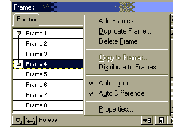
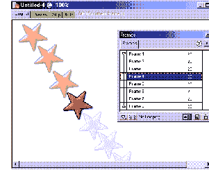
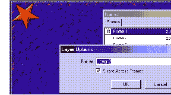
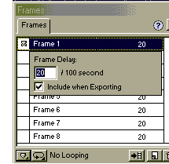
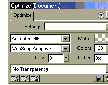

# 用 Fireworks 文章创建动画

> 原文：<https://www.sitepoint.com/create-animation-fireworks/>

多媒体丰富的网站曾经在网络上被避开。“不行！”反对者喊道。“你不可能拥有丰富而吸引人的媒体——它会吓退用户，也不会增加流量。”

然而，底线是，精心策划和明智实施的动画和其他富媒体技术，如 Macromedia 的 Flash，可以增加网站流量和增强用户体验。

Macromedia 的 Fireworks 是设计师的独特工具。它不仅提供了一流的绘图和设计工具，而且是唯一允许您在一个程序中创建动画 GIF 图像和 Flash SWF 电影的图形工具。

##### 动画格式

网络上有两种流行的动画格式:

1.  CompuServe 的 GIF 格式是最广泛使用的
2.  第二常见的 Flash 是 GIF 的迅速发展的继承者

当网景公司将 GIF 动画包含在 Navigator 3.0 浏览器中时，GIF 动画获得了主流采用(微软公司随后迅速推出了 Internet Explorer 3.0)。与 JPEG 图像不同，它支持照片级的色谱，GIF 图像只支持 256 色，这是 Web 浏览器最基本的色谱。然而，GIF 图像支持两个关键特性，使得这种格式非常适合在 Web 上使用:透明度和动画。

GIF 调色板中的颜色可以在 Web 浏览器中选择为透明。这提供了不规则形状图像(如按钮)的错觉。GIF 图像格式的第二大优势是，它们提供了将两个或更多图像层叠在一起以创建简单动画的能力。

Flash 为用户提供了许多与 GIF 相同的功能，虽然它可以支持动画，但它不允许 Web 浏览器中的颜色透明。然而，Flash 拥有的一个主要优势是能够在更紧凑的动画中支持 JPEG 质量的图像。幸运的是，Fireworks 为您提供了两个世界的最佳选择，让您可以轻松地创建动画，然后以您选择的格式导出它们。

##### Fireworks:一个动画工具

Fireworks 提供了一系列工具，可以快速创建动画电影。创建动画最重要的工具是帧检查器，如下所示。

Fireworks 中的任何动画都必须包含 2 个或更多帧。可以通过从“框架属性”中选择“添加框架…”来添加框架(检查器右上角的小箭头)。选择“添加帧…”将打开一个对话框，询问您要添加多少帧，以及您希望它们出现在电影中的什么位置。默认值是 1 个新帧，它直接出现在当前帧之后。

##### 创建动画

要在 Fireworks 中创建新动画，请打开一个新电影，并将画布设置设为 500 像素宽 500 像素高。打开框架检查器。默认只有一帧——但是我们不能只用一帧做很多动画，我们必须至少有两帧。但是在我们创建第二帧之前，让我们计划一下我们将要创建的动画类型。

规划任何类型的多媒体演示都会缩短项目的长度。在一张纸上勾画出你想在动画中看到的各种画面(这个过程叫做故事板)。现在，在 Fireworks 画布上，添加将占据第一帧的第一组图像。在这个示例练习中，使用你的名字，并将第一帧的字体大小设为 40 磅。

从帧属性中选择“添加帧…”并添加 5 帧到动画中。这将在第 1 帧之后直接创建 5 个新帧，因此总共有 6 个帧。从帧检查器中选择帧 2。你会看到你的名字已经消失了，因为在第 1 帧创建的图像只占据了电影的那一帧:我们没有把它们添加到第 2 帧。

现在，选择第一帧并突出显示你的名字。选择“复制”，将你的名字“粘贴”到第二帧。选中第 2 帧，将你名字的字体大小调整为 36。将你的名字复制到第二帧并粘贴到第三帧，将磅值调整为 30。对剩余的帧重复这些步骤。您现在应该有六个框架，每个框架包含您的姓名，在每个框架中以较小的磅值显示。

现在动画有 6 帧了，怎么看？Fireworks 有一组类似 VCR 的控件，允许动画逐帧播放、停止、倒带和转发。如下所示，这些控件位于程序的右下角。

选择白色的“播放”按钮。通过选择黑色的方形“停止”按钮，可以随时停止动画。使用帧前进控件在动画中逐帧移动。

##### 分配到框架

一帧一帧地制作动画可能会很乏味。一个更快的解决方案是使用 Fireworks 中一个名为“分发到帧”的功能。这允许画布上的对象快速构建成动画。要分布到帧，画布上必须出现两个或更多对象。

在 Fireworks 中创建新文件。在舞台上画一颗星星，按住 ALT 键，用鼠标选择星星。按住 ALT 键的同时，每次释放鼠标按钮，都会创建星形的新副本。这样造出六七颗星。

现在，选择 CTRL+A 突出显示您创建的所有星星，并从框架检查器的属性中选择“分布到框架”,如下所示。

新帧按照原始星形图形的创建顺序创建。每一帧中会出现一颗星星。选择“播放”动画控件观看动画播放。

##### 共享层

图像也可以在整个动画中共享，这对于必须出现在每一帧中的背景来说非常有用。

打开“层”检查器并添加新层。如果这是已经创建的第一层，它将被称为“层 2”。现在添加一个背景图片到图层。然后，在图层检查器中，双击名为“图层 2”的图层“层”对话框打开，允许更改层的名称。重要的是图层名称下的复选框标记为“跨帧共享”，如下所示。选中此复选框将在整个动画过程中显示该层中的任何对象。

播放动画—您会注意到背景现在在整个动画中是共享的。此功能的唯一警告是，该层必须在动画的每个帧中共享，因此不能选择帧组来共享层。

##### 再放一遍，山姆…

每个帧的回放速度可以从帧检查器中控制。双击任何单个框架将打开该框架的属性。如此处所示，默认时间是 20/100 秒，但是，这个速度可以手动更改。

例如，如果您将数字修改为 100/100，帧将暂停整整 1 秒，而速度 1000/100 将导致帧暂停 10 秒。

沿着帧检查器的底部，你会看到一个 GIF 动画循环按钮，默认设置为“无循环”。如果您选择 GIF 动画循环按钮，您将打开动画循环选项的下拉菜单。但是请注意，选择动画循环多次不会增加文件的大小。

##### 把它放到网上！

动画确实需要一些细微的修改才能输出到网络上。这可以通过使用优化检查器轻松完成，如下所示。

打开优化检查器，选择“导出文件格式”下拉菜单，然后点击动画 GIF。此时，可以使用“选择透明度类型”下拉菜单来应用透明度。

现在，您已经确认了导出设置，选择文件—导出，并指定硬盘上要保存动画的位置。文件保存后，打开您最喜欢的 Web 浏览器，选择“文件”—“打开”,然后找到新的动画 GIF。动画现在在您的浏览器中播放！

您的动画也可以导出为 Flash 电影。在 Fireworks 中打开动画后，选择“特殊导出”，将出现第二个选项列表。选择 Flash SWF。

##### 一锤定音

与 GIF 相比，Flash 有几个优点。首先，Flash 电影通常比动画 GIF 电影小。可以在更小的文件中创建更多的动画，最终结果是改善客户体验。Flash 电影也可以“加载”到其他 Flash 电影中。这必须在 Macromedia 的 Flash 4 或更高版本中使用 ActionScript 来完成。然而，最终的结果是，图形可以用 Fireworks 控制，脚本可以用 Flash 控制，这两种工具都发挥了各自的优势。

动画可以使任何网站与众不同。在威斯康辛州最近的一次网站竞赛中，一名设计师惊讶地看到赢得所有杠杆动画的网站，并评论道:“我想动画确实有所作为。”创造性地和谨慎地使用，动画的影响力可以使一个沉闷的网站和一个有影响力的网站有所不同。

## 分享这篇文章