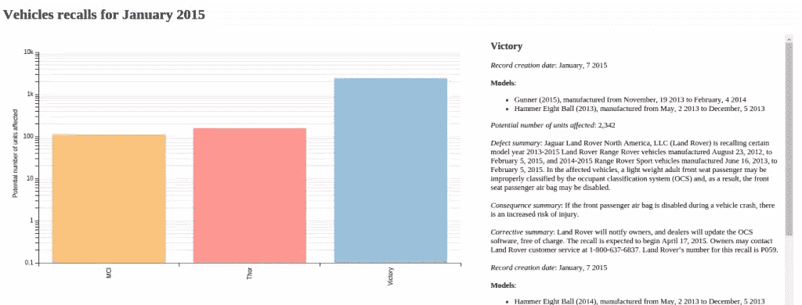

# 使用 Dimple 和 D3 在 JavaScript 中创建数据可视化

> 原文：<https://www.sitepoint.com/create-data-visualizations-javascript-dimple-d3/>

万维网将丰富的数据放在我们的指尖。由于这种数据的庞大数量，以一种突出的方式呈现它，或者以一种让你的信息被理解的方式呈现它，通常会被证明是棘手的。这就是数据可视化的用武之地。

在本文中，我将指导您创建一个数据可视化，即 2015 年 1 月的美国汽车召回，使用建立在 [D3.js](http://d3js.org/) 之上的 [dimple.js](http://dimplejs.org) JavaScript 库。

## 设定目标

<abbr title="National Highway Traffic Safety Administration">NHTSA</abbr> / <abbr title="Office of Defects Investigation">ODI</abbr> 提供了一份召回文件(可通过[他们的网站](http://www-odi.nhtsa.dot.gov/downloads/flatfiles.cfm)访问)，其中包含自 1967 年以来所有与 NHTSA 安全相关的缺陷和合规活动。我们的目标是提取给定月份(2015 年 1 月)的数据，并从中创建一个条形图，描绘制造商召回车辆的总数。

这种数据可视化不会是解释性的(我们将展示原始数据)，也很难是探索性的(没有太多的叙述供观众从这些数据中构建)。但是，我确实打算在用户将鼠标悬停在其中一个条上时，在图表旁边显示附加信息。

这就是我们的最终结果:



你可以在文末看到一个(更小的)[现场演示](#live-demo)或者[在 CodePen](http://codepen.io/SitePoint/pen/Eaqyrq) 上查看原文。

## 使用数据

### 只保留我们需要的数据

本节提到的所有文件都可以在我们的 [GitHub repo](https://github.com/sitepoint-editors/dive-into-dimple) 上找到。

原始文件`FLAT_RCL.txt` ( [链接](https://github.com/sitepoint-editors/dive-into-dimple/blob/master/FLAT_RCL.zip))是一个制表符分隔的值文件，包含一个*批次*的数据——确切地说是 109682 条记录。有一个附带的文件`RCL.txt` ( [链接](https://github.com/sitepoint-editors/dive-into-dimple/blob/master/RCL.txt))详细描述了与该数据相关的列。

由于我们只对 2015 年 1 月的数据感兴趣——或者更确切地说,`Record Creation Date`是 2015 年 1 月的记录——其余的记录可以删除。为此，我使用了 [OpenOffice Calc](https://www.openoffice.org/product/calc.html) 电子表格程序(尽管任何其他电子表格软件都可以)。结果文件，`RCL_January_2015.csv` ( [链接](https://github.com/sitepoint-editors/dive-into-dimple/blob/master/RCL_January_2015.csv))只统计了 201 条记录。

我们现在需要将列减少到可用列的子集，即:
`Record Creation Date`、`Maker`、`Model`、`Model Year`、`Begin Date of Manufacturing`、`End Date of Manufacturing`、`Potential Number of Units Affected`、`Defect Summary`、`Consequence Summary`和`Corrective Summary`。然后，我们可以将列名添加到结果 CSV 文件的第一行，`RCL_January_2015_clean.csv` ( [链接](https://github.com/sitepoint-editors/dive-into-dimple/blob/master/RCL_January_2015_clean.csv))。

这给了我们可视化所需的原始数据。

### 创建数据结构

现在我们需要按照制造商对召回进行手动分组，合并那些具有相同缺陷的记录。我们需要确保组合记录先按日期排序，然后按型号排序，并且它们具有受影响的累计潜在设备总数。

我们将使用 JSON 数据结构进行分组。

为了说明这一点，让我们处理`RCL_January_2015_clean.csv`文件的前三个条目。这些可以归为一行，说明制造年份相同的 2013 年、2014 年和 2015 年 MCI 的 J4500 存在相同的缺陷。受影响的单元的潜在数量已经在数据集中将这三个模型组合在一起。

下面是我们将要使用的 JSON 数据结构:

```
{
  "items": [
    {
      "item": {
        "date": "",
        "models": [
          "" 
        ],
        "units": "",
        "defect": "",
        "consequence": "",
        "corrective": ""
      }
    }
  ]
}
```

经过这个过程的迭代(并去掉双引号)，我们现在有了 CSV 文件*RCL _ 2015 年 1 月 _json.csv* ( [链接](https://github.com/sitepoint-editors/dive-into-dimple/blob/master/RCL_January_2015_json.csv))。为了简洁起见，我们的工作示例将只显示原始文件的前三个创建者(46 个中的 3 个)。

## 将数据绑定到 D3 对象

D3 提供了对数据文件格式的现成支持，比如 CSV、TSV 或 JSON。执行 Ajax 调用来获取文件，然后对文件进行解析并转换成 JavaScript 数组。我们创建的 CSV 文件可以用以下代码获取:

```
d3.csv("RCL.csv", function (data) {
  // process the data
});
```

我们也可以直接在代码中定义 JavaScript 数组，这是为了我们的 CodePen 演示的目的。数据结构尽可能接近 D3 从 CSV 文件创建的数组。

```
data = [
  {
    'Record creation date':'20150105',
    'Maker':'MCI',
    'Potential number of units affected':'109',
    'JSON data': '{
      "items":[
        {
          "item": {
            "date":"January, 5 2015",
            "models":[
              "J4500 (years 2013, 2014, 2015) ..."
            ],
            "units":"109",
            "defect":"...",
            "consequence":"...",
            "corrective":"..."
          }
        }
      ]
    }'
  },
  ...
];
```

## 现在，让我们开始吧！

```
<div id="RecallsChart"></div>
<div id="RecallDetails"></div>
```

HTML 很简单:两个 div，一个用于图表(`RecallsChart`)，另一个用于在用户将鼠标悬停在其中一个条上时显示额外的细节(`RecallDetails`)。

```
var svg = dimple.newSvg("#RecallsChart", 800, 560);
var myChart = new dimple.chart(svg, data);
myChart.setBounds(60, 30, 710, 355)
```

我们首先向 div 元素添加一个 SVG 对象，通过它的 id 引用它。然后，我们将数据链接到新的图表，该图表将在 SVG 中呈现。最后，我们手动设置图表边界，使其在父 div 中正确定位。

```
var x = myChart.addCategoryAxis("x", "Maker");
x.addOrderRule("Maker");
x.title = '';
```

我们将图表的 x 轴设置为数据的`Maker`字段——我们使用`addCategoryAxis`方法作为构成分类数据的标记。我们使用`addOrderRule`方法按字母顺序排列制造商，并隐藏 x 轴标题(可能是制造商)，因为制造商名称是不言自明的。

```
myChart.addLogAxis("y", "Potential number of units affected");
```

我们将图表的 y 轴设置为数据的`Potential Number of Units Affected`字段。我们本可以在这里使用[addmeasureaxins 方法](https://github.com/PMSI-AlignAlytics/dimple/wiki/dimple.chart#addMeasureAxis)，它从给定的值中定义一个线性轴，但是由于制造商 Victory 受影响的潜在单位数量是 MCI 或 Thor 的 20 倍以上，因此生成的列会使其他两个相形见绌。在这种情况下，对数标度为较小的值提供了更多的空间，所以我们使用`addLogAxis`方法，默认为基数 10。

```
var mySeries = myChart.addSeries(["Maker", "JSON data"], dimple.plot.bar);
```

现在我们已经定义了我们的轴，我们可以将它们连接在一起来呈现一个图形。为此，我们通过`dimple.plot.bar`选择一个条形图，并将其绑定到`Maker`数据字段。第二个数组元素`JSON data`将把我们数据的 JSON 部分绑定到每个条形上，使我们能够在鼠标悬停在条形上时访问正确的数据。

```
mySeries.getTooltipText = function (e) {
  var datum = jQuery.parseJSON(e.aggField[1]);
  var titles = [];
  titles['date'] = 'Record creation date';
  titles['units'] = 'Potential number of units affected';
  titles['defect'] = 'Defect summary';
  titles['consequence'] = 'Consequence summary';
  titles['corrective'] = 'Corrective summary';
  var html = '';
  html += '<span class="maker">'+e.aggField[0]+'</span>';
  html += '<br /><br />';
  $.each(datum.items, function(index1, element) {
    $.each(element, function(index2, item) {
      $.each(item, function(key, value) {
        if (key === 'models') {
          if (value.length == 1) {
            html +=  '<strong>Model</strong>:';
          }
          else {
            html +=  '<strong>Models</strong>:';
          }
          html += '<ul>';
          $.each(value, function(vk, val) {
            html += '<li>'+val+'</li>';
          });
          html += '</ul>';
        }
        else {
          html +=  '<em>'+titles[key]+'</em>: '+value+'<br /><br />';
        }
      });
    });
  });
  $("#RecallDetails").html(html);

  return [
    "Maker: " + e.aggField[0],
    "Potential number of units affected: " + 
      parseInt(e.cy).toLocaleString('en')
  ];
};
```

默认情况下，当鼠标悬停在绘图单元(此处为条形)上时，会显示工具提示，并显示轴和系列数据。在我们的例子中:制造商(x 轴值)、受影响的潜在单位数(y 轴值)，以及我们的`JSON data`的纯文本值。

这里重载了`getTooltipText`函数来处理 JSON 数据，并将其显示在旁边的另一个 div 中。它返回一个我们希望显示为工具提示的数据数组，即制造商的名称(我们的数据行的第一个聚合字段)和受影响的单位数量(我们从 y 轴获得，并通过内置的`toLocaleString` JavaScript 方法将其本地化为通用的英文数字格式)。

但是让我们回到 JSON 数据解析。

我们正在访问的两个聚合字段(`aggField[0]`和`aggField[1]`)与我们之前设置为序列(`["Maker", "JSON data"]`)的数据字段数组相匹配，`aggField`本身是底层元素对象的一个属性。

我们用 jQuery 的`parseJSON`函数解析 JSON 字符串，设置一个与 JSON 对象的键匹配的全长标题数组，然后，通过迭代 JSON 对象，我们构建一个 HTML 字符串，添加到 id 为`RecallDetails`的 div 中。

```
myChart.ease = "elastic";
myChart.draw(1000);
```

最后，我们使用一秒钟延迟的弹性缓动来绘制具有美学过渡的图表。

```
x.shapes.selectAll("text")
  .style("text-anchor", "end")
  .each(function () {
     var rec = this.getBBox();
     d3.select(this)
       .attr("transform", "rotate(-90," + (rec.x + rec.width) + "," + (rec.y + (rec.height / 2)) + ") translate(5, 0)");
  });
```

我说最后了吗？嗯，这里我们给 x 轴标签添加了另一个美学技巧。

默认情况下，x 轴标签是水平书写的。但是它们很容易重叠，所以我们将改为垂直书写。这就是 dimple 暴露其底层 D3 对象的地方。请注意，我们只能在图表绘制完成后，也就是在`myChart.draw()`调用之后，才能更改它。

为此，我们首先选择每个标签文本，或者更确切地说，选择与每个标签的 x 轴相关联的匹配 SVG 形状。`getBBox()`方法属于 [InterfaceSVGLocatable](https://www.w3.org/TR/SVG/types.html#InterfaceSVGLocatable) 并返回一个定义边界框的 SVGRect 对象，显示其坐标、高度和宽度。然后，我们旋转 SVG 框，并稍微垂直平移，使其更靠近 x 轴。

这是最终的结果:

参见 [CodePen](http://codepen.io) 上 SitePoint ( [@SitePoint](http://codepen.io/SitePoint) )发布的 2015 年 1 月汽车召回笔[。](http://codepen.io/SitePoint/pen/jEgrzz/)


## 分享这篇文章