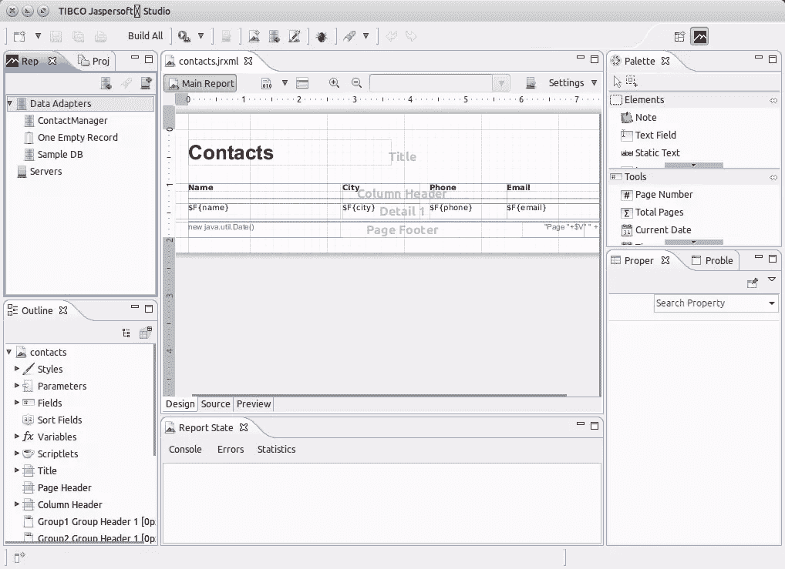

# 使用 JasperReports 创建出色的报告

> 原文：<https://www.sitepoint.com/create-great-reports-jasperreports/>


Ruby on Rails 是构建 web 应用程序的一个令人惊叹的框架。Ruby 和 Rails 生态系统非常活跃和成熟，有许多库可以解决开发人员遇到的各种问题。但是我觉得 Ruby 缺乏选择的一个特殊领域是报告。Rails 中有许多生成报告的解决方案，其中大多数依赖于生成 HTML 并转换为 PDF。这种方法有它的优点，但是对于复杂的和像素完美的报告来说是失败的。

输入 [JasperReports](http://community.jaspersoft.com/project/jasperreports-library) 。JasperReports 是 Java 世界中广泛使用的一个非常流行的开源报告库。许多人可能对如何在 Rails 中使用 Java 库感到好奇。有很多方法，但是我更喜欢使用 JRuby。这需要你把你的应用程序转换成 JRuby，这在今天是很容易做到的。那么，我们开始吧。

## 示例 Rails 应用程序

我们将创建一个带有联系模型和 CRUD 动作的示例 Rails 应用程序。该应用程序将使用 JRuby、Rails 4.2 和 SQLite 作为数据库，以保持简单。首先用 [RVM](https://rvm.io) 或者 [rbenv](http://rbenv.org) 安装 JRuby。

切换到 JRuby 和`bundle install`最新的 Rails gem。现在创建一个新的 Rails 应用程序，如下所示:

```
rails new contactbook
```

生成应用程序后，创建一个 Contact scaffold，它有一个 model 和 CRUD 资源操作:

```
cd contactbook
rails g scaffold Contact name:string address:string city:string phone:string email:string
```

现在迁移数据库:

```
rake db:migrate
```

让我们来看看它是如何工作的:

```
rails s
```

将你最喜欢的浏览器指向[http://localhost:3000/contacts](http://localhost:3000/contacts)，确保一切正常。创建一些记录，以便我们以后使用。

## 一份 JasperReport 样本

让我们创建一个显示联系人列表的简单报告。从 [Jaspersoft Studio](http://community.jaspersoft.com/project/jaspersoft-studio/releases) 站点下载适合您平台的 JasperSoft Studio。安装并运行 Jaspersoft Studio。它是基于 Eclipse 的成熟的 IDE，专门用于设计 JasperReports。毫无疑问，它有一个学习曲线，但我们现在不会进入这些细节。更多信息可以参考[jasper soft Studio-Resources](http://community.jaspersoft.com/project/jaspersoft-studio/resources)。

使用 Jaspersoft Studio 创建一个名为`contacts`的报告，如下所示:



编译报告并将 **contacts.jasper** 文件粘贴到我们的 Rails 应用程序中的 **app/reports/** 中。

## 集成 JasperReports

现在到了重要的部分，将 JasperReports 集成到 Rails 应用程序中。在本教程中，我们将使用 JasperReports 6.1 版本。前往 [JasperReports 库](http://community.jaspersoft.com/project/jasperreports-library/releases)页面并下载`jasperreports-6.1.0-project.tar.gz`。这个归档文件包含 JasperReports JAR 文件(在它的 **dist** 文件夹中)以及依赖项(在 **lib** 文件夹中)。从这两个文件夹中复制所有文件，并将它们放在 Rails 应用程序中的 **lib** 目录下的一个名为 **jasperreports** 的文件夹中。

```
contactbook
  - app
  ...
  - lib
    - jasperreports
      - jasperreports-6.1.0.jar
      ...
```

我们已经准备好了 JasperReports 所需的所有文件，所以让我们创建一个类来集成 JasperReports。在 **lib** 目录下创建一个名为 **jasper_report.rb** 的文件，代码如下:

```
Dir.entries("#{Rails.root}/lib/jasperreports").each do |lib|
  require "jasperreports/#{lib}" if lib =~ /\.jar$/
end

require 'java'

java_import Java::net::sf::jasperreports::engine::JasperFillManager
java_import Java::net::sf::jasperreports::engine::JasperExportManager
java_import Java::net.sf.jasperreports.engine.JRResultSetDataSource

class JasperReport
  DIR = "#{Rails.root}/app/reports"

  def initialize(report, query, params = nil)
    @model = report
    @report_params = params
    @conn = ActiveRecord::Base.connection.jdbc_connection
    @query = query
  end

  def to_pdf
    stmt = @conn.create_statement
    @result = JRResultSetDataSource.new(stmt.execute_query(@query))
    report_source = "#{DIR}/#{@model}.jasper"
    raise ArgumentError, "#@model does not exist." unless File.exist?(report_source)
    params = {}
    params.merge!(@report_params) if @report_params.present?
    fill = JasperFillManager.fill_report(report_source, params, @result)
    pdf = JasperExportManager.export_report_to_pdf(fill)
    return String.from_java_bytes(pdf)
  end
end
```

让我们看看代码实际上做了什么。首先，我们需要将所有 JasperReports 文件放入我们的类中，如下所示:

```
Dir.entries("#{Rails.root}/lib/jasperreports").each do |lib|
  require "jasperreports/#{lib}" if lib =~ /\.jar$/
end
```

为 JasperReports 添加 Java 导入声明:

```
require 'java'

java_import Java::net::sf::jasperreports::engine::JasperFillManager
java_import Java::net::sf::jasperreports::engine::JasperExportManager
java_import Java::net.sf.jasperreports.engine.JRResultSetDataSource
```

定义所有报告的存储位置:

```
DIR = "#{Rails.root}/app/reports"
```

在类构造函数中添加初始化代码:

```
def initialize(report, query, params = nil)
    @model = report
    @report_params = params
    @conn = ActiveRecord::Base.connection.jdbc_connection
    @query = query
end
```

作为第一步，我们初始化了所有必需的变量:

*   报告的文件名—`report`
*   报告的 SQL 查询-`query`
*   传递给报告的任何可选参数-`params`

`@conn`是来自 ActiveRecord 连接池的 JDBC 连接，因为 JasperReports 需要 JDBC 连接来执行查询。

最后，我们添加了一个方法来填写报告并将报告导出为 PDF 格式:

```
def to_pdf
  stmt = @conn.create_statement
  @result = JRResultSetDataSource.new(stmt.execute_query(@query))
  report_source = "#{DIR}/#{@model}.jasper"
  raise ArgumentError, "#@model does not exist." unless File.exist?(report_source)
  params = {}
  params.merge!(@report_params) if @report_params.present?
  fill = JasperFillManager.fill_report(report_source, params, @result)
  pdf = JasperExportManager.export_report_to_pdf(fill)
  return String.from_java_bytes(pdf)
end
```

第一项是 JDBC 语句`stmt = @conn.create_statement`，它通过执行`@result = JRResultSetDataSource.new(stmt.execute_query(@query))`返回一个 JDBC 结果集。先前使用 JasperStudio 创建的报告(`.jasper`)文件被设置为`report_source`。之后，调用`JasperFillManager.fill_report`用提供的结果集和参数填充报告。最后，调用`JasperExportManager.export_report_to_pdf`将报告导出到使用`String.from_java_bytes`返回的 PDF 字节流中。

我们现在有一个 PDF 字节流格式的报告，但是我们还没有办法把它发送给用户。所以，在**application _ controller . Rb**中添加一个小的 helper 方法如下:

```
def respond_to_report(name, query, filename, download = false, report_params = nil)
  @report = JasperReport.new(name, query, report_params) 
  disposition = (download.nil? || download == false) ? 'inline' : 'attachment'
  send_data @report.to_pdf, :filename => filename, :type => :pdf, :disposition => disposition
end
```

这个助手方法简化了报告调用，并将响应发送回用户。还增加了提供文件名的选项，以及在浏览器中打开文件或将其作为附件下载的`disposition`选项。

现在，我们将向调用报告的`ContactsController`添加一个动作。将以下代码添加到**app/controllers/contacts _ controller . Rb**中:

```
def report
  respond_to_report('contacts', 'select * from contacts', 'contacts.pdf')
end
```

因为我们没有要传递的参数，并且想要在浏览器中打开报告，所以我们从方法调用中跳过了`download`和`report_params`。

更新 **routes.rb** 以添加新动作:

```
resources :contacts do
  get :report, on: :collection
end
```

在 **contacts/index.html.erb** 视图中添加报告链接:

```
...
<h1>Listing Contacts</h1>

<%= link_to 'Download as PDF', report_contacts_path %>
...
```

启动服务器，进入[http://localhost:3000/contacts](http://localhost:3000/contacts)。点击“下载为 PDF”。您现在应该会看到一个列出了所有联系人的 PDF 文件。


## 包扎

这是一本关于如何将 JasperReports 与 Rails 集成以轻松创建报告的入门书。使用 JasperReports 和 Rails 可以做更多的事情，比如搜索标准、复杂报告、子报告等。但那是另一个教程。

我希望你喜欢这篇文章。欢迎您的评论和见解。

## 分享这篇文章