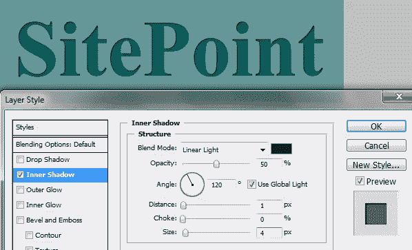
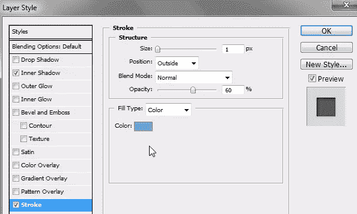

# 在 Photoshop 中创建嵌入样式的文字

> 原文：<https://www.sitepoint.com/create-inset-style-type-in-photoshop/>

插图或凸版印刷已经在网络上流行了一段时间。在[邮箱](https://www.postbox-inc.com/)网站上的标志只是在网络上使用这种风格的一个例子。这种效果非常容易创建，并且在你的设计工具箱中非常方便。

插图可以看起来很时尚，但适度是关键。本教程的目的不仅仅是向你展示如何实现这种特殊的效果，也是创建和保存你自己的风格的一个起点。以下是如何在 Photoshop 中创建插图或凸版效果的方法。

1.创建一个新的 Photoshop 文档，300 x 150 像素，背景色为蓝绿色#669999。

2.使用文字工具(T)，在文档中添加一些文本。我将使用衬线字体给它一个更古老的风格，但这几乎适用于任何类型的字体。邮箱站点使用无衬线字体。这里的字体是 Times New Roman，粗体，115 磅。

3.现在，我们将添加效果，使其看起来像文字被压入纸张(或屏幕)。

确保选择了文字图层，然后点击图层面板底部的图层样式按钮。从下拉菜单中，选择内部阴影。
设置距离为 1 px，大小为 4px。如果你愿意，你可以将阴影颜色设为黑色，或者选择一种深绿色来获得更微妙的效果。我在这里设置阴影颜色为#002727。这种效果适用于许多混合模式，包括正常模式，但我喜欢它设置为线性光时的样子。最后将不透明度设置为 50%左右。**先不要**点击确定。

4.为了完成这个简单的效果，我们将在文字周围添加一条细细的蓝绿色线条。描边颜色应该比背景颜色略浅。

仍然在图层样式对话框中，点击左侧的笔画。设置大小为 1 像素，不透明度为 60%，颜色设置为#66cccc。

您的类型现在应该看起来像这样。

这就是全部了。您可以通过更改内部阴影选项中的大小来改变插图的表观深度。

现在，在您单击图层样式对话框上的确定之前，您可以保存此样式，并随时再次使用。保存样式以备将来使用。点击**新样式**按钮。给你的样式起个名字，选中包括图层效果和包括图层混合选项框，然后点击确定。

您的样式现在已保存。现在，您可以在图层样式对话框中单击确定。当你想再次使用它时，只需选择“窗口”>“样式”打开样式面板，你就会在面板中看到你的样式。点击它，将其应用到当前选定的层。

## 分享这篇文章