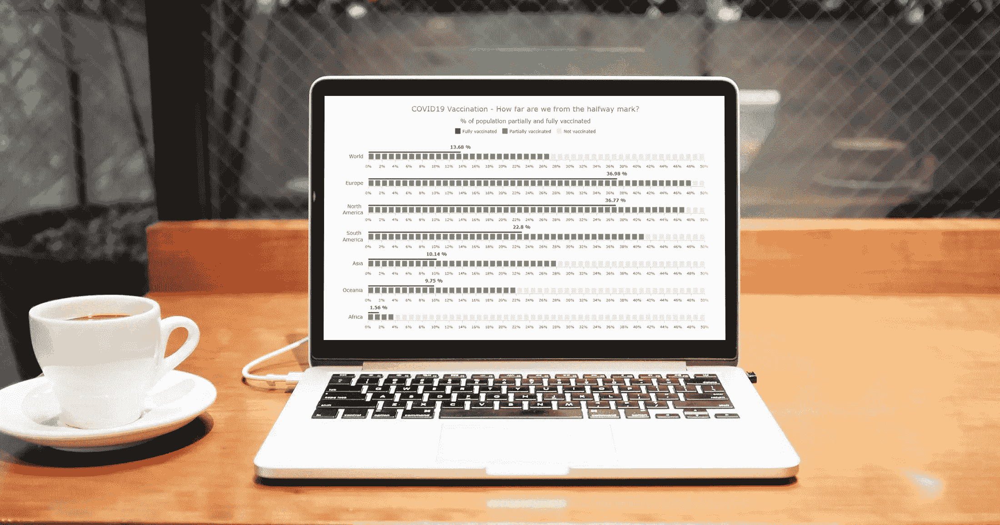
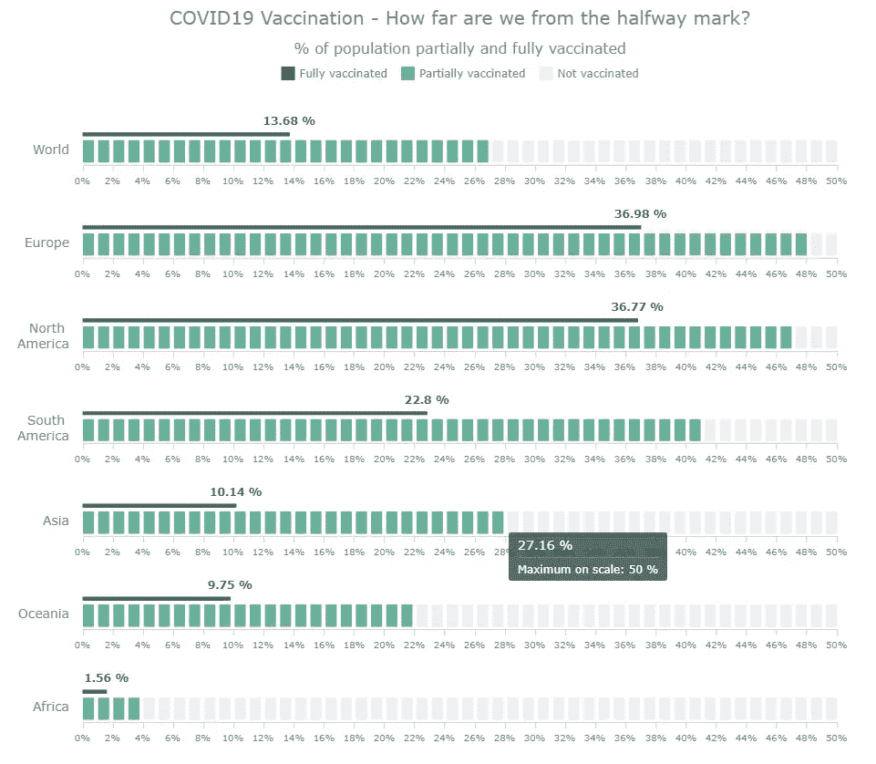
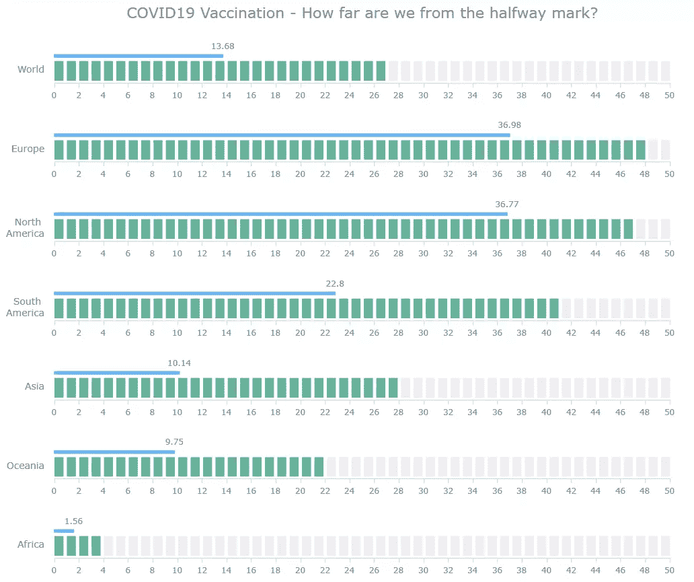
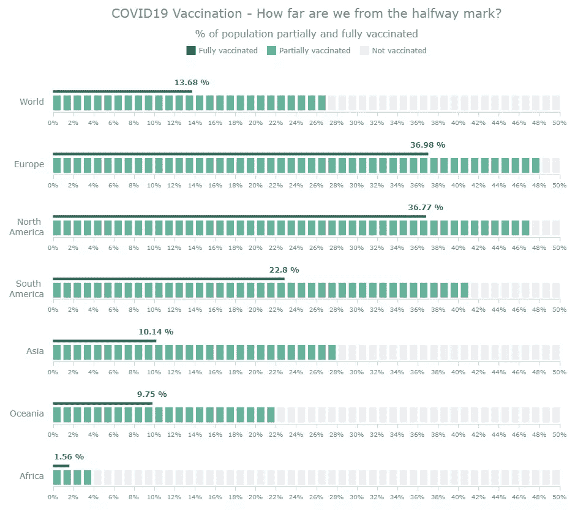

# 如何用 JavaScript 创建线性仪表图

> 原文：<https://www.sitepoint.com/create-linear-gauge-chart-javascript/>

**本文介绍了用 JavaScript 构建交互式线性仪表图的简单指南。**

我们将展示如何快速创建一个酷炫的交互式线性仪表图，突出显示世界各地的新冠肺炎疫苗接种数据。我们的图表将使我们能够在撰写本文时可视化新冠肺炎疫苗接种的状况，并将显示两种类型的数据——显示我们距离全球人口部分和完全接种疫苗的中途目标有多远。



## 什么是线性仪表图？

考虑到正在创建的大量数据和从数据中收集信息的众多可能性，数据可视化是一个非常有价值的工具。数据可视化对于识别趋势、解释模式以及向目标受众传达复杂的想法特别有用。

线性仪表图表示显示所需值的垂直或水平线性刻度，带有彩色刻度以及单个或多个指针。数据范围的最小值和最大值可以根据所表示的数据在轴上设置。指针位置指示指标的当前值。

仪表图可以使用单个指针或标记组合来显示单个值或多个值。指针可以是针，也可以是带有任何形状标记的线，如圆形、方形、矩形或三角形。

线性仪表图类型是一种有效的可视化表示，用于显示值与所需数据点的远近。

### 线性仪表的类型

线性仪表的几种类型是温度计图、子弹图、储罐图和 LED 图。水银温度计由显示温度和指针值的小刻度组成，是线性仪表图的经典示例。

### 我们将构建的线性规范可视化

这里先睹为快，在最终的线性规图。跟随本教程，了解我们如何用 JavaScript 构建这个有趣且信息丰富的线性仪表图。



## 构建 JavaScript 线性标尺的四个步骤

掌握一些 HTML 和 JavaScript 之类的技术总是有用的。但是在本教程中，我们使用一个 JS 图表库，它使创建引人注目的图表变得更加容易，比如线性标尺，即使只有很少的技术知识。

有几个用于轻松可视化数据的 [JavaScript 图表库](https://en.wikipedia.org/wiki/Comparison_of_JavaScript_charting_libraries)，这里我们用 [AnyChart](https://www.anychart.com/) 创建线性仪表图。这个库是灵活的，拥有[丰富的文档](https://docs.anychart.com)，并且包含一些[伟大的例子](https://www.anychart.com/products/anychart/gallery/)。而且，它有一个[游乐场](https://playground.anychart.com/)用于试验代码，非商业使用免费。如果你想购买授权版本，你可以查看[可用选项](https://www.anychart.com/buy/)，如果你是一个教育或非盈利组织，你可以在这里获得免费许可证[。](https://www.anychart.com/buy/non-commercial-license/)

## 制作 JavaScript 线性标尺的步骤

以下是创建线性仪表图的基本步骤:

1.  创建一个基本的 HTML 页面。
2.  包括必要的 JavaScript 文件。
3.  添加数据。
4.  为图表编写 JavaScript 代码。

让我们在下面详细地看一下这些步骤。

### 1.创建基本的 HTML 页面

我们需要做的第一件事是制作一个包含我们的可视化的 HTML 页面。我们添加了一个`<div>`块元素，并给它一个 ID，这样我们可以在以后引用它:

```
<html lang="en">
  <head>
    <title>JavaScript Linear Gauge</title>
    <style type="text/css"> html, body, #container { 
        width: 100%; height: 100%; margin: 0; padding: 0; 
      } </style>
  </head>
  <body>
    <div id="container"></div>
  </body>
</html> 
```

`<div>`的宽度和高度属性被设置为 100%,这样图表就可以呈现在整个屏幕上。这些属性可以根据需要进行修改。

### 2.包括必要的 JavaScript 文件

下一步是引用 HTML 页面中的 JS 链接。在本教程中，我们将使用 AnyChart 库，所以让我们从它们的 [CDN](https://cdn.anychart.com/) 中包含相应的文件。

为了创建一个线性仪表图，我们需要添加三个脚本:核心模块、[线性仪表模块](https://docs.anychart.com/Quick_Start/Modules#linear_gauge)和[表格模块](https://docs.anychart.com/Quick_Start/Modules#table_ui):

```
<html lang="en">
  <head>
    <title>JavaScript Linear Gauge</title>
    <style type="text/css"> html, body, #container { 
        width: 100%; height: 100%; margin: 0; padding: 0; 
      } </style>
  </head>
  <body>  
    <div id="container"></div>
    <script> // All the code for the JS linear gauge will come here </script>
    <script src="https://cdn.anychart.com/releases/8.10.0/js/anychart-core.min.js"></script>
    <script src="https://cdn.anychart.com/releases/8.10.0/js/anychart-linear-gauge.min.js"></script>
    <script src="https://cdn.anychart.com/releases/8.10.0/js/anychart-table.min.js"></script>
  </body>
</html> 
```

### 3.添加数据值

线性仪表图的数据收集自数据中的[我们的世界，并包含在代码中。在这个网站上，我们可以看到全球各大洲接种了一剂和两剂 T2 疫苗的人口比例。](https://ourworldindata.org/)

因为(在撰写本文时)没有一个数字大于 50%，我们将所有线性标尺的轴的最大限制保持为 50%，我们比较每个大陆与该标记的距离，以及全球数字。我们用 LED 表示至少部分接种的数字，用条形指针表示完全接种的数字。我们将在最后一步看到如何添加数据。

那么，我们的初始步骤都完成了，现在让我们添加代码，用 JavaScript 制作一个线性仪表图！

### 4.为图表编写 JavaScript 代码

在添加任何代码之前，我们将所有内容都放在一个函数中，以确保其中的整个代码只在页面加载后执行。

创建线性仪表图需要几个步骤，比其他基本图表类型要复杂一些。但这并不意味着它非常困难，我们将通过每个步骤来了解图表是如何制作的。

## 定义仪表图的线性刻度和坐标轴

我们的图表中有多个指针。因此，让我们从创建一个接受两个值的函数开始:一个用于条形指针，一个用于 LED 仪表。然后，我们将创建一个仪表，设置数据，并将布局指定为水平。接下来，我们将设置刻度和轴的范围。我们将用最小和最大范围制作一个线性标度。对于轴，我们将定义属性并设置方向:

```
function drawGauge(value, settings) {
  // Create gauge with settings
  const gauge = anychart.gauges.linear();
  gauge.data([value, settings.value]);
  gauge.layout('horizontal');

  // Set scale for gauge
  const scale = anychart.scales.linear();
  scale.minimum(0).maximum(settings.maximum).ticks({ interval: 2 });

  // Set axis for gauge
  const axis = gauge.axis(0);
  axis.width('1%').offset('43%').scale(scale).orientation('bottom');
} 
```

## 设置条形指针和标签

现在，我们将为条形系列创建条形指针和标签。标签被赋予一个偏移量以避免与指针重叠:

```
// Create and set bar point
const barSeries = gauge.bar(0);

barSeries
  .scale(scale)
  .width('4%');

// Create and set label with actual data
const labelBar = barSeries.labels();
labelBar
  .enabled(true)
  .offsetY('-15px'); 
```

## 创建 LED 指针并设置颜色属性

在 LED 点中，我们将指定点之间的间隙，并使用 dimmer 属性来设置剩余 LED 点的颜色，以指示无光效果。我们还将声明发光 LED 点的色阶:

```
// Create and set LED point
const ledPointer = gauge.led(1);

ledPointer
  .offset('10%')
  .width('30%')
  .count(settings.maximum)
  .scale(scale)
  .gap(0.55)
  .dimmer(function () {
    return '#eee';
  });

ledPointer.colorScale().colors(['#63b39b', '#63b39b']); 
```

## 用每个数据点的目标值声明仪表

为了制作每个洲的线性标尺，我们将为每个区域及其数据调用上面定义的函数。第一个数字表示目标值数据，第二个变量是包含 LED 数据的对象。`maximum`保持为常数 50，而`value`是每个数据点的完全接种人口的百分比值。该值将由指针显示:

```
// Create gauges
const world = drawGauge(13.68, { maximum: 50, value: 27.13 });
const europe = drawGauge(36.98, { maximum: 50, value: 47.28 });
const nAmerica = drawGauge(36.77, { maximum: 50, value: 46.53 });
const sAmerica = drawGauge(22.8, { maximum: 50, value: 40.54 });
const asia = drawGauge(10.14, { maximum: 50, value: 27.16 });
const oceania = drawGauge(9.75, { maximum: 50, value: 22.12 });
const africa = drawGauge(1.56, { maximum: 50, value: 3.04 }); 
```

## 设置线性仪表的布局

为了一个接一个地显示每个线性仪表，我们将定义一个表，并将标题和每个数据点添加为单独的一行。我们将添加布局的各种属性，比如对齐和字体大小。我们还将为第一行定义参数，因为它是标题，并将第一列的宽度属性设置为 100%，因为我们不需要更多的列:

```
// Create table to place gauges
const layoutTable = anychart.standalones.table();
layoutTable
  .hAlign('right')
  .vAlign('middle')
  .fontSize(14)
  .cellBorder(null);

// Put gauges into the layout table
layoutTable.contents([
  [null, 'Covid-19 Vaccination - How far are we from the halfway mark?'],
  ['World', world],
  ['Europe', europe],
  ['North America', nAmerica],
  ['South America', sAmerica],
  ['Asia', asia],
  ['Oceania', oceania],
  ['Africa', africa]
]);

// Set height for first row in layout table
layoutTable
  .getRow(0)
  .height(50)
  .fontSize(22)
  .hAlign('center');

// Set the first column to 100% width
layoutTable.getCol(0).width(100); 
```

## 绘制图表

最后一步是引用我们在上一步中添加的`<div>`容器，并绘制图表:

```
// Set container id and initiate drawing
layoutTable.container('container');
layoutTable.draw(); 
```

仅此而已。我们现在有了一个全功能的漂亮的 JavaScript 线性仪表图！线性规初始版本的代码可在[代码笔](https://codepen.io/SitePoint/pen/xxLwaQx?editors=0010)上查看。



## 使图表可访问

确保尽可能多的人可以访问图表是一个很好的做法。因此，牢记 a11y，我们制作了一个更适合屏幕阅读器的线性仪表图的基本版本。你可以在这里查看这个[，也可以在 AnyChart JavaScript 库的](https://codepen.io/SitePoint/pen/xxLwamx)[文档](https://docs.anychart.com/Common_Settings/Accessibility/Overview)中阅读更多关于这个方面的内容。

## 自定义线性仪表

我们制作的默认线性仪表图现在看起来很棒，但做一些修改将增强可读性，使图表更棒。JavaScript 库不仅非常适合快速创建图表，还可以根据需要定制可视化效果。图表库为控制图表的行为和美观提供了许多配置选项。让我们对当前的线性仪表图做一些小而有效的调整。

### 颜色修改

为了使线性仪表看起来更有凝聚力，让我们将条形指针的颜色属性设置为 LED 指针的深色版本。我们将通过指定栏的填充和描边属性来实现这一点:

```
// Create and set bar point
const barSeries = gauge.bar(0);
barSeries
  .scale(scale)
  .width('4%')
  .fill('#296953')
  .stroke('#296953'); 
```

### 向线性仪表图添加图例

因为我们对条形、发光和不发光的 LED 指针使用了不同的颜色，所以提供图例来解释颜色是一个很好的做法。我们将制作一个图例，并将其添加到图表标题的下方:

```
// Create stand alone legend
const legend = anychart.standalones.legend();
legend
.position('center')
.items([
    { text: 'Fully vaccinated', iconFill: '#296953' },
    { text: 'Partially vaccinated', iconFill: '#63b39b' },
    { text: 'Not vaccinated', iconFill: '#eee' }
]); 
```

### 工具提示格式

为了促进更好的数据通信，让我们格式化工具提示，通过以百分比形式显示值并指示仪表的最大值为 50%，使其更具信息性:

```
// Set gauge tooltip
gauge
    .tooltip()
    .useHtml(true)
    .titleFormat('{%Value} %')
        .format(
        'Maximum on scale: ' +
        settings.maximum +
        ' %'
    ); 
```

在 [CodePen](https://codepen.io/SitePoint/pen/dyzYqrX?editors=0010) 上查看该版本的全部代码。

### 轴和标签格式

我们要做的最后一件事是将所有数据值显示为百分比值，以避免任何混淆。我们还将在标题下的表格中添加一行副标题，以表明值是百分比。最后一件事是用更粗的字体美化酒吧标签。



这个 JavaScript 线性仪表图的完整最终代码可以在 [CodePen](https://codepen.io/SitePoint/pen/BadoOEJ?editors=0010) 上找到。

见[码笔](https://codepen.io)上的 [笔【JS】-最终](https://codepen.io/SitePoint/pen/BadoOEJ)由 site point([@ site point](https://codepen.io/SitePoint))
。