# 在 Photoshop 中创建融合的排版

> 原文：<https://www.sitepoint.com/create-melting-typography-in-photoshop/>

随着夏天的到来，许多企业开始求助于他们的营销和设计人员，以制作合适的主题广告和促销活动。从强制性的圣诞主题广告一直到情人节的彩色糖果，我们都可以看到这种季节性的做法。企业意识到季节性促销的力量，特别是当它们与消费者的季节性需求相一致时。

对于许多地方来说，夏天的想法会唤起许多视觉效果，包括阳光下的乐趣、海滩、户外野餐，当然还有酷热的温度。通常这些温度变得如此之高，以至于东西开始融化，当然，当东西融化时，混乱不可避免地发生。但是，不仅仅是图形可以说明季节的变化；巧妙设计的排版也可以。为了庆祝潜在的炎热和混乱的天气，今天的教程将向你展示如何创建融化的排版。

**资源**

[黏土质地](http://3.bp.blogspot.com/__ltVHmrYLK4/Sw-0GHA9t4I/AAAAAAAAAHw/rdCgnkWfODQ/s1600/clay+texture+map01.jpg)  

### 第一步:新画布

打开 Photoshop，通过“文件”>“新建”或按 Ctrl+“N”创建一个新文件。当对话菜单弹出时，更改设置，使您的画布为 800px x 500px。然后按“确定”。

[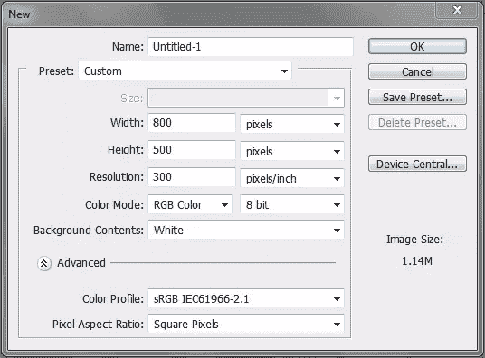](https://www.sitepoint.com/wp-content/uploads/2013/06/step18.png)

### 第二步:背景

由于我们的字体设计将是夏季灵感，我们希望有一个反映这一点的背景。在这种情况下，我们将创建一个新的层，并命名为“BKG”。然后我们将填充颜色#1694ff。

### 步骤 3:渐变

现在，不是创建一个新的层来添加我们的渐变，我们将简单地使用混合选项。首先，把你的背景色改成#ffffff，前景保持为#1694ff。选择好你的颜色后，右击正确的图层或者双击它，进入混合选项菜单。选择“渐变叠加”框，然后改变渐变，使其反映您预先选择的前景和背景颜色。

[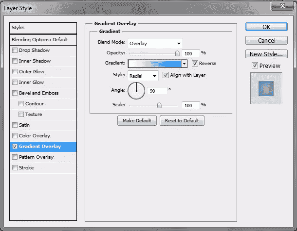](https://www.sitepoint.com/wp-content/uploads/2013/06/step31.png)

确保选中“反转”框，并将混合模式设置为“叠加”。

### 第四步:文字

我们将从设计的第一个字母开始。使用文本工具，在画布中心偏左的地方创建一个文本框。将文本颜色更改为#ffe92e，字体大小更改为 82pt，字体类型更改为 Arial。

### 第五步:3D 文本

与 2D 物体相比，更容易使 3D 物体看起来好像正在融化，所以我们将使字母“D”看起来是 3D 的。创建另一个“D”但改变颜色是#ffd500。将这一层移动到原来的“D”层下面，稍微向右移动，这样你只能看到它的一部分。为了清楚起见，请看下面。

[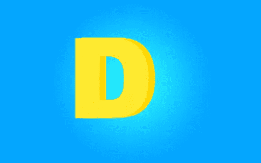](https://www.sitepoint.com/wp-content/uploads/2013/06/step51.png)

### 第六步:合并

因为我们将同时在这两个层上工作，如果它们只是一个对象而不是两个，将会更容易。栅格化两个图层，然后合并它们，使它们现在只是一个图层。

[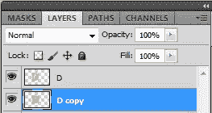 ](https://www.sitepoint.com/wp-content/uploads/2013/06/step61.png) [ 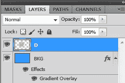](https://www.sitepoint.com/wp-content/uploads/2013/06/step6-11.png)

### 第七步:字母“F”

再次使用文本工具创建另一个字母“F”。你将把字母变成小写，而不是大写。使用与 D 完全相同的颜色；唯一的区别是字体大小将改为 48pt。重复同样的动作，使它看起来三维，然后合并层在一起。

[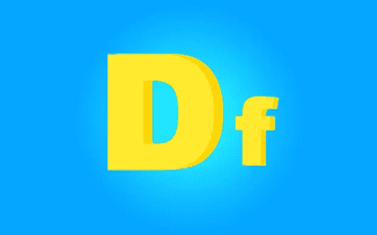](https://www.sitepoint.com/wp-content/uploads/2013/06/step71.png)

### 第八步:粘土质地

为了让文字看起来像是真的融化了，我们需要给字母添加纹理。我们将从字母“D”开始，然后继续。如果你还没有，去获取上面链接中提供的纹理图像，然后将其粘贴到画布上。你需要调整它的大小，使它只覆盖“D”。

[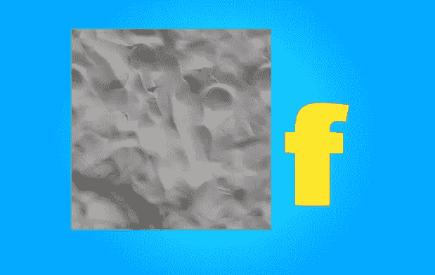](https://www.sitepoint.com/wp-content/uploads/2013/06/step81.png)

删除纹理中没有覆盖字母的多余部分，然后将图层模式改为“颜色加深”当这完成后，合并两层，使他们成为一个。

[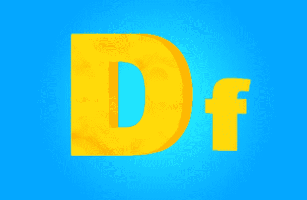](https://www.sitepoint.com/wp-content/uploads/2013/06/step8-1.png)

### 第九步:液化

现在我们的纹理被应用，我们可以开始融化我们的图像。为了做到这一点，你需要使用液化工具，进入“过滤器”>“液化”或按下 Shift+Ctrl+“X”。当对话菜单出现时，检查以确保设置与下图所示相同。此外，确保选择了向前扭曲工具。

[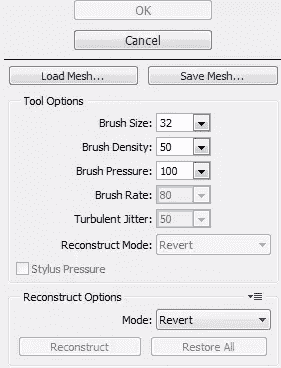](https://www.sitepoint.com/wp-content/uploads/2013/06/step91.png)

设置好之后，你可以开始拖动你的笔刷给字母一个熔化的外观。

[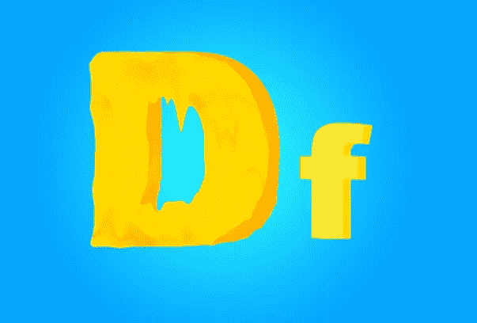](https://www.sitepoint.com/wp-content/uploads/2013/06/step9-1.png)

### 第十步:水坑

就像冰淇淋一样，融化的东西通常会留下水坑或某种形式的混乱。我们需要为我们的信创建一个水坑，以进一步发展其融化的外观。为了做到这一点，我们需要首先从复制我们的信开始。完成后，移动它，使其位于“D”下方，然后垂直翻转。

[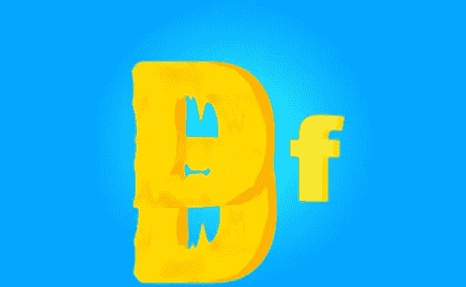](https://www.sitepoint.com/wp-content/uploads/2013/06/step101.png)

现在，使用扭曲工具重塑复制的字母，使它看起来像水坑。为了清楚起见，请看下面。

[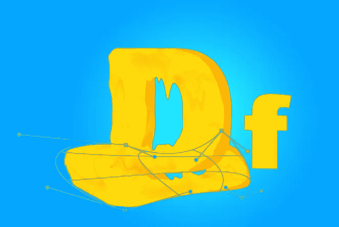](https://www.sitepoint.com/wp-content/uploads/2013/06/step10-1.png)

### 步骤 11:液化水坑

再次使用液化工具，使用不同大小的笔刷来扭曲水坑。

[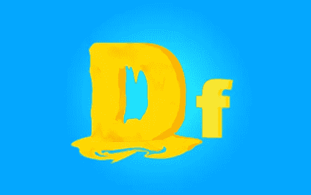](https://www.sitepoint.com/wp-content/uploads/2013/06/step111.png)

### 涂抹

你会注意到在字母“D”和我们的水坑之间有一条可见的线。我们需要去掉这个，因为我们想让它看起来好像这两层实际上是一层。拿起涂抹工具，用一个硬圆刷(强度 42%，混合模式为“正常”)，简单地来回涂抹线条，直到它被融入。

[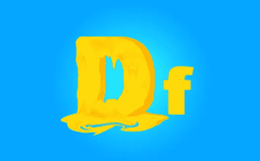](https://www.sitepoint.com/wp-content/uploads/2013/06/step121.png)

### 第十三步:塑料包裹的信

为了进一步使我们的信看起来“融化”,我们将应用一个过滤器，但首先我们需要复制它。确保你在正确的图层上，进入“滤镜”>“艺术”>“塑料包装”更改设置，使它们与下图中的数字相同。

[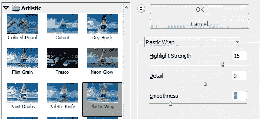](https://www.sitepoint.com/wp-content/uploads/2013/06/step131.png)

现在过滤器就位，改变图层模式为“变亮”

[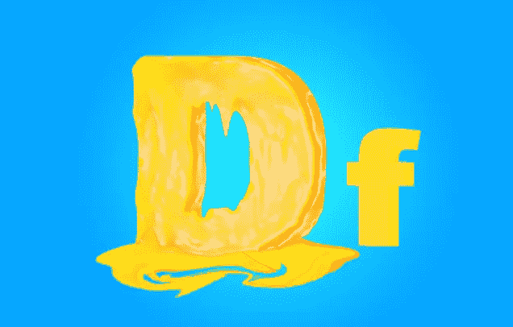](https://www.sitepoint.com/wp-content/uploads/2013/06/step13-11.png)

### 步骤 14:塑料包装水坑

复制你的水坑层，并应用相同的过滤器，你在第 13 步中使用。不要忘记改变层模式。

[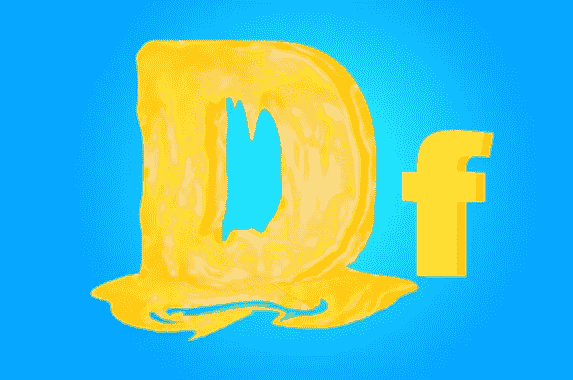](https://www.sitepoint.com/wp-content/uploads/2013/06/step141.png)

### 第十五步:泥浆

复制应用塑料包裹过滤器的混合层，并将其拉下原来的混合层。使用变换工具，并调整其大小，以便您可以看到它的边缘。将图层模式改为“浅色”

[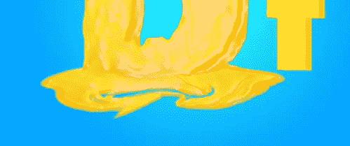](https://www.sitepoint.com/wp-content/uploads/2013/06/step151.png)

打开“混合选项”菜单，选中斜面和浮雕框。输入如下所示的设置，然后按“确定”。

[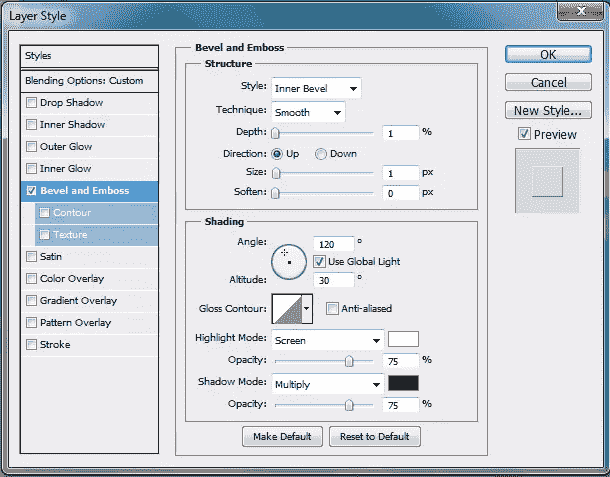](https://www.sitepoint.com/wp-content/uploads/2013/06/step15-1.png)

### 第十六步:字母“F”

现在我们已经完成了字母“D ”,我们可以对字母“F”做同样的事情。当你扭曲完字母后，你需要使用涂抹工具将字母“F”和字母“D”混合。这是完成的图像。

[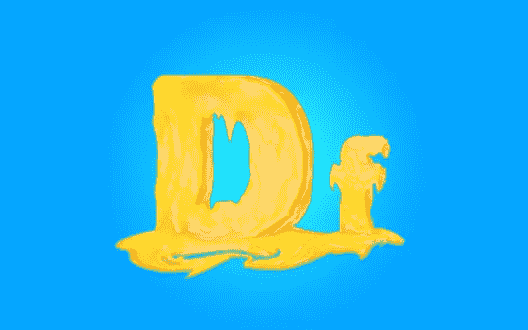](https://www.sitepoint.com/wp-content/uploads/2013/06/step161.png)

[下载 PSD 文件](https://www.dropbox.com/s/n9bmtn17nko210v/melty%20type.zip)

### 结论

需要注意的是，你不需要把你的排版留在这种状态。为了创造一个更有创意和夏天灵感的作品，考虑加入背景，也许是沙子和沙滩主题的物品。不言而喻，夏天并不是融化印刷术的唯一场景。尝试通过使用不同的字体和颜色组合来发挥创意。

我希望这篇教程对你有所帮助和启发。快乐设计！

## 分享这篇文章