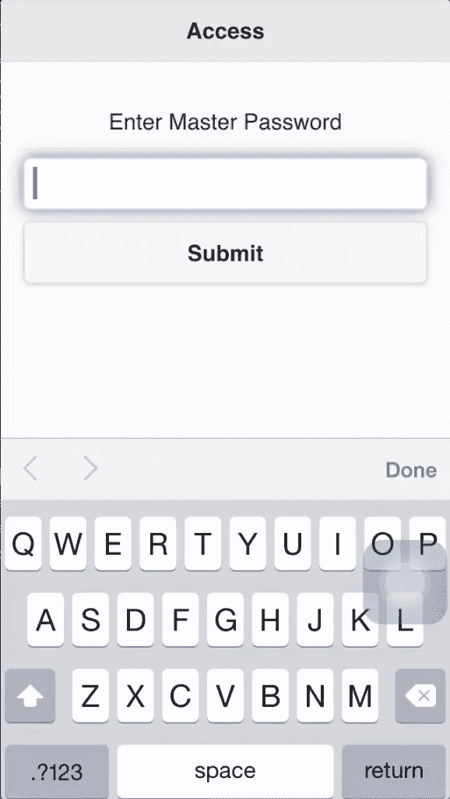
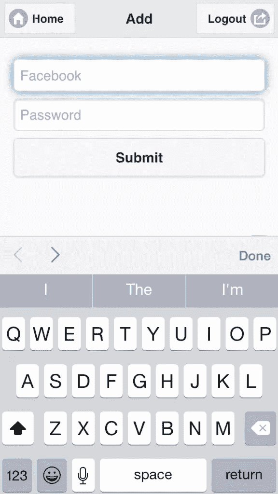

# 如何用 Cordova 创建一个密码管理器应用程序

> 原文：<https://www.sitepoint.com/create-password-manager-app-cordova/>

密码管理器是一个用来存储和组织密码的应用程序。使用主密码作为加密密钥对密码进行加密和存储。使用相同的主密码解密密码。

在本教程中，我将展示如何使用 Cordova 创建一个密码管理器应用程序。我们将使用 [jQuery Mobile](http://www.w3schools.com/jquerymobile/) 作为 UI，使用 [CryptoJS](https://code.google.com/p/crypto-js/#AES) 加密密码。

为了给你一个我们正在努力的想法，这里有一个视频预览，最终代码可以在 [GitHub 这里](https://github.com/sitepoint-editors/Cordova-Password-Manager)找到。

<video class="wp-video-shortcode" id="video-102143-1" width="640" height="1136" preload="metadata" controls=""><source type="video/mp4" src="https://uploads.sitepoint.com/wp-content/uploads/2015/03/1427274572SitePoint_Password_Manager.mp4.mp4?_=1">[https://uploads.sitepoint.com/wp-content/uploads/2015/03/1427274572SitePoint_Password_Manager.mp4.mp4](https://uploads.sitepoint.com/wp-content/uploads/2015/03/1427274572SitePoint_Password_Manager.mp4.mp4)</video>

## 开始

在起始模板中，我们需要包括 *jQuery* 、 *jQuery mobile* 和 *CryptoJS* 。我不会在这里介绍安装和创建 Cordova 应用程序，如果你以前没有这样做过的话，[阅读入门指南](http://cordova.apache.org/docs/en/4.0.0//guide_cli_index.md.html#The%20Command-Line%20Interface)。给应用程序一个合适的名称，并添加您想要支持的平台。您将在同一页面上找到如何构建和运行应用程序的说明。我们在本教程中使用 Cordova 的通知插件，你将需要添加那个，[在这里找到说明](http://docs.phonegap.com/en/edge/cordova_notification_notification.md.html)。

在`index.html`文件中，添加以下 JavaScript 和 CSS:

```
<style> @-ms-viewport { width: 100vw ; zoom: 100% ; }
        @viewport { width: 100vw ; zoom: 100% ; }
        @-ms-viewport { user-zoom: fixed ; }
        @viewport { user-zoom: fixed ; } </style>

    <link rel="stylesheet" href="https://code.jquery.com/mobile/1.4.5/jquery.mobile-1.4.5.min.css">

    <script src="https://code.jquery.com/jquery-1.11.2.min.js"></script>
    <script src="https://code.jquery.com/mobile/1.4.5/jquery.mobile-1.4.5.min.js"></script>

    <script src="http://crypto-js.googlecode.com/svn/tags/3.1.2/build/rollups/aes.js"></script>
```

## 创建访问屏幕

访问页面将是用户打开应用程序时显示的第一个页面。在访问页面上，我们需要显示一个表单，供用户输入主密码。

这是访问屏幕的代码，将其添加到 body 标签内的`index.html`。

```
<div data-role="page" id="pageone">
    <div data-role="header">
        <h1>Access</h1>
    </div>

    <div data-role="main" class="ui-content">
        <p style="text-align: center">Enter Master Password</p>
        <input type="password" id="master_password" />
        <a target="_blank" href="javascript:store_master_password()" style="text-decoration: none"><button>Submit</button></a>
    </div>
</div>
```

我们一个用户点击提交按钮，主密码存储在一个变量中，这样我们以后可以用它作为加密和解密的密钥。

这里是存储主密码的`store_master_password`函数的代码，将其添加到`js/index.js`中。

```
var master_password = "";

$(document).on("pageshow","#pageone",function(){
    master_password = "";
});

function store_master_password()
{
    master_password = document.getElementById("master_password").value;

    if(master_password == "")
    {
        navigator.notification.alert("Please enter master password");
        return;
    }

    $.mobile.changePage($("#pagetwo"), "slide", true, true);
}
```

一旦存储了主密码，我们就将用户移至主页(代码如下)。

每次加载该页面时，我们都会清除存储的主密码，以便我们可以在以后构建注销功能。

访问屏幕应该是这样的:



## 创建主屏幕

成功存储主密码后，用户将被带到主页。

在我们的主屏幕上，我们将显示两个按钮，一个添加新密码按钮和显示密码按钮。

这是主页的代码，添加到`index.html`:

```
<div data-role="page" id="pagetwo">
    <div data-role="header">
        <h1>Home</h1>
        <a target="_blank" href="#pageone" class="ui-btn ui-btn-right ui-icon-action ui-btn-icon-right">Logout</a>
    </div>

    <div data-role="main" class="ui-content">
        <a target="_blank" href="#pagethree" style="text-decoration: none"><button>Add New Password</button></a>
        <a target="_blank" href="javascript:display_list();" style="text-decoration: none"><button>Show Password List</button></a>
    </div>
</div>
```

根据按下的按钮，用户被带到相应的页面。我们在右上角有一个注销按钮，用户可以通过它进入访问页面。

当用户按下“显示密码列表”时，我们需要从本地存储中检索加密的密码，解密它们，然后构造 HTML 列表来显示它们。

以下是`display_list`函数的实现，将其添加到`js/index.js`:

```
function populate_list()
{
    var list = "";
    for(var key in localStorage)
    {
        list = list + "<li><a target="_blank" href='javascript:name_password(\"" + key + "\")'>" + key + "</a></li>";
    }
    document.getElementById("ul_list").innerHTML = list;
}

function display_list()
{
    populate_list();
    $.mobile.changePage($("#pagefour"), "slide", true, true);
}
```

主页应该是这样的:


## 创建添加密码页面

当用户单击主页上的“添加密码”按钮时，会被带到“添加密码”页面。

在我们的添加密码页面上，我们需要显示两个文本字段来输入密码和名称，以及一个提交值的按钮。

以下是添加密码页面的代码，将其添加到`index.html`:

```
<div data-role="page" id="pagethree">
    <div data-role="header">
        <a target="_blank" href="#pagetwo" class="ui-btn ui-icon-home ui-btn-icon-left">Home</a>
        <h1>Add</h1>
        <a target="_blank" href="#pageone" class="ui-btn ui-btn-right ui-icon-action ui-btn-icon-right">Logout</a>
    </div>

    <div data-role="main" class="ui-content">
        <input type="text" placeholder="Facebook" id="new_name" />
        <input type="text" placeholder="Password" id="new_password" />
        <input type="submit" placeholder="Add to List" onclick="new_entry();" value="Submit" />
    </div>
</div>
```

当用户点击提交按钮时，我们运行`new_entry` JavaScript 函数。该函数负责加密和存储密码。

这里是`new_entry`函数，把这个加到`js/index.js`:

```
function new_entry()
{
    var name = document.getElementById("new_name").value;
    var password = document.getElementById("new_password").value;

    if(name == "" || password == "")
    {
        navigator.notification.alert("Name and Password are Required");
        return;
    }

    var options = { mode: CryptoJS.mode.CBC, padding: CryptoJS.pad.Pkcs7 };  
    var encrypted_password = CryptoJS.AES.encrypt(password, master_password, options);

    localStorage.setItem(name, encrypted_password);

    populate_list();

    $.mobile.changePage($("#pagefour"), "slide", true, true);
}
```

我们使用 AES 对称加密来加密密码。它需要主密码作为密钥。我们将加密的密码存储在 HTML5 本地存储中。

以下是“添加密码”页面的外观:



## 创建密码列表页面

当用户单击主页上的“显示密码列表”按钮时，他们将被带到密码列表页面。

在此页面上，我们将显示已存储密码的列表。当用户点击一个项目时，我们显示与之相关的密码。

以下是密码列表页面的代码，将其添加到`index.html`:

```
<div data-role="page" id="pagefour">
    <div data-role="header">
        <a target="_blank" href="#pagetwo" class="ui-btn ui-icon-home ui-btn-icon-left">Home</a>
        <h1>List</h1>
        <a target="_blank" href="#pageone" class="ui-btn ui-btn-right ui-icon-action ui-btn-icon-right">Logout</a>
    </div>

    <div data-role="main" class="ui-content">
        <form class="ui-filterable">
            <input id="myFilter" data-type="search">
        </form>
        <ul id="ul_list" data-role="listview" data-filter="true" data-input="#myFilter" data-inset="true">
        </ul>
    </div>
</div>
```

当用户点击一个列表项时，我们执行`name_password`函数，解密与该名称相关的密码，并在一个警告框中显示出来。

下面是`name_password`函数的实现，添加到`js/index.js`中:

```
function name_password(name)
{
    var options = { mode: CryptoJS.mode.CBC, padding: CryptoJS.pad.Pkcs7 };  
    var decrypted_password = CryptoJS.AES.decrypt(localStorage.getItem(name), master_password, options);

    navigator.notification.alert("Password is: " + decrypted_password.toString(CryptoJS.enc.Utf8));
}
```

我们还希望在页面加载时刷新页面上的列表 UI。这是代码，添加到`js/index.js`。

```
$(document).on("pageshow","#pagefour",function(){ // When entering pagetwo
  $("#ul_list").listview("refresh");
});
```

## 最后的想法

目前，我们有一个功能，但基本的应用程序，可以很容易地部署到多个平台。接下来要尝试的是在服务器端存储密码，将密码同步到云端，以及复制密码。让我知道你尝试这个教程的经验和扩展它的想法。

## 分享这篇文章