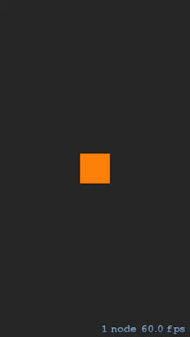
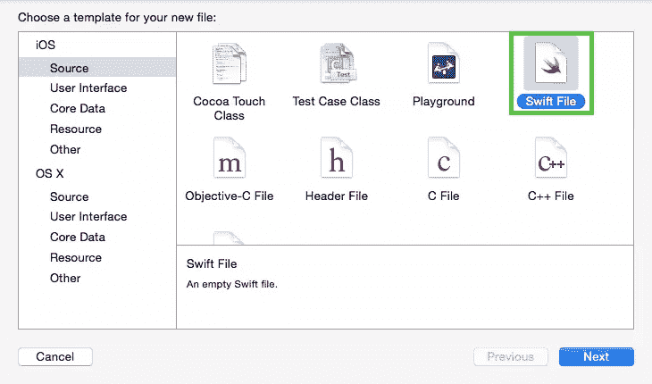
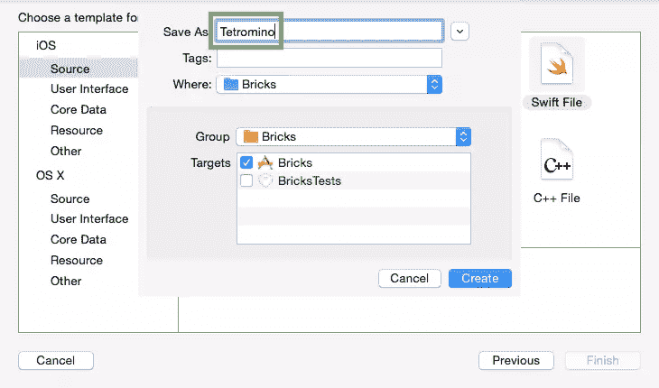
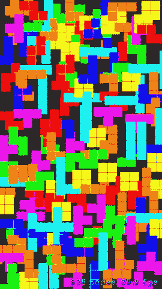

# 使用 Swift-Drawing 对象创建一个俄罗斯方块益智游戏

> 原文：<https://www.sitepoint.com/create-tetromino-puzzle-game-using-swift-drawing-objects/>

## [](#the-gamescene)游戏场景

现在是时候在屏幕上画点什么了。在**games scene . swift**中已经默认为我们声明了一个扩展`SKScene`的`GameScene`类。用以下代码更新其定义:

```
class GameScene: SKScene {
    override func didMoveToView(view: SKView) {
        /* Setup your scene here */
        let block = SKSpriteNode(color: SKColor.orangeColor(), size: CGSize(width: 50, height: 50))
        block.position = CGPoint(x:CGRectGetMidX(self.frame), y:CGRectGetMidY(self.frame))

        self.addChild(block)
    }

    override func touchesBegan(touches: NSSet, withEvent event: UIEvent) {
        /* Called when a touch begins */

        for touch: AnyObject in touches {
        }
    }

    override func update(currentTime: CFTimeInterval) {
        /* Called before each frame is rendered */
    }
}
```

让我们把讨论的焦点放在这个类中目前为止唯一的非空方法上，我们从`SKScene`重写的`didMoveToView`方法。正如评论中所描述的，这是我们应该设置场景的地方。

此时我们需要做的就是在屏幕中间显示一个正方形。我们通过使用一个用颜色和大小值初始化的`SKSpriteNode`对象来实现这一点。我们正式称这个方形物体为*精灵*。精灵是游戏中最基本的视觉元素。

```
let block = SKSpriteNode(color: SKColor.orangeColor(), size: CGSize(width: 50, height: 50))
```

我们通过重用 Xcode 为我们生成的默认飞船示例中的代码，将块的位置设置为屏幕的中心。

```
block.position = CGPoint(x:CGRectGetMidX(self.frame), y:CGRectGetMidY(self.frame))
```

为了在屏幕上显示该块，我们需要将它添加为场景的子元素。我们的 block sprite 成为场景的节点对象树的一部分，并与其他节点一起渲染，尽管此时正方形是场景中唯一的节点对象。

```
self.addChild(block)
```

运行( **⌘ + R** )我们的游戏，看看屏幕中央孤独的橙色方块。



在下一节中，我们将描述并画出七个四角图形状。

## [](#drawing-tetrominoes)绘制四张骨牌

根据维基百科，一个 [tetromino](http://en.wikipedia.org/wiki/Tetromino) 是由四个正方形正交连接而成的几何形状。有几种不同类型的四骨牌，其中，我们将使用单面四骨牌，它有七种不同的形状:


每个 tetromino 可以用一个抽象地类似其形状的字母来表示。我们用字母 I、O、T、J、L、S 和 Z 来代表每一张四骨牌。我们还使用颜色来进一步区分形状，当然也增加了一些视觉效果。

### [](#the-tetromino-class)河豚类

让我们创建一个新的类来表示我们的 tetrominoes。

1.  按 **⌘ + N** 打开文件模板选择窗口，从 iOS 源组中选择 Swift 文件。单击“下一步”保存文件。

    

2.  将文件命名为 Tetromino，然后单击“创建”。

    

3.  将以下枚举添加到 **Tetromino.swift** 文件中的`import`语句之后:

    ```
    enum Direction {
        case Left, Right, Down, None
    }

    enum Rotation {
        case Counterclockwise, Clockwise
    }

    enum Shape {
        case I, O, T, J, L, S, Z

        static func randomShape() -> Shape {
            let shapes: [Shape] = [.I, .O, .T, .J, .L, .S, .Z]
            let count = UInt32(shapes.count)
            let randShape = Int(arc4random_uniform(count))
            return shapes[randShape]
        }
    }
    ```

    这三个枚举描述了我们的四联骨牌的内在价值。`Direction`顾名思义，列举了我们游戏中一个俄罗斯方块可以移动到的可能方向。要么向左，向右，要么向下。由于显而易见的原因，它还包括保持静止的值，但没有向上的值。

    `Rotation`枚举定义了逆时针或顺时针方向的值。

    enum 定义了我们将在游戏中使用的七种不同的单面俄罗斯骨牌。Swift 中枚举的一个优点是能够定义自己的方法，包括*类型*(用`static`关键字定义)和*实例*方法。

    看上面的游戏动画，我们可以很容易地推断出，俄罗斯方块是随机生成的。所以为了方便起见，让我们将这种一致的行为实现为一个名为`randomShape`的*类型的*方法。我们使用内置的`arc4random_uniform`方法，通过传递形状的总数来生成一个随机数。然后我们使用这个数字从`shapes`数组中访问一个元素。

4.  添加代表形状的位图数据。数据相当复杂，但不要被吓倒。它只是一个字典类型，使用一个`Shape`作为三维数组值的键。这些数组代表所有形状的旋转配置。

    ```
    let bitmaps: [Shape: [[[Int]]]] = [
        .I: [[[0, 1], [0, 1], [0, 1], [0, 1]], [[0, 0, 0, 0], [1, 1, 1, 1]]],
        .O: [[[2, 2], [2, 2]]],
        .T: [[[3, 3, 3], [0, 3, 0], [0, 0, 0]], [[3, 0], [3, 3], [3, 0]], [[0, 0, 0], [0, 3, 0], [3, 3, 3]], [[0, 0, 3], [0, 3, 3], [0, 0, 3]]],
        .J: [[[0, 4, 4], [0, 4, 0], [0, 4, 0]], [[4, 0, 0], [4, 4, 4], [0, 0, 0]], [[0, 4, 0], [0, 4, 0], [4, 4, 0]], [[0, 0, 0], [4, 4, 4], [0, 0, 4]]],
        .L: [[[0, 5, 0], [0, 5, 0], [0, 5, 5]], [[0, 0, 5], [5, 5, 5], [0, 0, 0]], [[5, 5, 0], [0, 5, 0], [0, 5, 0]], [[0, 0, 0], [5, 5, 5], [5, 0, 0]]],
        .S: [[[0, 6, 0], [0, 6, 6], [0, 0, 6]], [[0, 0, 0], [0, 6, 6], [6, 6, 0]], [[0, 6, 0], [0, 6, 6], [0, 0, 6]], [[0, 0, 0], [0, 6, 6], [6, 6, 0]]],
        .Z: [[[0, 7, 0], [7, 7, 0], [7, 0, 0]], [[0, 0, 0], [7, 7, 0], [0, 7, 7]], [[0, 7, 0], [7, 7, 0], [7, 0, 0]], [[0, 0, 0], [7, 7, 0], [0, 7, 7]]]
    ]
    ```

    我们当然可以在这里实现矩阵旋转算法来动态旋转形状位图，但是对于我们的简单需求来说，这在计算上太昂贵了。反正没有很多配置，所以“硬编码”它们更好。此外，我们可以使用 SpriteKit 的 SKAction 以指定的角度旋转精灵，但这不是我们游戏的数据结构方式。

    我们水平排列这些值，以避免给这一部分增加不必要的长度，但是您可以在自己的代码中随意设置它的格式，以突出这些形状。零表示空格，而非零整数表示颜色数组中的索引值(稍后添加)。这里是一个可读性更好的 T 形图。您可以清楚地看到不同的配置:

    ```
    .T: [[
            [3, 3, 3],
            [0, 3, 0],
            [0, 0, 0]],
        [
            [3, 0],
            [3, 3],
            [3, 0]],
        [
            [0, 0, 0],
            [0, 3, 0],
            [3, 3, 3]],
        [
            [0, 0, 3],
            [0, 3, 3],
            [0, 0, 3]
        ]],
    [/code]

    ####  [](#arrays-and-dictionaries) 数组和字典

    我们的`bitmap`数据是 Swift 集合类型的一个很好的例子。它是一个包含数组集合的字典。数组和字典分别存储有序和无序的值集合。使用*下标符号*访问(和设置)数组和字典元素。它使用方括号(`[]`)，其中可能包含一个从零开始的数组索引值，或者一个键，在我们的例子中是一个`Shape`键，用于字典。

    例如，要从 bitmaps 字典中访问一个元素，可以将其编写为:

    ```
    bitmaps[.T]
    ```

    ####  [](#optionals) 可选项目

    字典返回一个可选值。可选意味着用于访问字典元素的键可能不存在，需要字典返回代表缺少值的*。选项用于确定值是否存在，并帮助处理这种情况。* 
    ```

5.  让我们定义一下 Tetromino 类。

    ```
    class Tetromino {
        let shape = Shape.randomShape()

        var bitmap: [[Int]] {
            let bitmapSet = bitmaps[shape]!
            return bitmapSet[rotationalState]
        }

        var position = (x: 0, y: 0)

        private var rotationalState: Int

        init() {
            let bitmapSet = bitmaps[shape]!
            let count = UInt32(bitmapSet.count)
            rotationalState = Int(arc4random_uniform(count))
        }

        func moveTo(direction: Direction) {
            switch direction {
            case .Left:
                --position.x
            case .Right:
                ++position.x
            case .Down:
                ++position.y
            case .None:
                break
            }
        }

        func rotate(rotation: Rotation = .Counterclockwise) {
            switch rotation {
            case .Counterclockwise:
                let bitmapSet = bitmaps[shape]!
                if rotationalState + 1 == bitmapSet.count {
                    rotationalState = 0
                } else {
                    ++rotationalState
                }
            case .Clockwise:
                let bitmapSet = bitmaps[shape]!
                if rotationalState == 0 {
                    rotationalState = bitmapSet.count - 1
                } else {
                    --rotationalState
                }
            }
        }
    }
    ```

    #### [](#property-initialization)属性初始化

    Swift 中的类实例属性必须要么用默认值定义，如不可变的`shape`属性，要么在初始化期间给定一个值，如`rotationalState`的情况。这意味着我们需要实现一个*初始化器*来使用`init`关键字设置`rotationalState`的值。

    同样，我们在语句`let bitmapSet = bitmaps[shape]!`中遇到了**个选项**。访问字典中的一个元素会返回一个可选类型，所以我们需要一种方法来访问其中包含的值，如果有的话。我们用一个感叹号来*解开*可选的，并暴露出潜在的价值。

    最后，我们使用`arc4random_uniform`为四分位数分配一个随机的初始旋转状态。

    #### [](#computed-properties)计算属性

    我们的类的`bitmap`属性被定义为只读的计算属性。这种类型的属性不存储值。相反，它的作用就像一个函数，每次被访问时都会给出正确的值。计算属性还可以选择接收用于设置类中其他属性的值。

    #### [](#tuples)元组

    元组是由零个或多个不同类型的值组成的复合值。swift 中的元组被写成逗号分隔值，可选名称包含在一组括号内。这里我们使用`position`属性，一个类型为`(Int, Int)`的元组，来跟踪这个 tetromino 在游戏板上的 x 和 y 位置。

    #### [](#conditional-statements)条件语句

    我们的类定义了两个方法来控制 tetromino 的移动和旋转。一个是`moveTo`方法，它接受一个类型为`Direction`的参数，这是我们之前定义的枚举。该方法使用一个`switch`语句来检查所有可能的方向值，以便能够相应地调整 tetromino 的位置。

    与大多数其他语言中的`switch`语句不同，Swift 不允许*在没有遇到断点的情况下穿过*。这增加了一层保护，防止由于缺少中断而无意中触发错误的处理程序。还要求处理*所有*案件。这意味着如果你没有像我们枚举中那样的有限的事例集，你将不得不为所有其他值包含一个`default`事例。

    `rotate`方法接受一个类型为`Rotation`的参数，但是设置一个默认值——`.Counterclockwise`。它还利用`switch`语句来检查两个旋转方向。传统上，玩家可以双向旋转砖块。但是在我们的游戏中，为了简单起见，我们只允许玩家在其中一个位置轮换。我们处理这两个问题的目的是为了能够在发生碰撞时将 tetromino 重置为其先前的状态。我们将在后面更详细地讨论碰撞检测。

    除了`switch`语句，`rotate`还利用`if`语句来检查数组越界情况。if 语句接受一个条件，如果条件为真，则执行大括号中包含的一组语句。与其他语言不同，Swift 的`if`语句中的条件不需要用括号括起来。然而，这对大括号是必需的，即使它是空的或者只有一个要执行的语句。

### [](#the-gamescene-class)游戏场景类

现在让我们用下面的代码更新我们的`GameScene`类来显示随机的四张骨牌:

```
import SpriteKit

let colors: [SKColor] = [
    SKColor.lightGrayColor(),
    SKColor.cyanColor(),
    SKColor.yellowColor(),
    SKColor.magentaColor(),
    SKColor.blueColor(),
    SKColor.orangeColor(),
    SKColor.greenColor(),
    SKColor.redColor(),
    SKColor.darkGrayColor()
]

let blockSize: CGFloat = 18.0

class GameScene: SKScene {

    override func didMoveToView(view: SKView) {
        /* Setup your scene here */
        self.anchorPoint = CGPoint(x: 0, y: 1.0)
    }

    override func touchesBegan(touches: NSSet, withEvent event: UIEvent) {
        /* Called when a touch begins */
        for touch: AnyObject in touches {
            drawTetrominoAtPoint(touch.locationInNode(self))
        }
    }

    override func update(currentTime: CFTimeInterval) {
        /* Called before each frame is rendered */
    }

    func drawTetrominoAtPoint(location: CGPoint) {
        let t = Tetromino()
        for row in 0..<t.bitmap.count {
            for col in 0..<t.bitmap[row].count {
                if t.bitmap[row][col] > 0 {
                    let block = t.bitmap[row][col]
                    let square = SKSpriteNode(color: colors[block], size: CGSize(width: blockSize, height: blockSize))
                    square.anchorPoint = CGPoint(x: 1.0, y: 0)
                    square.position = CGPoint(x: col * Int(blockSize) + col, y: -row * Int(blockSize) + -row)
                    square.position.x += location.x
                    square.position.y += location.y
                    self.addChild(square)
                }
            }
        }
    }
}
```

在我们的`import`语句之后，我们创建了一个不可变的颜色对象数组，它将被用来赋予我们原本枯燥的形状以生命。方便的是，我们有可以重用的`SKColor`(只是`UIColor`的包装)预设值。就好像它们是为这种游戏而创造的，因为它们与官方游戏的标准颜色非常接近。

我们设置每个块的大小，然后继续更新`GameScene`类。我们用一行代码替换前面的`didMoveToView`方法的内容，将锚点从场景的默认左下角一直移动到左上角。这实际上将原点(0，0)移动到那个特定的角。

在`touchesBegan`中，我们必须遍历所有可能的触摸点，因为我们正在多点触摸设备上运行。但由于我们禁用了这个游戏的多点触摸功能，只有第一次触摸才会被记录。然后我们调用`drawTetrominoAtPoint`方法，传递触摸的位置。

#### [](#anchor-points-and-the-origin)锚点和原点

在`drawTetrominoAtPoint`方法中，我们首先创建一个具有随机形状和旋转状态的四分图。SpriteKit 的坐标系使用传统的笛卡尔坐标系，其原点(0，0)固定在一个称为`anchorPoint`的特定位置。这与其他屏幕坐标系不同，在其他屏幕坐标系中，y 值从上到下递增，默认情况下原点位于左上角。

这与我们游戏中数组的定义背道而驰。位图数组索引从 0 开始，实际上代表第一行，然后随着每次向下移动一行而递增 1。因此，为了能够方便地解决这种情况，我们如前所述将视图的锚点从默认位置移开。这意味着我们从原点 y 值零开始，沿着负 y 轴向下移动。我们将不得不通过使用一元`-`(减)运算符否定我们的行索引值来进行补偿，以便能够沿着 y 轴正确定位块:

```
square.position = CGPoint(x: col * Int(blockSize) + col, y: -row * Int(blockSize) + -row)
```

#### [](#for-loops)为循环圈

为了方便起见，我们游戏中的俄罗斯方块的形状用位图表示。位图具有代表 2d 图像像素的行和列(x 和 y)值。我们通过遍历位图的所有行和列来提取每个像素数据。像许多其他语言一样，Swift 也有自己的`for in`语句。在我们的`drawTetrominoAtPoint`方法中，我们有一个`for in`循环的嵌套实现来访问位图的每个元素。

我们需要访问每个位图索引，所以我们将其定义为一个整数范围，从 0 到但不包括行或列的总数。我们使用*半开范围运算符* `.. to express this. If we want to include the total count we’ll have to use the *closed range operator*` `...`来定义范围。范围的当前值存储在您放在`for`关键字后的任何变量中。

形状位图的元素可以具有零值或非零值。我们使用条件语句`if`将零值像素排除在显示之外。我们使用与上一节中绘制块相同的过程来创建每个块精灵。颜色索引被设计为映射到块的值，为整个 tetromino 集产生一致的颜色方案。

每个块的位置是根据其边的长度及其在数组中的索引来计算的。为了实现“块之间的空间”效果，我们使用行或列的当前值添加一个单点宽度的间隙。我们还希望在我们触摸的区域附近绘制 tetromino，因此我们通过添加从参数接收的位置值来调整位置。将方块精灵的锚点设置在右下角也有助于将方块居中。

运行( **⌘ + R** )我们的游戏，触摸模拟器屏幕上的任何地方，随机绘制俄罗斯方块图并创建您自己的作品，如下所示:



在下一集，我们将进入有趣的部分，游戏机制！

## 分享这篇文章