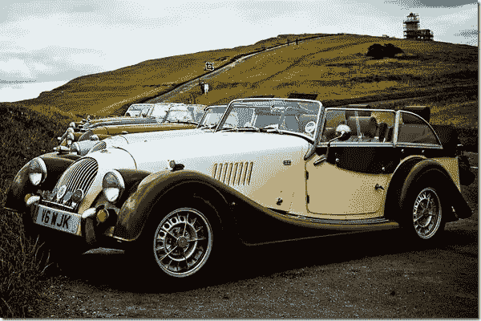
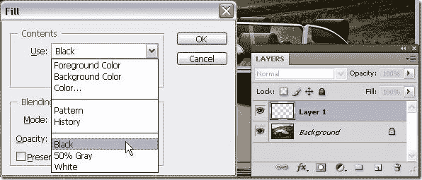
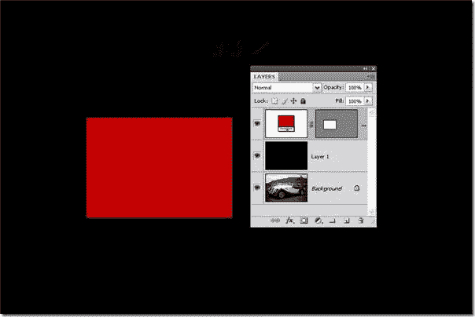
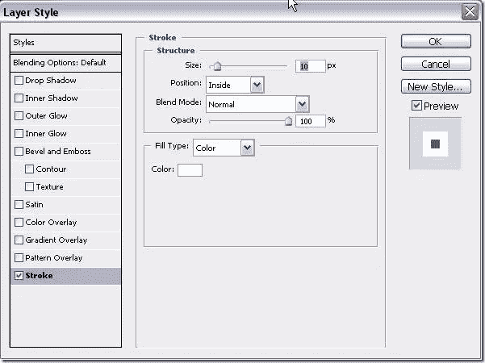
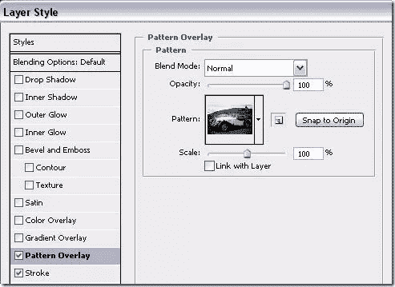
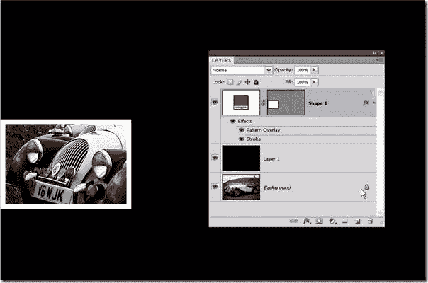
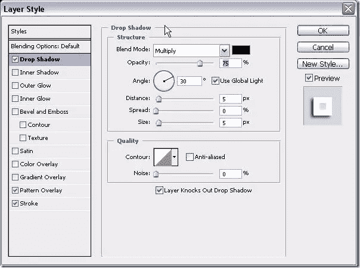
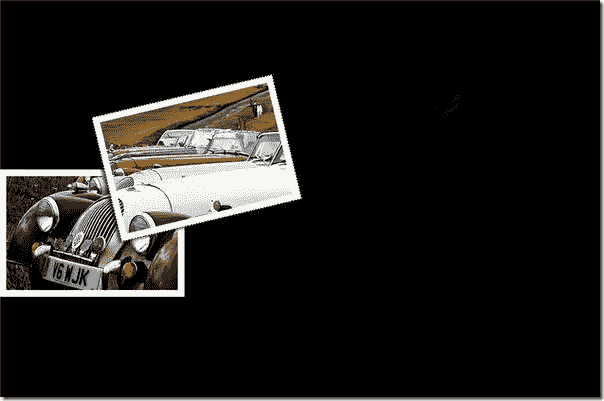
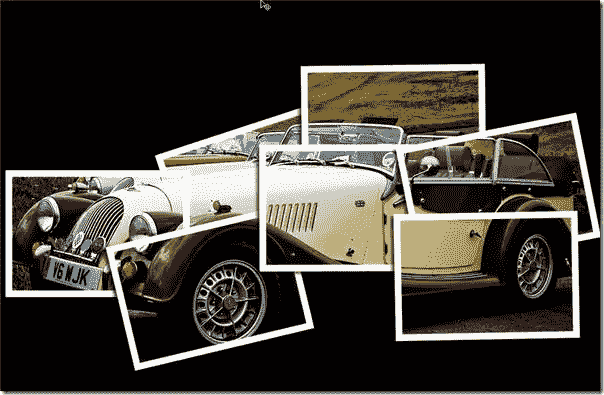

# 在 Photoshop 中创建多张照片拼贴的效果

> 原文：<https://www.sitepoint.com/create-the-effect-of-a-multiple-photo-collage-in-photoshop/>

使用形状层和一个巨大的图案，我们将制作一个看起来像是由几张照片合成的图像。这很快也很容易做到，所以让我们开始吧。

1.打开要创建效果的图像。

2.通过选择**编辑>定义图案并给图案命名，使整个图像成为图案。**

****

3.创建一个新层，然后按 Shift + Backspace (PC)或 Shift + Delete (Mac)。这将打开填充对话框。从“使用”菜单中选择“黑色”，然后单击“确定”用黑色填充新图层。

4.在工具栏上，选择矩形工具。然后在屏幕顶部的选项栏上，确保选择了形状图层图标。

5.在黑色图层上绘制一个矩形。这个矩形是什么颜色并不重要，因为我们将在它上面放置一个图案。

6.点击图层面板底部的 FX 按钮，选择描边，为矩形图层添加图层样式。我设置大小为 10 像素，位置为内侧，填充类型颜色为白色。先不要单击确定。

7.点击图层效果对话框左侧的文字图案叠加。选择您在步骤 2 中制作的图案。按“捕捉到原点”按钮，取消选中“与图层链接”

单击“确定”,图像应该如下所示:

8.如果你在图像周围移动矩形，你会看到图案是如何保持在原位的，这是因为我们在上一步中按了“对齐原点”。现在你可以复制第一个矩形，并将它们散布在整个图像中。要复制矩形，确保矩形层被选中并点击 **Ctrl + J (PC)或 Cmd + J (Mac)。**

9。将新矩形拖到图像的不同部分。通过选择 Ctrl + T 或 Cmd + T 来旋转矩形，以自由变换对象。旋转后，点击图层面板上的 FX 按钮，选择投影，添加一个投影效果。

图像应该看起来有点像这样:

10.继续复制和旋转矩形。添加任意数量的矩形。你不需要再添加阴影效果了。它将与图层一起复制。

为了完成图像，你可以改变矩形的堆叠顺序，这将改变一张“照片”放置在另一张上面的方式。

现在你知道了。

## 分享这篇文章