# 在 Photoshop 中创建您自己的自定义画笔

> 原文：<https://www.sitepoint.com/create-your-own-custom-brushes-in-photoshop/>

画笔是 Photoshop 的基本功能之一。使用画笔，您可以混合遮罩、创建效果、添加纹理和创建照明。网上有成千上万的笔刷可供你下载，但有时要花几个小时才能找到合适的笔刷来得到你想要的特定外观。如果你只是创建自己的笔刷，它可以节省你很多时间。你可以使用任何东西来创建自定义画笔。你只需要知道如何将你的图像或物体转换成正确的格式，然后将它们定义为画笔。

请记住，如果你要创建自定义画笔，使用大或高分辨率的图像是一个好主意。就像照片一样，从大笔刷到小笔刷是没问题的，但如果从低分辨率图像创建笔刷，在大型应用程序中使用时会很糟糕。

### 第一步:找到图像

对于这个例子，我找到了一个可以使用的云图。用于自定义笔刷的最佳图像是那些不会从边缘溢出的图像。这样，如果你最终在你的设计中使用云刷，它会看起来很自然，没有任何锋利的边缘。

### 第二步:消除颜色信息

前往“图像”>“调整”>“去饱和”,将图像转换为灰度图像。这将允许你保留图像中的高光和阴影，让你的笔刷看起来更自然。

[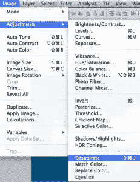](https://www.sitepoint.com/wp-content/uploads/2012/02/Screen-shot-2012-02-18-at-7.19.12-PM.png)

### 第三步:反转你的形象

当你定义一个笔刷时，任何纯白的东西都不会被包括在内，任何黑色或灰色的东西都会作为笔刷的一部分显示出来。按下 command/ctrl 键+ "I "来反转你的图像，这样黑色区域将是白色的，云的白色区域将是黑色的。

### 第四步:增加对比度

背景不是一个完美的纯白色，所以通过点击 command/ctrl+L 打开色阶对话框来打开色阶调整。

[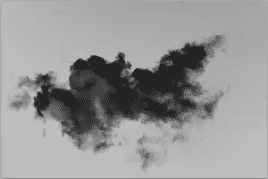](https://www.sitepoint.com/wp-content/uploads/2012/02/Screen-shot-2012-02-18-at-7.19.56-PM.png)

### 第五步:让你的背景纯白

选择右侧的白色滴管。这允许您设置图像中最白的点。

[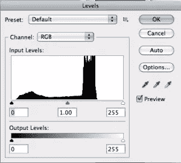](https://www.sitepoint.com/wp-content/uploads/2012/02/Screen-shot-2012-02-18-at-7.20.24-PM.png)

### 第六步:让你的形象脱颖而出

在你的反转图像的亮背景中点击最暗的区域(不是云！)，然后单击“确定”

[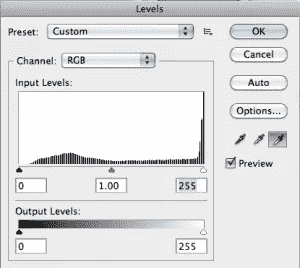](https://www.sitepoint.com/wp-content/uploads/2012/02/Screen-shot-2012-02-18-at-7.21.13-PM.png)

### 第七步:去掉流痕和任何你不想要的东西

在我们定义黑色区域为自定义笔刷之前，我们可能需要清理我们的图像。选择笔刷工具，选择一个简单的软边笔刷，使用白色作为前景色。用你的笔刷，在所有你不想显示的地方涂上白色。这一步的要点是去除你不想要的杂散痕迹或不想要的斑点。

### 第八步:选择你的画笔内容

选择你的选框工具，并选择周围的乌云，你已经创建了。

[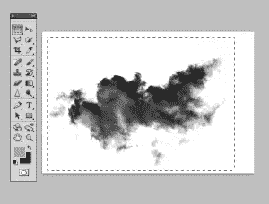](https://www.sitepoint.com/wp-content/uploads/2012/02/Screen-shot-2012-02-18-at-7.29.39-PM.png)

### 第九步:定义你的笔刷

转到编辑>定义笔刷预设。

[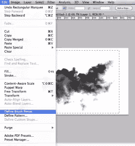](https://www.sitepoint.com/wp-content/uploads/2012/02/Screen-shot-2012-02-18-at-7.30.00-PM.png)

### 第十步:给你的笔刷命名为

将弹出一个对话框。命名您的自定义画笔。一个好的经验法则是给你的画笔起一个令人难忘的、描述性的名字。请注意左侧的预览框，它显示了笔刷的预览图像及其像素大小。

### 第 11 步:查看你的画笔缩略图

再次选择笔刷工具，进入屏幕顶部的笔刷选择工具栏。你应该在列表底部看到你的自定义笔刷。

[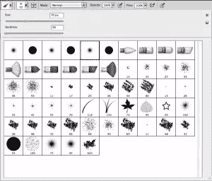](https://www.sitepoint.com/wp-content/uploads/2012/02/Screen-shot-2012-02-18-at-7.32.57-PM.png)

### 第十二步:选择你的前景色

创建新文档。我创建了一个 800 像素宽 600 像素高的文档。选择一个中等的蓝色作为你的前景色。我选了#3883ff。

[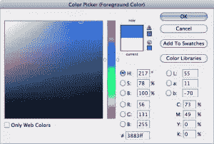](https://www.sitepoint.com/wp-content/uploads/2012/02/Screen-shot-2012-02-18-at-8.07.18-PM.png)

### 第十三步:选择你的背景颜色

选择稍微深一点的颜色作为背景色。我选了#354ac7。

[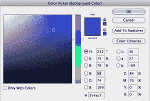](https://www.sitepoint.com/wp-content/uploads/2012/02/Screen-shot-2012-02-18-at-8.07.38-PM.png)

### 第十四步:选择你的渐变类型

点击渐变工具，选择前景到背景渐变。

[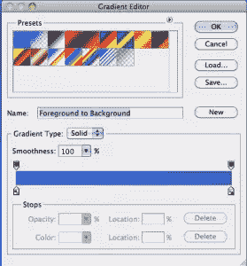](https://www.sitepoint.com/wp-content/uploads/2012/02/Screen-shot-2012-02-18-at-7.36.33-PM.png)

### 第十五步:绘制渐变

将渐变从画布底部拖到画布顶部。这将创建一个渐变，从底部的浅蓝色到顶部的深蓝色。

### 步骤 16:测试你的自定义笔刷

选择白色作为你的前景色，并创建一个新层。点击一次你想要你的云在哪里，你会看到你的云，完整的高光和阴影。

### 步骤 17:保存你的自定义笔刷

如果您想要保存自己的自定义画笔集，以便以后使用或在互联网上共享，您可以在画笔预设面板中完成此操作。

### 步骤 18:查看你的笔刷预设

转到“窗口”>“笔刷预设”以显示此面板。

[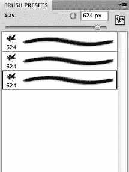](https://www.sitepoint.com/wp-content/uploads/2012/02/Screen-shot-2012-02-18-at-10.12.02-PM.png)

### 步骤 19:使用你的预设管理器创建一个笔刷设置

然后，单击弹出菜单选择预设管理器。一个新的对话框将会出现。

[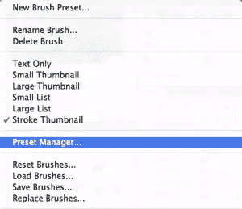](https://www.sitepoint.com/wp-content/uploads/2012/02/Screen-shot-2012-02-18-at-10.14.19-PM.png)

### 第 20 步:选择你的笔刷

如果您已经创建了几个自定义画笔的新集合，请按住 shift 键并选择要包含在集合中的所有画笔，然后选择“保存集合”。

[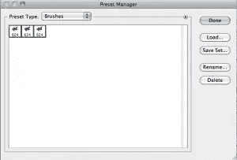](https://www.sitepoint.com/wp-content/uploads/2012/02/Screen-shot-2012-02-18-at-10.59.24-PM.png)

### 第 21 步:保存你的设置

选择保存新设置的文件夹，然后单击保存。如果您自己要使用此设置，请指向 Photoshop 应用程序文件夹的“预设”文件夹中的 Photoshop 的“画笔”文件夹。这将使你下次很容易找到刷子。

### 第 22 步:改变你的笔刷

使用您自己的自定义画笔的一个优点是，您还可以使用画笔面板来更改它们。使用此面板，您可以彻底改变画笔的行为。第一个设置是 Shape Dynamics，它允许你玩画笔的大小，以及当你用它绘画时它的大小是否变化。我改变了尺寸抖动和角度抖动，这允许画笔在你用它绘画时改变尺寸和方向。仅仅通过改变这些设置，我就能够用一个小的圆周运动创造出一个烟雾云。

[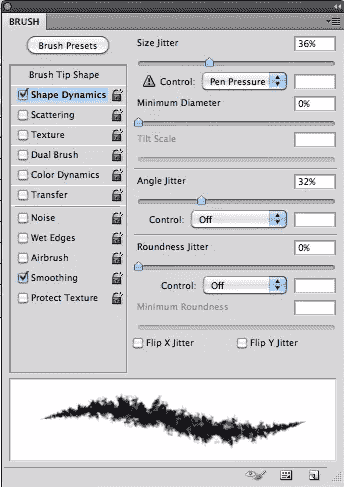](https://www.sitepoint.com/wp-content/uploads/2012/02/Screen-shot-2012-02-23-at-12.11.55-AM.png)

这是我用笔刷变化制作的烟雾云:

### 第 23 步:分散你的画笔

“散射”允许您将笔刷设置为在绘画时随机散射笔刷形状。您可以决定散射量，笔刷是否在水平轴和垂直轴上都散射，计数是增加还是减少，以及计数中是否抖动。

[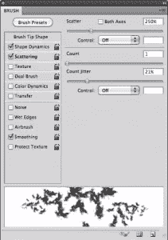](https://www.sitepoint.com/wp-content/uploads/2012/02/Screen-shot-2012-02-23-at-12.28.51-AM.png)

以下是使用这些设置绘制一个连续笔划的结果:

[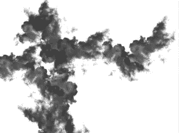](https://www.sitepoint.com/wp-content/uploads/2012/02/Screen-shot-2012-02-23-at-12.22.18-AM.png)

### 步骤 24:为真实效果添加纹理

下一个设置，纹理，真的可以创造出一些惊人的效果。因为你可以下载自己的纹理和图案，所以可能性是无穷的。你也可以选择各种混合模式，就像在图层面板中一样，这允许你在笔刷上覆盖纹理。你可以选择纹理的比例和深度。

[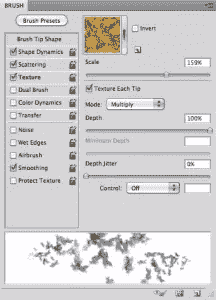](https://www.sitepoint.com/wp-content/uploads/2012/02/Screen-shot-2012-02-23-at-12.32.41-AM.png)

我选择了这个纹理的混合模式，结果看起来像大理石。

[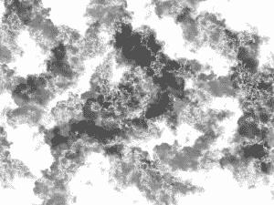](https://www.sitepoint.com/wp-content/uploads/2012/02/Screen-shot-2012-02-23-at-12.33.02-AM.png)

### 步骤 25:组合你的笔刷

下一步是一个有趣的步骤，因为它将你的自定义笔刷与另一个活动笔刷相结合。该设置被称为双重画笔，它可以自己创建一些独特的结果。这个设置也有混合模式，所以你可以花几个小时混合你的笔刷，但永远不会得到相同的结果。我关闭了纹理，所以这里要观察的独特设置是间距，因为它来回滑动覆盖的笔刷来创建一个完全不同的笔刷。

[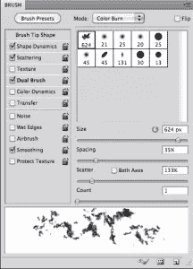](https://www.sitepoint.com/wp-content/uploads/2012/02/Screen-shot-2012-02-23-at-12.45.17-AM.png)

我把我们现在的笔刷和它自己结合起来，改变间距，得到一个和以前完全不同的笔刷。

### 步骤 26:改变颜色和不透明度

下面两个设定我一起说。如果您正在使用颜色并希望它们变化，您可以通过颜色动态选项设置属性，在这里您可以确定色调、饱和度、亮度和纯度属性。顶部的前景/背景抖动设置控制你的笔刷在前景和背景颜色之间来回渐变的程度。传递属性是一个重要的属性，因为它使您能够更改不透明度抖动，这允许您的画笔从完全透明渐变到完全不透明。它还控制湿度和混合强度，这需要您打开湿度。潮湿会给你的笔刷作品一种潮湿的绘画效果。

[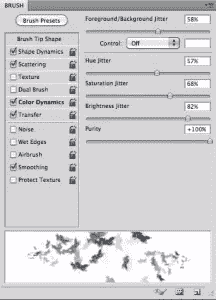](https://www.sitepoint.com/wp-content/uploads/2012/02/Screen-shot-2012-02-23-at-1.00.45-AM.png)

随着不透明度抖动打开，前景/背景抖动打开，我能够制作一个微妙的灰色云彩的背景流动在一起。

### 最后的想法

您可以用任何东西制作自定义画笔，包括图像、形状、纹理等等。当您创建自己喜欢的内容时，您可以将其保存在预设中，并反复使用。自定义画笔的伟大之处在于，你可以更改设置，组合画笔，并通过快速简单的设置，真正创建你需要的任何类型的画笔。尝试一下，看看你能创造什么！

## 分享这篇文章