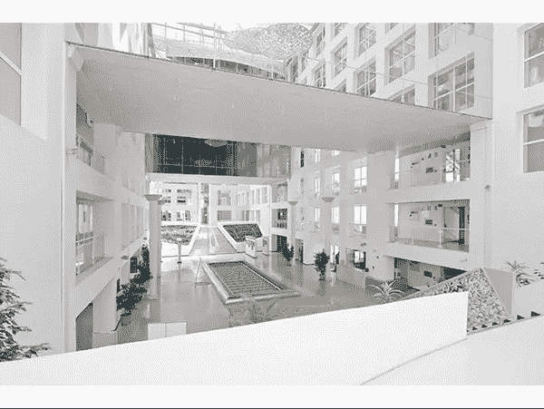
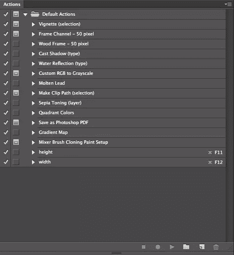
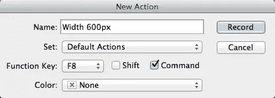
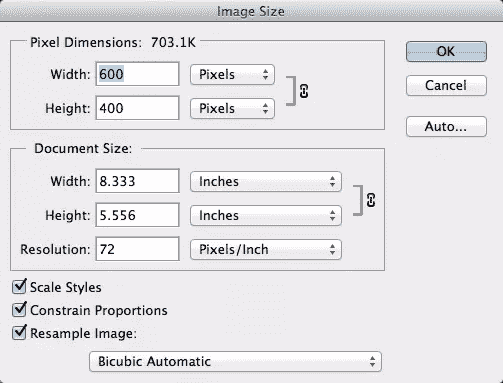
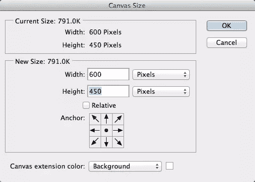
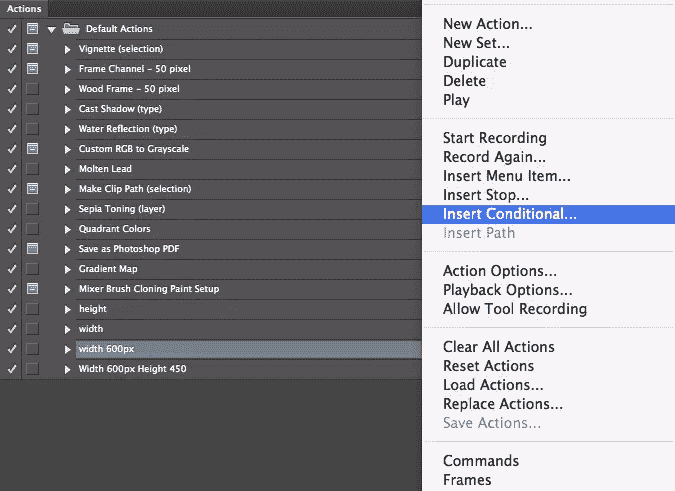
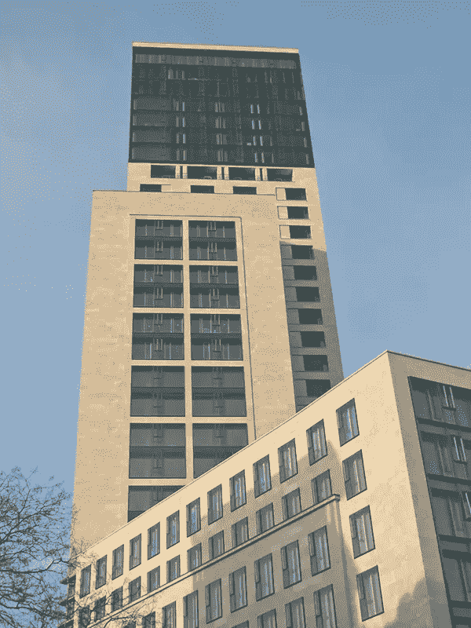
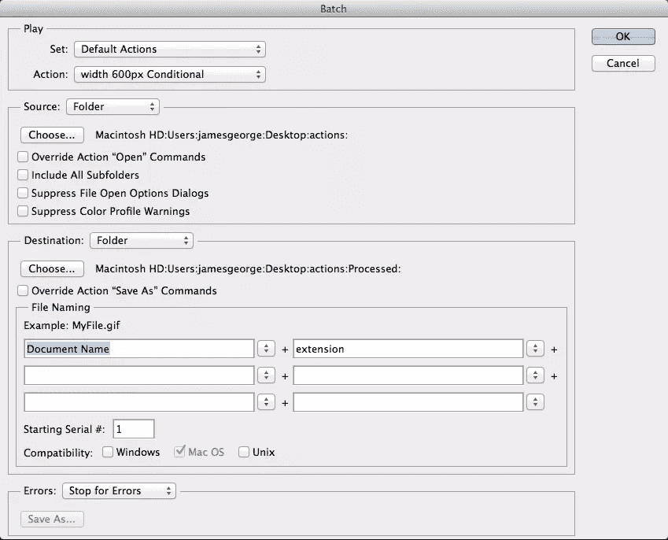

# 创建您自己的节省时间的 Photoshop 动作

> 原文：<https://www.sitepoint.com/create-your-own-photoshop-actions/>

如果你进入了所有项目的日常设计程序，很可能你已经开发了自己的定制工作流程。你可能每天都需要执行重复的任务。可能是网站维护、添加图像、调整图像大小、给照片添加某些滤镜或设置等。如果您不断地一遍又一遍地做相同的重复任务，您应该节省时间，并将重复任务记录为 Photoshop 动作。然后，你所要做的就是运行那个动作，只需一次点击，一幅图像就会立即转换。这将节省您大量的时间，因为 Photoshop 可以更快地处理这些常见的任务，因为自动化的行动。

### 录制您的 Photoshop 动作

记录自己的 Photoshop 动作并不难。我建议你提前写下步骤，以获得你想要的结果。这将减少你犯错并重新开始的可能性。创造你自己的行动的美妙之处在于它记录了你执行的每一步，而不是每一步花费的时间。这对于记录动作非常有用，因为你可以从容不迫，集中精力按照正确的顺序完成每一步。

### Photoshop 动作的实际用途

对于我的博客，我需要我的图片和截图是 600 像素宽。对于大多数博客来说，这是相当普遍的。但是首页的文章列表需要按比例 450px 高。我用动作来快速调整图片的大小。纵向(垂直)图像可以是任何高度，因为我不使用它们作为我的特征图像，所以我为纵向图像记录的操作只是将宽度调整为 600px，仅此而已。然而，我必须为横向(水平)图像记录一个单独的动作。我仍然将宽度设置为 600 像素，但是通过画布大小设置将高度设置为 450 像素，所以如果图像不够高，Photoshop 会在顶部和底部添加白色画布空间。从那以后，我再也不用手动调整照片大小了。

### 创建 Photoshop 动作

点击下载示例图片[。这张图片是一间办公室，我可能会在我的一篇文章中用到它。这张图片有 3348 像素宽，对于一个普通博客的内容区域来说太大了。通常情况下，我们只需进入“图像”>“图像大小”，并将宽度设置为 600 像素。这样做很好，但是如果你有 15、20 或 500 张图片呢？为此设置一个动作要容易得多，您甚至可以为该动作指定一个热键，使其更加自动化。进入“窗口”>“动作”，动作面板就会出现。](http://www.sxc.hu/browse.phtml?f=download&id=1401294)

点击图标，看起来像一个新的层图标，一个对话框将出现。一定要给你的行为起一个有意义的名字。我只是用实用的方法给它命名，告诉我它是什么或它做什么。在下面的例子中，我将我们的动作命名为“Width 600px”，并将其放在名为“默认动作”的动作集中这是 Photoshop 动作的默认动作文件夹。如果您要创建彼此相关的操作，那么创建一组新的操作并将它们保存在单独的文件夹中可能是个好主意。您也可以为每个操作分配一个功能键。为了避免与 Photoshop 的其他键盘快捷键冲突，您可以添加 Shift 键和/或 Command 键。

底部的图标就像普通的音乐播放器一样工作。方形按钮是停止，圆形是录音，三角形是播放。当您准备好记录您的操作时，单击圆圈图标，它将变为红色，这意味着记录处于活动状态。对于我们的操作，我按 Command/Ctrl + Alt/Option + "I "调出图像大小，并将宽度设置为 600 像素。

高度只有 400px，不够高，满足不了我的需求。这将导致内容移动，并且对我的格式不起作用，所以我需要在宽度设置为 600 像素后，将高度设置为 450 像素。为此，我将通过按 Command/Ctrl + Alt/Option + "C "来调出画布大小。当高度显示为 400 像素时，我将该值更改为 450。无论背景色样本是什么，最终都会是顶部和底部的画布颜色。当我创建完我的动作后，我点击了方形的“停止”按钮。

## 

Photoshop 会保存你的动作供以后使用，这样当你需要的时候就很容易使用了。现在，我所要做的就是打开一张图片，然后按 Command + F8 来相应地调整我的风景图片的大小。

### CS6: Photoshop 条件动作

就在你认为动作已经好到不能再好的时候，Adobe 把标准又提高了一步。现在在 Photoshop CS6 中，可以设置*条件* Photoshop 动作。在我的例子中，我创建了一个动作，将宽度设置为 600 像素，然后将画布大小设置为 450 像素。嗯，如果我的图像是肖像呢？我不得不为此使用不同的动作。由于图像的高度并不重要，只要它是 600 像素宽，我们将使用上面使用的相同方法来记录这个动作，而不调整画布大小。接下来，单击弹出菜单。确保您刚刚创建的宽度为 600 像素(没有画布高度调整)的动作被选中。点击“插入条件”

如果目标图像是横向的，您可以告诉您的 Photoshop 动作以一种方式运行，如果不是横向的，则以另一种方式运行。我们将在这个条件动作中一起使用这两个动作。如果图像是横向的，请确保它的宽度为 600 像素，高度至少为 450 像素。如果它不是横向的，你需要做的就是把它变成 600 像素宽。点击“确定”，Photoshop 会用“如果”语句更新第一个动作。

我在这里下载了[下面的图片。我通过它的热键运行了条件动作，这个肖像图像被调整了大小，没有被削减到 450 像素的高度。在检查以确保其工作正常后，我将该动作重命名为“宽度 600 像素条件”要重命名动作，只需在动作面板中双击其名称。](http://www.sxc.hu/browse.phtml?f=download&id=1373483)

### 有条件的 Photoshop 动作之美

现在也可以批量运行有条件的 Photoshop 动作了。不需要单独运行一批人像和风景图片，它们都可以被转储到一个文件夹中，并通过 Photoshop 批处理调整大小。要运行批处理，请前往“文件”>“自动化”>“批处理”

选择您的动作所属的集，然后选择您刚刚创建的条件 Photoshop 动作。选择图像收藏所在的源文件夹。然后，为处理后的文件选择一个目标文件夹。我通常只在原始文件夹中创建一个名为“已处理”的文件夹底部写着“出错停止”。当我运行这个批处理时，我一直收到一条消息，提示 if 条件不可用，但是它仍然运行这个批处理。我只需点击按钮告诉它继续。如果您想避免这种情况，请告诉 Photoshop 将错误记录到文件中。如果这样做，有错误的文件将必须手动保存到目标文件夹。对我来说，按几次回车键比手动保存多张图片要简单得多。

### 结论

Photoshop Actions 是一个不可思议的工具，可以为重复任务创建节省时间的快捷方式。如果你有一个需要多个步骤的重复任务，很容易只记录一次，然后作为热键使用。如果你有一个装满图像的文件夹，你可以运行一个批处理，花半个小时的手动工作，调整到只需一两分钟的工作，从长远来看可以节省你大量的时间。添加了条件 Photoshop 动作后，我们现在可以通过告诉 Photoshop 寻找某些参数来节省更多的时间。除了横向格式还有其他条件，比如是方形、RGB、是未保存的文档等等。

*你用 Photoshop 动作做什么？你试过新的有条件的 Photoshop 动作功能吗？你认为它能为你节省多少时间？*

## 分享这篇文章