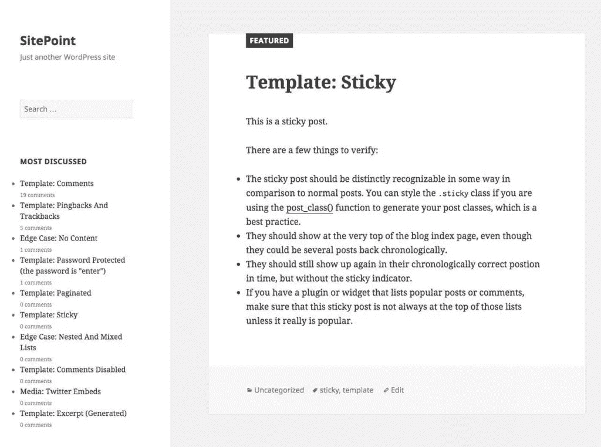
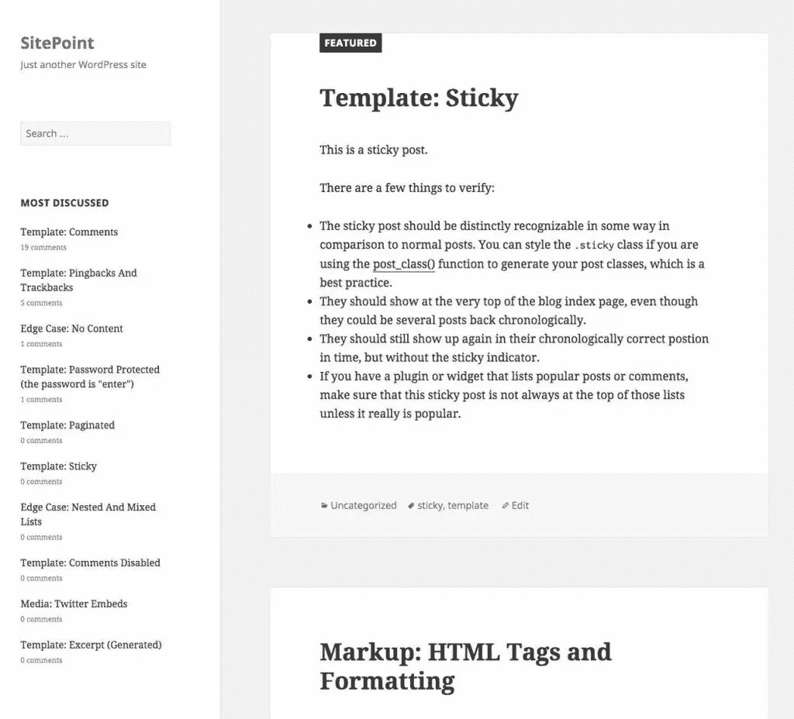

# 为 WordPress 创建一个“评论最多的帖子”插件

> 原文：<https://www.sitepoint.com/creating-a-most-commented-on-posts-plugin-for-wordpress/>

任何网站上的新鲜内容都是好事。一个很好的方法是向你的网站访问者展示你的讨论最多的帖子。在 WordPress 的例子中，一个小部件是实现这一点的理想场所。那些在阅读完当前帖子后不知道去哪里的用户，可能会查看并希望参与你的博客中评论最多的帖子。你评论最多的帖子通常也是带来最多浏览量和最有趣的。

在本教程中，我们将创建一个基本插件，在一个小部件中显示大多数评论文章。尽管有很多插件可以用于这个目的，但是它们中的很多都不支持缓存。在本文中，我们将构建一个轻量级的插件，它将缓存 24 小时前 10 个评论文章。

## 插件目录和文件

从插件开发开始，创建一个名为 **most-commented-widget** 的目录，并在其中创建以下文件:

```
--most-commented-widget
  -most-commented-widget.php
  -style.css
```

在**most-commented-widget.php**文件中，添加以下文本使插件可安装。

```
<?php

/*
Plugin Name: Most Commented Posts Widget
Plugin URI: https://www.sitepoint.com
Description: Displays most commented posts in an widget
Author: Narayan Prusty
*/
```

## get _ posts()函数

我们将使用`get_posts()`函数而不是`WP_Query`对象来检索评论最多的帖子，因为使用`WP_Query`会直接改变主循环(即全局`$wp_query`变量)，这会导致站点问题。

`get_posts()`函数用于根据一组参数检索一组`WP_Post`对象。`get_posts()`内部使用`WP_Query`对象的`query`函数构建一个 MySQL 查询并执行它。`WP_Query`对象的`query`不会改变主循环。

## 瞬态 api

Transients API 用于存储数据的键值对，就像 Options API 一样，但是有一个过期时间。如果配置了持久缓存，瞬态 API 只将数据存储在缓存中。因此，瞬态 API 非常适合缓存数据。

我们将使用 Transients API 来缓存我们评论最多的帖子 24 小时。

## 创建小部件

好了，让我们创建我们的小部件。小部件是一个扩展了`WP_Widget`类的类。代码如下:

```
class Most_Commented_Post_Widget extends WP_Widget 
{
    public function __construct() 
    {
        parent::__construct("Most_Commented_Post_Widget", "Display Most Commented Posts", array("description" => __("This plugin displays three most commented posts in an widget")));
    }

    public function form($instance) 
    {
        if($instance) 
        {
            $title = esc_attr($instance['title']);
        } 
        else
        {
            $title = '';
        }
        ?>

        <p>
            <label for="<?php echo $this->get_field_id('title'); ?>"><?php echo "Title"; ?></label>  
            <input class="widefat" id="<?php echo $this->get_field_id('title'); ?>" name="<?php echo $this->get_field_name('title'); ?>" type="text" value="<?php echo $title; ?>" />
        </p>

        <?php
    }

    public function update($new_instance, $old_instance) 
    {
        $instance = $old_instance;
        $instance['title'] = strip_tags($new_instance['title']);
        return $instance;
    }

    public function widget($args, $instance) 
    {
        extract($args);

        $title = apply_filters('widget_title', $instance['title']);

        echo $before_widget;

        if($title) 
        {
            echo $before_title . $title . $after_title ;
        }

        echo $after_widget;
    }
}

function register_most_commented_widget() 
{
  register_widget("Most_Commented_Post_Widget");
}

add_action("widgets_init", "register_most_commented_widget");
```

代码是这样工作的:

*   我们使用在`widgets_init`动作中调用的`register_widget`函数注册小部件类。
*   我们的`Most_Commented_Post_Widget`类的`widget`函数负责回显前端输出。
*   目前，我们只是在前端显示标题。

## 检索和显示评论最多的帖子

下面是`Most_Commented_Post_Widget`类的`widget`函数的实现，它显示了评论最多的前 10 篇帖子:

```
public function widget($args, $instance) 
{
    extract($args);

    $title = apply_filters('widget_title', $instance['title']);

    echo $before_widget;

    if($title) 
    {
        echo $before_title . $title . $after_title ;
    }

    $posts = null;

    $posts = get_posts(array(
    	'orderby'	=> 'comment_count',
    	'order'     => 'DESC',
    	'posts_per_page' => 10
	));

	?><ul class="most-commented-post-widget"><?php

        foreach ($posts as $key => $value) 
        {
        	$title = $value->post_title;
        	$comment_count = $value->comment_count;
        	$url = get_permalink($value->ID);

        	?>
        	<li>
        		<a href="<?php echo $url; ?>"><?php echo $title; ?></a>
        		<br>
        		<?php echo $comment_count; ?> comments
        	</li>
        	<?php

        }

    ?></ul><?php
    echo $after_widget;
}
```

下面是代码的工作原理:

*   我们用`orderby`、`order`和`posts_per_page`数组键调用`get_posts`函数。我们将按降序检索评论最多的前 10 篇帖子。
*   然后我们使用一个`foreach`构造来遍历`WP_Post`对象的数组。
*   然后我们会显示标题和评论的数量。

这是我们的小部件目前的样子:



但是我们还没有开始缓存结果。让我们看看如何缓存`get_posts()`结果。

## 缓存评论最多的帖子列表

让我们看看如何在小部件中实现瞬态 API。下面是带有瞬态 API 实现的`widget`函数的代码:

```
public function widget($args, $instance) 
{
    extract($args);

    $title = apply_filters('widget_title', $instance['title']);

    echo $before_widget;

    if($title) 
    {
        echo $before_title . $title . $after_title ;
    }

    $posts = null;

    if(get_transient("most_commented_posts") == false)
    {
    	$posts = get_posts(array(
	    	'orderby'	=> 'comment_count',
	    	'order'     => 'DESC',
	    	'posts_per_page' => 10
		));

    	set_transient("most_commented_posts", json_encode($posts), 86400);
    }
    else
    {
    	$posts = get_transient("most_commented_posts");
    	$posts = json_decode($posts);
    }

	?><ul class="most-commented-post-widget"><?php

        foreach ($posts as $key => $value) 
        {
        	$title = $value->post_title;
        	$comment_count = $value->comment_count;
        	$url = get_permalink($value->ID);

        	?>
        	<li>
        		<a href="<?php echo $url; ?>"><?php echo $title; ?></a>
        		<br>
        		<?php echo $comment_count; ?> comments
        	</li>
        	<?php

        }

    ?></ul><?php
    echo $after_widget;
}
```

这里，我们将生成的数组存储为一个带有 24 小时到期计时器的瞬态。如果 transient 返回 false，那么我们将再次运行查询，并将结果存储为接下来 24 小时的 transient。现在这个插件在 MySQL 上会玩得更好。

## 样式化小部件

让我们将小部件设计得更专业一些。将这段代码放入插件文件，将 **style.css** 文件加入队列。

```
function most_commented_widget_style() 
{
    wp_register_style("most-commented-post-widget-style", plugin_dir_url(__FILE__) . "style.css");
    wp_enqueue_style("most-commented-post-widget-style");
}

add_action("wp_enqueue_scripts", "most_commented_widget_style");
```

将这段代码放在 **style.css** 文件中，以设置列表样式并添加一些空白。

```
.most-commented-post-widget
{
	list-style: none;
}

.most-commented-post-widget li
{
	margin-bottom: 20px;
}
```

这是我们的小部件现在应该看起来的样子:



## 结论

在这篇文章中，我向你展示了如何轻松地为 WordPress 构建你自己的**评论最多的帖子**插件。现在，您可以继续进行扩展，以显示图像并添加更多信息。请在下面分享你自己插件的经验。

## 分享这篇文章