# 用 JavaScript 创建一个简单的 Windows 8 游戏:游戏基础& CreateJS/EaselJS

> 原文：<https://www.sitepoint.com/creating-a-simple-windows-8-game-with-javascript-game-basics-createjseaseljs/>

这是为期四周的四篇系列文章中的第二篇，将向您展示如何使用 HTML5、JavaScript、WinJS 和 [CreateJS](http://createjs.com/) 创建一个简单的 Windows 8 游戏。

第一篇文章是对一个基本的 Windows 8 应用程序中运动部件的快速介绍。在这篇文章中，我们将认真地开始创建一个游戏。

## 我们在建造什么？

这是游戏在最初的 XNA 版本中的样子:

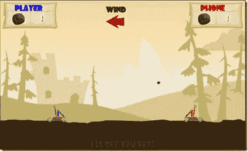

我们不会添加所有这些功能，但我们会接近的！

## 添加资产

除非你正在创造下一个伟大的基于文本的冒险，否则你可能需要一些图像和声音。在我们的例子中，我们使用的是已经在[“弹射器战争实验室”](http://msdn.microsoft.com/en-us/windowsphonetrainingcourse_2dgamedevelopmentwithxnalab.aspx) 2D 样本游戏中创建的。本教程是为 XNA 开发的，但我们需要 JavaScript，所以让我们抓住图形和声音，开始编码吧！

1.  启动 Visual Studio 2012 并创建一个名为“CatapultWars”的项目，使用 JavaScript->“Windows Metro style”模板中的“空白应用程序”模板。
2.  下载并解压[“弹射器战争实验室”样本](http://create.msdn.com/en-US/education/catalog/lab/catapult_wars) ( *弹射器战争 _4_0.zip* )
3.  在文件夹的 Windows 资源管理器视图中，从`/Assets/Media/Textures`文件夹中选择并拖动所有四个文件夹，在 Visual Studio 中，将它们放在 images 文件夹下。(这会将它们复制并添加到项目中。)
4.  在项目的根目录下创建一个名为`sounds`的新文件夹。
5.  将文件从`/Assets/Media/Sounds`复制到新的`sounds`文件夹。

您的项目应该如下所示:

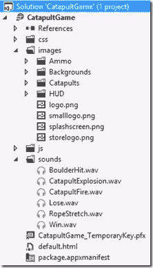

既然我们有了一些资产，就让我们把它们用起来吧。

## 闪屏和徽标

注意，当你运行这个游戏时，你首先会在一个正方形中看到一个 X？这是闪屏，默认显示的img/splashscreen.png`图像，但我们可以做得更好。要调整闪屏，双击`package.appxmanifest`:

文img/Backgrounds/gameplay_screen.png`就是我们要用的，但是图像必须是 620×300 像素。所以，在你最喜欢的编辑器中打开图片，调整大小，另存为`title_screen_620x300.png`。将新文件添加到项目中。

现在我们可以将`Splash screen`字段设置为`imagesBackgroundstitle_screen_620x300.png`。当我们在这里的时候，选择你想要的任何背景颜色来补充图片(例如`darkGray`)。现在，当运行时，游戏用一个新的闪屏来迎接我们:

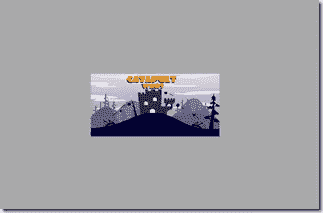

我们还可以调整应用程序的磁贴，默认情况下是这样的:

此外，在应用清单中，我们看到了许多标识的位置。我们可以添加 150×150、310×150 和 30×30 的徽标，用于各种场合。

现在，我们有了方形和宽格式的定制图块:

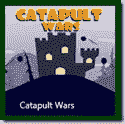 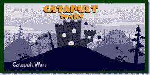

看起来不错！现在，如果我们有一个游戏可以玩…

## 添加 HTML5 画布

首先，我们需要一些东西来显示游戏。HTML5 `canvas`元素本质上是一个像素沙箱，你可以动态地绘制。我们将使用画布来呈现游戏，所以我们需要将它添加到我们的 HTML 页面中。打开`default.html`，用画布标签替换第 17 行(`Content goes here`行),如下所示:

通常，你需要指定宽度和高度，并在 canvas 不被支持的情况下添加后备内容，但是我们稍后将设置宽度/高度，我们知道 canvas 将被支持。然而，这只是你应该考虑的许多编码实践中的一个，以防你想将你的一些应用程序代码作为传统的 web 应用程序重用——但那是另一个系列文章的故事…

## 使用 CreateJS 让事情变得更简单

那么我们如何添加像我们的背景和弹射器这样的东西呢？与 HTML 内容不同，画布内容完全是通过 JavaScript 指令创建的。关于基础知识，请阅读 MSDN 网站上的[“如何在 HTML5 画布上画画”](http://msdn.microsoft.com/en-us/library/windows/apps/hh452750.aspx)。

当然，我们*可以*使用 canvas 方法直接绘制我们的游戏，但是有 JavaScript 库可以提供帮助，包括非常适合游戏开发的库。 [CreateJS](http://www.createjs.com/) 是一套 JavaScript 库&工具，包括 [EaselJS](http://www.createjs.com/#%21/EaselJS) 、 [PreloadJS](http://www.createjs.com/#%21/PreloadJS) 等。我们将在游戏中使用这些，所以[下载](https://github.com/CreateJS/) EaselJS 和 PreloadJS，为它们创建一个新文件夹作为`/js/CreateJS`，并复制脚本(从`lib`文件夹中)如下:

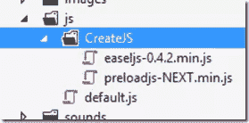

将 JavaScript 文件添加到项目中并不足以使用它们，所以从`default.html`开始引用它们:

提示:通过将脚本从解决方案资源管理器拖到页面上，可以添加脚本引用。(额外提示:在 HTML5 中，不再需要`type="text/javascript"`脚本属性。)

我们将使用 PreloadJS 来帮助在游戏中使用之前加载资产，并使用 EaselJS 来使管理游戏循环和图像资产的绘制变得更容易。

## 开始游戏

要开始游戏，我们需要知道页面何时可以运行。为此，我们使用`DOMContentLoaded`事件来告诉我们页面结构何时被加载，脚本何时准备好运行。这与 onload 事件不同，后者等待所有引用的内容都被下载。

在`default.js`中，添加一个`initialize()`函数，并由`DOMContentLoaded`调用。既然这样，让我们也加入游戏循环的基础:

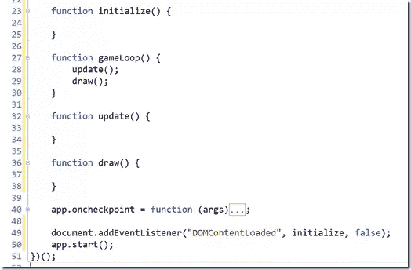

注意:`app.oncheckpoint`函数是折叠的，以便于阅读。

## 变量

为了使用画布、存储图像和创建位图，我们需要一些变量。此外，因为最初的游戏假设屏幕为 800×480，所以我们需要将绘制的图像缩放到实际的屏幕尺寸。

将以下变量添加到`default.js`:

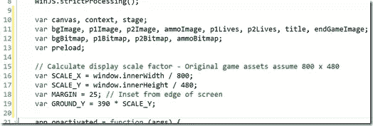

## 初始化画布并使用 PreloadJS

前面，我提到过 canvas 只能通过 JavaScript 更新。要连接到画布，您需要首先找到元素，然后检索它的 2D 上下文。该上下文公开了绘图功能。我们还将缩放画布以匹配我们的全屏尺寸。

更新`initialize()`如下:

现在我们需要加载我们的图像，这样我们就可以将它们绘制到画布上。有很多方法可以做到这一点，但是 PreloadJS 是有帮助的，因为我们可以列出我们将要使用的内容，它可以确保在我们引用它们之前加载它们。如果我们不这样做，我们可能无法在运行时可靠地获得图像大小等细节，从而产生错误。

PreloadJS 的工作方式是读取一组资源，然后在完成时调用一个函数。我们将指定我们将使用的所有图像。

如下扩展`initialize()`功能:

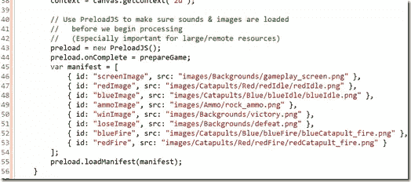

当 PreloadJS 准备好我们的资产时，将调用`prepareGame()`方法。

## 使用 EaselJS 创建和绘制图像

现在我们需要将这些图像显示到屏幕上(通过画布)。幸运的是，EaselJS 有很多我们会觉得有用的特性:

*   一个 [*Stage*](http://www.createjs.com/Docs/EaselJS/Stage.html) 类，管理画布和我们正在绘制的场景
*   [*位图*](http://www.createjs.com/Docs/EaselJS/Bitmap.html) 、 [*文本*](http://www.createjs.com/Docs/EaselJS/Text.html) 和[*sprite sheet*](http://www.createjs.com/Docs/EaselJS/SpriteSheet.html)*类，用于表示要绘制的项目*
**   [*点*](http://www.createjs.com/Docs/EaselJS/Point.html) 类帮助定位画布上的项目*   一个 [*Ticker*](http://www.createjs.com/Docs/EaselJS/Ticker.html) 类来帮助管理游戏循环(把它想象成游戏的心跳)*

 *稍后我们将讨论 Ticker，但是现在让我们添加 Stage，这样我们就可以开始向它填充内容了。在`default.js`中，将以下内容添加到`initialize()`功能中:

这创建了舞台并将其连接到我们游戏的画布元素。现在，我们可以将项目(称为子项目)添加到舞台。

在`initialize()`函数的正下方，添加一个`prepareGame()`函数。(还记得我们告诉 PreloadJS 在加载完资产后给`prepareGame`打电话。)现在，让我们只添加一项——背景:

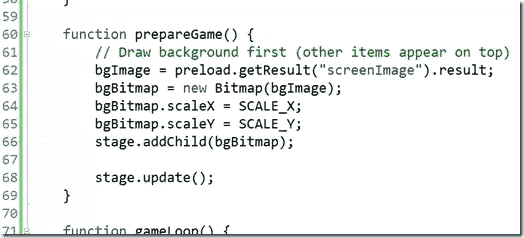

这是怎么回事？

*   **第 62 行**–`preload.getResult()`向 PreloadJS 请求它已经为我们加载的图像
*   **第 63 行**–创建一个 EaselJS `Bitmap`实例，使用图像作为它的源
*   **Lines 64&65**–将`Bitmap`缩放到我们屏幕的分辨率(相对于原始资产的 800×480)
*   **第 66 行**——将`Bitmap`作为子元素添加到`Stage`中
*   **第 68 行**–让`Stage`告诉画布它所知道的一切

让我们运行游戏。在启动画面之后，我们现在看到:

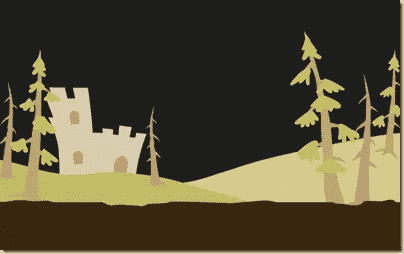

## CSS 的快速变化

正如你所看到的，我们添加的背景图像是透明的，所以我们的背景颜色是透明的。黑色背景令人毛骨悚然，但不是我们要找的。

我们可以做的一件事是改变我们正在使用的 WinJS CSS 库。默认情况下，我们使用`ui-dark.css`，但是`default.html`中的一个快速变化指向`ui-light.css`，并且事情自动选择新的样式:

快速运行现在显示:

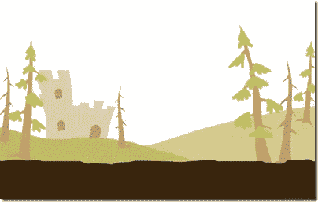

然而，让我们尝试一种更像天空的颜色…比如说，“天蓝色”。我们可以通过 CSS 设置自己的颜色来覆盖 WinJS 背景色。打开`/css/default.css`并改变车身样式，如图所示:

再次运行:

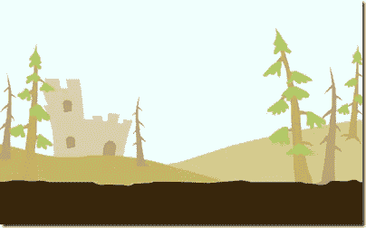

一片美丽的天空，准备开战！

## 添加剩余资产

现在你已经看到了如何添加背景。这主要是一个重复的问题，以包括其他人(有一点更多的数学投入。)返回`default.js`，在`prepareGame()`中包含以下内容:

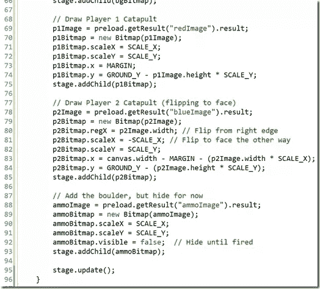

关于这一点的几点说明:

*   弹射器出现在“地平面”,我们需要随着图像的整体大小进行缩放
*   画 2 号玩家的弹弓很棘手，因为我们需要它朝向另一个方向。使用`regX`来设置一个变形点，并设置一个负的比例来完成这项工作。
*   我们创建并添加弹药(巨石)图像，但隐藏它，直到它稍后发射。

## 添加一些文本

为了总结这篇文章，让我们使用 EaselJS 的`Text`类来添加一个游戏标题以及每个玩家剩余弹射器的指示器。首先，我们需要一些靠近`default.js`顶部的变量:

然后，在`prepareGame()`中添加以下内容；

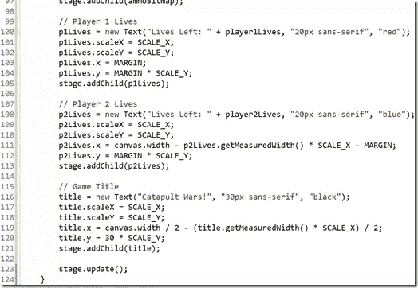

对于`Stage`，`Text`实例是孩子，就像我们之前添加的`Bitmap`一样。

游戏现在是什么样子的？

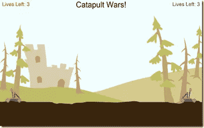

## 下一步是什么？

事情看起来很好，但不幸的是，仅此而已，没有任何进展。在下一篇文章中，我们将深入游戏的机制，通过添加动作、碰撞检测、记分和结束游戏来充实游戏循环。

## 分享这篇文章*