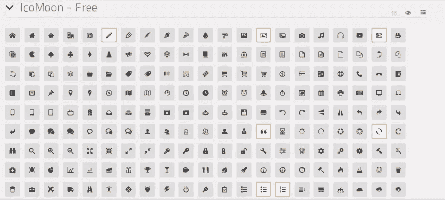
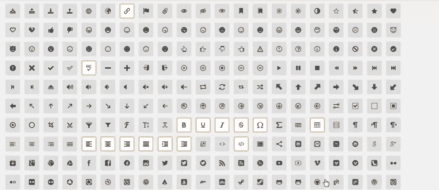
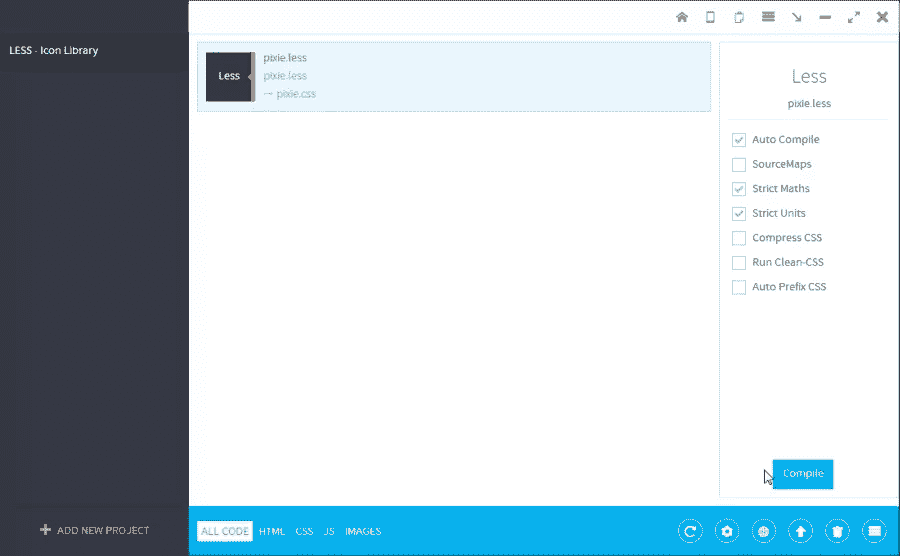
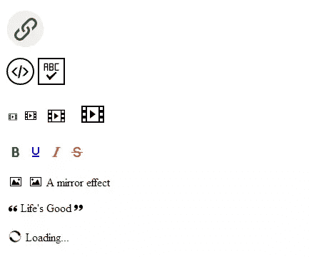

# 使用 IcoMoon 和更少的工具创建自定义图标字体

> 原文：<https://www.sitepoint.com/creating-custom-icon-font-icomoon-less/>

现在使用图标字体非常流行和有用。所有主流前端框架(如 [Bootstrap](http://getbootstrap.com/) 、 [Foundation](http://foundation.zurb.com/) 、[语义 UI](http://semantic-ui.com/) 、 [UIkit](http://getuikit.com/) 、[纯](http://purecss.io/))都使用某种图标字体。这不是没有原因的。使用图标字体有几个重要的好处。

*   所有图标都加载到一个文件中，减少了服务器请求的数量。
*   所有的图标都可以用 CSS 很容易地设计，因此不需要使用图像编辑器。
*   所有图标在各种显示器和分辨率下看起来都清晰锐利。

在本教程中，我将向您展示如何创建您自己的自定义图标字体，然后如何使用它来建立一个小的 CSS 图标库。基本上，它将类似于其他流行的前端框架的图标组件，但是有一些显著的优点，您将在下一节看到。

## 为什么我需要创建自定义图标库？

那么，为什么你想要创建自己的图标库，而不是使用已经建立的解决方案，如 [FontAwesome](http://fortawesome.github.io/Font-Awesome/) ？简单的回答是:您从一开始就拥有完全的控制权，并且只实现满足您特定需求和需要的特性。所以，没什么多余的！

现在让我们更详细地了解一下优点。您可能需要自定义图标库，因为:

*   它可以只包含您想要和需要的图标。
*   它可以组合来自不同图标集的图标( [IcoMoon App](http://icomoon.io/app/) 有很多这样的图标)。
*   它可以很容易地定制(你可以添加/删除图标，如你所愿)。
*   它是完全便携和独立的。
*   CSS 和字体文件的大小会小得多。

正如你所看到的，创建你自己的图标库有很多原因。所以，我们开始吧。

## 使用 IcoMoon 应用程序创建自定义字体

我们称我们的项目为小精灵。因此，我们需要做的第一件事是创建一个新的项目文件夹，并将其命名为 *Pixie* 。

现在是时候创建我们的自定义图标字体了，谢天谢地，对于 IcoMoon App 这样的工具来说，这只是小菜一碟。我们唯一需要做的事情是选择我们想要的图标，并下载内置的字体。

假设我们计划创建一个 HTML 编辑器，我们需要关于文本编辑的图标，等等。如果我们对这些图标使用常规的图标字体，我们也会得到一大堆我们不需要的图标。幸运的是，在我们的自定义字体中，我们将只放置项目所需的图标。

往前走，打开 [IcoMoon App](http://icomoon.io/app/) 。从 IcoMoon 图标集中选择以下 22 个图标，在下面两个图像中突出显示:





选择这些选项后，单击“字体”按钮，然后单击“下载”按钮。下载完`icomoon.zip`文件后，导航到该文件并双击打开它。我们需要从这里得到的是*字体*文件夹。所以抓住它，并将其提取到项目文件夹中。

现在我们准备进入下一步。

## 用更少的资源建造图书馆

到目前为止，我们已经创建了全新的图标字体，是时候构建 CSS 库了。为此，我们将使用[减去](http://lesscss.org/)。

我已经将我们需要编写的代码分解成几个部分，我们将从上到下一个一个地填充它们。我们将从声明一些我们以后需要的变量开始。在项目文件夹中，创建一个文件`pixie.less`，并将以下代码放在文件的开头。

```
// Variables
//===========

@icon-font-path:                "fonts/";
@icon-font-name:                "icomoon";

@font-size-big:                 2em;
@font-size-medium:              1.5em;
@font-size-small:               0.75em;
@icon-vertical-align:           -15%;

@color-success:                 green;
@color-info:                    blue;
@color-warning:                 orange;
@color-danger:                  red;

@linkbutton-color:              #444;
@linkbutton-background-color:   #eee;
```

接下来，在上面的代码下面，放入以下较少的 mixins:

```
// Mixins
//========

.border-radius(@radius) {
  -webkit-border-radius: @radius;
          border-radius: @radius;
}      

.box-shadow(@h: 0em; @v: 0em; @blur: 0em; @spread: 0.1em; @inset: inset) {
  -webkit-box-shadow: @arguments;
          box-shadow: @arguments;
}

.rotate(@angle) {
  -webkit-transform: rotate(@angle);
      -ms-transform: rotate(@angle);
          transform: rotate(@angle);
}

.scale(@x;@y) {
  -webkit-transform: scale(@x,@y);
      -ms-transform: scale(@x,@y);
          transform: scale(@x,@y);
} 

.animation(@name; @duration: 2s; @iteration: infinite; @timing: linear) {
  -webkit-animation: @arguments;
          animation: @arguments;
}

.keyframes(@prefix) when (@prefix = webkit) {
  from { -webkit-transform: rotate(0deg); }
  to { -webkit-transform: rotate(359deg); }
}

.keyframes(@prefix) when (@prefix = none) {
  from { transform: rotate(0deg); }
  to { transform: rotate(359deg); }
}

.keyframes(@prefix) {

}
```

我们的准备工作已经完成了。现在让我们继续我们图书馆的真实部分。我们需要添加一个引用到我们新创建的字体。我们使用 CSS 的`@font-face`规则，使用[最防弹的方法](http://www.fontspring.com/blog/further-hardening-of-the-bulletproof-syntax)来做到这一点。

```
/* Font Declaration
====================*/

@font-face {
    font-family: 'Pixie';
    src: url('@{icon-font-path}@{icon-font-name}.eot');
    src: url('@{icon-font-path}@{icon-font-name}.eot?#iefix') format('embedded-opentype'),
         url('@{icon-font-path}@{icon-font-name}.woff') format('woff'),
         url('@{icon-font-path}@{icon-font-name}.ttf') format('truetype'),
         url('@{icon-font-path}@{icon-font-name}.svg#icomoon') format('svg');
}
```

在上面的代码中，我们将字体命名为“Pixie ”,并在“fonts”文件夹中包含了对字体文件的引用。为此，我们使用前两个变量。

在下一段代码中，我们定义了图标的原型。对于每个以“pixie icon-”开头的类声明，我们设置以下属性。

```
/* Icon Prototype
==================*/

[class^='pixie icon-'] {
    font-family: 'Pixie';
    font-style:   normal;
    font-weight:  normal;
    font-variant: normal;
    line-height:  1;

    display: inline-block;

    padding: 0.3em 0.3em;
    margin: 0em 0.1em;

    -webkit-font-smoothing: antialiased;
    -moz-osx-font-smoothing: grayscale;
}
```

这里我们包含了上面声明的字体，并设置了一些印刷属性。为了正确显示图标，将`display`属性设置为`inline-block`是很重要的。我们也稍微调整了一下`padding`和`margin`的属性来增加一些空间。最后，我们添加了最后两行，以便更好地跨浏览器和设备呈现字体。

我们字体中的每个图标都有一个唯一的标识符，如果我们想让其中一个图标出现，就需要使用这个标识符。在下一个片段中，我们将图标类映射到图标标识符。

```
/* Icon Mapping
================*/

.pixie.icon-pencil                     {&amp;:before{content: "\e603";}}
.pixie.icon-image                      {&amp;:before{content: "\e60d";}}
.pixie.icon-film                       {&amp;:before{content: "\e613";}}
.pixie.icon-quotes                     {&amp;:before{content: "\e676";}}
.pixie.icon-spinner                    {&amp;:before{content: "\e67c";}}
.pixie.icon-list                       {&amp;:before{content: "\e6b5";}}
.pixie.icon-numbered-list              {&amp;:before{content: "\e6b6";}}
.pixie.icon-link                       {&amp;:before{content: "\e6c3";}}
.pixie.icon-spell-check                {&amp;:before{content: "\e700";}}
.pixie.icon-bold                       {&amp;:before{content: "\e744";}}
.pixie.icon-underline                  {&amp;:before{content: "\e745";}}
.pixie.icon-italic                     {&amp;:before{content: "\e746";}}
.pixie.icon-strikethrough              {&amp;:before{content: "\e747";}}
.pixie.icon-omega                      {&amp;:before{content: "\e748";}}
.pixie.icon-table                      {&amp;:before{content: "\e74b";}}
.pixie.icon-paragraph-left             {&amp;:before{content: "\e754";}}
.pixie.icon-paragraph-center           {&amp;:before{content: "\e755";}}
.pixie.icon-paragraph-right            {&amp;:before{content: "\e756";}}
.pixie.icon-paragraph-justify          {&amp;:before{content: "\e757";}}
.pixie.icon-indent-increase            {&amp;:before{content: "\e758";}}
.pixie.icon-indent-decrease            {&amp;:before{content: "\e759";}}
.pixie.icon-code                       {&amp;:before{content: "\e75c";}}
```

有时我们可能需要使用图标作为链接或按钮。因此，我们添加代码，使图标在用`<a></a>`标签包装时看起来像一个圆形按钮，如下所示:

```
/* Icon Link Button
====================*/

a>.pixie.linkbutton {
  background-color: @linkbutton-background-color;
             color: @linkbutton-color;

  .border-radius(100%);
  -webkit-box-shadow: none;
          box-shadow: none;
}

a>.pixie.linkbutton:hover {
  background-color: darken(@linkbutton-background-color, 5%);
}
```

为了增加图标的多样性，我们将创建另外两种方式来显示它们。第一种类型在图标周围添加一个圆形，第二种类型添加一个正方形。

```
/* Icon Types
==============*/

.pixie.circular {
  .border-radius(100%);
  .box-shadow();
}

.pixie.square {
  .box-shadow();
}
```

为了使图标真正有用，我们需要增加一些尺寸变化。

```
/* Icon Sizes
==============*/

.pixie.big {
  font-size: @font-size-big;
  vertical-align: @icon-vertical-align;
}

.pixie.medium {
  font-size: @font-size-medium;
  vertical-align: @icon-vertical-align;
}

.pixie.small {
  font-size: @font-size-small;
}
```

为了打破单调，我们将增加图标以多种颜色显示的能力。

```
/* Icon Colors
===============*/

.success {
    color: @color-success;
}

.info {
    color: @color-info;
}

.warning {
    color: @color-warning;
}

.danger {
    color: @color-danger;
}
```

一些图标需要翻转，以更好地适应我们的视觉需求。我们在下面的代码中添加了这个特性:

```
/* Icon Flipping
=================*/

.pixie.flipped-h {
  .scale(-1, 1);
}
.pixie.flipped-v {
  .scale(1, -1);
}
```

如果我们需要四个箭头，我们通常会从图标集中选择所有四个。更好的选择是只选择一个，然后旋转它。这样只有一个图标可以起到四个图标的作用，这将减少字体的文件大小。我们将通过添加以下代码来实现这一行为:

```
/* Icon Rotating
=================*/

.pixie.rotated-right {
  .rotate(90deg);
}

.pixie.rotated-down {
  .rotate(180deg);
}

.pixie.rotated-left {
  .rotate(-90deg);
}
```

最后，我们将添加强制图标旋转的代码。当您想要显示进度时，这很有用。

```
/* Icon Spin
=============*/

.pixie.spin {
  .animation(spin);
}

@-webkit-keyframes spin {
  .keyframes(webkit);
}

@keyframes spin {
  .keyframes(none);
}
```

现在是时候把我们的`.less`文件编译成`.css`了。最快的方法是——如果你从未使用过 Less 语言——使用在线编译器，如 [WinLess](http://winless.org/online-less-compiler) 。只需将`pixie.less`的全部内容复制并粘贴到编译器的左窗格中。然后在右窗格中，您将看到编译的 CSS 代码。复制编译好的代码，粘贴到一个名为`pixie.css`的新文件中，放入项目文件夹。就是这样。

当然，你也可以使用类似 [Prepros](http://alphapixels.com/prepros/) 这样的 app 来编译你的`.less`文件。



如果你经常工作，或者你打算这样做，这是更好的选择。关于 Prepros 的更多信息，你可以在 SitePoint 上看到[这个教程。](https://www.sitepoint.com/multilingual-preprocessing-with-prepros/)

## 用法示例

唷。艰苦的工作终于完成了。现在是检验我们工作的时候了。

在项目文件夹中，创建一个名为`pixie.html`的新 HTML 文件，并将以下标记放入其中:

```
<!DOCTYPE HTML>
<html>
<head>
    <meta charset="utf-8" />
    <title>Pixie</title>
    <link rel="stylesheet" type="text/css" href="pixie.css">
</head>

<body>

<p><a href="#"><i class="pixie icon-link big linkbutton"></i></a></p>
<p><i class="pixie icon-code circular medium"></i><i class="pixie icon-spell-check square medium"></i></p>
<p><i class="pixie icon-film small"></i><i class="pixie icon-film"></i><i class="pixie icon-film medium"></i><i class="pixie icon-film big"></i></p>
<p><i class="pixie icon-bold success"></i><i class="pixie icon-underline info"></i><i class="pixie icon-italic warning"></i><i class="pixie icon-strikethrough danger"></i></p>
<p><i class="pixie icon-image"></i><i class="pixie icon-image flipped-h"></i>A mirror effect</p>
<p><i class="pixie icon-quotes small"></i>Life's Good<i class="pixie icon-quotes small rotated-down"></i></p>
<p><i class="pixie icon-spinner spin"></i>Loading...</p>

</body>
</html>
```

当您在浏览器中打开它时，应该会看到以下内容:



没有使用图像；只是从 IcoMoon 构建的字体。如您所见，图标的外观和行为都非常好。所以，恭喜你！您刚刚创建并成功测试了一个全新的 CSS 图标库。

注意:如果你对你的`pixie.less`文件有任何问题——或者任何其他问题——你可以[在这里](https://uploads.sitepoint.com/wp-content/uploads/2014/04/1398852572pixie.zip)下载库的工作版本(包括所有文件)。

## 摘要

在本教程的开始，我们看到了拥有一个自定义库的好处之一是你最终得到的文件要小得多。让我们做一个快速实验来证明这一点。再次打开 IcoMoon 应用程序，这次从 IcoMoon 图标集中选择所有图标。然后下载字体，并随时提取 *fonts* 文件夹。现在检查该文件夹的大小，并将其与我们的 Pixie 项目中同名文件夹的大小进行比较。对于 IcoMoon 集合中的所有图标，大小为 507 KB，而对于我们项目中需要的图标，大小约为 19 KB。最终结果是我们节省了 488 KB！

我希望这个小项目对你来说是有趣的，并且你学到了一些有用的东西。从头开始创造一些有价值的东西总是很有趣和愉快的。通过投入少量时间来构建这个 CSS 图标库，我们获得了一个非常有用的产品，我们可以反复使用它。

[下载源文件](https://uploads.sitepoint.com/wp-content/uploads/2014/04/1398852572pixie.zip)

## 分享这篇文章