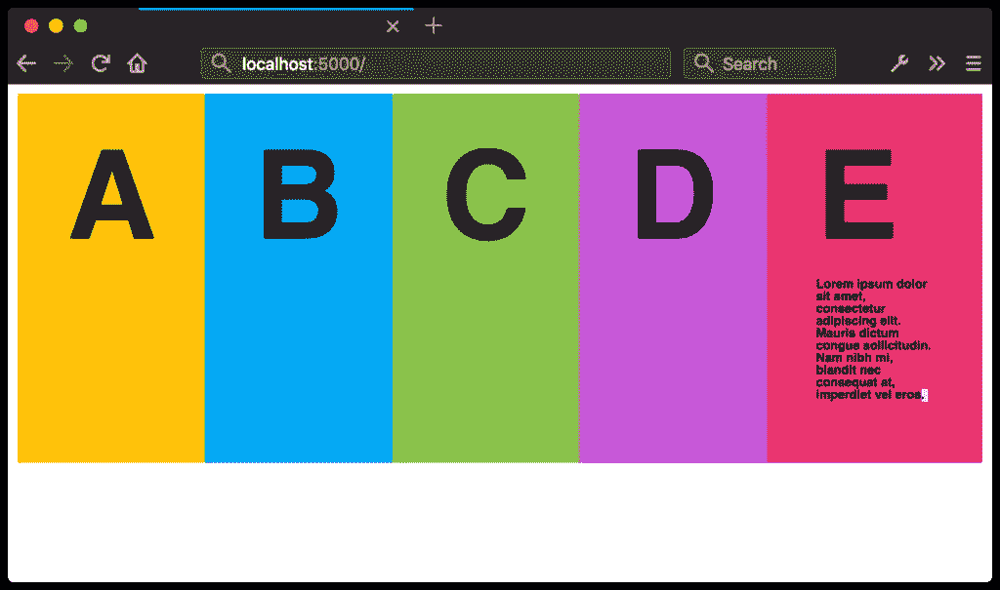
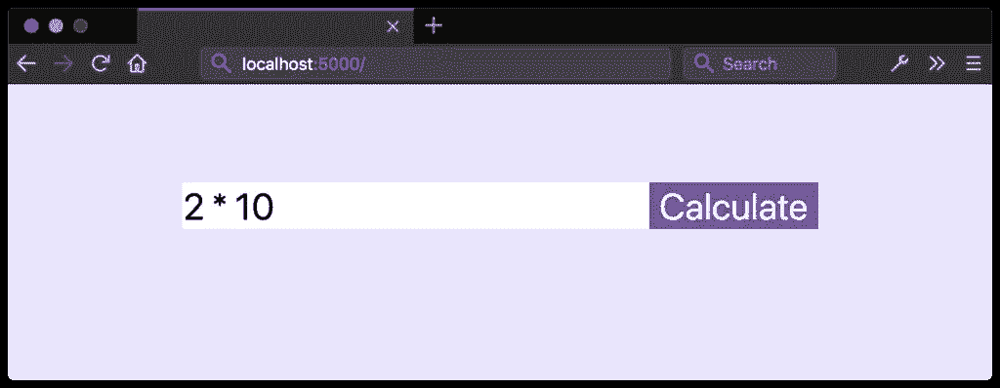
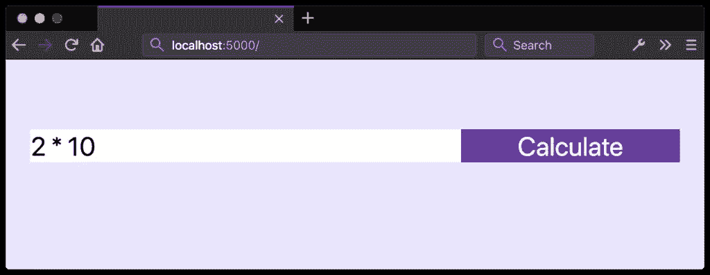
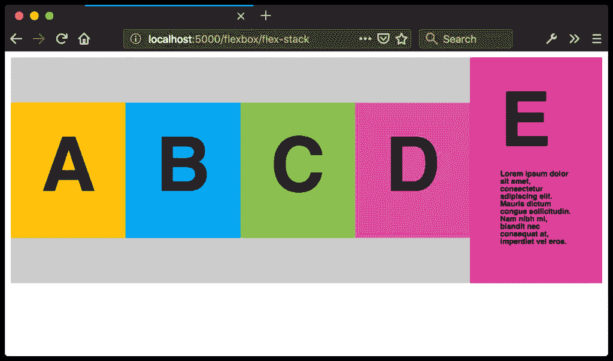
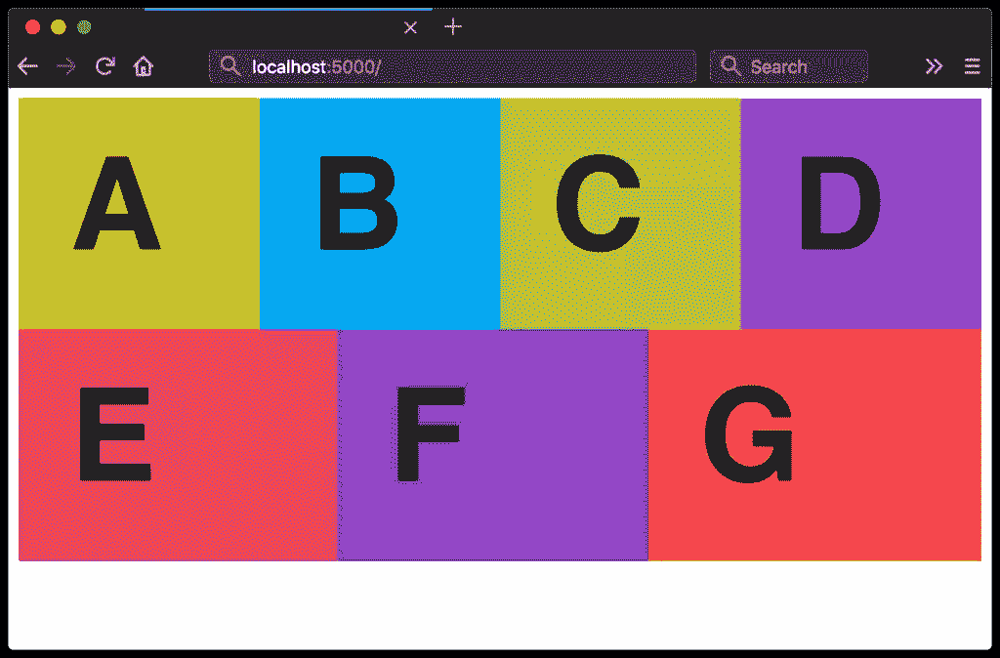

# 使用 Flexbox 创建灵活的布局

> 原文：<https://www.sitepoint.com/creating-flexible-layouts-with-flexbox/>

*以下对 Flexbox 的介绍摘自蒂芙尼的新书 [CSS Master，第二版](https://www.sitepoint.com/premium/l/css-master2)。*

**在 [CSS 网格](https://www.sitepoint.com/creating-css-grid-layouts/)出现之前，就有了 Flexbox(官方称为 [CSS 灵活框布局模块](https://www.w3.org/TR/css-flexbox-1/))。Flexbox 被设计成管理一个方向的布局——一行(`flex-direction: row`或`row-reverse` ) *或*一列(`flex-direction: column`或`column-reverse`)。这与 Grid 形成对比，Grid 占行*和*列。**

创建一个基本的灵活的盒子布局很简单:将`display: flex`或`display: inline-flex`添加到包含元素中。这些`display`的值将为包含元素的子元素触发一个 *flex 格式上下文*。与网格一样，`flex`和`inline-flex`都是内部显示模式。我们在容器上设置这些值，容器的行为分别类似于块级或内联级的盒子。然后根据 flex 布局的规则排列该容器的子容器。

*注意:旧版本的基于 Blink 的浏览器，如 Chrome (≤ 28)和基于 WebKit 的浏览器，如 Safari (≤ 8)，需要一个供应商前缀。如果你的项目仍然支持这些浏览器，你将需要使用`display: -webkit-flex`或`display: -webkit-inline-flex`。旧版本的 Firefox (≤ 21)也需要前缀。使用`-moz-flex`和`-moz-inline-flex`来支持那些浏览器。*

通过将`display: flex`或`display: inline-flex`添加到一个包含元素，它的直接子元素成为 flex 项，如下图所示。Flex 项目可以是子元素或非空文本节点。例如，下面的标记生成三个 flex 项目框，每个框都根据 flex 布局的规则运行:

```
<div style="display: flex">
    <span>This text is contained by a SPAN element.</span>
    <b>This text is contained by a B element.</b>
    This text node is still a flex item.
</div> 
```

如果没有设置其他属性，每个 flex 项目将与其最高的元素具有相同的高度(由内容决定)。它还将水平堆叠(或者当文档具有垂直书写模式时垂直堆叠)而不换行，并且每个框的边缘之间没有空间。柔性物品可能会溢出容器。

A list with `display: flex` applied to the `ul` containing element

这看起来没什么大不了的，但是它简化了一系列用户界面模式所必需的代码。让我们看几个例子。

## 新的媒体对象组件

以下面的媒体对象代码为例:

```
<div class="media__object">
    
    <div class="media__object__text">Lorem ipsum dolor sit amet, consectetur adipiscing elit, sed do eiusmod tempor incididunt ut labore et dolore magna aliqua.</div>
</div> 
```

在 Flexbox 之前，我们可能已经将前面的标记与下面的 CSS 配对:

```
.media__object img {
    float: left;
    height: auto;
    width: 150px;
}
.media__object__text {
    padding-left: 170px;
}
/* Let's use the clearfix hack! */
.media__object::after{
    content: ' ';
    display: block;
    clear: both;
} 
```

这种布局是可行的，但是它有一个主要的缺点:它要求我们限制图像的宽度，以便我们知道使用多少填充。这限制了我们在多种环境中使用相同组件的能力。当这个组件用于“相关故事”小部件时，您可能想要一个 150 像素宽的图像，以及一个只有 75 像素宽的评论。

让我们使用 Flexbox 来尝试一下。这是我们更新的 CSS:

```
.media__object {
    display: flex;
}
.media_object img {
    margin-right: 20px;
} 
```

那就少了很多 CSS。一个额外的好处是，我们不必担心我们的形象有多宽或多高。我们也不必关心清除浮动。无论图像是 200 像素宽还是 20px 宽，`.media__object__text`都将邻接我们的`img`元素的边距框。

## 用`flex`创建灵活的表单组件

Flexbox 的另一个用例是创建灵活的、垂直对齐的表单组件。考虑下图所示的接口模式。

A form field with an adjacent button

这里，我们有一个表单输入控件和一个相邻的按钮。两者都是垂直对齐的，我们的按钮是 150px 宽。

如果我们希望我们的`input`元素扩展以填充其容器中的可用空间，该怎么办？如果没有 Flexbox，我们将需要一些 JavaScript 和手势来更新`input`的宽度，以响应其父级宽度的变化。然而，有了 Flexbox，我们可以只使用`flex`。

属性实际上是其他三个属性的简写。

*   `flex-grow`表示一个元素在必要时应该增长，并且必须是正整数。它的初始值是`0`。
*   `flex-shrink`表示一个元素在必要时应该收缩，并且必须是正整数。它的初始值是`1`。
*   `flex-basis:`表示元素的初始或最小宽度(当伸缩轴水平时)或高度(当它垂直时)。它可能是一个长度或百分比，或者是`auto`，它的初始值是`auto`。

虽然可以单独设置这些，但是规范强烈推荐使用`flex`简写。这里有一个例子:

```
div {
    display: flex;
}
input[type="text"], button {
    border: 0;
    font: inherit;
}
input[type="text"] {
    flex: 1 0 auto;   
}
button {
    background: #003;
    color: whitesmoke;
    display: block;
    text-align: center;
    flex: 0 0 150px;
} 
```

这里，我们使用`flex: 1 0 auto`作为`input`元素。因为它的`flex-grow`值是`1`，它将增长以填充其父节点的可用空间。然而，对于`button`元素，我们使用了`flex: 0 0 150px`。`flex-grow`和`flex-shrink`的`0`值防止按钮的宽度增加或减少，而`150px`的`flex-basis`值设置其宽度。

正如你在下面的图片中看到的，我们的按钮保持同样的大小，但是`input`的宽度扩大以填充剩余的空间。

The effect of `flex: 0 0 150px`

关于`flex-grow`和`flex-shrink`值的微妙之处在于它们是成比例的。是的，`flex: 1 0 auto`意味着我们的`input`元素将比我们的按钮更宽。但是将按钮的`flex`属性的值改为`flex: 1 0 auto`并不一定意味着两个元素的大小相同，如下图所示。

Both items have the same flex value but are still different sizes

取而代之的是，flex 项将被重新调整大小以填充容器，将它们所使用的`min-width`和`max-width`值(可能是它们的初始值)考虑在内。

不幸的是，我们不能使用带有`flex`或`flex-basis`属性的`fr`单位。请改用长度或百分比值。

## 使用 Flexbox 进行垂直对中

最后，让我们看看如何使用 Flexbox 垂直居中内容。将元素垂直居中是 CSS 最难实现的任务之一，尤其是在内容高度未知的情况下。但是使用 Flexbox，我们只需要一行额外的 CSS 代码:

```
.flex-container {
    display: flex;
    align-items: center;
} 
```

现在，我们的 flex 项目及其内容在 flex 容器中垂直居中，如下图所示。

Distributing flex items with `align-items: center`

## 使用 Flexbox 创建类似网格的布局

在大多数情况下，您会希望使用 Grid 来创建类似网格的布局。然而，您可能会发现自己希望当项目数为偶数时，盒子可以对齐，但当项目数为奇数时，盒子可以扩展以填充可用空间。

A grid-like layout with expanding cells

下面是我们将使用的标记:

```
<ul class="flex-aligned">
    <li>A</li>
    <li>B</li>
    <li>C</li>
    <li>D</li>
    <li>E</li>
    <li>F</li>
    <li>G</li>
</li> 
```

默认情况下，伸缩项不换行。为了实现上面的布局，我们需要使用`flex-wrap`属性将它们包装起来。它接受三个值:`nowrap`(初始值)、`wrap`和`wrap-reverse`。我们将在这里使用`wrap`:

```
.flex-aligned {
    display: flex;
    flex-wrap: wrap;
} 
```

现在我们只需要指出我们的 flex 项目应该如何表现，以及它们的最大宽度应该是多少。因为我们想要最多四列，我们将把我们的`flex-basis`值设置为`25%`。由于我们希望 flex 项目扩展以填充可用空间，我们将把`flex-grow`设置为 1。我们将保持`flex-shrink`为 0，这样我们的盒子永远不会少于其容器的 25%:

```
.flex-aligned li {
    flex: 1 0 25%;
} 
```

## 了解更多关于 Flexbox 的信息

Flexbox 的功能远不止我们在此介绍的内容。CSS-Tricks ' "[Flexbox 的完整指南](https://css-tricks.com/snippets/css/a-guide-to-flexbox/)"深入探讨了所有的属性和值。您还可以查看 Philip Walton 的“[由 Flexbox](http://philipwalton.github.io/solved-by-flexbox/) 解决”，它展示了使用 Flexbox 变得更容易的 UI 模式。

## 选择`flex`或`grid`

当您开发页面或组件布局时，您可能会发现自己想知道什么时候使用 Flexbox 更好，什么时候使用 Grid 更好。

*   当您想要将元素排列成水平和垂直对齐的行*和列*时，请使用 Grid。
*   当您希望在一行*或一列*中排列项目时，当您希望垂直或水平对齐项目，但不希望两者都对齐时，请使用 Flexbox。

Jen Simmons 的视频" [Flexbox 和 CSS Grid 哪个更好？](https://www.youtube.com/watch?v=hs3piaN4b5I)”带您了解在 Grid 和 Flexbox 之间进行选择时需要考虑的一些事情。Rachel Andrew 的[我应该使用 Grid 还是 Flexbox？](https://www.rachelandrew.co.uk/archives/2016/03/30/should-i-use-grid-or-flexbox/)”是了解这两者的另一个重要资源。

在实践中，您的项目很可能混合了这两种技术，以及 floats。例如，您可以使用 Grid 来定义整个页面布局，而使用 Flexbox 来创建导航菜单或搜索框，并使用 floats 来放置表格或图像。

## 分享这篇文章