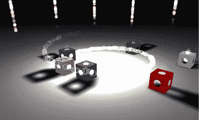
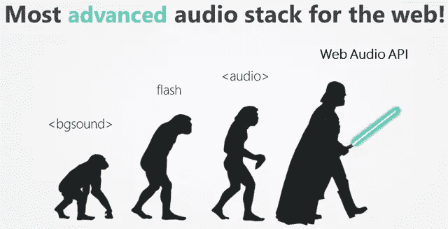
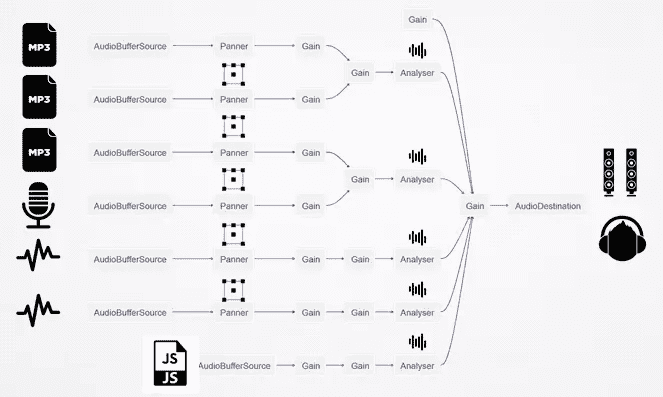
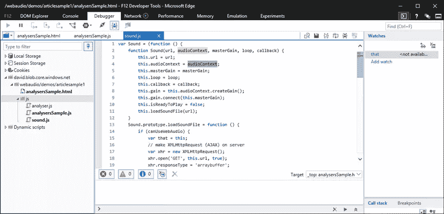
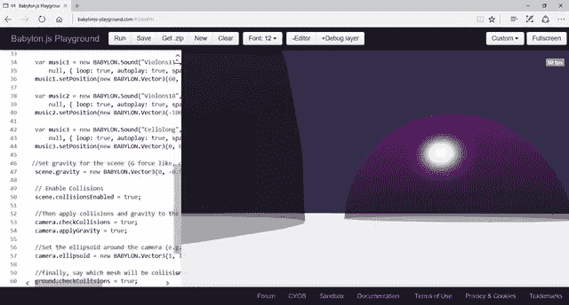
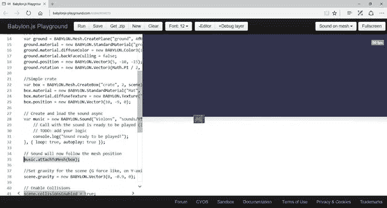
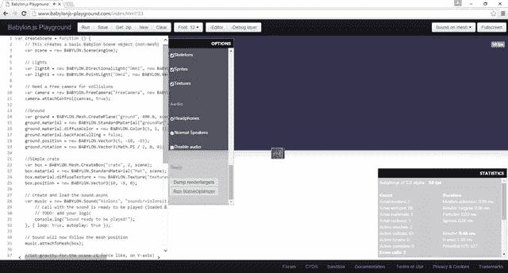
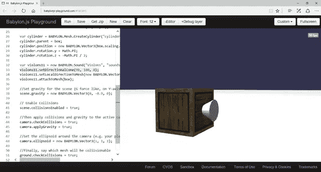
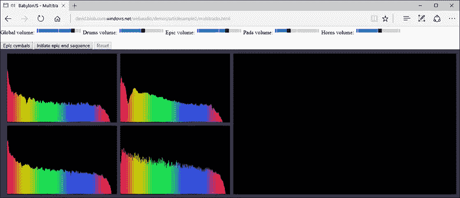

# 使用网络音频创建有趣且身临其境的音频体验

> 原文：<https://www.sitepoint.com/creating-fun-immersive-audio-experiences-web-audio/>

本文是微软网站开发系列的一部分。感谢您对使 SitePoint 成为可能的合作伙伴的支持。

今天，感谢 [**网络音频** API](https://dev.windows.com/en-us/microsoft-edge/platform/status/?utm_source=SitePoint&utm_medium=article66&utm_campaign=SitePoint/webaudioapi?filter=f3f0000bf&search=web%20audio) 的力量，你可以直接在浏览器中创建**沉浸式音频体验**——这里不需要任何插件**。今天，我想和大家分享我在构建我们的 [Babylon.js](http://www.babylonjs.com/?WT.mc_id=16530-DEV-sitepoint-article66) 开源游戏引擎的音频引擎时所学到的东西。**

在这篇文章结束时，你会知道如何建立这种体验:



**用法:**用鼠标移动立方体或触摸白色圆圈的中心附近，在使用 WebGL &网络音频的 3D 体验中混合[我的音乐](https://soundcloud.com/david-rousset/coding4fun-ms-techdays-2015)。查看[源代码](https://github.com/MicrosoftEdge/Demos/tree/master/musiclounge)。

## 简而言之，网络音频

网络音频是最先进的网络音频堆栈。



从[学习网络音频 API](http://www.devbattles.com/en/sand/post-69-Learn+Web+Audio+API)

如果你曾经尝试过使用 HTML5 音频元素来播放一些声音或音乐之外的其他事情，你就会知道它有多有限。网络音频可以让你打破所有的障碍，让你**访问完整的音频流和音频管道**，就像在任何现代本地应用程序中一样。它的工作要归功于由音频节点组成的**音频路由图。这给了你**对时间、滤波器、增益、分析器、卷积器和 3D 空间化的精确控制**。**

它现在得到了广泛的支持(微软 Edge，Chrome，Opera，Firefox，Safari，iOS，Android，FirefoxOS 和 Windows Mobile 10)。在 Edge 中(但我猜在其他浏览器中也是如此)，它被**呈现在一个独立的线程**中，而不是 JS 主线程中。这意味着几乎在任何时候，如果**对你的应用程序或游戏没有性能影响**，它将很少。所有浏览器支持的编解码器至少是 WAV 和 MP3 ，其中一些还支持 OGG。Edge even [支持多声道杜比数字加音频格式！](http://blogs.windows.com/msedgedev/2015/05/26/announcing-dolby-audio-for-high-performance-audio-in-microsoft-edge/?WT.mc_id=16530-DEV-sitepoint-article66)！然后，您需要注意构建一个可以在任何地方运行的 web 应用程序，并为所有浏览器提供潜在的多个来源。

### 音频路由图解释



**注:** *这张图片是使用 Firefox DevTools 的 awesome Web Audio 标签中显示的图表制作的。[我喜欢这个工具。](https://twitter.com/davrous/status/660130281752522752):)以至于我打算通过一个 [Vorlon.js](http://www.vorlonjs.io/?WT.mc_id=16530-DEV-sitepoint-article66) 插件来模仿它。我已经开始着手这项工作，但它仍然是非常早期的草案。*

让我们看看这张图表。每个节点都可以有一些东西作为输入，并连接到另一个节点的输入。在这种情况下，我们可以看到 MP3 文件充当 **AudioBufferSource** 节点的源，连接到**声相器**节点(提供空间化效果)，连接到**增益**节点(音量)，连接到**分析器**节点(可以实时访问声音的频率)，最后连接到**音频目的地**节点(您的扬声器)。你也可以看到你可以控制一个特定声音的音量(增益)或者同时控制几个声音。例如，在这种情况下，我通过目的节点之前的最终增益节点处理了一个“全局音量”,并在分析器节点之前放置了一些增益节点的某种音轨音量。

最后，网络音频提供了 2 个[心理声学](https://en.wikipedia.org/wiki/Psychoacoustics)模型来模拟空间化:

*   **equalpower** (默认设置)支持笔记本电脑的经典扬声器或落地扬声器。
*   **HRTF** ，它模拟[双耳录音](https://en.wikipedia.org/wiki/Binaural_recording)，为耳机提供最佳效果。

**注意:** *MS Edge 目前只支持 equalpower。*

您已经为基础做好了准备。要开始使用一些代码，我建议您阅读以下资源:

*   W3C 规范:[http://webaudio.github.io/web-audio-api/](http://webaudio.github.io/web-audio-api/)。再说一次，我仅仅通过阅读说明书就学到了很多。
*   [Web Audio API 入门，用 Web Audio API 开发游戏音频，在 HTML5 Rocks 上混合位置音频和 WebGL](http://www.html5rocks.com/en/tutorials/webaudio/intro/) 。绝对是牛逼的内容。它们有时包含不赞成使用的演示链接(使用以前的网络音频规范)，但大多数时候它们仍然非常相关。还要注意演示中使用的编解码器，您的浏览器不支持它。
*   [将网络音频引入微软 Edge，实现可互操作的游戏和发烧友媒体](http://blogs.windows.com/msedgedev/2015/05/19/bringing-web-audio-to-microsoft-edge-for-interoperable-gaming-and-enthusiast-media/?WT.mc_id=16530-DEV-sitepoint-article66)，这是一项最新、最准确的资源。

例如，让我们想象我们想要创建这样一个音频图:


我想播放两个同步音乐，每个都有自己的增益连接到自己的分析器。这意味着我们将能够在单独的画布上显示每首音乐的频率，并单独播放每首音乐的音量。最后，我们将有一个全局音量，它将同时作用于两种音乐，还有第三个分析器，它将显示累积在第三块画布上的两种音乐的频率。

你可以在这里找到演示:[analysersSample.html](https://david.blob.core.windows.net/webaudio/demos/articlesample1/analysersSample.html)


只需使用您最喜欢的浏览器和 F12 工具查看源代码。



**sound.js** 正在抽象加载声音、解码和播放声音的逻辑。 **analyser.js** 正在抽象使用网络音频分析器和在 2D 画布上显示频率的工作。最后，**analyser sample . js**使用这两个文件来创建上面的结果。

使用滑块来操作每个轨道上的音量或全局音量，以查看正在发生的事情。例如，试着理解如果你把总音量调到 0，为什么你仍然可以看到 2 个分析仪在右边显示数据？

为了能够同步播放这两个音轨，你只需要通过一个 XHR2 请求加载它们，解码声音，一旦这两个异步操作完成，只需在它们每个上调用 Web 音频播放功能。

## Babylon.js 的网络音频

### 基础

在处理音频堆栈时，我想保持我们的“*简单&强大*的哲学。即使网络音频没有那么复杂，它对我来说仍然非常冗长，你很快就在做无聊和重复的任务来构建你的音频图。然后我的目标是封装它，提供一个非常简单的抽象层，让人们**创造 2D 或 3D 声音，而不是一个声音工程师**。

这是我们选择用来创造声音的签名:

```
varnewSound = new BABYLON.Sound("nameofyoursound", "URLToTheFile",
yourBabylonScene,
callbackFunctionWhenSoundReadyToBePlayed,
optionsViaJSONObject);
```

例如，下面是如何在 Babylon.js 中创建新的声音:

```
 varsound1 = new BABYLON.Sound("sound1", "./sound1.mp3", scene,
  null, { loop: true, autoplay: true }
);

varsound2 = new BABYLON.Sound("sound2", "./sound2.wav", scene,
  function() { sound2.play(); },
  { playbackRate: 2.0 }
);

varstreamingSound = new BABYLON.Sound("streamingSound", "./sound3.mp3", scene,
  null, { autoplay: true, streaming: true }
); 
```

当第一个声音从 web 服务器加载并被 Web Audio 解码后，它将自动循环播放。

第二个声音将播放一次，这要感谢回调函数，一旦解码并准备好播放，该函数将触发其上的`play()`函数。它也将以 2 倍的回放速度播放。

最后一个声音是使用了“`streaming: true`”选项。这意味着我们将使用 **HTML5 音频元素**，而不是使用 XHR2 请求和 Web 音频`AudioBufferSource`对象。如果你想流式播放一首音乐，而不是等着完全下载，这可能会很有用。不过，你可以在这个 HTML5 音频元素上应用网络音频的所有魔力:分析器、3D 空间化等等。

你可以把这种逻辑运用到我们的游戏中，比如这个非常简单的例子:[http://www.babylonjs-playground.com/index.html?22](http://www.babylonjs-playground.com/index.html?22/?WT.mc_id=16530-DEV-sitepoint-article66)

### 引擎，轨道和记忆足迹

网络音频音频上下文仅在最后一刻创建。当在 Babylon.js 主引擎构造函数中创建 Babylon.js 音频引擎时，它只检查 Web 音频支持并设置一个标志。同样，每一个声音都存在于一个声道中。默认情况下，声音将被添加到附加到场景的主声道中。

只有在第一次调用 *new BABYLON 之后，才真正创建 Web 音频上下文和主轨道(包含连接到全局音量的自己的增益节点)。音()*。

我们这样做是为了避免为不使用音频的场景创建一些音频资源，这是今天我们在[http://www.babylonjs.com/](http://www.babylonjs.com/?WT.mc_id=16530-DEV-sitepoint-article66)主持的大多数场景的情况。尽管如此，音频引擎仍然可以随时调用。这也有助于我们将音频引擎从核心游戏引擎中分离出来，如果我们想要构建一个内部没有任何音频代码的核心版本 Babylon.js 以使其更加轻量级的话。最后，我们目前正在与大型工作室合作，他们非常关注所使用的资源。

为了更好地理解这一点，我们将使用 Firefox 及其网络音频标签。

–导航至:[http://www.babylonjs-playground.com/](http://www.babylonjs-playground.com/?WT.mc_id=16530-DEV-sitepoint-article66)并通过 F12 打开网络音频标签。您应该看到:


尚未创建任何音频上下文。

–进入左侧的游乐场编辑器，在“*返回场景*之前添加这行代码，例如:

```
varmusic = new BABYLON.Sound("Violons", "sounds/violons11.wav",
  scene, null, { loop: true, autoplay: true }
);
```

–您现在应该会在 F12 中看到这个音频图:


在第一次调用`new BABYLON.Sound()`之后，已经动态创建了音频上下文以及主音量、主音轨音量和与该声音相关联的音量。

### 3D 声音

#### 基础

网络音频受到图书馆中使用的模型的高度启发，如 3D 的 [OpenAL](https://www.openal.org/) (开放音频库)。**大部分 3D 复杂性将由网络音频为你处理。**它将处理声音的三维位置、方向和速度(应用[多普勒效应](https://en.wikipedia.org/wiki/Doppler_effect))。

作为一名开发人员，您需要请求 Web Audio 在 3D 空间中定位您的声音，并使用`setPosition()`和`setOrientation()`功能设置和/或更新 [Web 音频监听器](http://webaudio.github.io/web-audio-api/#AudioListener)(您的虚拟耳朵)的位置和方向。但是如果你不是 3D 大师，这可能有点复杂。这就是为什么，我们在 Babylon.js 中为您做这些。我们正在用我们的摄像机在 3D 世界中的位置更新网络音频监听器。这就像**一些虚拟的耳朵**(听众)**被粘在一些虚拟的眼睛**(摄像机)上。

到目前为止，我们一直使用 2D 声音。要将声音转换为空间声音，您需要通过以下选项进行指定:

```
varmusic = new BABYLON.Sound("music", "music.wav",
  scene, null, { loop: true, autoplay: true, spatialSound: true }
);
```

空间声音的默认属性是:

*   默认情况下，距离模型(衰减)使用一个“**线性**方程。其他选项有“*逆*或“*指数*”。
*   最大距离设置为 **100** 。这意味着，一旦听者距离声音超过 100 个单位，音量将为 0。你再也听不到声音了。
*   panningModel 按照规范设置为“ **equalpower** ”。另一个可用的选项是“ *HRTF* ”。该规范称它是:“*一种更高质量的空间化算法，使用与人类对象的测量脉冲响应的卷积。这种平移方式呈现立体声输出*。这是使用耳机时的最佳算法。

**最大距离**仅在使用*线性*衰减时使用。否则，您可以使用**衰减因子**和 **refDistance** 选项调整其他型号的衰减。默认情况下，两者都设置为 1，但是您当然可以更改它。

例如:

```
varmusic = new BABYLON.Sound("music", "music.wav", scene, null, {
  loop: true, autoplay: true, spatialSound: true,
  distanceModel: "exponential", rolloffFactor: 2
});
```

声音在 3D 世界中的默认位置是 *(0，0，0)* 。要改变这种情况，使用`setPosition()`功能:

```
music.setPosition(new BABYLON.Vector3(100, 0, 0));
```

为了更好地理解，请[到我们的游乐场看一看这个样品](http://www.babylonjs-playground.com/#2AH4YH/?WT.mc_id=16530-DEV-sitepoint-article66):



使用键盘和鼠标进入场景。每个声音都由一个紫色的球体代表。当你进入一个球体时，你会开始听到一种音乐。声音在球体中心较大，离开球体时降至 0。您还会注意到，声音在左右扬声器以及前/后扬声器之间得到了平衡(仅使用经典立体声扬声器时很难注意到这一点)。

#### 将声音附加到网格

之前的演示很酷但是没有达到我的“**简单&强大**栏。我想要更简单易用的东西。我最终采用了以下方法。

简单地创造一个*巴比伦。声音*，把它附加到一个现有的网格上，你就完成了！只有 2 行代码！如果网格在移动，声音也会跟着移动。你什么都不用做，其他一切都由 Babylon.js 处理。

下面是要使用的代码:

```
 varmusic = new BABYLON.Sound("Violons", "sounds/violons11.wav",
  scene, null, { loop: true, autoplay: true }
);

// Sound will now follow the box mesh position
music.attachToMesh(box); 
```

在声音上调用`attachToMesh()`功能会自动将其转换为空间 3D 声音。使用上面的代码，您将进入默认的 Babylon.js 值:一个*线性*衰减，一个*最大距离*为 100，一个类型为“ *equalpower* 的平移模型。

戴上耳机，[把这个样品放到我们的操场上](http://www.babylonjs-playground.com/index.html?23/?WT.mc_id=16530-DEV-sitepoint-article66):



不要移动摄像机。当立方体移动时，你应该听到我的音乐在你头上旋转。想要使用耳机获得更好的体验吗？

在支持 HRTF 的浏览器(如 Chrome 或 Firefox)中启动相同的演示，单击“**调试层**按钮显示它，并向下滚动到音频部分。**将**当前平移模式**从“普通扬声器”** (equalpower) **切换到“耳机”** (HRTF)。你应该享受稍微好一点的体验。如果不是，换你的耳机…或者你的耳朵。；-)



**注意:**您也可以使用箭头键&鼠标(像在 FPS 游戏中一样)移动到 3D 场景中，以检查 3D 声音定位的影响。

#### 创建空间定向 3D 声音

默认情况下，空间声音是全向的。但是如果你愿意，你可以有方向性的声音。

**注意:**方向声音只对附着在网格上的空间声音有效。

下面是要使用的代码:

```
 varmusic = new BABYLON.Sound("Violons", "violons11.wav", 
  scene, null, { loop: true, autoplay: true }
);
music.setDirectionalCone(90, 180, 0);
music.setLocalDirectionToMesh(new BABYLON.Vector3(1, 0, 0));
music.attachToMesh(box); 
```

`setDirectionalCone`取 3 个参数:

*   **内锥角**:内锥的大小，单位为度
*   **外锥角**:外锥的大小，单位为度
*   **外锥增益**:当你在外锥之外时的音量(在 0.0 和 1.0 之间)

圆锥的外角必须大于或等于内角，否则将记录错误，定向声音将不起作用。

简单来说就是圆锥体相对于你所附着的网格的方向。默认情况下是 *(1，0，0)* 。如果你想的话。

您可以使用[我们操场上的这个样本](http://www.babylonjs-playground.com/#1BO0YS/?WT.mc_id=16530-DEV-sitepoint-article66)来更好地理解输出:



进入 3D 场景。如果你在由灰色圆锥体定义的**空间内，你应该能听到音乐，否则你将听不到音乐，因为**圆锥体增益**被设置为 0。**

### 更进一步

播放我们著名的**大厦网络音频** [演示](http://www.babylonjs.com/index.html?MANSION/?WT.mc_id=16530-DEV-sitepoint-article66):


尝试在豪宅场景中找到互动对象，它们几乎都与声音相关联。为了构建这个场景，我们 3D 艺术家**米歇尔·鲁索没有使用一行代码！**他完全使用我们新的动作生成器工具和 3DS Max 来制作。动作生成器目前确实只在我们的 3DS Max 导出器中可用。我们将很快在我们的[沙盒工具](http://www.babylonjs.com/sandbox/?WT.mc_id=16530-DEV-sitepoint-article66)中展示它。如果你有兴趣建立类似的体验，请阅读这些文章:

*   来自[的 Julien Moreau-Mathis](https://twitter.com/Luaacro) 的动作构建器，我们 Babylon.js 了不起的实习生，他制作了这个工具。
*   [由](http://blogs.msdn.com/b/designmichel/archive/2015/10/20/create-actions-in-babylonjs.aspx?WT.mc_id=16530-DEV-sitepoint-article66)[米歇尔·鲁索](https://twitter.com/rousseau_michel)在 BabylonJS 中创建动作。他在这里解释了如何以一种基本的方式使用动作。他用同样的方法构建了[大厦演示](http://www.babylonjs.com/index.html?MANSION/?WT.mc_id=16530-DEV-sitepoint-article66)，因为动作生成器也支持声音动作。

但是，要明确了解和学习我们如何在游戏引擎中使用网络音频，最好的方法是**阅读我们的源代码**:

*   [巴比伦。AudioEngine](https://github.com/BabylonJS/Babylon.js/blob/master/src/Audio/babylon.audioEngine.ts) 由 Babylon.js 核心引擎创建为静态。
*   [巴比伦。包含几种声音的音轨](https://github.com/BabylonJS/Babylon.js/blob/master/src/Audio/babylon.soundtrack.ts)。你至少创建了一个音轨，如果你正在创建一个声音，这是主音轨。
*   [巴比伦。声音](https://github.com/BabylonJS/Babylon.js/blob/master/src/Audio/babylon.sound.ts)包含您将与之交互的主要逻辑。
*   [巴比伦。可以连接到音频引擎本身(通过全局音量查看输出)或特定轨道上的分析器](https://github.com/BabylonJS/Babylon.js/blob/master/src/Audio/babylon.analyser.ts)。

也请看看[巴比伦。场景](https://github.com/BabylonJS/Babylon.js/blob/master/src/babylon.scene.ts)和`_updateAudioParameters()`功能，以了解我们如何基于摄像机的当前位置&方向更新网络音频监听器。

最后，这里有一些有用的资源可供阅读:

*   在那里你将学到我还没有在 Babylon.js 中实现的东西，比如 convolvers。

## 使用多轨道和分析仪构建演示

为了向您展示使用我们的 Babylon.js 音频堆栈可以快速做些什么，我制作了[这个有趣的演示](https://david.blob.core.windows.net/webaudio/demos/articlesample2/multitracks.html):



它使用了 Babylon.js 的几个功能，如自动加载远程 WAV 文件并显示默认加载屏幕的**资产加载器**、**多音轨**和几个连接到音轨的**分析器对象**。

请通过您的 F12 工具查看 **multitracks.js** 的源代码，检查它是如何工作的。

[这个演示](https://david.blob.core.windows.net/webaudio/demos/articlesample2/multitracks.html)是基于我过去创作的一首音乐，我对它进行了轻微的改编:[极客委员会](https://soundcloud.com/david-rousset/the-geek-council)。您可以通过使用滑块来为音乐的第一部分进行自己的混音。您可以尽可能快地多次点击“ ***【史诗钹】*** ”按钮来添加戏剧效果。最后，点击 ***启动史诗结束序列*** 。它将等待当前循环的结束，并将停止 4 首曲目(鼓、史诗背景、垫&喇叭)以播放最后的史诗序列！:)点击 ***复位*按钮从头重新启动。**

**注意:**事实证明，**有很好的声音循环**，没有任何故障，**你需要避免使用 MP3** 正如在这个[论坛](http://www.html5gamedevs.com/topic/10976-seamless-loop/):*中解释的那样，最简单的解决办法就是不使用. MP3。ogg 或. m4a，你会发现声音循环完美无缺，只要你从原始的未压缩音频源生成这些文件，而不是从 mp3 文件！压缩为 mp3 的过程会在音频的开头插入几毫秒的静音，使 mp3 不适合循环播放声音。我在某处读到过，静音实际上应该是文件头信息，但它被错误地当作声音数据！*”。这就是为什么，我在这个演示中使用 WAV 文件。这是唯一适用于所有浏览器的干净解决方案。

## 音乐休息室演示怎么样？

[音乐休息室演示](https://dev.windows.com/en-us/microsoft-edge/testdrive/demos/musiclounge/?utm_source=SitePoint&utm_medium=article66&utm_campaign=SitePoint)基本上重复使用了之前描述的所有东西。但是你缺少一个能够重新创建它的最后部分，因为它基于一个我还没有解释的特性:T0。

您可以选择**向 Babylon.js 提供自己的衰减函数**来替换 Web Audio 提供的默认函数(线性、指数和逆函数)，正如我们的文档中的[所解释的那样。](http://doc.babylonjs.com/tutorials/16._Playing_sounds_and_music#creating-your-own-custom-attenuation-function)

例如，如果你正在尝试这个[操场演示](http://www.babylonjs-playground.com/#1YIXEO/?WT.mc_id=16530-DEV-sitepoint-article66)，你会看到我正在使用这个愚蠢的衰减函数:

```
music.setAttenuationFunction(function (currentVolume, currentDistance,
maxDistance, refDistance, rolloffFactor) {
  returncurrentVolume * currentDistance / maxDistance;
});
```

在物体附近，体积几乎为 0。越远，声音越大。这完全违背直觉，但它是一个示例，可以让您了解这个想法。

在音乐休息室演示的情况下，它非常有用。事实上，每个轨迹的体积并不取决于每个立方体与摄像机的距离，而是取决于立方体与白色圆圈中心的距离。如果你正在查看[源代码](https://github.com/MicrosoftEdge/Demos/blob/master/musiclounge/src/musicLounge.soundCube.ts)，神奇的事情就发生在这里:

```
 attachedSound.setAttenuationFunction((currentVolume, currentDistance,
  maxDistance, refDistance, rolloffFactor) => {
    vardistanceFromZero = BABYLON.Vector3.Zero()
    .subtract(this._box.getBoundingInfo().boundingSphere.centerWorld)
    .length();

    if(distanceFromZero<maxDistance) { 
      returncurrentVolume * (1 - distanceFromZero / maxDistance); 
    } 
    else{ 
      return 0; 
    }
}); 
```

我们正在计算当前立方体`(this._box)`和恰好是圆心的(0，0，0)坐标之间的距离。基于这个距离，我们为立方体的音量设置了一个线性衰减函数。演示的其余部分是使用连接到各种网格(立方体)的声音和连接到全局体积的分析器对象来制作由粒子组成的外圆的动画。

我希望你会像我写这篇文章时一样喜欢它。我也希望它能给你带来新的想法来创建酷的 Web 音频/ WebGL 应用程序或演示！

## 更多的 Web 开发实践

这篇文章是微软技术倡导者的 web 开发系列的一部分，内容涉及实用的 JavaScript 学习、开源项目和互操作性最佳实践，包括[微软 Edge](http://blogs.windows.com/msedgedev/2015/05/06/a-break-from-the-past-part-2-saying-goodbye-to-activex-vbscript-attachevent/?WT.mc_id=16530-DEV-sitepoint-article66) 浏览器和新的 [EdgeHTML 渲染引擎](http://blogs.windows.com/msedgedev/2015/02/26/a-break-from-the-past-the-birth-of-microsofts-new-web-rendering-engine/?WT.mc_id=16530-DEV-sitepoint-article66)。

我们鼓励您使用 [dev.modern.IE](https://dev.windows.com/en-us/microsoft-edge/?utm_source=SitePoint&utm_medium=article66&utm_campaign=SitePoint) 上的免费工具跨浏览器和设备进行测试，包括 Windows 10 的默认浏览器 Microsoft Edge:

*   [扫描你的网站，寻找过时的库、布局问题和可访问性](http://dev.modern.ie/tools/staticscan/?utm_source=SitePoint&utm_medium=article66&utm_campaign=SitePoint)
*   [下载适用于 Mac、Linux 和 Windows 的免费虚拟机](http://dev.modern.ie/tools/vms/windows/?utm_source=SitePoint&utm_medium=article66&utm_campaign=SitePoint)
*   [跨浏览器检查网络平台状态，包括微软 Edge 路线图](https://dev.modern.ie/platform/status/?utm_source=SitePoint&utm_medium=article66&utm_campaign=SitePoint)
*   [在您自己的设备上远程测试 Microsoft Edge](https://remote.modern.ie/?utm_source=SitePoint&utm_medium=article66&utm_campaign=SitePoint)

从我们的工程师和传道者那里获得更深入的学习:

*   GitHub 上的编码实验室:跨浏览器测试和最佳实践
*   【2015 年微软 Edge 网络峰会(来自我们的工程团队和 JS 社区)
*   哇，我可以在 Mac 电脑上测试 Edge & IE 浏览器& Linux！(来自雷伊·班戈)
*   [在不破坏网络的情况下推进 JavaScript】(来自 Christian Heilmann)](http://channel9.msdn.com/Events/WebPlatformSummit/2015/Advancing-JavaScript-without-breaking-the-web/?WT.mc_id=16530-DEV-sitepoint-article66)
*   使网络正常工作的边缘渲染引擎(Jacob Rossi)
*   [用 WebGL 释放 3D 渲染](https://channel9.msdn.com/Events/WebPlatformSummit/2015/Unleash-3D-rendering-with-WebGL-and-Microsoft-Edge/?WT.mc_id=16530-DEV-sitepoint-article66)(来自 David Catuhe)
*   托管网络应用和网络平台创新(来自律师奶爸和基里尔·赛克谢诺夫)

我们的社区开源项目:

*   伏龙。JS (跨设备远程 JavaScript 测试)
*   [manifoldJS](http://manifoldjs.com/?WT.mc_id=16530-DEV-sitepoint-article66) (部署跨平台托管的 web 应用)
*   [babylonJS](http://babylonjs.com/?WT.mc_id=16530-DEV-sitepoint-article66) (轻松制作 3D 图形)

更多免费工具和后端 web 开发工具:

*   [适用于 Linux、MacOS 和 Windows 的 Visual Studio 代码](https://code.visualstudio.com/?WT.mc_id=16530-DEV-sitepoint-article66)
*   [用节点编码。JS](https://www.microsoftvirtualacademy.com/en-US/training-courses/building-apps-with-node-js-jump-start-8422/?WT.mc_id=16530-DEV-sitepoint-article66) 和[在 Azure 上免费试用](https://azure.microsoft.com/en-us/pricing/free-trial/?WT.mc_id=16530-DEV-sitepoint-article66)

## 分享这篇文章