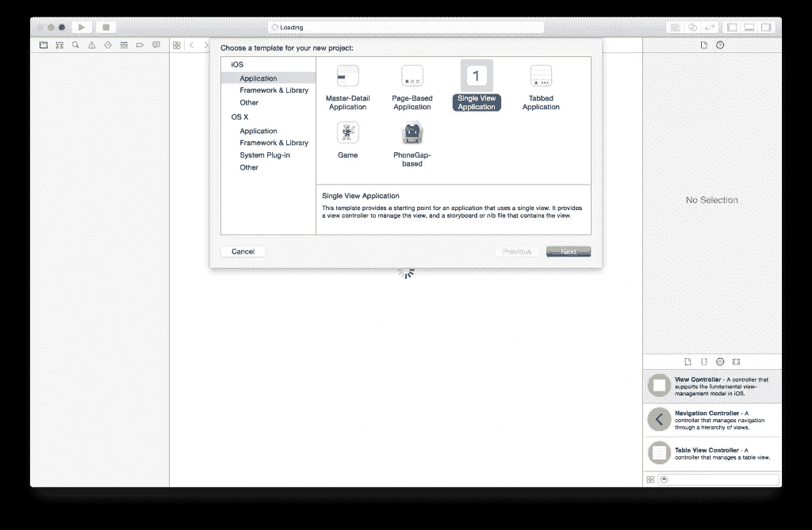
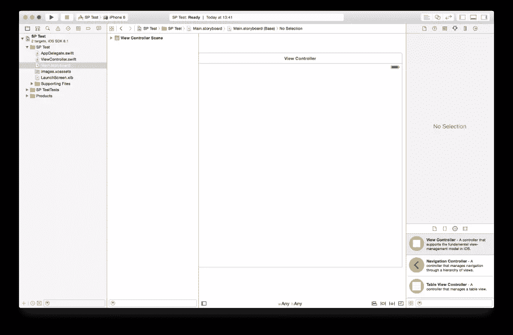
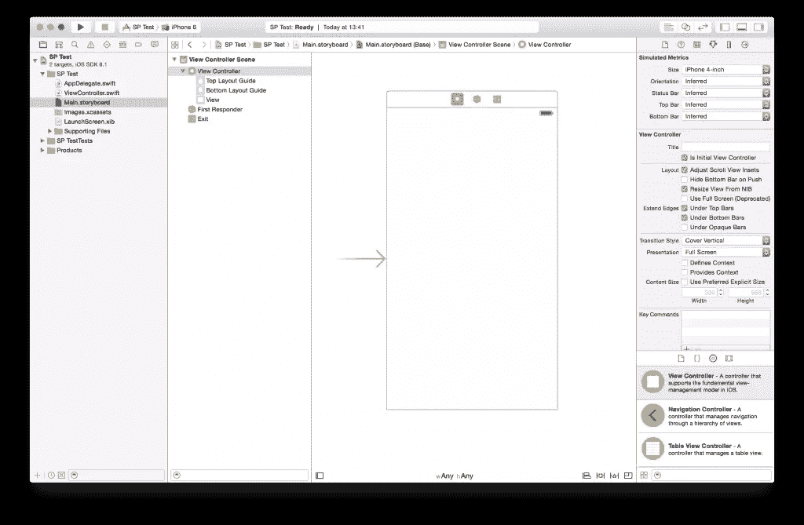
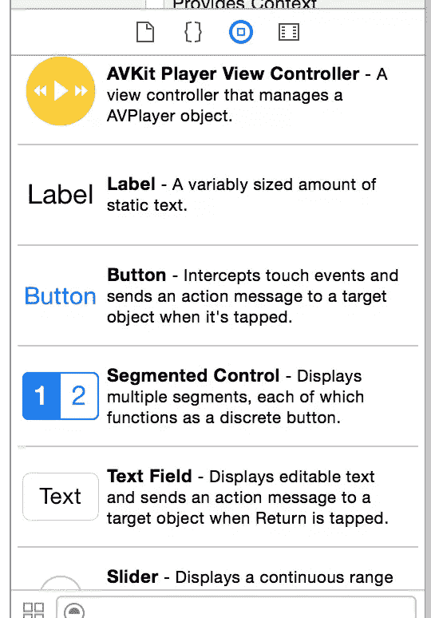
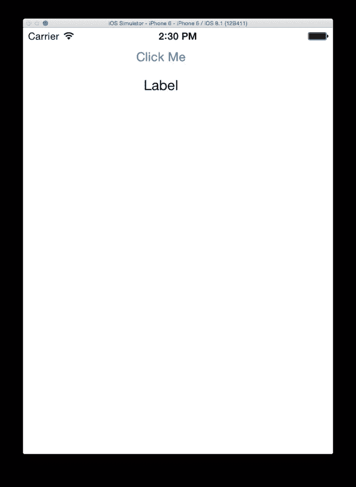
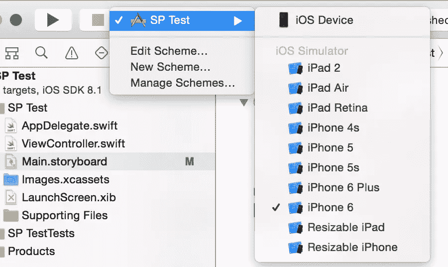
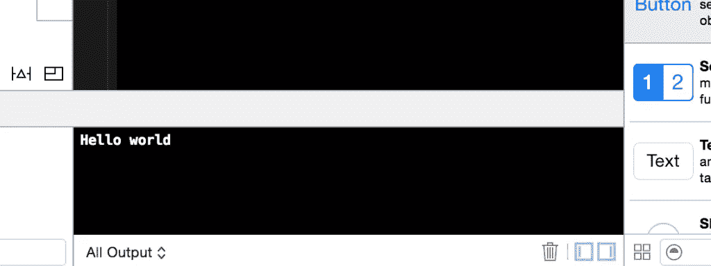

# 使用 Swift 创建“Hello World”应用程序

> 原文：<https://www.sitepoint.com/creating-hello-world-app-swift/>

早在六月，苹果公司宣布了 Swift 编程语言，如果你和我一样，它可能会让你思考

> “也许现在是我学习如何为 iOS 设备和 Mac 开发应用程序的时候了”

当然，学习 Swift 的真正“最佳时间”是不久前的*，但是与 Objective-C 相比，Swift 有许多令人喜爱的地方:*

 *1.  很现代。
2.  很干净。
3.  很安全。

它并不是没有缺陷，毕竟它是一门年轻的语言，但这些缺陷并不严重，初学者不应该从 Swift 开始。Objective-C 已在现实世界中使用多年，但 Swift 才是未来。

为了步入未来，我们将在 Swift 中制作一个简单的“Hello World”示例，同时涵盖 iOS 开发的绝对基础知识。

我们开始吧。

## 先决条件

对于本教程，请从 Mac App Store 下载最新版本的 Xcode。这是我们用来制作 iPhone 和 Mac 应用程序的 IDE。还要注意，本教程并不是一个完整的编程初学者指南。我会假设对变量和函数等概念有基本的理解。

## 步骤 1:创建一个项目

打开 Xcode 后，点击“*文件*菜单，将鼠标悬停在“*新建*选项上，然后选择“*项目*”。您应该会看到类似这样的内容:



这里我们看到了许多创建 iOS 应用程序的模板。这些模板都包括一些默认代码，可以帮助我们节省时间。我们现在将选择“单一视图应用程序”选项。这是最少的默认代码，是学习基础知识的最佳选择。

点击*下一个*按钮，填写以下详细信息:

*   **产品名称**。这是您的应用程序的名称。
*   **机构名称**。输入您的姓名或您公司的名称。
*   **组织标识**。通常，这被格式化为反向域名(所以类似于`com.davidturnbull`)。
*   **语言**。将此设置为“快速”。
*   **设备**。将此设置为“iPhone”。
*   **使用核心数据**。不要勾选此项。

再次点击*下一个*按钮。将会出现一个对话框来保存项目，所以选择一个方便的位置。

项目保存后，会出现一系列不同的选项。这可能会让 Xcode 感到不知所措，但请放心，我们可以忽略屏幕上看到的大部分内容。现在我们只担心基本问题。

## 第二步:设计界面

在屏幕的左侧，我们可以看到“*导航器*窗格。这是我们在项目中用来导航文件的。Xcode 为我们创建了一些文件，但是现在，请点击`Main.storyboard`文件。

您应该看到以下内容:



这里我们看到一个白色的“视图控制器”方块，在制作 iPhone 应用时，一个视图控制器基本相当于一个*屏幕*。因此，如果你打开 iPhone 上的“时钟”应用程序，我们可以看到它有四个主屏幕，因此至少有四个视图控制器:

*   世界时钟
*   警报
*   跑表
*   计时器

这不是一个完美的定义，但目前来看，可以假设视图控制器是一个更好的屏幕名称。

奇怪的是，我们的视图控制器是一个正方形。但是 iPhone 本身不是方形的。怎么回事？嗯，因为不同的设备有不同的屏幕尺寸，所以我们鼓励设计界面，使其能够适应这些不同的要求。

要关闭这个特性(这超出了本教程的范围)，请完成以下步骤:

1.  单击白色正方形内的任意位置以选择视图控制器。
2.  从右侧边栏中选择“属性检查器”。
3.  将“大小”选项更改为任何“iPhone”选项。

由于这一变化，视图控制器现在应该是矩形的。



在这一点上，我们将通过在界面中间添加一个按钮来增加界面的趣味性。要实现这一点，看一看“*对象库*”。

该库包含一系列我们可以放入界面的对象，如果您滚动(或搜索)列表，您会发现一个“*按钮*对象:



将该按钮从库中拖到视图控制器中。你可能会看到蓝线出现，这有助于我们的设计符合苹果的人机界面准则。若要更改按钮的文本，请双击该按钮并将其更改为“单击我”。

按下此按钮后，点按 Xcode 左上角的“播放器”箭头。这将在 iOS 模拟器中运行我们的应用程序，因此我们可以更好地了解应用程序在模拟设备上的外观。加载一段时间后，您应该会看到如下所示的内容:



要在一系列模拟设备上测试应用程序，请在播放按钮旁边的“*方案*菜单中选择可用选项:



## 第三步:编写 Swift 代码

要开始写一些 Swift 代码，打开“*助理编辑器*”。你可以在屏幕的右上角找到这个按钮。点击按钮后，会出现一个包含一些代码的文件。这是`ViewController.swift`文件，它包含了与我们的视图控制器相关的代码。

目前，忽略除这一部分之外的所有代码:

```
override func viewDidLoad() {
    super.viewDidLoad()
    // Do any additional setup after loading the view, typically from a nib.
}
```

这里，我们有一个名为`viewDidLoad`的函数，这个函数将在视图加载后立即执行。因为我们的应用程序只有一个视图，所以应用程序一加载，代码就会执行。

要查看这一点，请在函数的底部编写以下内容:

```
println(&quot;Hello world&quot;)
```

`println`函数用于向控制台输出一些东西。在本例中，我们输出带有“Hello world”的文本。请注意，我们没有使用分号来结束语句。这是因为 Swift 不需要分号。你*可以*写它们，但是它们没有必要。

再次运行模拟器，请注意，当应用程序加载时，Xcode 窗口底部会出现另一个面板。这是“调试”窗格，在它的右侧，我们可以看到带有“Hello world”文本的控制台。



## 步骤 4:创建一个操作

下一步是当用户单击“Click Me”按钮时，而不是当视图加载时，在控制台中显示一条消息。

要实现这一点:

1.  按住 CTRL 键。
2.  点击“点击我”按钮。
3.  将光标拖动到`ViewController.swift`文件中。

*最好将光标拖动到`viewDidLoad`功能的正上方:*

将出现一个带有一系列选项的窗口。我们将改变其中的两个:

1.  将“连接”选项设置为“操作”。
2.  将“名称”选项设置为“按钮已按下”。

这里，我们创建了一个*动作*，动作允许界面元素响应事件。在这种情况下，“点击我”按钮将响应“触摸内部”事件。(这只是一个常见的“轻击”事件。)

至于“名称”选项，这允许我们引用动作。所以我们的动作将被称为`buttonPressed`。

点击"连接"按钮后，下面的代码出现在 Swift 文件中:

```
@IBAction func buttonPressed(sender: AnyObject) {
}
```

关于这个`buttonPressed`函数有一些事情要做，但重要的是要知道，当我们将这个动作附加到按钮上时，这个函数中的代码将在点击按钮时执行。

为了演示这一点，在我们的按钮函数中添加一个`println`函数:

```
@IBAction func buttonPressed(sender: AnyObject) {
    println(&quot;You clicked the button&quot;)
}
```

所以现在，如果我们运行模拟器，每次用户点击按钮时,“你点击了按钮”消息将出现在控制台中。

## 第五步:创造一个出口

最后，我们将让“你点击了按钮”的文本出现在界面内，这样用户就可以真正看到它，为了实现这一点，我们将开始使用 *outlets* 。

Outlets 允许我们通过代码修改部分界面。要查看它们是如何工作的，从库中拖动一个“*标签*对象到界面中。这个对象只是用来显示一串文本。

然后重复我们用按钮完成的步骤:

1.  按住 CTRL 键。
2.  单击我们刚刚创建的标签对象。
3.  将光标拖动到`ViewController.swift`文件中。

这一次，不要改变“*连接*选项。把它设置为“*出口*”即可。您唯一需要更改的是“*名称*”选项，因为这是我们对象的引用。我把我的命名为*我们的标签*。

您应该会在我们的代码中看到以下内容:

```
@IBOutlet var ourLabel: UILabel!
```

由于这个语句，我们现在可以从代码中引用这个`ourLabel`变量，允许我们以编程方式修改标签。

因此，在`buttonPressed`函数中，删除`println`函数，并替换为以下内容:

```
ourLabel.text = &quot;You clicked the button&quot;
```

我们正在做几件事:

1.  我们引用了`ourLabel`对象。

2.  我们修改它的`text`属性。

3.  我们将`text`属性设置为这个“*你点击了按钮*的字符串。

因此，如果我们再次运行模拟器，单击“ *Click Me* ”按钮会将标签的值更改为这个静态文本。

## 结论

在本教程中，我们仅介绍了使用 Swift 制作 iOS 应用程序的绝对基础知识。你可能有很多挥之不去的问题，这很好，iOS 开发是一个大话题，问题是你的朋友。

也就是说，即使只是对销售点和行动的基本了解，也能实现很多目标，所以这里有一个挑战:

在界面中添加一个文本字段，这样每当用户在这个字段中输入内容时，当用户按下按钮时，它的内容就会出现在标签中。如果您不确定从哪里开始，请注意文本字段需要是一个出口。

## 分享这篇文章*