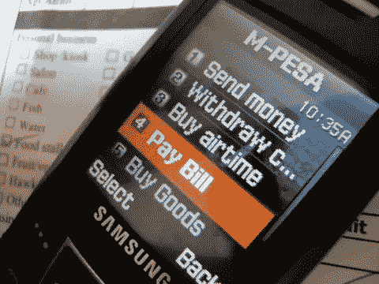
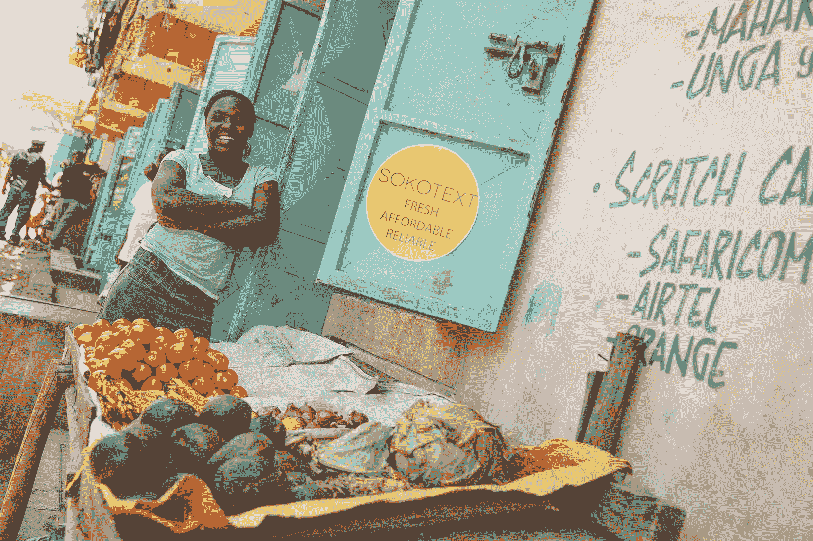
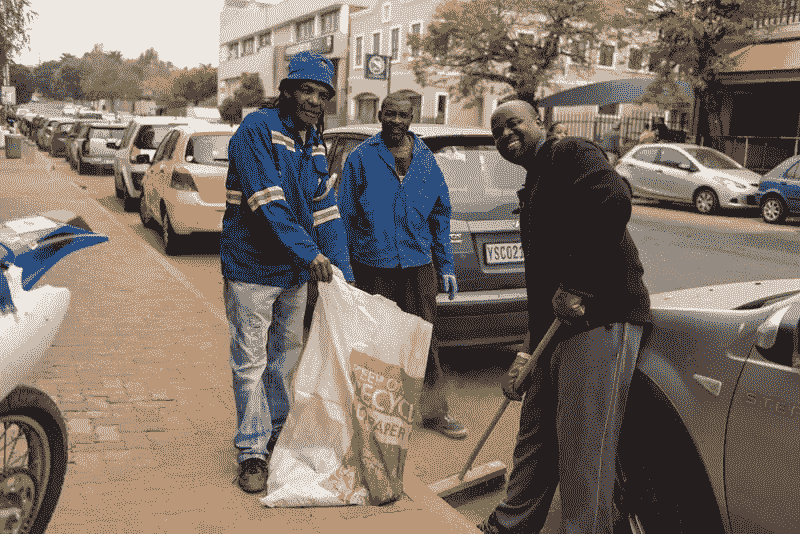
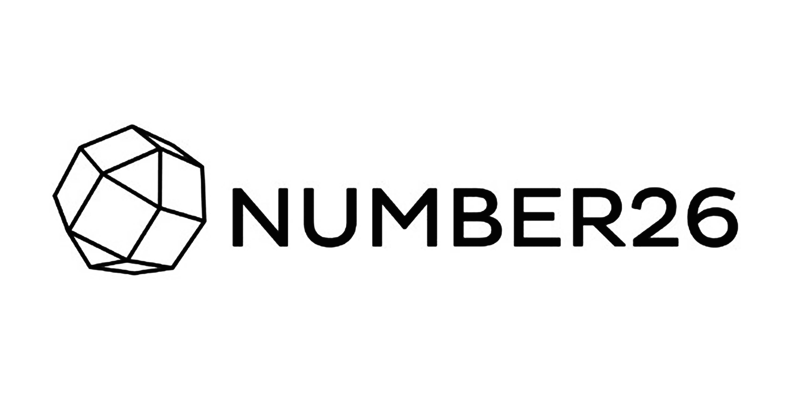

# 为发展中国家创造移动货币解决方案

> 原文：<https://www.sitepoint.com/creating-mobile-money-solutions-for-the-developing-world/>

对于我们这些生活在发达国家的人来说，一个成年人没有银行账户或电脑的想法似乎是一个古老的概念。但对世界上许多地方来说，手机是参与日常金融生活的生命线。本文探讨了使用移动平台的无币货币的现实，并讨论了可能想要探索这一领域的企业家所面临的挑战。

## 没有银行账户的人口有多大？

世界上有 20 亿人，即 38%的成年人，不使用正规的金融服务，73%的穷人由于成本、旅行距离和开设金融账户的繁琐要求而没有银行账户。他们的行列包括发展中国家最贫穷的 40%家庭中超过一半的成年人。

例如，肯尼亚居民更可能使用手机支付服务和数字或实物商品，而不是现金、支票或信用卡。

来源:[世界银行](http://siteresources.worldbank.org/EXTGLOBALFIN/Resources/8519638-1332259343991/world_bank3_Poster.pdf)

## 移动货币平台

以下是我在研究过程中遇到的一些最引人注目或最受欢迎的平台。此列表绝非详尽无遗，但有些是高度本地化或小众的，信息可能很难找到。

### M-Pesa

M-Pesa 是一种基于电话的转账、融资和小额信贷服务，由沃达丰于 2007 年为肯尼亚和坦桑尼亚最大的网络运营商 Safaricom 和 Vodacom 推出。70%的肯尼亚成年人使用这项服务，考虑到[肯尼亚 31%的 GDP 是通过手机消费的](http://qz.com/57504/31-of-kenyas-gdp-is-spent-through-mobile-phones/)，这是一个很大的数字。

该服务使用户能够将钱存入他们手机上存储的账户，使用 pin 安全短信向其他用户(包括商品和服务的卖家)发送余额，以及将存款兑换成常规货币。M-Pesa 客户可以在代理网络中存钱和取钱，代理网络包括充当银行代理的零售网点。

M-Pesa 后来扩展到阿富汗、南非、印度、罗马尼亚和阿尔巴尼亚，并提到它可能继续向东欧其他地方扩展，因为该地区许多人有移动电话，但没有传统的银行账户。

### Sokotext

正如 start up [Sokotext](http://sokotext.com/) 所展示的那样，基于移动的计划并不总是过于复杂。在肯尼亚的城市贫民区，小规模的蔬菜商贩和售货亭老板是获取食物的守门人和关键角色。然而，缺乏资金意味着他们买不起批发，不得不每天长途跋涉去市场购买足够的存货。Sokotext 利用移动电话在贫民窟的广泛使用来解决这些问题。

Sokotext 创建了一个虚拟采购小组，使用手机对需求进行分组，并放开批发价。被称为“Sokotext 女士”的售货亭主人用他们的手机预订。Sokotext 通过位于贫民窟边缘的批发商店汇总订单并管理分销。这是通过 Sokotext 管理的，并导致消费者获得 20%的折扣。Sokotext 已经扩展到哥伦比亚

### 公共财政管理系统(PFMS)健康模块

印度政府开展的一个项目训练被称为“ASHAs”的女性服务员照顾她们社区的孕妇，鼓励她们在健康中心分娩，然后带孩子去接受免疫接种。这个善意的计划遇到了一些妇女没有收到付款的问题。在印度的部分地区，基于纸张的政府运营福利计划在交付现金支付方面速度缓慢且效率低下，并且容易出现腐败和“资金流失”。

印度的一个创新项目[公共财政管理系统健康模块](http://www.worldbank.org/en/news/feature/2015/12/08/bihar-india-digitizing-cash-transfers-improves-womens-health)，通过将福利转移支付系统转移到一个数字化平台来计算付款并将资金直接存入收款人的银行账户，从而实现了流程的自动化。在该方案实施之前，ASHAs 平均要等 191 天才收到付款，而女性受益人要等 58 天才收到付款。四分之一的受益人还报告说，他们必须支付“疏通费”才能获得资金。

### Gem 项目

[GEM 项目](http://gemproject.org)是一个面向南非志愿者的移动奖励平台。用户通过从事社区工作来获得积分，这些社区工作包括垃圾分类、在孤儿院做志愿者、植树或参与社区健康项目。用户通过拨号或应用程序从 [USSD](https://en.wikipedia.org/wiki/Unstructured_Supplementary_Service_Data) 下载宝石。一旦登录，他们就可以看到他们所在地区有哪些志愿服务机会，当他们决定了日期和地点后，该应用程序会告诉他们将获得多少宝石作为感谢。

GEMs 由企业和公共部门赞助商捐赠，并平均分配给举办活动的社会合作伙伴。用户在完成志愿活动的三天内获得奖励，并可以使用他们的 GEM 直接从 GEM 平台购买数据、电力、广播时间或电影票。

## 想参与进来吗？

### 考虑为创业公司工作，而不是自己经营

虽然将自己视为慈善创新者可能很诱人，但不要忽视创建这样一个平台所需的其他有价值的角色。这些包括应用程序开发、服务器部署、网络集成，当然还有安全性。初创企业需要熟悉受众具体需求的营销人员，以及能够分析重要法规以进行谈判的法律人员。

### 一种尺寸不适合所有人

发展中国家并不是同质的。非洲是一个大陆，其中的国家千差万别。与肯尼亚和坦桑尼亚相比，南非有一个更发达的银行市场，这意味着试图将 M-Pesa 整合到这个国家是一个令人沮丧的失败。

### 不要把自己局限在发展中国家

柏林的 bank [Number26](https://number26.de/) 允许用户在下载他们的应用程序后开立一个银行账户并获得一张万事达卡。要开一个账户，用户需要给一个 26 号员工打视频电话，并出示他们的护照。

该应用程序的工作方式就像一个普通的银行账户，允许用户按照自己的意愿存钱和取钱。如果用户怀疑自己的详细信息被盗，它还允许用户通过该应用程序禁用在线支付和 ATM 使用。

另一个安全功能是，该应用程序会发送与帐户相关的所有活动的推送通知。例如，当用户使用万事达卡付款时，他们会在卡仍在读卡器中时收到一条信息。它还允许账户持有人通过该应用程序进行即时银行转账。

第 26 名在 2015 年苹果 iPhone 年度最佳应用和游戏中排名第六，已经在德国和奥地利运营，现在正在扩展到法国、西班牙、意大利、爱尔兰、希腊和斯洛伐克。

### 加密货币可能不是答案

比特币爱好者将希望寄托在 2013 年年中推出的 Kipochi 比特币企业上。它的目的是允许非洲人发送和接收比特币，并在 M-Pesa 之间进行转换。不幸的是，它在发射后不久就被关闭了。

接近 Kipochi 项目的消息人士认为，该项目被关闭是因为它对 Safaricom 占主导地位的 M-PESA 汇款业务构成了竞争威胁。Kipochi 依靠与 M-PESA 网络的整合，将它作为一种交换，将钱放进自己的钱包。

其他人认为，Vice 的一篇文章声称[“三分之一的肯尼亚人现在拥有比特币钱包”](http://motherboard.vice.com/blog/one-third-of-kenyans-now-have-a-bitcoin-wallet)吓坏了肯尼亚监管机构。

### 找到解决现存问题的方法

非洲一个尚未解决的问题是进出非洲大陆的资金转移成本。非洲人汇款 200 美元大约花费 24 美元，是全球平均水平的两倍。根据世界银行的数据，非洲人比任何其他移民群体支付的汇款都多，而且很大一部分非洲人生活在海外，这是谈论非洲金融服务时提出的一个问题。

### 确保移动平台适合低端功能手机。

移动平台需要面向所有人，而不仅仅是那些拥有最新智能手机的人。一个平台需要有短信，USSD 和 HTML5 前端，以确保所有人的可访问性。

## 结论

当最新和最具创新性的技术可能无法解决长期的社会和经济问题时，人们很容易关注这些技术。开发发展中市场的金融科技具有巨大的潜力，但需要特殊的理解和研究。

我很想听听你们的想法，尤其是如果你们中有人来自我提到的一些地区。

## 分享这篇文章