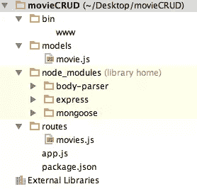
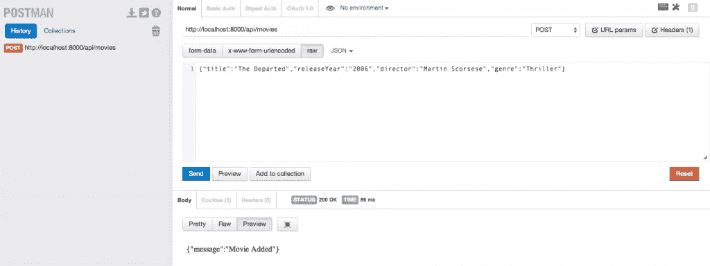

# 使用 Express 4 创建 RESTful APIs

> 原文：<https://www.sitepoint.com/creating-restful-apis-express-4/>

随着 Express 4 的发布，创建 RESTful APIs 变得更加容易。如果你正在创建一个单页面应用程序，你肯定需要一个支持 CRUD 操作的 RESTful web 服务。我的上一篇教程集中在用 Angular 的 [$resource](https://www.sitepoint.com/creating-crud-app-minutes-angulars-resource/) 创建一个单页 CRUD 应用程序。本教程解释了如何使用 Express 4 为这样的 CRUD 应用程序设计后端 API。

请注意，自 Express 3 以来，很多内容都发生了变化。本教程不解释如何将您的应用从 Express 3 升级到 Express 4。相反，它将介绍如何用 Express 4 直接创建 API。那么，我们开始吧。

## 为电影应用程序创建 API

我们的应用程序将是一个简单的电影数据库，支持基本的 CRUD 操作。我们将使用 Express 4 作为 web 框架，使用[mongosejs](http://mongoosejs.com/)作为对象建模工具。为了存储电影条目，我们将使用 MongoDB。

在继续之前，让我们看一下 API 将会是什么样子:


### 目录结构

我们将在应用中使用以下目录结构:



以下是关于上述目录结构的一些要点:

1.  `bin/www.js`用于引导我们的应用程序。
2.  目录存储了我们的猫鼬模型。对于这个应用程序，我们将只有一个名为`movie.js`的文件。
3.  `routes`目录将存储所有的快捷路线。
4.  `app.js`保存了我们 Express 应用程序的配置。

最后，`node_modules`和`package.json`是 Node.js app 的常用组件。

### 获得必要的依赖关系

为了创建 API，我们将使用以下模块:

1.  表达
2.  主体分析器
3.  猫鼬

**注意**–`body-parser`不再是 Express 核心的一部分。您需要单独下载该模块。所以，我们把它列在了`package.json`里。

为了获得这些包，我们将在`package.json`中将它们列为依赖项。这是我们的`package.json`文件:

```
{
  "name": "Movie CRUD API",
  "version": "0.0.1",
  "private": true,
  "scripts": {
    "start": "node ./bin/www"
  },
  "main":"./bin/www",
  "engines": {
     "node": "0.10.x"
   },
  "dependencies": {
    "express": "~4.2.0",
    "body-parser": "~1.0.0",
    "mongoose": "~3.8.11"
  }
}
```

只需运行`npm install`，所有的依赖项都将被下载并放在`node_modules`目录下。

### 创建模型

因为我们正在为电影数据库构建 API，所以我们将创建一个`Movie`模型。创建一个名为`movie.js`的文件，并把它放在`models`目录中。这个文件的内容，如下所示，创建了一个 Mongoose 模型。

```
var mongoose=require('mongoose');
var Schema=mongoose.Schema;

var movieSchema = new Schema({
  title: String,
  releaseYear: String,
  director: String,
  genre: String
});

module.exports = mongoose.model('Movie', movieSchema);
```

在前面的代码片段中，我们创建了一个新的模型，`Movie`。每部电影都有四个相关属性——片名、上映年份、导演和类型。最后，我们将模型放在`module.exports`中，这样我们可以从外部访问它。

### 创建路线

我们所有的路线都在`routes/movies.js`里。首先，将以下内容添加到您的`movies.js`文件中:

```
var Movie = require('../models/movie');
var express = require('express');
var router = express.Router();
```

Express 4 有一个名为`express.Router()`的新方法，它给了我们一个新的`router`实例。它可以用来定义中间件和路由。关于 Express `router`有趣的一点是它就像一个迷你应用程序。您可以使用这个路由器定义中间件和路由，然后通过调用`app.use()`在您的主应用程序中使用它，就像任何其他中间件一样。

### 得到所有的电影

当用户向`/api/movies`发送一个`GET`请求时，我们应该向他们发送一个包含所有电影的响应。下面是为此创建路线的代码片段。

```
router.route('/movies').get(function(req, res) {
  Movie.find(function(err, movies) {
    if (err) {
      return res.send(err);
    }

    res.json(movies);
  });
});
```

`router.route()`返回可用于配置一个或多个 HTTP 动词的单个路由实例。这里，我们想要支持一个`GET`请求。因此，我们调用`get()`并传递一个回调，当请求到达时将调用这个回调。在回调函数中，我们使用 Mongoose 检索所有的电影，并将它们作为 JSON 发送回客户端。

### 创作新电影

当向`/api/movies`发出`POST`请求时，我们的 API 应该在数据库中创建一部新电影。JSON 字符串必须作为请求体发送。我们将使用相同的路线`/movies`，但是使用方法`post()`而不是`get()`。

代码如下:

```
router.route('/movies').post(function(req, res) {
  var movie = new Movie(req.body);

  movie.save(function(err) {
    if (err) {
      return res.send(err);
    }

    res.send({ message: 'Movie Added' });
  });
});
```

这里，我们从请求体创建一个新的`Movie`实例。这就是使用`body-parser`的地方。然后，我们只需保存新电影，并发送一个指示操作成功的响应。

注意方法`get()`、`post()`等。返回同一个`route`实例。因此，您实际上可以链接前面的两个调用，如下所示。

```
router.route('/movies')
  .get(function(req, res) {
    Movie.find(function(err, movies) {
      if (err) {
        return res.send(err);
      }

      res.json(movies);
    });
  })
  .post(function(req, res) {
    var movie = new Movie(req.body);

    movie.save(function(err) {
      if (err) {
        return res.send(err);
      }

      res.send({ message: 'Movie Added' });
    });
  });
```

### 更新电影

如果用户想要更新一部电影，他们需要向`/api/movies/:id`发送一个`PUT`请求，请求体是一个 JSON 字符串。我们使用命名参数`:id`来访问一个现有的电影。由于我们使用 MongoDB，我们所有的电影都有一个唯一的标识符，叫做`_id`。所以，我们只需要检索参数`:id`，并使用它来查找特定的电影。完成这项工作的代码如下所示。

```
router.route('/movies/:id').put(function(req,res){
  Movie.findOne({ _id: req.params.id }, function(err, movie) {
    if (err) {
      return res.send(err);
    }

    for (prop in req.body) {
      movie[prop] = req.body[prop];
    }

    // save the movie
    movie.save(function(err) {
      if (err) {
        return res.send(err);
      }

      res.json({ message: 'Movie updated!' });
    });
  });
});
```

这里，我们创建一条新的路线`/movies/:id`并使用方法`put()`。`Movie.findOne({ _id: req.params.id })`的调用用于查找 URL 中传递了`id`的电影。一旦我们有了`movie`实例，我们就根据请求体中传递的 JSON 更新它。最后，我们保存这个`movie`，并向客户端发送一个响应。

### 检索电影

要阅读一部电影，用户需要向路由`/api/movies/:id`发送一个`GET`请求。我们将使用与上面相同的路线，但是这次使用`get()`。

```
router.route('/movies/:id').get(function(req, res) {
  Movie.findOne({ _id: req.params.id}, function(err, movie) {
    if (err) {
      return res.send(err);
    }

    res.json(movie);
  });
});
```

代码的其余部分非常简单。我们基于传递的`id`检索一部电影，并将其发送给用户。

### 删除电影

要删除一部电影，用户应该向`/api/movies/:id`发送一个`DELETE`请求。还是那句话，路线同上，但方法不同(即`delete()`)。

```
router.route('/movies/:id').delete(function(req, res) {
  Movie.remove({
    _id: req.params.id
  }, function(err, movie) {
    if (err) {
      return res.send(err);
    }

    res.json({ message: 'Successfully deleted' });
  });
});
```

方法`Movie.remove()`从数据库中删除一部电影，我们向用户发送一条消息，表明成功。

现在我们都准备好了。但是等等！我们需要将`router`实例放在`module.exports`中，这样我们就可以在我们的应用程序中将它作为中间件使用。所以，这是文件中的最后一行`movies.js`:

```
module.exports = router;
```

### 配置应用程序

我们所有的配置都进入`app.js`。我们首先需要必要的模块:

```
var express = require('express');
var bodyParser = require('body-parser');
var mongoose = require('mongoose');
var movies = require('./routes/movies'); //routes are defined here
var app = express(); //Create the Express app
```

下一步是通过 Mongoose 连接到 MongoDB:

```
//connect to our database
//Ideally you will obtain DB details from a config file
var dbName = 'movieDB';
var connectionString = 'mongodb://localhost:27017/' + dbName;

mongoose.connect(connectionString);
```

最后，我们配置中间件:

```
//configure body-parser
app.use(bodyParser.json());
app.use(bodyParser.urlencoded());
app.use('/api', movies); //This is our route middleware

module.exports = app;
```

如你所见，我像使用任何其他中间件一样使用了`router`。我将`/api`作为第一个参数传递给了`app.use()`，这样路由中间件就被映射到了`/api`。所以，最终我们的 API URLs 变成了:

*   `/api/movies`
*   `/api/movies/:id`

### 拔靴带

下面的代码进入`bin/www.js`，启动我们的应用程序:

```
var app = require('../app'); //Require our app

app.set('port', process.env.PORT || 8000);

var server = app.listen(app.get('port'), function() {
  console.log('Express server listening on port ' + server.address().port);
});
```

通过运行`node bin/www.js`，您的 API 应该启动了！

## 测试 API

既然我们已经创建了 API，我们应该测试它，以确保一切按预期运行。你可以使用 Chrome 扩展软件 [Postman](http://www.getpostman.com/) 来测试你所有的端点。这里有几个截图显示了在 Postman 中测试的`POST`和`GET`请求。




## 结论

这是如何使用 Node 和 Express 轻松创建 RESTful APIs 的基本概述。如果你想深入了解 Express，一定要查看他们的[文档](http://expressjs.com/4x/api.html)。如果你想补充或询问什么，请随时发表意见。

该应用的源代码可以在 GitHub 上下载。

## 分享这篇文章