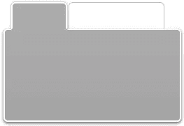

# 在 CSS 中创建多边形周围的阴影

> 原文：<https://www.sitepoint.com/creating-shadows-around-polygons-in-css/>

最近，客户几次要求我实现这样的设计:



当我这样说<q>时，</q>指的是整个组件周围的阴影。主框和顶部选定的选项卡都有阴影，但没有重叠；它们组合在一起形成一个单一的分级结果。实际上，它们描述了一个**非矩形多边形**。

标签框并不是这种效果的唯一应用。我也见过它用在下拉菜单中，我相信你还能想到其他的例子。设计师想要的是*整个形状*创造出一种投影的感觉，就像在自然中一样。

那么，你将如何实现这种效果呢？如果我告诉你我是用纯粹的*<abbr title="Cascading Style Sheets">CSS</abbr>完成的，没有使用任何图像，你会惊讶吗？*

 *这一切的关键是标签和盒子结合的地方。在 <abbr title="Cascading Style Sheets">CSS</abbr> 中，我们如何用阴影来描述那个复杂的形状？显然它将涉及到`box-shadow`(及其供应商的等价物)，但是该属性只能创建矩形。它对`border-radius`(及其供应商等价物)是灵活的，所以它*可以*描述圆角，而不局限于直边。但是，这个警告还不足以描述这个设计需要的复杂多边形。那么是怎么做到的呢？

答案看似简单！

几乎每个多边形都可以被简化成更简单的形状的组合——这种简化是我们如何首先用 <abbr title="HyperText Markup Language">HTML</abbr> 和 <abbr title="Cascading Style Sheets">CSS</abbr> 制作复杂形状的本质。这个例子可以简化为*两个*矩形:选项卡和主框。

所以我们要做的就是**给*两个*那些盒子**，然后**剪掉与`clip`** 的重叠部分！

## 多边形框-阴影

我准备了一个[简化测试用例来说明技术](https://www.sitepoint.com/examples/shadowclip/)，它表面上看起来像上面显示的选项卡结构，但只是两个带有纯色背景的盒子。下面是它的 <abbr title="Cascading Style Sheets">CSS</abbr> :

```
#container
{
    position:relative;
}

#small
{
    background:#336;
    width:8em;
    height:3em;

    position:absolute;
    left:1em;
    top:0;
    z-index:100;
    clip:rect(-10px 9em 3em -10px);

    -moz-box-shadow:0 0 10px #002;
    -webkit-box-shadow:0 0 10px #002;
    box-shadow:0 0 10px #002;
}

#large
{
    background:#336;
    width:18em;
    height:20em;

    position:relative;
    top:3em;
    z-index:0;

    -moz-box-shadow:0 0 10px #002;
    -webkit-box-shadow:0 0 10px #002;
    box-shadow:0 0 10px #002;
}
```

两个框都有阴影，但是小的一个框有一个`clip`值，用于移除其底部边缘的阴影。顶部、右侧和左侧的`clip`值超出了元素的维度，为其阴影提供了扩展空间；然而，底部的`clip`与元素的高度相同，这有效地切断了任何延伸到它下面的阴影。

大矩形的阴影可以自由扩散，但它与小矩形相邻的部分是被小矩形的覆盖的*，因为它的`z-index`更高，放在它上面。总的来说，定位和`clip`移除的结合隐藏了我们不想要的阴影部分。*

这就产生了我们想要的最终效果:纯粹的 CSS 在非矩形周围投下阴影！

敏锐的观察者会注意到，我使用了基于`em`的尺寸和定位，因此它会随着字体大小而扩展，从而抵消了绝对定位可能带来的一个主要问题。由于容器元素具有相对定位，为了创建定位上下文，整个结构仍然在页面流中，仍然可以被其他页面内容移动，并且受到窗口大小调整的影响。

现在你知道了！这种技术可以在所有现代浏览器中使用，包括 Internet Explorer。当然，IE 没有`box-shadow`，但它有一个[辉光滤镜](http://msdn.microsoft.com/en-us/library/ms532995(VS.85).aspx)，如果巧妙地使用，它可以创造出*合理*的效果。* 

## *分享这篇文章*