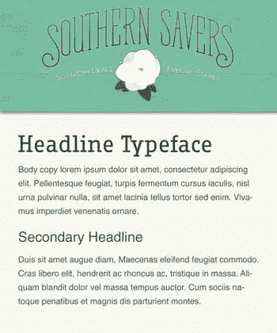

# 为客户网站创建版式:案例研究

> 原文：<https://www.sitepoint.com/creating-typography-for-a-client-site-case-study/>

不久前，我为一家名为 Southern Savers 的公司制作了一个新网站的开发图表。最终，我们到达了项目的关键点，网站的所有部分都整理好了，只求能组合成一个全新的设计。我们已经用可用性研究、信息架构和线框奠定了基础。我们向客户展示了情绪板，以了解新的和改进的南方储蓄者品牌更喜欢什么颜色和质地。

正是在游戏的这个阶段，是时候淘汰网站设计了。从品牌元素开始，设计师马修·史密斯的第一件事就是选择排版。“为一个品牌工作时，”马修说，“我试图保持它的真实本质，但通过网络镜头来诠释它。”这种解释的一部分包括寻找一种与新标志中独特的手写拱形字体相匹配的字体。

在浏览了他的选项后，马修最终选定了 slab serif face Fago Office Serif。考虑到标志类型是平板衬线和文字的混合，这个选项适合品牌的外观，同时仍然提供足够的对比度来突出自己。对于正文，马修想要一种简单的另类字体，让 Fago 的标题脱颖而出，而不是与之竞争。Helvetica 是最好的选择，他决定，使默认的字体堆栈简单:Helvetica，Arial，无衬线。下图显示了新标志与 Fago Office Serif 和 Helvetica body copy 的搭配效果。

 **南方储蓄者排版**

随着排版选择的确定，仍然需要一些颜色和纹理的决定来充实线框。Matthew 决定在这里使用标识的花部分作为他的灵感。“这些花瓣有一些非常好的纹理，感觉优雅但朴实，我想通过网站的其余部分来实现这一点。”借鉴这种说明性的风格，Matthew 在页眉区域加入了一条蓝绿色的丝带，从几何角度向页面外拱起，突出了徽标。在丝带上方，他使用了调色板中的深绿色，并以木兰的叶子为重点。这些元素为 Emily 的线框中定义的站点导航元素提供了一个可视容器。

当马修继续完成设计时，该项目的开发功夫专家[凯宾·史密斯](http://kevinsmith.cc/)开始了前端开发和 WordPress 集成。凯文的工作是决定如何将所有这些排版决策融入到网站的建设中。他知道他必须使用动态字体替换技术，所以他决定对大多数标题字体使用 Cufón，对一些按钮和静态项目使用图像替换。下面的截屏显示了这些字体，以及 Matthew 的标题设计元素，是如何出现在最终的网站中的。

 **南方储户主页设计**

你如何开发排版风格用于你完成的网络项目？排版在你自己的设计过程中处于什么位置？ ****

## 分享这篇文章