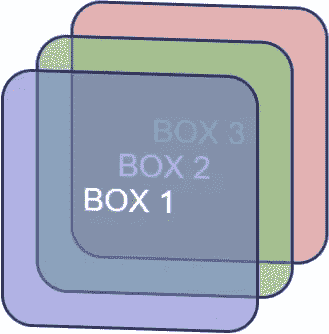
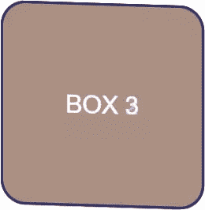
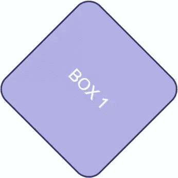
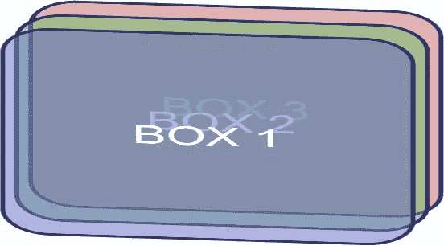
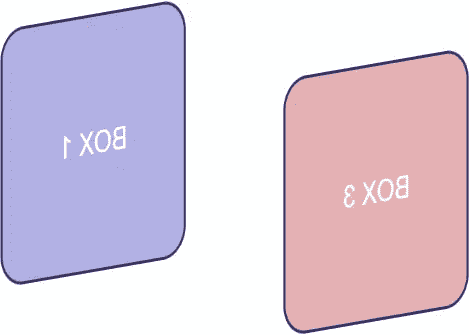
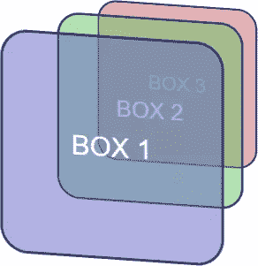
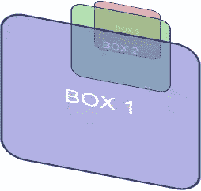
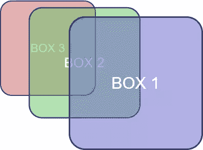
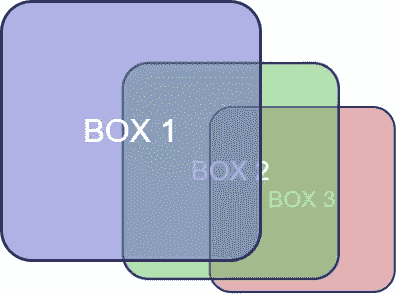

# CSS 中的 3D 变换函数

> 原文：<https://www.sitepoint.com/css-3d-transformation-functions/>

在这篇文章中，我将展示如何用 CSS 中新的 3D 转换函数和属性为你的网页和应用程序添加另一个维度。我们将探讨变换、平移、旋转、缩放、透视等，以及与 z 索引、浏览器陷阱有关的问题，以及这些功能的最佳使用案例。

HTML 元素可以在三维空间中转换:

*   水平 x 轴
*   垂直 y 轴，以及
*   深度 z 轴

在二维屏幕上，把表面想象成 z 坐标为零是很有用的。z 值为正值会将对象移向您(屏幕前方)，而 z 值为负值会将对象移离您(屏幕后方)。添加透视时，更远的 z 值会导致对象完全消失。

这里有一些事情需要注意:

1.  CSS 只能在三维空间中转换二维 HTML 元素。元素本身保持平坦，深度为零。在 z 平面上缩放是可能的，但是那将*而不是*把一个正方形挤压成一个立方体。你仍然可以创建一个立方体，但是每边需要六个元素。
2.  CSS 3D 转换对于页面效果来说是很棒的——但是不要期望你能创造出下一个 MineCraft 或者使命召唤。使用诸如 [WebGL](https://developer.mozilla.org/en-US/docs/Web/API/WebGL_API) 这样的技术可以更好地实现复杂的模型。

所有现代浏览器 (IE10+)都很好地支持 3D 转换，但是:

*   Internet Explorer 不支持`transform-style: preserve-3d`，无法创建 3D 场景。
*   所有版本的 Safari 都必须使用厂商前缀`-webkit-backface-visibility`来隐藏背面。其他浏览器都支持`backface-visibility`。

以下部分描述了 3D 变换的属性和功能。 **[演示页](https://codepen.io/craigbuckler/full/OEGGJd/)** 说明了大部分是如何使用的。

## `transform`属性

任何元素都可以应用单个`transform`属性。可以给它分配一个带有一个或多个参数的函数。例如:

```
.element {
  transform: function1(parameter1, [...parameterN]);
} 
```

如果需要两个或更多转换，可以定义任意数量的空格分隔函数:

```
.element {
  transform: function1(p1, [...pN]) function2(p1, [...pN]);
} 
```

例如，要在水平面上缩放并垂直变换:

```
.element {
  transform: scaleX(2) translateY(50px);
} 
```

最后，`transform: none;`删除所有现有的变换。

## 平移(移动)功能

您可能使用了`translate`函数来沿 x 轴水平移动元素或沿 y 轴垂直移动元素:

```
transform: translateX(50px);        /* 50px to right */
transform: translateY(-100%);       /* 100% up */
transform: translate(50px, -100%);  /* both together */ 
```

可以使用任何长度单位。百分比引用变换元素的大小，因此应用了`translateY(80%)`的 100px 高的块将其向下移动 80 像素。

进入第三维度，我们也可以使用`translateZ`:

```
transform: translateZ(-200px);      /* 200px 'into' the screen */ 
```

给定三个元素，`#box1`、`#box2`、`#box3`，绝对定位在同一位置，其中`translateZ(-200px)`应用于#box2，`translateZ(-400px)`应用于#box3。结果相当令人失望:


然而，如果我们旋转整个外部`#scene`容器，z 轴的变换会变得更加明显:

```
#scene {
  transform-style: preserve-3d;
  transform: rotateX(-10deg) rotateY(-10deg);
} 
```



速记`translate3d`功能允许元素相应地沿所有三个轴移动:

```
transform: translate3d(50px, 100%, 7em); /* x, y, z axis */ 
```

## `transform-style`属性

默认情况下(并且总是在 IE 中)，`transform-style`设置为`flat`。这表示元素的所有变换子元素都位于元素本身的平面中。换句话说，内部元素可以应用任何变换，但它们会被挤压到容器的平面中:



在大多数情况下，`transform-style: preserve-3d;`必须用来表示子元素位于 3D 空间中，容器的任何变换都会相应地进行变换。

## 旋转功能

2D `rotate()`功能实际上是围绕 z 轴旋转元素，与`rotateZ()`相同。例如:

```
transform: rotateZ(45deg); /* or rotate(45deg) */ 
```



`rotateX()`绕水平轴旋转，`rotateY()`绕垂直轴旋转。

角度可以用以下方式定义:

*   `turn` —如`0.5turn`为顺时针半圈
*   `deg` —度，例如`90deg`是顺时针旋转四分之一圈
*   `rad` —弧度，如`-3.1416rad`为逆时针半圈
*   `grad` —格拉迪亚人。一整圈是`400grad`，所以`-200grad`是逆时针半圈。

使用`rotate3d()`功能可以设置三个旋转轴。有点令人困惑的是，它接受四个值来描述一个向量:

*   `x` —表示旋转轴的向量的 x 坐标(0 到 1)。
*   `y` —表示旋转轴的向量的 y 坐标(0 到 1)。
*   `z` —表示旋转轴的矢量的 z 坐标(0 到 1)。
*   `a` —旋转的角度。正角度表示顺时针旋转，负角度表示逆时针旋转。

数学受虐狂可以在 MDN 阅读`rotate3d()`的全部细节。

## 缩放(大小)函数

功能`scaleX()`和`scaleY()`相应地在水平和垂直平面上拉伸或收缩一个元素:

```
transform: scaleX(2);   /* twice as wide */
transform: scaleY(0.5); /* half as tall */ 
```

`scaleZ()`对深度平面也是如此。在上面的例子中，`transform: scaleZ(0.5);`因此将每个元素之间的间距减少了一半。

`scale3d(x, y, z)`功能可以在一个命令中应用所有平面的缩放。例如:

```
#scene {
  transform-style: preserve-3d;
  transform: scale3d(2, 1, 0.5) rotateX(-10deg) rotateY(-10deg);
} 
```



## 变换原点

默认情况下，元素会围绕其中心点旋转和缩放。这可以通过用最多三个空格分隔的值设置`transform-origin`来修改:

*   **单值语法:**x 原点的长度或百分比。单个`left`、`center`、`right`、`top`或`bottom`关键字也可用于`top`和`bottom`设置以 x 原点为中心的 y 原点。
*   **二值语法:**x 和 y 的原点。可以使用长度、百分比或关键字。
*   **三值语法:**x，y，z 的原点。z 值可能只是一个长度单位，如`px`或`em`。

移动一个原点会影响其他原点的旋转平面。例如，`transform-origin: left center 0;`将原点移动到左侧边缘的中心。这将影响`rotateY()`和`rotateZ()`功能。

## 背面可见度

当元素绕 x 或 y 轴旋转超过 90 度但在任一方向上小于 270 度时，显示元素的后部。车尾实际上是一个镜像，默认情况下是`visible`。

通过设置`backface-visibility: hidden;`可以隐藏后部——如果应用于`#box2`:

```
#box2 {
  backface-visibility: hidden;
}

#scene {
  transform: rotateX(-10deg) rotateY(-135deg);
} 
```



`backface-visibility: hidden;`通常用于翻牌动画，其中两个元素显示牌的正面和背面，但一次只能看到一个。

## 远景

上面显示的例子不适用透视。向 z 平面更深处移动的元素保持相同的大小，不管它离观察者有多远。`perspective`属性默认为`none`,但它可以设置为任意正长度。例如:

```
#scene {
  perspective: 1000px;
  transform: rotateX(-15deg) rotateY(-15deg);
} 
```



`perspective`长度越小，消失点越近，3D 效果越明显:

```
#scene {
  perspective: 200px;
  transform: rotateX(-15deg) rotateY(-45deg);
} 
```



## 透视消失点

默认情况下，透视消失点位于被变换元素的中心。可以通过设置`perspective-origin: x y;`进行修改，其中:

*   `x`是关键字(`left`、`center`或`right`)或相对于元素宽度的百分比(`0%`、`50%`和`100%`等同于关键字)。
*   `y`是关键字(`top`、`center`或`bottom`)或相对于元素高度的百分比(`0%`、`50%`和`100%`等同于关键字)。

左上角的消失点:

```
#scene {
  perspective-origin: left top; /* or 0% 0% */
  perspective: 1000px;
} 
```



右下角消失点:

```
#scene {
  perspective-origin: right bottom; /* or 100% 100% */
  perspective: 1000px;
} 
```



还有一个`perspective()`函数——例如`transform: perspective(200px)`。然而，它似乎并不尊重任何`perspective-origin`。

## 现在都在一起

最后，缩放、旋转和平移可以在单个`matrix3d()`函数中定义，该函数对于一个[三维仿射变换](https://en.wikipedia.org/wiki/Affine_transformation)需要不少于 16 个值。

这可能最好用在 JavaScript 中，并由那些有几何学位的人来尝试！对于 CSS，转换函数的列表可能更具可读性和可维护性。

## 进一步阅读

在三维空间中工作在概念上是困难的，但是 CSS 转换是一种更容易的对象操作方法。 **[演示页面](https://codepen.io/craigbuckler/full/OEGGJd/)** 提供了一个交互式工具，它将帮助您理解属性和功能是如何协同工作的。

你可以找到 CSS 3D 转换的惊人例子，包括[虚拟现实查看器](https://keithclark.co.uk/articles/css-vr/)、[第一人称射击游戏](https://keithclark.co.uk/labs/css-fps/desktop/)、[图片库](https://tympanus.net/Tutorials/3DHoverEffects/)和[星球大战滚动文本](https://www.sitepoint.com/css3-starwars-scrolling-text/)。许多是概念验证演示，不太可能在典型项目中使用。然而，一些微妙的、逐渐增强的 3D 效果可以为您的网页和应用程序添加另一个维度。

*   [使用 CSS 变换的 MDN](https://developer.mozilla.org/en-US/docs/Web/CSS/CSS_Transforms/Using_CSS_transforms)
*   [CSS 转换模块](https://www.w3.org/TR/css-transforms-1/)
*   [CSS 3D 变换简介](https://3dtransforms.desandro.com/)

## 分享这篇文章