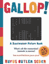
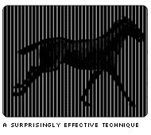
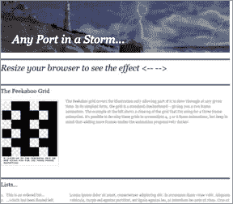
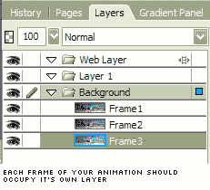
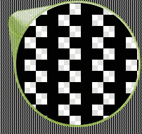
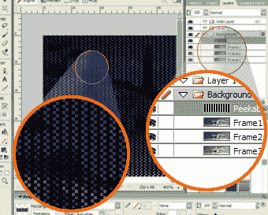
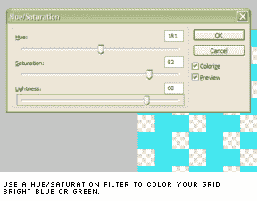
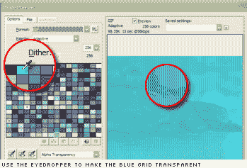
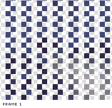

# 警告:这个秘密的 CSS 技术会让你大吃一惊！

> 原文：<https://www.sitepoint.com/css-animation-technique/>

**几周前，我和两岁的女儿一起购物，偶然发现了一本精彩的小人书——《疾驰！鲁弗斯·巴特勒·塞德的扫描图画书。**



现在说实话，*驰骋的书面内容！*是相当标准的儿童用语——“你能看见马飞奔吗？”大概是那里的文学亮点吧。然而，它采用的动画小技巧相当漂亮。



效果是这样的:

1.  拍摄一个六帧的动画，并将其切割成极薄的垂直条带。

3.  每 6 条扔掉 5 条。

5.  将剩余的条带重新组合成一个单一的合成图像，包含所有六个帧的部分。

7.  用黑色醋酸纤维片覆盖这张合成图像，上面有从上到下的透明细线。这张纸遮住了它后面的大部分图像，一次只能看到一帧。

当读者打开和合上页面时，插图会在页面后面被推拉。结果是一个非常漂亮的运动错觉。现在，这种技术听起来可能不会给出令人信服的结果——毕竟，有很多黑色，没有多少图像可看。然而，正如上面的动画 GIF 所示，效果令人惊讶。事实上，令人印象深刻的是，当用户调整他们的浏览器时，我想知道是否有可能使它适应在线工作。



我将通过展示我模拟的测试用例来直接切入正题[，然后我将简单谈谈我在构建它时遇到的一些挑战和问题。稍后，我将解释创建您自己的数据库所涉及的有点麻烦的过程。](https://www.sitepoint.com/examples/scanline/)

***一些随意的想法***

1.  这是第一次拍摄。有相当多的经验教训，我会通过任何更新版本。

3.  这是一个三帧动画。我最初尝试了一个简单的两帧版本的动画。这更清楚，但产生了太多的闪电。虽然使用这种方法设计四帧、五帧或六帧的动画是完全可能的，但实际情况是每增加一帧，动画就变得越来越暗，降低了动画的清晰度。

5.  在你的例子中，它们不是直的垂直线，对吗？不，垂直线不是唯一有用的透明形状。事实上，我发现网格和棋盘图案通常会给出更清晰的结果。

##### 躲猫猫动画:方法

好吧，所以你很想试一试。让我们来看看创造效果的具体细节。这确实需要一些精确性，所以在这个过程中不要分心。

这不是最容易解释的过程，但我会尽力而为，所以请跟紧我。我将使用 Fireworks 作为示例，但在 Photoshop 或各种等效的图形应用程序中获得类似的结果应该不难。



***第一步。创作你的动画。***

这部分由你决定，但是你需要在它自己的层上创建每个帧。

***第二步。创建您的躲猫猫网格。***

躲猫猫网格是覆盖在我们图像上的半透明网格，在任何时候都只允许一帧通过。我在 Fireworks 中构建了我的网格，它只不过是一个自定义的图案填充。



这里有[一个小的无缝瓷砖板块供你下载](https://www.sitepoint.com/examples/scanline/3frame-grid.png)。它应该允许你创建尽可能多的网格。


要在 Fireworks 中使用瓷砖，创建一个新的正方形，将其填充设置为**图案**，并选择**其他…** 。然后，您将能够选择平铺 PNG。调整形状的大小应该会自动用重复的网格图案平铺形状，给我们所需的网格。导出一大块足够大的网格(GIF 格式),足以覆盖你的动画区域。

***第三步。创建躲猫猫网格遮罩。***

现在事情变得有点棘手了。复制我们刚才做的网格形状，粘贴为一个新层覆盖你的三个框架层。将网格与文档的左上角对齐。



***第四步。将蒙版重新着色为荧光蓝***

那些参与电视制作的人可能知道[色键技术](http://en.wikipedia.org/wiki/Bluescreen)，它允许制片人瞄准天气预报员后面的(通常)蓝色屏幕，并用动画天气信息替换它。我们现在将使用这种技术的变体。



选择你的黑色躲猫猫网格层，应用**色调/饱和度…** 滤镜到它**(滤镜/调整颜色/色调饱和度…)** 。调整滑块，直到网格变成明亮的荧光蓝色。

你选择的确切颜色并不重要。你只需要确保这种颜色不会出现在动画中的任何地方，所以明亮的荧光色通常是最好的。

***第五步。*出口第 1 帧**

打开帧 1 层和蓝色网格层，然后启动 Firework 的导出预览屏幕( **CTRL+ALT+X** )。

设置你的导出格式为 GIF，使用吸管工具从调色板中选择荧光蓝色卡。


点击**导出**按钮，调用图像`Frame1.gif`，把它放到安全的地方。



***第六步。导出帧 2。***

切换您的层，以便第二帧显示。现在非常仔细地选择网格层，使用箭头键将其向左移动一个像素。这里要特别小心，因为如果你不小心碰到或拖动了网格，它将会与我们的第一帧“不同步”，这意味着你需要重复第五步。将图像导出为`Frame2.gif`，再次使蓝色色卡透明。

***第七步。导出帧 3。***

你现在大概能猜到这一步了。使帧 3 层可见，并再次小心轻推蓝色网格向左一个像素。导出结果并将其命名为`Frame3.gif`。你现在应该有三个新的图像，基本上是我们的动画帧的“花边”副本。

***第八步。将这些图像组合成一个复合图像。***

这是您发现在前面的步骤中是否足够小心的地方。
打开所有三个新导出的框架。复制`Frame2.gif`并粘贴到`Frame1.gif`中。对`Frame3.gif`做同样的事情。如果一切都按计划进行，三个框架应该完美地结合在一起，如下图所示。



获得正确的图像是这项技术的关键，而且很容易出错。如果第一次不太符合，不要放弃。我花了一些时间才把它弄好。将这个合成图像导出到一个文件中(我称之为 mine `stormy-sea.jpg`)。

***第八步。创建 HTML 结构。***

好吧，如果你已经做到了这一步，给你自己奖励一颗金星吧，因为你坚持不懈！现在，开始一个新的 HTML 文档，并将以下标记添加到正文中:

```
<div id="header_outer">  

<div id="header_inner">  

<h1>Here is the Header</h1>  

</div>  

</div>

This is very simple structure - simply two DIVs wrapping an H1\. 

 ***第九步。添加 CSS。***

最后，将下面的 CSS 添加到`HEAD`中:

```

```
<style type="text/css">  

#header_outer {  

background:#000 url(images/stormy-sea.jpg) left top no-repeat;  

}   

#header_inner {  

background: transparent url(images/bigw.gif) right top;  

border-top:1px solid #000;  

height:200px;  

position:relative  

}   

h1 {  

color:#fff;  

position:absolute;  

bottom:0px;  

left:1em;  

font-size:400%  

}  

</style>
```

外部 DIV 在其背景中包含我们的复合动画图像，并与左上角对齐，因此当我们调整浏览器大小时，它不会移动。内部 DIV 包含我们的黑色躲猫猫网格，并且总是与右上角对齐。这意味着当我们调整浏览器大小时，我们的网格总是在我们的合成图像上横向滑动。[基本页面应该看起来像这样的](https://www.sitepoint.com/examples/scanline/simple.php)。

##### 一锤定音

这就是了。如果你努力创造了你自己的版本，我向你脱帽致敬。制作复合图形似乎更像是一种信仰行为，而不是一种图形技术。

不幸的是，目前我想不出更简单的方法，除了编写一个定制的应用程序来自动生成图像。在我的测试中，我通常发现强烈基于循环的动画(例如，轮子、旋转的齿轮或奔跑的马)不是很有效。

虽然翻页会产生非常平滑、有分寸的动作，但调整浏览器的大小通常会更加不平稳，这使得你更有可能跳过一些帧。相反，实际上受益于一定随机性的动画似乎效果最好。例如:

*   闪烁的星星
*   远处公路上的前灯
*   城市天际线上的灯光
*   水面上闪闪发光的倒影
*   围着灯嗡嗡叫的昆虫

很明显，有些人会质疑他们是否值得花时间和资源去开发一个甚至可能不是所有用户都能看到的效果。毫无疑问，许多预算和项目不适合这种类型的把戏。但是可能有其他项目会从这种方法的变体中受益，给用户带来惊喜和兴趣的机会——暂时摆脱混乱——是不可低估的。

又及:我很想看看其他人对这个想法的实验，所以如果你想出了一些很酷的东西，给我留言。

## 分享这篇文章