# CSS 选集:101 个基本提示、技巧和窍门，第 2 章-文本样式和其他基础知识

> 原文：<https://www.sitepoint.com/css-anthology-tips-tricks-2/>

本章探讨了 CSS 在文本样式化方面的应用，涵盖了大量 CSS 基础知识，并回答了一些常见问题。如果你是 CSS 的新手，这些例子将向你介绍各种各样的属性和用法，并给你一个广泛的概述，从这里开始你自己的 CSS 实验。对于那些已经熟悉 CSS 的人来说，当你不太记得如何达到某种效果时，这一章将作为快速复习。

这里提供的例子在各种浏览器和版本中都得到了很好的支持。一如既往，跨不同浏览器测试您的代码很重要；但是，文本样式属性有很好的支持。虽然在老版本的浏览器中可能会有一些小的不一致或者缺乏支持，但是这里不会给你带来任何严重的问题。还要注意，如果你想离线阅读这些信息，你可以下载。pdf 版的前 4 章在这里。

##### 如何用 CSS 替换字体标签？

第 4 版及更高版本的浏览器都支持用 CSS 样式化文本，所以没有令人信服的理由继续使用`<font>`标签来样式化文本。最简单的方法是，你可以用 CSS 来替换你站点中的字体标签。

使用字体标签，您需要为页面上的每个段落设置样式。

```
<p><font color="#800080" 

      face="Verdana,Geneva,Arial,Helvetica,sans-serif">These 

    stuffed peppers are lovely as a starter, or as a side dish 

    for a Chinese meal. They also go down well as part of a 

    buffet and even children seem to like them.</font></p>
```

***解***

使用 CSS，你只需在样式表中定义`<p>`标签的`color`属性是`#800080`，字体系列应该是`Verdana,Geneva,Arial,Helvetica,sans-serif`:

```
p { 

  color: #800080; 

  font-family: Verdana,Geneva,Arial,Helvetica,sans-serif; 

}
```

现在，每次你在文档中添加包含在一个`<p>`标签中的文本时，它就会采用这种样式，这样你就不需要在文档中添加大量额外的标记了。如果您的客户突然想将 100 个文档的字体从 Verdana 改为 Times，这也会让事情变得容易得多！

##### 字体大小应该用像素，磅，ems 还是别的？

您可以使用`font-size`属性来调整 CSS 中的文本大小。例如:

```
font-size: 12px;
```

然而，有各种其他方法来设置字体的大小。决定使用哪一种需要您对每种的相对优点有所了解。

***解***

*字体大小的单位*

表 2.1 描述了可以用来调整字体大小的单位。

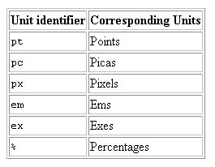

*点数和十二点活字*

```
p { 

  font-size: 10pt; 

}
```

你应该避免使用点和十二点活字来设计显示在屏幕上的文本。这些单位是为印刷设计设置尺寸的绝佳方式，因为它们的尺寸是为此目的而设计的。点的固定大小是一英寸的七分之二，而十二点活字是一英寸的六分之一。使用这些单位指定的打印文档将完全按照您的预期打印出来。然而，计算机无法准确预测元素在显示器上显示的实际大小，因此它们会猜测(而且猜测得很糟糕)磅值或十二点活字的大小，不同平台的结果会有所不同。如果您创建的是打印样式表，或者是用于打印而非在屏幕上查看的文档，则可以使用这些单位。然而，一般的经验法则是在设计网页时避免使用它们。

*像素*

```
p { 

  font-size: 12px; 

}
```

许多设计师喜欢用像素来度量字体大小，因为这种度量单位很容易在各种浏览器和平台上实现一致的显示。然而，像素忽略了用户可能在他们自己的浏览器中设置的任何偏好，并且在大多数浏览器中，用户不能调整设计者以像素表示的字体大小。对于那些需要将文本放大以便清晰阅读的人来说，这是一个严重的可访问性问题。因此，虽然像素可能看起来是最简单的选择，但如果可以使用其他方法，就应该避免像素测量，特别是对于大块内容。如果您正在创建一个用于打印的文档，或者使用一个打印样式表，您应该完全避免像素。像素在打印世界中没有任何意义，与点在屏幕环境中的应用类似，提供像素测量的打印应用将简单地尝试猜测字体在纸上应该显示的大小，结果不稳定。

*Ems*

em 是相对字体度量，其中一个 em 等于默认字体大小中字母“M”的高度。就 CSS 而言，1em 被视为等于用户的默认字体大小，或者当它不同时等于父元素的字体大小。如果您使用 ems(或任何其他相关单位)来调整字体大小，用户将能够调整文本大小，这将符合他们在浏览器中设置的文本大小首选项。例如，假设我创建了一个声明，将`<p>`标记中的文本设置为 1em，如下面的 CSS 所示:

```
p { 

  font-size: 1em; 

}
```

使用 Internet Explorer 6 浏览器的用户将会看到如图 2.1 所示的段落，该浏览器的文本大小设置为中等。


图 2.1。字体大小设置为 1em，文本大小为中等。

如果用户将其文本设置为最大，1em 文本将如图 2.2 所示显示。

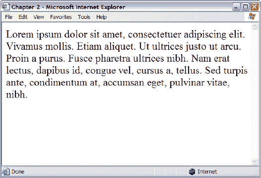
图 2.2。字体大小设置为 1em，文本大小设置为最大。

作为设计者，这使您对用户查看文档的方式控制较少。然而，这意味着需要很大字体的用户可以阅读你的内容。

Ems 值可以使用十进制数来设置。例如，要以比用户默认值(或其父元素的字体大小)小 10%的大小显示文本，您可以使用:

```
p { 

  font-size: 0.9em; 

}
```

要显示比默认或继承大小大 10%的文本:

```
p { 

  font-size: 1.1em; 

}
```

*前任*

ex 是一个相对单位度量，对应于默认字体大小中小写字母“x”的高度。理论上，如果你将一个段落的字体大小设置为`1ex`，文本的大写字母应该与字母“x”的高度相同，如果没有指定字体大小的话。

不幸的是，现代浏览器还不支持精确确定 ex 大小所需的排版功能。他们通常对这个测量值进行粗略的猜测。由于这个原因，这个时候很少使用 exe。

*百分比*

```
p { 

  font-size: 100%; 

}
```

与 ems 和 exe 一样，以百分比设置的字体大小将遵循用户的文本大小设置，并且可由用户调整大小。将`<p>`标签设置为 100%会以用户默认的字体大小显示文本(就像将字体大小设置为 1em 一样)。减小百分比会使文本变小:

```
p { 

  font-size: 90%; 

}
```

增加百分比会使文本变大:

```
p { 

  font-size: 150%; 

}
```

*关键词*

您也可以使用绝对和相对关键字来调整文本大小。

*绝对关键词*

CSS 中有七种绝对关键字大小，如下所示:

*   `xx-small`
*   `x-small`
*   `small`
*   `medium`
*   `large`
*   `x-large`
*   `xx-large`

这些关键字是相对于彼此定义的，浏览器以不同的方式实现它们。大多数浏览器显示`medium`的大小与未设置样式的文本相同，其他关键字不同程度地调整文本大小。但是，Internet Explorer 5(和版本 6，取决于文档类型)将 small 视为与无样式文本大小相同。

这些关键字度量被认为是绝对的，因为它们不从任何父元素继承。然而，与为高度提供的绝对值(如像素和磅值)不同，它们允许在浏览器中调整文本的大小，并将遵循用户的浏览器设置。使用这些关键字的主要问题是，例如，`x-small`大小的文本可能在一个浏览器中完全可读，而在另一个浏览器中却很小。

*相对关键词*

相对关键字——`larger`和`smaller`——从父元素中获取它们的大小，与`em`和`%`的方式相同。因此，如果您使用绝对关键字将您的`<p>`标签设置为`small`，并且您只是希望强调的文本显示得相对较大，您可以将以下内容添加到样式表中:

例 2.1。relative.css

```
p { 

  font-size: small; 

} 

em { 

  font-size: larger; 

}
```

下面的标记将如图 2.3 所示，因为包装在`<em>`标签中的文本将显示得比它的父标签`<p>`大。

例 2.2。relative.html(节选)

```
<p>These <em>stuffed peppers</em> are lovely as a starter, or as a 

  side dish for a Chinese meal. They also go down well as part of 

  a buffet and even children seem to like them.</p>
```

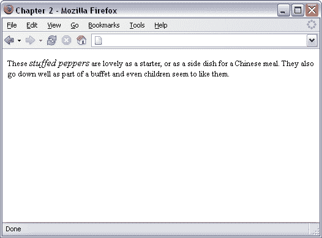
图 2.3。强调的文本显示得比其包含的段落大。

*相对大小和继承*

当您使用任何类型的相对大小调整时，请记住该元素从其父元素继承其起始大小，然后相应地调整其大小。在元素没有以复杂的方式嵌套的布局中，这很容易理解；然而，这种继承模式在父元素并不总是显而易见的嵌套表布局中可能会出现问题——事物的继承看起来确实非常奇怪！下面的示例演示了这一点。

我的样式表包含下面的代码，它设置`td`以 80%显示文本。这比用户的默认字体大小略小，但他们可以调整大小:

例 2.3。nesting.css

```
td { 

  font-size: 80%; 

}
```

在没有嵌套表格单元格的页面上，文本将始终以略小的尺寸显示。但是，在嵌套表格布局中，每个嵌套表格中的文本将以其包含表格的字体大小的 80%显示。

例 2.4。nesting.html(节选)

```
<table> 

  <tr> 

    <td>This is a table 

      <table> 

        <tr> 

          <td>This is the second table 

            <table> 

              <tr> 

                <td>This is the third table</td> 

              </tr> 

            </table> 

          </td> 

        </tr> 

      </table> 

    </td> 

  </tr> 

</table>
```

上面的示例标记将如图 2.4 所示。如您所见，每个嵌套表格中的文本逐渐变小。

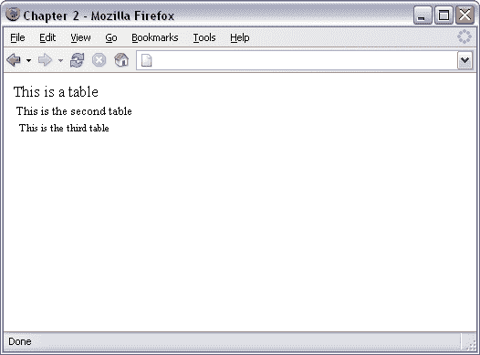
图 2.4。该显示演示了嵌套表格中相对字体大小的使用。

***讨论***

当选择使用哪种调整文本大小的方法时，最好选择一种允许所有用户调整文本大小的方法，并确保文本符合用户在其浏览器中选择的设置。相对字体大小往往适用于 CSS 布局和简单的基于表格的布局，但在复杂的嵌套表格布局中实现可能会很棘手，因为元素继承大小的方式不同。如果您决定您的唯一选择是使用绝对度量单位来调整字体大小，请考虑开发一个样式表切换器，允许用户在您的站点界面中更改字体大小。

##### 如何指定我的文本以某种字体显示？

***解***

使用 font-family 属性指定文本将采用的字体，如下所示:

```
p {  

  font-family: Verdana;  

}
```

***讨论***

除了 Verdana 或 Times 等特定字体之外，CSS 还允许指定一些更通用的字体系列，它们是:

*   `serif`
*   `sans-serif`
*   `monospace`
*   `cursive`
*   `fantasy`

当您指定字体时，重要的是要记住用户可能没有与您计算机上相同的字体。如果你定义了一种他们没有的字体，你的文本将会显示在他们的网页浏览器的默认字体中，不管你喜欢什么，或者你的网站设计。

您可以简单地使用通用的字体名称，让用户的系统决定应用哪种字体。例如，如果您希望您的文档以无衬线字体(如 Arial)显示，您可以简单地使用以下代码:

```
p {  

  font-family: sans-serif;  

}
```

然而，你可能想对你的网站的显示方式有更多的控制——你可以做到。可以指定字体名称以及通用字体。以下面的`<p>`标签的 CSS 声明为例。这里，我们已经指定，如果系统上安装了 Verdana，就应该使用它；如果没有安装，电脑会被引导查看用户是否安装了 Geneva 如果失败，计算机会寻找阿里亚，然后是 Helvetica。如果这些字体都不可用，将指示计算机使用该系统的默认无衬线字体。

```
p {  

  font-family: Verdana, Geneva, Arial, Helvetica, sans-serif;  

}
```

##### 如何从链接中删除下划线？

网页上的文本链接到另一个文档的默认指示是它带有下划线，并且颜色与文本的其余部分不同。在某些情况下，您可能希望删除该下划线。

***解***

我们使用`text-decoration`属性来删除下划线。默认情况下，浏览器会将`<a>`标签的`text-decoration`设置为下划线。要删除下划线，只需为链接设置以下属性:

```
text-decoration: none;
```

用于创建图 2.5 所示效果的 CSS 如下:

例 2.5。textdecoration.css

```
a:link, a:visited {  

  text-decoration: none;  

}
```

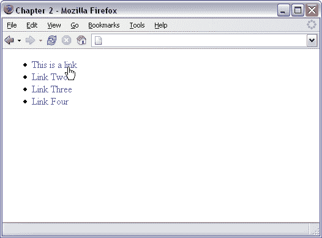
图 2.5。使用文本修饰创建没有下划线的链接。

***讨论***

除了`underline`和`none`，您还可以尝试`text-decoration`的其他值:

*   `overline`
*   `line-through`
*   `blink`

您也可以组合这些值。例如，如果你想在一个特定的链接上加下划线和上划线，如图 2.6 所示，你可以使用下面的代码:

例 2.6。文本装饰 2.css

```
a:link, a:visited {  

  text-decoration: underline overline;  

}
```

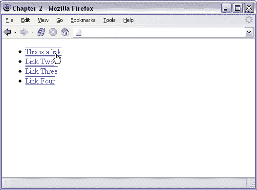
图 2.6。组合文本修饰值以创建带下划线和上划线的链接。

*误导线*

你可以在不是链接的文本上使用 text-decoration 属性，但是要小心。链接加下划线是一种被广泛接受的约定，以至于用户倾向于认为任何带下划线的文本都是到另一个文档的链接。

##### 什么时候删除下划线是个坏主意？

给链接加下划线是所有 Web 浏览器都遵循的标准约定，因此，用户希望看到带下划线的链接。删除文本中链接的下划线会让人们很难意识到这些单词实际上是链接，而不仅仅是突出显示的文本。我建议不要删除文本中链接的下划线。还有其他方法可以让链接看起来更有吸引力，并且很少需要删除下划线。

作为菜单的一部分使用的链接，或者在文本明显是链接的其他情况下——例如，文本使用 CSS 样式以类似于图形按钮——是另一回事。如果你愿意，你可以去掉这类链接的下划线，因为从它们的上下文可以明显看出它们是链接。

##### 如何创建一个鼠标经过时改变颜色的链接？

当光标在链接上移动时，吸引人的链接效果会改变颜色或者改变链接的外观。当 CSS 被用来代替导航按钮时，这种效果可以得到很好的应用；但是，它也可以用于文档中的链接。

***解***

为了创造这种效果，我们将`:hover`和`:active`伪类的样式设计为不同于锚标记的其他伪类。

我们的链接使用样式表中的以下声明进行样式化:

例 2.7。文本装饰 3.css

```
a:link, a:visited, a:hover, a:active {  

  text-decoration: underline;  

  color: #6A5ACD;  

  background-color: transparent;  

}
```

当这个样式表被应用时，我们的链接将显示为带有下划线的蓝色`#6A5ACD`,如图 2.7 所示。

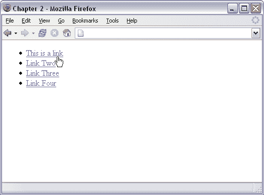
图 2.7。这些链接的所有伪类都使用相同的声明。

为了使我们的`:hover`和`:active`伪类不同，我们需要将它们从其他伪类的声明中移除，并给它们自己的声明。我决定在下划线之外加上一条上划线，一种背景色，并使文本颜色变深。生成的 CSS 如下所示(参见图 2.8):

例 2.8。文本装饰 4.css

```
a:link, a:visited {  

  text-decoration: underline;  

  color: #6A5ACD;  

  background-color: transparent;  

}  

a:hover, a:active {  

  text-decoration: underline overline;  

  color: #191970;  

  background-color: #C9C3ED;  

}
```

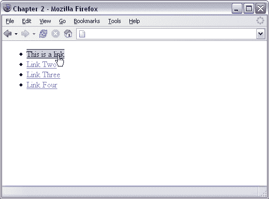
图 2.8。当我们用鼠标悬停在一个链接上时，CSS 的效果是很明显的。

您可能已经意识到，您也可以单独设计其他伪类的样式。特别是，您可能希望对用户访问过的链接采用不同的样式。要做到这一点，您只需单独设计`:visited`伪类的样式。

在设计伪类的样式时，注意不要改变文本的大小或粗细(粗细)。如果你这样做了，你会发现你的页面似乎在“抖动”，因为内容必须移动，为悬停时出现的较大文本让路。

*伪订单*

*链接伪类应该按照以下顺序声明:`link`、`visited`、`hover`、`active`。如果不是这样，你可能会发现它们并不像你预期的那样工作。记住这个顺序的一个方法是助记法:爱恨。*

##### 如何在一个页面上显示两种不同风格的链接？

上一篇技巧文章解释了如何设计 anchor 标记的不同选择器的样式，但是如果您想在同一个文档中使用不同的链接样式呢？也许您希望在导航菜单中显示不带下划线的链接，但要确保正文内容中的链接易于识别。也许你的文档的一部分是深色的背景色，所以你需要在那里使用浅色的链接样式。

***解***

为了演示如何为链接创建多种样式，让我们举一个已经对链接进行了样式化的例子。

例 2.9。linktypes.css(摘录)

```
a:link, a:visited {  

  text-decoration: underline;  

  color: #6A5ACD;  

  background-color: transparent;  

}  

a:hover, a:active {  

  text-decoration: underline overline;  

  color: #191970;  

  background-color: #C9C3ED;  

}
```

这些应该作为默认的样式——这是链接在你的文档中通常的样式。这种链接样式使链接变成蓝色，因此，如果您的页面上有一个蓝色背景的区域，链接将无法阅读。您需要为该区域内的任何链接创建第二组样式。

首先，您需要给包含不同颜色链接的区域一个类或 ID。如果这个区域已经用 CSS 样式化了，那么它已经有了一个你可以使用的类或者 ID。假设您的文档包含以下标记:

例 2.10。linktypes.html(节选)

```
<div class="boxout">  

  <p>Visit our <a href="store.html">online store</a>, for all your  

    widget needs.</p>  

</div>
```

您需要创建一个 CSS 规则来影响父元素应用了类 boxout 的区域中出现的任何链接:

例 2.11。linktypes.css(摘录)

```
.boxout {  

  color: #FFFFFF;  

  background-color: #6A5ACD;  

}  

.boxout a:link, .boxout a:visited {  

  text-decoration: underline;  

  color: #E4E2F6;  

  background-color: transparent;  

}  

.boxout a:hover, .boxout a:active {  

  background-color: #C9C3ED;  

  color: #191970;  

}
```

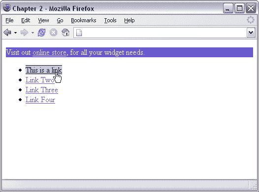
图 2.9。一个文档中可以使用两种不同样式的链接。

如图 2.9 所示，这将按照第一种样式显示文档中的所有链接，除了那些出现在方框中的链接，这些链接将以较浅的颜色显示。

##### 如何给标题添加背景色？

您可以为任何元素添加背景色，包括标题。

***解***

下面，我们为文档中的所有一级标题创建了一个 CSS 规则。结果如图 2.10 所示。

例 2.12。headingcolor.css(节选)

```
h1 {   

  background-color: #ADD8E6;   

  color: #256579;   

  font: 18px Verdana, Geneva, Arial, Helvetica, sans-serif;   

  padding: 2px;   

}
```

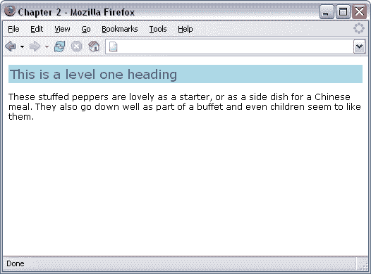
图 2.10。标题可以用背景色显示。

*为颜色让路*

给标题添加背景时，你可能还想调整填充，这样标题文本和彩色区域的边缘之间就有了空间，就像我们在上面的例子中所做的那样。

##### 如何给标题加下划线？

***解***

有两种方法可以给文本添加下划线。最简单的方法是使用我们在上面设计链接时遇到的`text-decoration`属性。这种方法可以让你用和文本本身一样的颜色给文本加下划线，如图 2.11 所示。

例 2.13。headingunderline.css(节选)

```
h1 {   

  font: 18px Verdana, Geneva, Arial, Helvetica, sans-serif;   

  text-decoration: underline;   

}
```

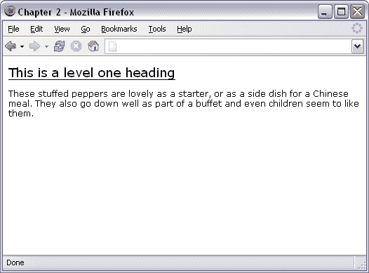
图 2.11。使用文本装饰为标题添加下划线。

您也可以通过给标题添加下边框来创建下划线效果。这种解决方案更加灵活，因为您可以使用填充来分隔下划线和标题，并且可以将下划线的颜色更改为不同于文本的颜色。然而，这种效果在不同的浏览器中可能会略有不同，所以你需要测试它，以确保这种效果在你的访问者可能使用的浏览器上看起来是合理的(见图 2.12)。

例 2.14。headingunderline2.css

```
h1 {   

  font: 18px Verdana, Geneva, Arial, Helvetica, sans-serif;   

  padding: 2px;   

  border-bottom: 1px solid #aaaaaa;   

}
```

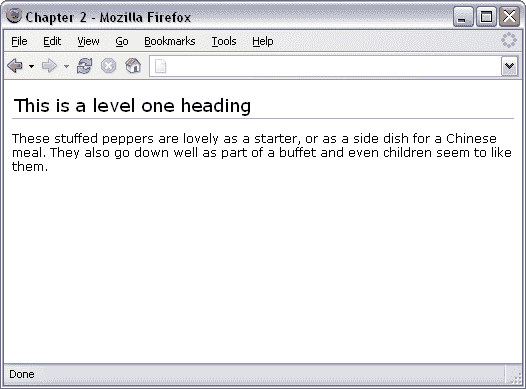
图 2.12。使用下边框添加下划线效果。

##### 如何去掉一个`<h1>`标签和下面一段之间的大间隙？

***解***

默认情况下，浏览器在标题和段落标记之间呈现一个间隙。这是由浏览器应用于这些标签的默认上下边距产生的。

要删除标题和其后段落之间的所有空格，不仅要删除标题的下边距，还要删除段落的上边距。但是因为用 CSS 选择器来定位标题后面的第一段可能不太方便，所以简单地给标题指定一个负的下边距会更容易。边距可以设置为负值，但填充不能。

图 2.13 所示的标题页边空白没有改变。


图 2.13。这个标题和段落显示了默认的间距。

图 2.14 显示了将下面的 CSS 应用到`<h1>`标签后的相同标题。

```
h1 {   

  font: 18px Verdana, Geneva, Arial, Helvetica, sans-serif;   

  margin-bottom: -12px;   

}
```

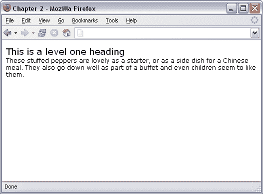
图 2.14。当 margin-bottom 设置为-15px 时，航向显示改变。

##### 如何在不使用字体标签的情况下突出显示页面上的文本？

在使用 CSS 之前，我们可能会使用字体标签来突出显示页面上的一个重要术语，或者标识访问者用来通过搜索引擎定位文档的搜索术语。

***解***

CSS 允许你为高亮样式创建一个类，并通过用应用该类的`<span>`标签包装高亮文本来应用它。例如，在下面的段落中，我们将一个短语放在应用类`hilite`的 span 标签中。

例 2.15。hilite.html(节选)

```
<p>These <span class="hilite">stuffed peppers</span> are lovely as   

  a starter, or as a side dish for a Chinese meal. They also go   

  down well as part of a buffet and even children seem to like   

  them.</p>
```

`hilite`类如下所示；该部分将如图 2.15 所示:

例 2.16。hilite.css(节选)

```
.hilite {   

  background-color: #FFFFCC;   

  color: #B22222;   

}
```

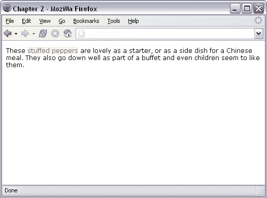
图 2.15。用 CSS 突出显示文本。

##### 如何改变文本的行高(行距)？

使用 CSS 而不是字体标签的一个很大的好处是你可以更好的控制页面上的文本外观。在这个解决方案中，我们将了解如何改变文档中文本的行距。

***解***

如果文本行之间的默认间距看起来有点窄，请使用 line-height 属性更改它。

例 2.17。leading.css

```
p {   

  font: 11px Verdana, Geneva, Arial, Helvetica, sans-serif;   

  line-height: 2.0;   

}
```

结果如图 2.16 所示。


图 2.16。使用行高属性改变行距。

注意不要把文章间隔得太大，以免阅读困难。

*没有单位？*

你也可以使用标准的 CSS 度量单位来指定行高，比如 ems 或者甚至是像素。但是这样做会破坏子元素的行高和字体大小之间的联系。

*例如，如果上面的例子包含一个设置大字体大小的`<span>`，那么行高将按比例放大以保持相同的比例，因为段落的行高被设置为数值 2.0。然而，如果行高设置为 2em 或 200%，那么`<span>`将继承实际的行高，而不是比率，并且大字体大小不会影响跨度的行高。根据你想要的效果，这可能是你想要的。*

##### 我如何对齐文本？

当您对齐文本时，您会改变单词之间的间距，使左右边距都是直的，就像本书中的文本一样。您可以使用 CSS 创建这种效果。

***解***

您可以借助 text-align 属性来对齐段落文本。

例 2.18。justify.css

```
p {   

  text-align: justify;   

  font: 11px Verdana, Geneva, Arial, Helvetica, sans-serif;   

  line-height: 2.0;   

}
```

图 2.17 显示了这段代码的效果。

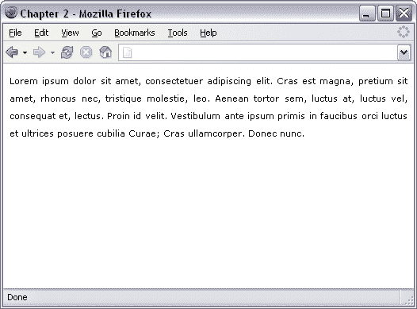
图 2.17。使用文本对齐对齐文本。

***讨论***

文本对齐的其他值有:

*   `right`–将文本与容器右侧对齐
*   `left`–将文本与容器左侧对齐
*   `center`–对齐文本中心

##### 如何设计水平标尺的样式？

***解***

您可以更改水平线的颜色、高度和宽度。注意，在下面的 CSS 中，我对`color`和`background-color`使用了相同的值，因为基于 Mozilla 的浏览器使用`background-color`为规则着色，而 IE 使用`color`。

例 2.19。hrstyle.css(节选)

```
hr {    

  border: none;    

  background-color: #ADD8E6;    

  color: #ADD8E6;    

  height: 1px;    

  width: 80%;    

}
```

结果如图 2.18 所示。

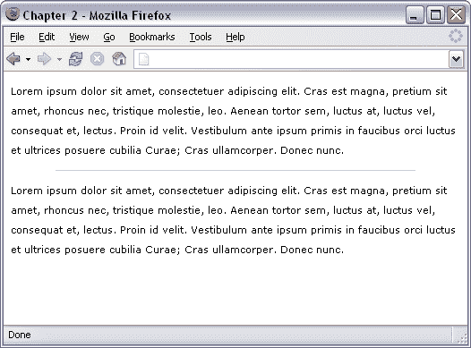
图 2.18。更改水平线的颜色、高度和宽度。

##### 如何缩进文本？

***解***

您可以通过对容器应用设置了`padding-left`值的规则来缩进文本。

例 2.20。indent.html(节选)

```
<p class="indent">Lorem ipsum dolor sit amet, consectetuer    

  adipiscing elit. Vivamus mollis. Etiam aliquet. Ut ultrices    

  justo ut arcu. Proin a purus. Fusce pharetra ultrices nibh.    

  Nam erat lectus, dapibus id, congue vel, cursus a, tellus.    

  Sed turpis ante, condimentum at, accumsan eget, pulvinar    

  vitae, nibh.</p>
```

例 2.21。indent.css(节选)

```
.indent {    

  padding-left: 30px;    

}
```

你可以在图 2.19 中看到缩进的段落。

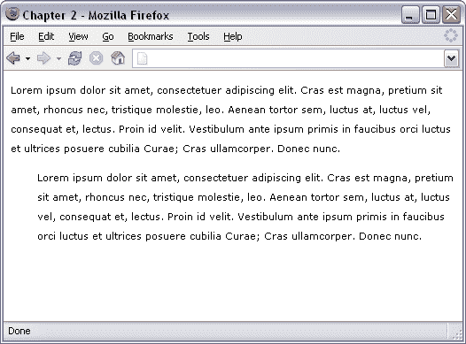
图 2.19。使用 CSS 缩进文本。

***讨论***

你不应该使用 HTML 标签`<blockquote>`来缩进文本，除非文本实际上是一个引用。尽管可视化编辑环境如 Macromedia Dreamweaver 经常将`<blockquote>`称为“缩进文本”,但还是要抵制使用它的诱惑；相反，设置一个 CSS 规则来缩进适当的块。`<blockquote>`是为标记一段引文而设计的，像为视障人士设计的屏幕阅读器这样的设备会以一种帮助用户理解他们所听到的是一段引文的方式来阅读这段文字。如果你使用`<blockquote>`来缩进普通段落，对于那些内容被当作引用来阅读的用户来说，这将是非常混乱的。

*一行程序*

一种相关的技术能够使每段的第一行缩进。为此，使用应用于段落的 CSS 属性 text-indent，或者应用于您希望以这种方式显示的段落的类。

```
p {    

  text-indent: 20px;    

}
```

##### 如何使文本居中？

***解***

您可以使用值为`center`的`text-align`属性将文本或任何其他元素居中。

例 2.22。center.html(节选)

```
<p class="centered">Lorem ipsum dolor sit amet, consectetuer    

  adipiscing elit. Vivamus mollis. Etiam aliquet. Ut ultrices    

  justo ut arcu. Proin a purus. Fusce pharetra ultrices nibh. Nam    

  erat lectus, dapibus id, congue vel, cursus a, tellus. Sed    

  turpis ante, condimentum at, accumsan eget, pulvinar vitae,    

  nibh.</p>
```

例 2.23。center.css(节选)

```
.centered {    

  text-align: center;    

}
```

结果如图 2.20 所示。

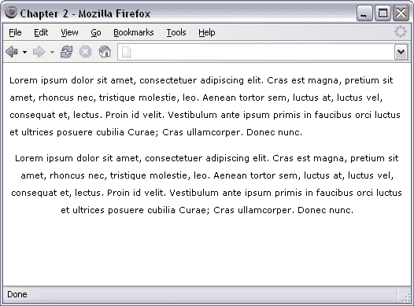
图 2.20。使用文本对齐将文本居中。

##### 如何使用 CSS 将文本改为全大写？

***解***

您可以使用`text-transform`属性将文本改为全大写并执行其他转换。

例 2.24。uppercase.html(节选)

```
<p class="transform">Lorem ipsum dolor sit amet, consectetuer    

  adipiscing elit. Vivamus mollis. Etiam aliquet. Ut ultrices    

  justo ut arcu. Proin a purus. Fusce pharetra ultrices nibh. Nam    

  erat lectus, dapibus id, congue vel, cursus a, tellus. Sed    

  turpis ante, condimentum at, accumsan eget, pulvinar vitae,    

  nibh.</p>
```

例 2.25。uppercase.css(摘录)

```
.transform {    

  text-transform: uppercase;    

}
```

注意图 2.21 中的大写文本。

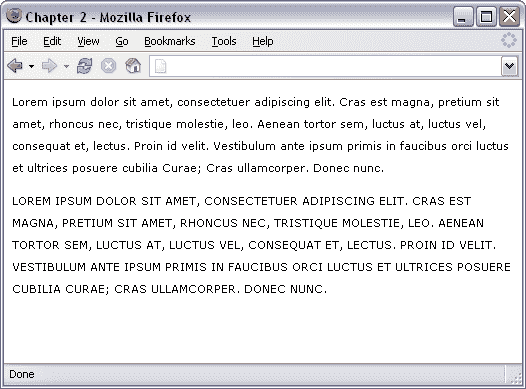
图 2.21。这个文本转换使所有的字母都变成大写。

***讨论***

`text-transform`属性还有其他有用的值。值“大写”将每个单词的第一个字母大写，如图 2.22 所示:

例 2.26。capitalize.css(节选)

```
.transform {    

  text-transform: capitalize;    

}
```

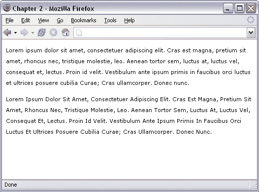
图 2.22。文本转换的应用改变了单词的外观。

`text-transform`属性的其他值有:

*   `lowercase`
*   `none`(默认)

##### 如何更改或删除列表项上的项目符号？

***解***

您可以通过更改`list-style-type`属性来更改列表中使用的项目符号的样式。

例 2.27。listtype.html(节选)

```
<ul>    

  <li>list item one</li>    

  <li>list item two</li>    

  <li>list item three</li>    

</ul>
```

要使用方形项目符号，如图 2.23 所示，请将属性设置为方形:

例 2.28。listtype.css

```
ul {    

  list-style-type: square;    

}
```

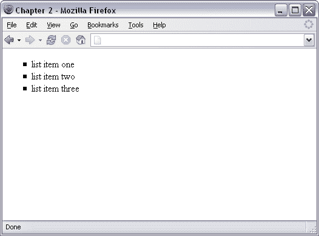
图 2.23。此列表使用方形项目符号。

***讨论***

`list-style-type`属性的其他值有:

*   `disc`
*   `circle`
*   `decimal-leading-zero`
*   `decimal`
*   `lower-roman`
*   `upper-roman`
*   `lower-greek`
*   `lower-alpha`
*   `lower-latin`
*   `upper-alpha`
*   `upper-latin`
*   `Hebrew`
*   `Armenian`
*   `Georgian`
*   `none`

并非所有浏览器都支持所有这些值；那些不支持特定类型的将显示默认的项目符号类型。您可以在列表样式类型的 CSS 测试套件中看到不同的类型，并检查您的浏览器对它们的支持。将`list-style-type`设置为`none`将导致不显示项目符号，尽管列表仍然会缩进，就好像项目符号在那里一样。你可以在图 2.24 中看到这一点。

例 2.29。listtype2.css

```
ul {    

  list-style-type: none;    

}
```


图 2.24。该列表显示时不带项目符号。

##### 如何为列表项目符号使用图像？

***解***

要为项目符号使用图像，请创建您的图像，然后为您的项目符号使用`list-style-image`属性，而不是`list-style-type`。该属性接受一个 URL，该 URL 将图像文件的路径作为一个值合并。

例 2.30。listimage.css

```
ul {    

  list-style-image: url(bullet.gif);    

}
```

你可以在图 2.25 中看到一个用作项目符号的图像示例。

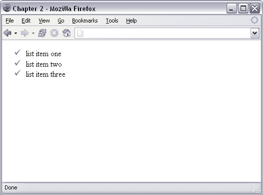
图 2.25。使用图像作为列表项目符号。

*每项项目符号*

*`list-style-image`属性实际上应用于列表中的列表项目(`<li>`)标签，但是通过将它应用于整个列表，单个项目将继承它。但是，您可以选择在单个列表项上设置属性，为单个项提供它们自己的项目符号图像。*

##### 如何从列表中移除缩进的左边距？

如果您已经将`list-style-type`设置为`none`，您可能还希望删除或减少浏览器在列表上设置的默认左边距。

***解***

如图 2.26 所示，要完全删除缩进以使列表与任何其他内容左对齐，请使用以下代码:

例 2.31。listnomargin.css

```
ul {    

  list-style-type: none;    

  padding-left: 0;    

  margin-left: 0;    

}
```

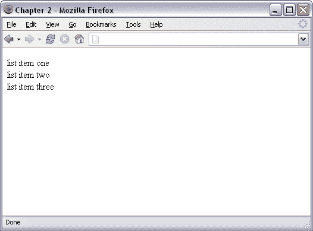
图 2.26。该列表没有缩进或项目符号。

***讨论***

完成此操作后，您可以调整缩进。要将内容缩进几个像素，请尝试以下方法:

```
ul {    

  list-style-type: none;    

  padding-left: 5px;    

  margin-left: 0;    

}
```

##### 如何水平显示列表？

默认情况下，列表项显示为块元素；因此，每个新项目将显示在一个新行上。然而，有时候页面上的某些内容从结构上来说是一个列表，尽管你可能不想这样显示它。例如，如果您想要水平显示“列表项”,会发生什么情况？

***解***

通过将`<li>`标签的 display 属性改为 inline，可以使列表水平显示。

例 2.32。listinline.html(节选)

```
<ul class="horiz">    

  <li>list item one</li>    

  <li>list item two</li>    

  <li>list item three</li>    

</ul>
```

例 2.33。listinline.css

```
ul.horiz li {    

  display: inline;    

}
```

上面代码的结果可以在图 2.27 中看到。

##### 如何给我的 CSS 文件添加注释？

您可以并且应该在 CSS 文件中添加注释。例如，CSS 文件非常简单，只有一些文本样式规则，可能不需要注释。然而，一旦你开始为一个站点使用大型 CSS 文件和多个样式表，注释就变得非常方便了！如果没有它们，您可能会花费大量时间寻找正确的类，考虑哪个类做什么以及它存在于哪个样式表中。

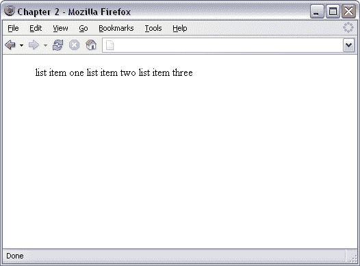
图 2.27。列表可以水平显示。

***解***

CSS 支持多行 C 风格的注释，就像 JavaScript 一样。因此，要注释掉一个区域，请使用以下代码:

```
/*    

  ...    

*/
```

至少，您应该在每个样式表的顶部添加一个注释来解释该样式表中的内容。

```
/* This is the default style sheet for all text on the site */
```

##### 我如何在不给 body 标签添加属性的情况下去掉页边距？

在 CSS 支持之前，我们会通过向`<body>`标签添加属性来删除文档和浏览器窗口之间的默认装订线:

```
<body topmargin="0" leftmargin="0" marginheight="0"    

    marginwidth="0">
```

***解***

body 标记的上述属性现在已被否决。它们应该被为`<body>`标签定义的 CSS 所取代。

```
body {    

  margin: 0;    

  padding: 0;    

}
```

*歌剧唱出自己的调子*

*Opera 的一些版本将边距和填充应用于`<html>`元素，而不是`<body>`标签。因此，为了支持 Opera，您需要使用下面的代码:*

```
html, body {    

  margin: 0;    

  padding: 0;    

}
```

##### 摘要

在这一章中，我们已经讨论了一些相对来说不熟悉 CSS 的人提出的比较常见的问题:与页面上的文本样式和操作相关的问题。通过结合这些技术，您可以创建吸引人的效果，对于那些不使用支持 CSS 的浏览器的人来说，这些效果会适当降低。

敬请关注 CSS 选集的下一章[*:101 个基本提示、技巧&黑客*](https://www.sitepoint.com/books/cssant1)——它将很快在 SitePoint 上发布。或者，如果你等不及了，[现在就免费下载前 4 章](https://www.sitepoint.com/show-modal-popup-after-time-delay/)。

## 分享这篇文章