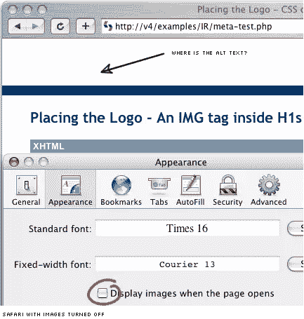

# CSS 打开/图像关闭

> 原文：<https://www.sitepoint.com/css-onimages-off/>

继昨天的[徽标放置讨论](https://www.sitepoint.com/css-selectors/)之后，一些人非常正确地提到了在 H1 标签中使用[IMG 标签放置徽标的简单性。毫无疑问，这种方法有很多优点，也有很好的理由说明为什么它是当前的标准。然而，值得注意的是，它可能不像你想的那样健壮。](https://www.sitepoint.com/examples/IR/meta-test.php)

以许多低带宽用户喜欢的“CSS 打开/图像关闭”的情况为例。作为一名坐在电缆末端的开发人员，很容易对这种场景嗤之以鼻，但是如果您:

1.  支付额外费用浏览您的网络电话，或者
2.  生活在一个无法有效接入宽带的地区

—这并不是一个激进的前景。事实上，我似乎记得住在 456 Berea St 的罗杰~~约翰松~~约翰逊最近提到，他仍然只能在自己的区域使用拨号上网。

公平地说，如果你屏蔽了图像，Firefox 和 Opera 的当前版本在缩放甚至着色替代文本到 H1 风格方面都做得很好。

然而，IE 渲染了一个难看的“缺失图形”图标，并以几乎无法辨认的 10px 字体叠加了 ALT 文本。当然不理想，但也许可以忍受。

不过，Safari 真的让人大开眼界。正如你在截图中看到的，禁用图片会移除它们，但是 Safari 忽略了留下任何证据——替代文本或其他——表明该区域曾经有过图片。

也许有一种我不知道的在 Safari 中关闭图像的替代方法？我必须承认这不是我的默认浏览器，所以我不知道它的里里外外。

但是如果不是，那就不是一个好的结果，也是需要注意的事情。

## 分享这篇文章