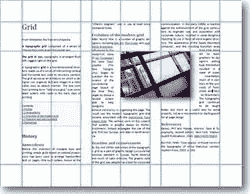

# CSS 定位:三个规范比一个好？

> 原文：<https://www.sitepoint.com/css-positioning-three-specs-better-than-one/>

CSS 3 将引入大量新功能的领域之一是页面布局。这被广泛认为是一件好事。但是 W3C 刚刚宣布在 CSS 3 中将有两个独立的页面布局模块，这个标准可能对浏览器开发者要求太高了。

尽管让 CSS 的定位特性屈从于你的意愿是值得的，但我想我们都同意 CSS 2 的设计并没有考虑三列布局。浮动和负利润可以完成这项工作，但它们肯定会引起争论。

由 W3C 在 2005 年 12 月作为工作草案推出，不可否认的是 [CSS 高级布局模块](https://www.w3.org/TR/css3-layout/)比我们现在拥有的*方式*更好，但是浏览器供应商对实现这个模块明显缺乏兴趣表明它可能在错误的轨道上。在 8 月份最新的工作草案发布后，SitePen 的亚历克斯·罗素受到了一些[的严厉批评](http://alex.dojotoolkit.org/?p=625):

> 我甚至不确定是否应该提到“高级”布局[模块]，因为害怕更多的人会真的看到它。你会期望一个“高级布局”模块给我们 hbox 和 vbox 行为，或者一个网格布局模型或拉伸…但不，答案显然是 *ascii art* 。

看起来至少 W3C CSS 工作组的一些成员同意这个观点。上个月，小组发布了*另一个* CSS 3 模块的第一份公开工作草案，用于布局: [CSS 网格定位](https://www.w3.org/TR/2007/WD-css3-grid-20070905/)。

这个新的布局模块建立在现有的用于文本列的[多列布局模块](https://www.w3.org/TR/css3-multicol/)的基础上，该模块在 6 月份看到了最新的工作草案，现在 Firefox 2 和 Safari 3 部分支持该模块。网格定位使您能够将元素与由多列元素定义的“隐式网格”对齐。或者，您可以定义一个“显式网格”,然后将元素与之对齐。这是通过引入一个新的 CSS 长度度量来实现的:网格单位(例如`1.5gr`)。

高级布局模块和网格定位模块之间的交互还有待规定，但是使用高级布局模块定义定位网格的元素也应该定义隐式网格，以便用网格定位的特性对齐元素。

所有这些听起来都很棒，但是我们真的能够使用这些东西吗？即使是相对冒险的浏览器，如 Opera 和 Safari，到目前为止也避开了高级布局模块，虽然网格定位确实建立在获得浏览器支持的功能上，但这个新的布局模块看起来并不容易实现。

在 CSS 面临的最大挑战是让浏览器制造商投资新功能的时候，W3C 应该用多个 CSS 模块做同样的事情来淡化它的“推销”吗？或者，W3C 不断提出新的 CSS 布局标准，直到浏览器对其中一个感兴趣，这是一件好事吗？

## 分享这篇文章