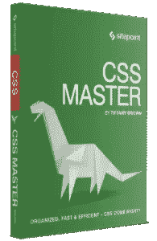

# CSS 选择器:特异性

> 原文：<https://www.sitepoint.com/css-selectors-specificity/>



下面是我们的书《CSS 大师》的摘录，作者是蒂芙尼·布朗。世界各地的商店都有出售，或者你可以在这里买到电子书。

将 **特殊性** 想象成一个分数或等级，它决定了最终将哪些样式声明应用于一个元素。通用选择器(`*`)特异性低。ID 选择器是高度特定的。后代选择器如`p img`和子选择器如`.panel > h2`比类型选择器如`p`、`img`或`h1`更具体。

一开始，计算精确的特异性值似乎很棘手。如[选择器第 3 级所述，](http://dev.w3.org/csswg/selectors-3/#specificity)您需要:

> *   Calculate the number of ID selectors in selectors (= a)
>     
>     
> *   Calculate the class selectors in selectors (= B), Number of attributes and pseudo-classes
>     
>     
> *   Calculate the number of pseudo-elements in the type selector and selector (= C)
>     
>     
> *   Ignore the general selector

然后将这些 A、B 和 C 值组合起来，形成最终的特异性值。像`#foo`这样的 ID 选择器具有 1，0，0 的特异性。属性选择器，如`[type=email]`和类选择器，如`.chart`，具有 0，1，0 的特异性。添加一个伪类，比如`:first-child`(例如`.chart:first-child`)给我们一个 0，2，0 的特异性。但是使用一个简单的类型或元素选择器，比如`h1`或`p`，只能给出 0，0，1 的特异性。

### 注:计算特异性

Keegan Street 的[特异性计算器](http://specificity.keegan.st/)和 Joshua Peek 的 [CSS 解释](http://josh.github.io/css-explain/)有助于了解和计算选择器特异性。

当然，复杂和组合选择器给了我们更高的特异性值。让我们看一个例子。考虑以下 CSS:

```
ul#story-list > .book-review {
    color: #0c0;
}

#story-list > .book-review {
    color: #f60;
}
```

这两个规则集相似，但不相同。第一个选择器`ul#story-list > .bookreview`，包含类型选择器(`ul`)、ID 选择器(`#story-list`)和类选择器(`.bookreview`)。它的特异性值为 1，1，1。第二个选择器，`#story-list > .book-review`只包含一个 ID 和一个类选择器。其特异性值为 1，1，0。尽管我们的`#story-list > .book-review`规则继承了`ul#story-list > .bookreview`，但是前者更高的特异性意味着那些带有`.book-review`类的元素将是绿色的而不是橙色的。

像`:link`或`:invalid`这样的伪类与类选择器具有相同的特异性。`a:link`和`a.external`的特异性值都是 0，1，1。类似地，像`::before`和`::after`这样的伪元素和类型或元素选择器一样具体。在两个选择器都同样特定的情况下，级联效应就开始了。这里有一个例子:

```
a:link {
    color: #369;
}
a.external {
    color: #f60;
}
```

如果我们应用这个 CSS，除了那些应用了`class="external"`的链接之外，每个链接都将是蓝灰色的。这些链接将改为橙色。

保持低特异性有助于防止 **选择器蠕动** ，或者选择器特异性和长度随时间增加的趋势。当你在团队中加入新的开发人员，或者在网站中加入新的内容时，这种情况经常发生。选择器蠕变还会导致长期维护问题。您要么最终使用更具体的选择器来覆盖其他规则集，要么需要重构代码。较长的选择器也会增加 CSS 文件的重量。

我们将在第二章讨论保持低特异性的策略。

## 结论

看完这一章，你应该对 [CSS 选择器](https://www.sitepoint.com/css-selectors/)有了很好的理解。具体来说，您现在应该知道如何:

*   使用选择器将 CSS 应用于特定的元素、伪元素和伪类

*   理解伪元素和伪类的区别

*   采用由选择器级别 3 和 4 规范引入的较新的伪类

*   计算特异性

在下一章，我们将提出一些编写可维护、可伸缩 CSS 的黄金法则。

## 分享这篇文章