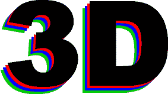

# 如何用 CSS3 创建 3D 文本

> 原文：<https://www.sitepoint.com/css3-3d-text/>

我们已经看到了如何使用 CSS3 文本阴影属性来创建[发光的](https://www.sitepoint.com/css3-glowing-link-effect/)和[模糊的](https://www.sitepoint.com/css3-blurred-text-effect/)文本。今天，我们将把这一特性发挥到极致，进入 3D 领域:


这是在没有图形、插件或画布欺骗的情况下实现的。不相信我？拿个 [**看看火狐、Chrome、Safari 或 Opera *中的示例页面***](https://blogs.sitepointstatic.com/examples/tech/css3-3d-text/index.html) (抱歉 IE 用户——你需要等 10 版)。

深度是用多个文本阴影创建的。每一个都有一个零模糊，并且越来越偏离主文本。此图显示了层是如何构建的，但在真实示例中，颜色相似，间距不超过 1px:



然后应用一些模糊的阴影，使 3D 效果更加真实。最终的 CSS:

```
 p.threeD
{
	text-shadow:
		-1px 1px 0 #ddd,
		-2px 2px 0 #c8c8c8,
		-3px 3px 0 #ccc,
		-4px 4px 0 #b8b8b8,
		-4px 4px 0 #bbb,
		0px 1px 1px rgba(0,0,0,.4),
		0px 2px 2px rgba(0,0,0,.3),
		-1px 3px 3px rgba(0,0,0,.2),
		-1px 5px 5px rgba(0,0,0,.1),
		-2px 8px 8px rgba(0,0,0,.1),
		-2px 13px 13px rgba(0,0,0,.1)
		;
} 
```

[**演示页面**](https://blogs.sitepointstatic.com/examples/tech/css3-3d-text/index.html) 展示了一个例子，并包含了完整的源代码。

好吧，这是一个可爱的效果，但对于你疲惫的打字手指来说，这是一个很大的 CSS 代码。建立自己的风格也需要时间和努力。如果我们有东西来替我们处理这些繁重的工作，那不是很好吗？*敬请关注 SitePoint…*

## 分享这篇文章