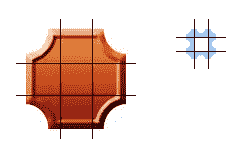

# CSS3 边框-图像

> 原文：<https://www.sitepoint.com/css3-border-image/>

编者按:本文通篇使用图像来说明边框图像所达到的效果。来看看这是怎么回事。并查看代码，进入[演示页面](http://standardista.com/articles/borderimage.html)。

CSS3 中的一个新特性是`border-image`属性，但对浏览器来说并不新鲜。`Border-image`提供了一种为任何元素添加装饰边框的方法。使用`border-image`属性，你可以为元素创建装饰性的边框，不仅仅是简单的圆角，还有非常小文件大小的图像，甚至是渐变。

属性允许你拍摄一个小图像，将它虚拟地分割成九个部分，并将小图像的各个部分放置/分布在一个更大的元素上。

您可以拍摄一张图像，并在一个按钮或整个页面上拉伸它。


We’ve used the image on the left as a `border-image` for the `div` on the right, maintaining the corners, while stretching the center of the `border-image` to cover the entire `div` on the right.In this second example, instead of stretching the middle of the `border-image`, we’ve repeated, slightly distorting the image if necessary to ensure we don’t have a broken image in supporting browsers.To ensure that the image is not ‘broken’, the width should be a multiple of the slice’s width. While we’ve repeated the top, bottom and sides, we’ve maintained the four corners, creating a stamp-like effect.

接下来，我们将讲述如何拍摄一张`background-image`，虚拟地剪切它，并重复或拉伸图像以覆盖元素的边界和背景。

`border-image`是一个简写属性，用于声明:

```
  border-image-source:
  border-image-slice:
  border-image-width:
  border-image-outset:
  border-image-repeat:
```

简写的语法是:

```
 border-image: <source>
<slice {1,4}> / <width {1,4}> <outset> <repeat{1,2}>;
```

目前，Opera、Firefox、Chrome 和 Safari 都支持带供应商前缀的`border-image`速记属性，但不支持组成速记的任何手写属性。因此，虽然我们将讨论定义边框图像的各种属性，但是您应该总是使用简写，而不是下面描述的简写属性。

## 边框-图像-来源:

border-image-source 是要用作边框图像的图像的 URL、渐变或数据 URI。在上面的例子中，虽然不支持手写属性，但就好像我们使用了

```
.gradientBox {
  border-image-source: url(gradient.png);
}
.stamp {
  border-image-source: url(stamp.gif);
}
```

正如您可以将渐变、base 64、gif、jpegs、png 甚至 SVG 图像作为背景图像一样，您也可以将所有这些图像类型作为边框图像。

## 边框图像切片:

`border-image-slice`属性定义了一到四个长度，这些长度设置了从图像的每个边缘到标记区域的距离，该区域将被用于剪切或切片我们的边界图像。

`border-image-slice`属性值表示分别从图像的上、右、下和左(故障)边缘向内偏移。实际上，使用您定义的四条线，浏览器将一个边框图像分成九个区域:四个角、四个边和一个中间。四个角保持它们的精确尺寸。根据其他`border-image`属性的值，其他五个值可以拉伸或重复，或者两者的组合(舍入)。



上图中的黑线描绘了我们定义的四条切片线是如何切割我们的`border-image`。

在我们的例子中，我们将图像从每边 30px 分割为渐变，从每边 8 像素分割为图章。

在上面的例子中，虽然不支持手写属性，但就好像我们使用了

```
.gradientBox {
  border-image-slice: 30 30 30 30;
}
.stamp {
  border-image-slice: 8 8 8 8;
}
```

或者，由于值是重复的，就像边框或填充的 TRBL，我们可以对所有四个边使用一个值

```
.gradientBox {
  border-image-slice: 30;
}
.stamp {
  border-image-slice: 8;
}
```

注意我们没有使用长度单位。如果以长度设置切片值，并且该值将被解释为像素，请省略单位。如果使用百分比值，请包括百分比。在我们的示例中，我们还可以使用以下内容:

```
.gradientBox {
  border-image-slice: 30%;
}
.stamp {
  border-image-slice: 26.7%;
}
```

对于位图图像，省略的值作为像素值进行插值。对于矢量图像(SVG ),这些值是坐标。对于百分比，使用百分号(%)。

## 边框-图像-宽度:

属性设置元素边框的宽度。如果声明了`border-image-width`属性，它优先于声明了`border-width`的属性。如果省略并且省略了`border-width`，则该值默认为`border-width`默认值“中”，或者通常为 3px。

Opera 不支持这种简写方式(build 1024 是最近检查的版本)。此外，任何浏览器都不支持 auto 值。因此，通常建议将`border-width`作为一个单独的属性。作为速记的一部分声明就好像我们声明了:

```
.gradientBox {
  border-image-width: 30px 30px 30px 30px;
}
.stamp {
  border-image-width: 8px 8px 8px 8px;
}
```

或者，因为所有的值都相同，

```
.gradientBox {
  border-image-width: 30px;
}
.stamp {
  border-image-width: 8px;
}
```

到目前为止，我们已经:

```
.gradientBox {
  border-image: url(gradient.png) 30 / 30px;
}
.stamp {
  border-image: url(stamp.gif) 8 / 8px;
}
```

由于在简写中包含 `border-image-width`目前会使 Opera 失败，所以建议排除该属性，而选择包含 CSS2 `border-width`值。

```
.gradientBox {
  border-width: 30px;
}
.stamp {
  border-width: 8px;
}
```

让`border-image-width`与`border-image-slice`的宽度相同将会创建没有失真的最好看的边界图像。但是，他们不需要有相同的价值观。如果数值不同，切片将被拉伸(或收缩)到`border-image-width`的宽度。

记住盒子模型！随着您增加`border-image-width`，您的元素将变得更大。

## 边界-图像-开头

`border-image-outset`属性指定了`border-image`区域在所有四个边上超出边框的量。任何浏览器都不支持它，它会使整个声明失败，所以现在不要包含它。默认值为 0。

## 边框-图像-重复

`border-image-repeat`属性允许您描述非角部图像(侧面和中间)如何重复和/或缩放。第一个值是顶部和底部，第二个值是左侧和右侧。如果省略第二个值，所有四条边的值都相同。

规范目前定义了四种可能的值，但是只有三种得到了很好的支持。`stretch`表示图像不应平铺，而应拉伸以填充该区域。`repeat`表示平铺(或重复)图像以填充该区域。如果为重复图像分配的区域不能被图像的宽度整除，则最后一个平铺图像可能会被剪切掉。使用`round`,图像被平铺(重复)以填充区域，图像被缩小，可能会失去其纵横比，但确保图像不会被裁剪。注意，Webkit 不支持`round`值，用`repeat`代替它(我猜这比失败要好)。

当前不支持`space`值，但是如果支持的话，`border-image`将在所提供的区域内重复尽可能多的次数，平铺均匀，如果所提供的宽度不是图像大小的整数倍，则平铺之间显示空白。

在上面的例子中，我们使用`stretch`作为渐变，使用`round`作为图章。你总是想要拉伸渐变，因为重复渐变会在一个图块结束而下一个图块开始时产生粗糙的线条。而且，虽然在邮票上使用`repeat`似乎有道理，但我们无法知道这个图像是否能被我们设计的宽度整除。`round`确实稍微扭曲了图像，但这比切断图像要好。

如果我们使用相反的方法，效果会很奇怪。虽然顶部和底部可以使用`round`、`repeat`或`stretch`，但左侧和右侧肯定需要`stretch`值:


## 边框图像速记

如前所述，没有浏览器支持上面定义的手写属性，但 Opera、Firefox、Chrome 和 Safari 理解带前缀的速记`border-image`属性。现在我们已经理解了速记属性的组成部分，让我们把它们放在一起。

正确的语法是

```
border-image: <source>
<slice {1,4}> / <width {1,4}>  / <outset> <repeat{1,2}>;
```

由于目前不支持 outset，我们可以省略它:

```
border-image: <source>
<slice {1,4}> / <width {1,4}> <repeat{1,2}>;
```

像所有的`border-images`一样，我们将渐变图像切割成由`border-image-slice`属性定义的九个切片。一般来说，切片的宽度与`border-width`相同。而且，因为我们有一个渐变，我们想拉伸图像，而不是平铺它，所以我们不会得到粗糙的颜色过渡。因此，我们的准则是:

```
.gradientBox {
    border-image: url(gradient.png) 34 34 34 34 / 34px 34px 34px 34px stretch stretch;
}
```

通过重复的值，我们可以缩小到:

```
.gradientBox {
    border-image: url(gradient.png) 34  / 34px  stretch;
}
```

由于 Opera 不理解包含在速记中的`border-image-width`,我们单独包含了`border-width`,然后扩展我们的声明以包含各种供应商前缀:

```
.gradientBox {
   border-width: 34px;
  -moz-border-image: url(gradient.png) 34 / 34px  stretch;
  -webkit-border-image: url(gradient.png) 34 / 34px  stretch;
  -o-border-image: url(gradient.png) 34   stretch;
   border-image: url(gradient.png) 34 / 34px   stretch;
}
```

类似地，我们的图章效果包括图章图像作为`border-image-source`，有 8 个像素宽的边框，有一个重复的边框，不能显示部分图像，以免破坏设计。我们还有 Opera 的问题`border-width`，所有支持的浏览器还是用厂商前缀。因此，我们的代码如下所示:

```
.stamp {
    border-width: 8px;
   -webkit-border-image: url(stamp.gif) 8 / 8px round;
   -moz-border-image: url(stamp.gif) 8 / 8px round;
   -o-border-image: url(stamp.gif) 8  round;
    border-image: url(stamp.gif) 8 / 8px  round;
    }
```

## 资源

至此，你有望很好地理解如何创建一个边框图像。有几个工具可以帮助你:

*   [W3C 边框图像规范](https://www.w3.org/TR/css3-background/#border-images)
*   使用自己的边框图像创建 CSS 代码的工具
*   [浏览器支持网格边框-图像属性](http://www.standardista.com/css3/css3-border-properties)
*   [边框图像可视化工具](http://www.norabrowndesign.com/css-experiments/border-image-anim.html)

本文通篇使用图像来说明边框图像所达到的效果。来看看这是怎么回事。并查看代码，进入[演示页面](http://standardista.com/articles/borderimage.html)。

## 分享这篇文章