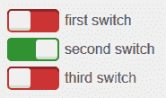

# 如何在 CSS3 中创建一个切换开关

> 原文：<https://www.sitepoint.com/css3-toggle-switch/>

你会在网上的许多地方发现类似移动界面的拨动开关，但我想改进现有的例子。



具体来说，我想要一个解决方案，它:

1.  逐步增强的标准复选框
2.  没有使用多余的 HTML 标签或属性
3.  支持的输入标签
4.  仅使用 CSS，没有图像或 JavaScript
5.  使用相对单位，因此控件可调整大小/响应
6.  有一些流畅的动画
7.  理想情况下，可在一系列移动浏览器中运行，并且
8.  适度降级，因此它在所有浏览器中都可用

[**查看演示页面**](http://cssdeck.com/labs/full/css3-toggle-switch)[HTML/CSS 代码……](http://cssdeck.com/labs/css3-toggle-switch)

## HTML

我们需要一个`input`复选框和一个`label`:

```
<div>
	<input type="checkbox" id="switch1" name="switch1" class="switch" />
	<label for="switch1">first switch</label>
</div> 
```

`input`分配了一个“开关”类别。这确保我们可以在需要时保留正常的复选框。

HTML 纯粹主义者看到包装器`div`会感到恐惧，但是只有当你需要两个或更多的切换开关时才需要——在同一个父容器中不能有一个以上的开关(或更多的标签)。此外，您可能还需要`div`包装器来分隔表单元素。

HTML 将在大多数浏览器中以最少的样式呈现得很好。IE6、7 和 8 用户将会看到:


## CSS

现在是有趣的部分。首先，我们将使用负边距隐藏输入框——这可能比 display:none 更可取，后者通常会在移动设备上禁用它:

```
input.switch:empty
{
	margin-left: -999px;
} 
```

你可能已经看到了我最近的帖子[中使用的`:empty`选择器，如何在 CSS3](/css3-responsive-centered-image/) 中创建一个响应居中的图像。它只匹配没有子元素的元素，但是由于 IE8 和更低版本不支持它，这些浏览器不会尝试应用这些样式。

接下来，我们将设计输入复选框的同级标签的样式:

```
input.switch:empty ~ label
{
	position: relative;
	float: left;
	line-height: 1.6em;
	text-indent: 4em;
	margin: 0.2em 0;
	cursor: pointer;
	-webkit-user-select: none;
	-moz-user-select: none;
	-ms-user-select: none;
	user-select: none;
}
```

需要注意的主要属性是 position:relative，为开关提供空间的文本缩进，以及定义其高度的 line-height。

切换本身是使用`:before`和`:after`伪元素为彩色背景和白色开关创建的:

*   这两个元素都绝对位于我们标签的左边
*   白色开关被设置为较小的尺寸，并应用了左边距以将其与背景对齐
*   一个边框半径和嵌入框阴影是适用于给一些深度，和
*   为动画定义一个过渡。

```
input.switch:empty ~ label:before, 
input.switch:empty ~ label:after
{
	position: absolute;
	display: block;
	top: 0;
	bottom: 0;
	left: 0;
	content: ' ';
	width: 3.6em;
	background-color: #c33;
	border-radius: 0.3em;
	box-shadow: inset 0 0.2em 0 rgba(0,0,0,0.3);
	-webkit-transition: all 100ms ease-in;
	transition: all 100ms ease-in;
}

input.switch:empty ~ label:after
{
	width: 1.4em;
	top: 0.1em;
	bottom: 0.1em;
	margin-left: 0.1em;
	background-color: #fff;
	border-radius: 0.15em;
	box-shadow: inset 0 -0.2em 0 rgba(0,0,0,0.2);
} 
```

最后，当复选框被选中时，我们将开关移动到右边并更改背景颜色:

```
input.switch:checked ~ label:before
{
	background-color: #393;
}

input.switch:checked ~ label:after
{
	margin-left: 2em;
} 
```

[**查看演示页面**](http://cssdeck.com/labs/full/css3-toggle-switch)[HTML/CSS 代码……](http://cssdeck.com/labs/css3-toggle-switch)

每个人都喜欢拨动开关！请随意使用代码。一个回到这篇文章的链接或者一条*“嘿，克雷格，那太棒了/太可怕了”* [推文](http://twitter.com/craigbuckler)很感谢。

## 分享这篇文章