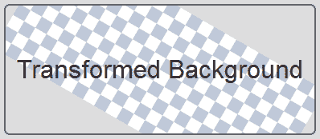

# 如何将 CSS3 变换应用于背景图像

> 原文：<https://www.sitepoint.com/css3-transform-background-image/>

CSS 转换很棒，但是他们没有(还没有？)应用于背景图像。本文提供了一种解决方法，用于当您确实想要旋转背景图像，或者在旋转背景图像的容器元素时保持背景图像不变的时候。

*本文更新于 2020 年。更多的 CSS 知识，请阅读我们的书， [CSS 大师，第二版](https://www.sitepoint.com/premium/books/css-master-2nd-edition?utm_source=blog&utm_medium=articles)。*

使用 CSS3 [`transform`属性](https://www.sitepoint.com/a-primer-on-css3-transforms/)可以缩放、倾斜和旋转任何元素。所有没有厂商前缀的现代浏览器都支持它[。](http://caniuse.com/#search=transform)

```
#myelement {
  transform: rotate(30deg);
} 
```

很棒的东西。但是，这会旋转整个元素——它的内容、边框和背景图像。如果你只想旋转背景图片呢？或者，如果您希望在内容旋转时背景保持不变，该怎么办？

没有 W3C CSS 关于`background-image`转换的提议。这将是非常有用的，所以也许最终会出现一个，但这对今天想使用类似效果的开发人员没有帮助。

一种选择是从原始图像创建一个新的背景图像，比如旋转 45 度。这可以通过以下方式实现:

1.  服务器端图像处理过程
2.  基于客户端 [`canvas`](https://developer.mozilla.org/en-US/docs/Web/API/Canvas_API) 的图像处理代码，或者
3.  一些图像托管 CDN 服务提供的 API。

但是所有这些都需要额外的努力、处理和成本。

幸运的是，有一个基于 CSS 的解决方案。本质上，这是一种将背景图像应用于`::before`或`::after`伪元素而不是父容器的黑客行为。然后，可以独立于内容对伪元素进行转换。

## 仅变换背景

容器元素可以应用任何样式，但是它必须被设置为`position: relative`，因为我们的伪元素将被放置在其中。你也应该设置`overflow: hidden`,除非你喜欢背景溢出到容器之外。

```
#myelement {
  position: relative;
  overflow: hidden;
} 
```

我们现在可以创建一个绝对定位的伪元素，并转换背景。将`z-index`设置为`-1`,以确保它出现在容器内容的下方:

```
#myelement::before {
  content: "";
  position: absolute;
  width: 200%;
  height: 200%;
  top: -50%;
  left: -50%;
  z-index: -1;
  background: url(background.png) 0 0 repeat;
  transform: rotate(30deg);
} 
```

注意，您可能需要调整伪元素的宽度、高度和位置。例如，如果您使用重复的图像，旋转区域必须大于其容器才能完全覆盖背景。



## 将背景固定在已变换的元素上

父容器上的所有变换都应用于伪元素。因此，我们需要*撤销*那个转换。例如，如果容器旋转 30 度，背景必须旋转-30 度才能返回到其原始位置:

```
#myelement {
  position: relative;
  overflow: hidden;
  transform: rotate(30deg);
}

#myelement::before {
  content: "";
  position: absolute;
  width: 200%;
  height: 200%;
  top: -50%;
  left: -50%;
  z-index: -1;
  background: url(background.png) 0 0 repeat;
  transform: rotate(-30deg);
} 
```

同样，您需要调整大小和位置，以确保背景充分覆盖父容器。

以下是 CodePen 上的相关演示:

看笔 [CSS3 通过](https://codepen.io/SitePoint/pen/Ngpvwx) [CodePen](https://codepen.io) 上的 site point([@ site point](https://codepen.io/SitePoint))
对背景图像进行变换。