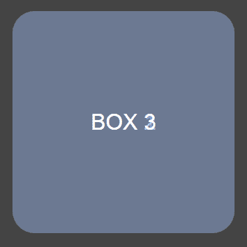
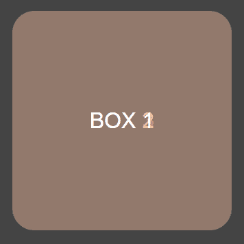
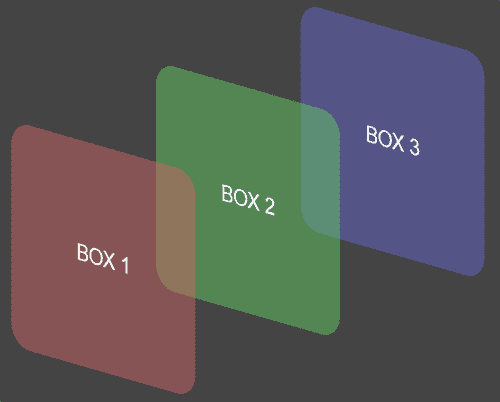
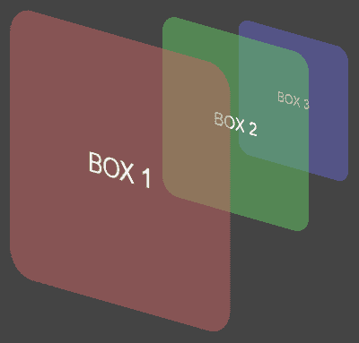

# CSS3 3D 转换

> 原文：<https://www.sitepoint.com/css3-transformations-3d/>

在本系列的第三部分中，讨论三维变换似乎是合适的。

正如你所料，3D 更复杂，在浏览器中稳定性稍差。为确保合理的兼容性:

1.  使用所有属性的标准版本和带-webkit 前缀的版本(这些没有在下面的代码示例中显示，但在演示中会显示)。
2.  忘记 IE9 及以下。IE10 支持 3D 转换，但浏览器缺少一个关键属性，您可能需要修改代码以实现完全的跨浏览器支持*(稍后将详细介绍)*。

## 2D 屏幕上的 3D？

在二维空间中，我们有水平的 x 轴和垂直的 y 轴。在三维空间中，我们也有一个 z 轴。如果你假设你的屏幕是 z 坐标的零点，正值表示物体向你移动，负值表示物体向远离你的方向移动。增加一些视角，一个物体可能会消失在远处。

还有一些其他特定于浏览器的要点需要注意:

1.  我们正在转换三维空间中的二维元素。HTML 框保持扁平，深度为零。即使您可以在 z 平面中缩放元素，它也不会挤出，即您的圆将保持为圆，不会变成圆柱体。
2.  3D 变换应用于所有内部元素。
3.  转换一个元素有点太容易了，所以它以某种方式被移到你身后或屏幕之外！我的建议是:经常测试并撤销任何灾难性的转换。

## 应用深度

我们从一个简单的例子开始:

```
<div id="stage">

	<div id="mybox1">BOX 1</div>
	<div id="mybox2">BOX 2</div>
	<div id="mybox3">BOX 3</div>

</div>
```

我们的外部元素(#stage)包含三个盒子，分别为透明的红色、绿色和蓝色。外部元素不是严格要求的，但它允许我们旋转整个场景，这有助于可视化。

首先，我们将尝试使用`translateZ`功能将第二个和第三个框进一步移回屏幕，该功能与`translateX`和`translateY`相同，只是它适用于深度:

```
#mybox2
{
	transform: translateZ(-300px);
}

#mybox3
{
	transform: translateZ(-600px);
}
```

[**查看第一个 3D 转换演示页面……**](https://blogs.sitepointstatic.com/examples/tech/css3-transformations/3dtransform1.html)

结果是:

[](https://blogs.sitepointstatic.com/examples/tech/css3-transformations/3dtransform1.html)

这不是我们所期望的；方框 3 肯定比其他的高。原因是`transform-style`属性的默认值为`flat`。这将在同一个二维平面中应用所有的 3D 变换，因此，当变换发生时，没有深度的错觉。为了解决这个问题，我们需要将一个值`preserve-3d`应用到我们的外部#stage 容器:

```
#stage
{
	transform-style: preserve-3d;
}
```

[**查看第二个 3D 转换演示页面……**](https://blogs.sitepointstatic.com/examples/tech/css3-transformations/3dtransform2.html)



**IE10 平了！**
不幸的是，IE10 不支持`transform-style`所以盒子 3 会留在盒子 1 上面。因为我们可以对单个元素应用 3D 变换，所以一切都不会丢失。然而，不可能将效果应用于具有多个子元素的容器，因此下面的演示将无法在浏览器中运行。让我们期待微软在 IE11 中解决这个问题。

所以，除了 IE10，我们越来越近，但没有深度的错觉。让我们…

## 获得一些观点

在上面的演示中，我们坐在舞台的前面，看着我们的三个盒子。但是没有透视，所以盒子 1 与盒子 2 和盒子 3 的大小完全相同。我们可以通过移动整个外部#阶段来说明这一点:

```
#stage
{
	transform: rotateX(-20deg) rotateY(-40deg);
}
```

我们现在坐在剧院的右边，看着我们的舞台，有三个盒子:



`perspective`变换功能将确保较远的物体变小:

```
#stage
{
	transform: rotateX(-20deg) rotateY(-40deg) perspective(600px);
}
```

[**查看第三次 3D 改造演示页面……**](https://blogs.sitepointstatic.com/examples/tech/css3-transformations/3dtransform3.html)



向`perspective`函数传递一个值，该值指示查看者离动作有多近。数字越小，透视效果越明显。把 0px 想象成坐在#舞台的第一排；更容易看出演员和物体之间的相对距离。1000px 的值是上圆的背面；判断准确的距离更加困难，所以这些物体看起来大小相似。

尝试使用您自己的#stage 旋转和透视值，看看它如何影响元素。在下一课中，我们将对我们的 3D 场景应用其他的`transform`函数。

## 分享这篇文章