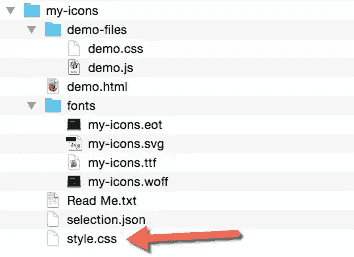
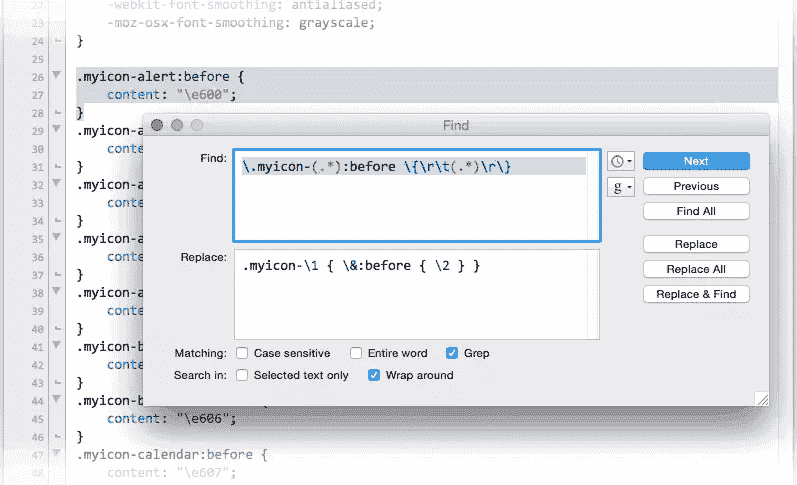
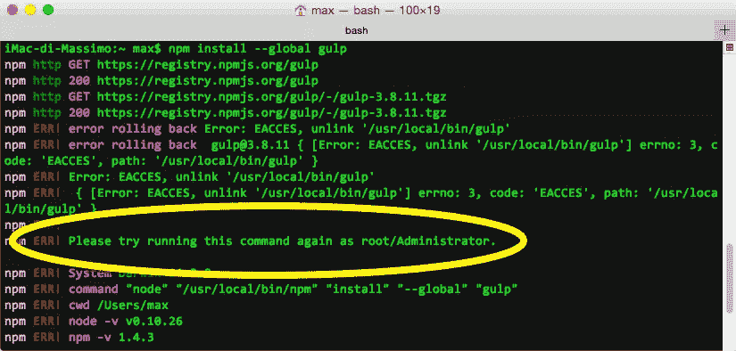
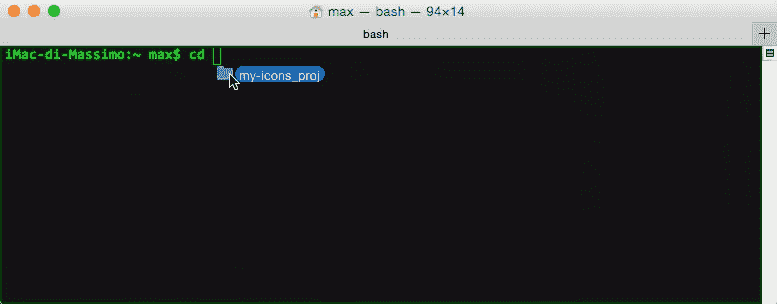
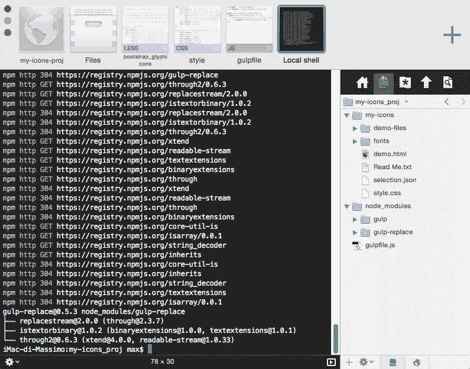
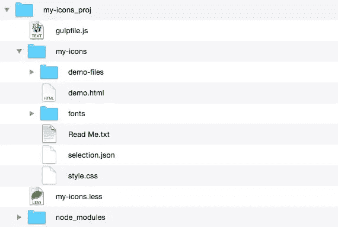

# 使用 Gulp 自定义引导图标

> 原文：<https://www.sitepoint.com/customizing-bootstrap-icons-using-gulp/>

如果您正在使用 Bootstrap 开发一个 web 项目，您可能需要添加一组自定义图标来代替框架附带的默认图标[glyphicon](http://getbootstrap.com/components/#glyphicons)。

我已经讨论了使用 Illustrator 和 Icomoon 构建图标的主题，但是在 Bootstrap 项目中集成图标的更好方法是什么？

## Icomoon CSS vs Glyphicons CSS

当我们从 Icomoon 下载一组图标时(为了这个演示，我创建了一个名为`my-icons`的项目)，我们得到了字体文件、一些演示文件(为我们的字形提供了有用的参考)和一个`style.css`文件。这个包含了你在项目中使用字体所需的所有 CSS 规则。



让我们来看看 CSS 文件。它包含一个`@font-face`声明、一个捕捉所有图标类的规则(基于它们名称的第一部分)和一个所有图标类的列表:

```
@font-face {
  font-family: 'my-icons';
  src:url('fonts/my-icons.eot?-dp1fqh');
  /* other properties */
}

[class^="myicon-"], [class*=" myicon-"] {
  /* some properties */
}

.myicon-alert:before {
  content: "\e600";
}

.myicon-arrow-down:before {
  content: "\61";
}

/* ... more icons */
```

现在，让我们看看来自 Bootstrap 的`glyphicons.less`文件:

```
// Import the fonts
@font-face {
  font-family: 'Glyphicons Halflings';
  src: url('@{icon-font-path}@{icon-font-name}.eot');
  /* other properties */
}

// Catchall baseclass
.glyphicon {
  /* some properties */
}

// Individual icons
.glyphicon-asterisk { 
  &:before {
    content: "\2a";
  }
}

.glyphicon-plus {
  &:before {
    content: "\2b";
  }
}

/* ... more icons */
```

它们非常相似，但有一些基本的区别:

*   首先，Glyphicons 是一个少了[的](http://lesscss.org/)文件(也有一个 Sass 文件)，图标字体路径和名称被分配给两个变量(`@{icon-font-path}`和`@{icon-font-name}`)。
*   Glyphicons 使用一个类作为“catchall”选择器(`.glyphicon`)，而 Icomoon 使用一个属性选择器。
*   Glyphicons 为单个类使用[父选择器](http://lesscss.org/features/#parent-selectors-feature) ( &)。

最后一点在某些情况下非常有用，因为它可以简化构建 CSS 文件的方式。

“与”符号指的是每个规则的父规则，当编译`glyphicons.less`时，它会产生与 Icomoon CSS 完全相同的结果:

```
.glyphicon-asterisk:before { 
  content: "\2a";
}
```

那么，有什么区别呢？

简单地说，您可以将每个图标类用作一个 [mixin](http://lesscss.org/features/#mixins-feature) ，因此您可以将它们嵌入到其他规则中，而不必担心对原始类的任何更改。

让我们看一个样品。

## 使用字体混合

在下面的截图中，您可以看到一个警告块，它使用了 Icomoon 创建的 *my-icons* 字体中的一个图标。


使用一个`span`元素应用图标；这是使用图标字体的“经典”方式，也是为引导图标建议的相同方式。

因此，为了构建我们的示例，我们需要在容器中添加一个`span.myicon-alert`元素(在本例中是一个`div`):

```
<div class="alert">
  <span class="myicon-alert"></span>
  .alert
</div>
```

您不能将`myicon-alert`直接应用于`div`，因为它会继承图标字体。这就是我们需要额外的`span`元素的原因。但是使用 mixins 有另一种方法来解决我们的问题。

首先，让我们以与 Glyphicons 相同的方式重新排列图标字体，并使用 mixins 构建`alert`规则:

```
/* this replaces the [class^="myicon-"], [class*=" myicon-"] selectors */
.myicon { 
  /* catchall properties */
}

.myicon-alert { 
  &:before { 
    content: "\e600"; 
  }
}

.alert {
  /* some properties */
  .myicon-alert();
  &:before {
    .myicon();
  }
}
```

`.myicon-alert`和`.myicon`(括号可以省略)引用各自的类，并在`.alert`规则中导入它们的所有属性。

这是生成的 CSS:

```
.myicon {
  /* catchall properties */
}

.myicon-alert:before {
  content: "\e600";
}

.alert {
  /* some properties */
}

.alert:before {
  content: "\e600";
}

.alert:before {
  /* myicon catchall properties */
}
```

现在我们可以最小化标记并获得与上一个没有`span`元素的示例相同的结果:

```
<div class="alert">
  .alert
</div>
```

但是生成的 CSS 是多余的:catchall 属性重复了两次，有两个`.alert:before`规则，等等。

我们可以使用 [:extend](http://lesscss.org/features/#extend-feature) 伪类更有效地完成这项工作:

```
.alert {
  /* some properties */

  &:before {
    &:extend(.myicon);
    &:extend(.myicon-alert:before);
  }
}
```

它产生:

```
.myicon,
.alert:before {
   /* myicon catchall properties */
}

.myicon-alert:before,
.alert3:before {
  content: "\e600";
}

.alert {
  /* some properties */
}
```

不错吧？

## 走向自举

上面的例子只是对图标字体使用 Less(或 Sass)的众多好处之一。因此，让我们回顾一下我们必须以*引导方式*重新排列 Icomoon CSS 文件的任务:

*   使用`@{icon-font-path}`变量改变字体路径(必须在我们的引导项目`variables.less`文件中设置)。我不关心`@{icon-font-name}`变量(还有另外一个:`@{icon-font-svg-id}`，但是如果你需要的话，你也可以处理它。
*   改变`.myicon`中的总汇选择器(`[class^="myicon-"], [class*=" myicon-"]`)。
*   使用`&`选择器更改所有单个图标类别。
*   重命名`my-icons.less`中的文件

您可以手动进行这些更改，并且可以使用正则表达式轻松地重新排列各个图标类。许多工具可以帮助你执行这项任务，但我通常更喜欢[裸机 BBEdit](http://www.barebones.com/products/bbedit/) :



它方便的搜索和替换窗口，以及对 [Grep 模式](http://en.wikipedia.org/wiki/Grep)的有据可查的支持，使 BBEdit 成为这类工作非常有用的工具。BBEdit 是一个商业代码编辑器，但是你可以使用它的免费“小弟”[文本牧马人](http://www.barebones.com/products/textwrangler/)来得到同样的结果。

所有的改变都需要几分钟，但是你可能需要多次重复这些任务(特别是当一个项目开始的时候)，如果这些任务可以自动化，这将是非常有用的。这是像[吞咽](http://gulpjs.com/)或[咕噜](http://gruntjs.com/)这样的任务跑者进入游戏的时候。

## 什么是吞咽？

Gulp 和 Grunt 是 JavaScript 任务运行器，换句话说，是自动化重复任务的简单方法。他们使用 JavaScript，非常适合前端开发人员，因为他们不需要学习另一种语言。它们都只需要在你的电脑上安装 [Node.js](https://nodejs.org/) ，这使得 Grunt/Gulp 脚本很容易共享。

我花了一些时间来帮助我决定他们中的哪一个更适合这项工作。差别微乎其微，但我发现 Gulp 更容易一些，所以我更喜欢它(也许我将来会改变主意)。

如果你想要一个概览，可以看看克雷格去年的文章[gulp . js 简介](https://www.sitepoint.com/introduction-gulp-js/)。

## 安装吞咽

根据[官方 Gulp 入门指南](https://github.com/gulpjs/gulp/blob/master/docs/getting-started.md)，要安装 Gulp 你必须执行几个简单的步骤。

**注意:如果你已经熟悉 Gulp 并安装了它，你可以跳到下一节。**

首先，你需要安装 JavaScript 的节点包管理器(npm)。npm 附带了 [Node.js 安装程序](https://nodejs.org/download/)，所以你只需要下载并运行它。

npm 安装到您的计算机上后:

*   打开终端应用程序(或 Windows 上的命令提示符)
*   类型`npm install --global gulp`

在 Mac 上，您可能会得到很多错误，因为您需要被认证为管理员才能运行这种命令:



这可以通过使用`sudo` (=超级用户 do)命令轻松解决，该命令允许您作为顶级管理员运行命令:

```
sudo npm install --global gulp
```

您将被要求输入管理员密码，然后安装将开始。

此时，Gulp 将被全局安装到你的电脑上，但是你也需要把它安装到你的项目文件夹中(在 StackOverflow 上的 T2 你可以找到一个简单清晰的解释)。

要在本地安装 Gulp，你必须使用`cd` (=更改目录)命令在终端中找到你的项目文件夹。您可以通过简单地将您的项目文件夹拖到终端/命令提示符窗口中来执行此任务(在您键入`cd`后跟一个空格之后):



文件夹的完整路径将自动添加到终端，您只需按下`return`键。

进入项目文件夹后，键入:

```
npm install --save-dev gulp
```

您的 Gulp 安装现在已经完成，您将在项目中找到一个包含本地 Gulp 文件的`node_modules`文件夹。注意，如果其他项目需要 Gulp，您必须为每个项目重复本地安装。

## 提示:使用 Coda 终端

虽然终端应用程序非常适合我们的目的，但我发现我通常用于开发的应用程序 [Panic Coda](https://panic.com/coda/) 特别适合这种工作。

Coda 有一个内置的终端应用程序，可以在您的项目窗口中打开一个本地 shell。终端直接在您的项目文件夹中打开，您可以切换到它，而无需离开 Coda。



## 安装吞咽模块

除了安装 Gulp，我们需要两个*模块* (Gulp 扩展)来执行我们的任务。

它们可以在 [npmjs 在线资源库](https://www.npmjs.com/)找到，分别是[大口替换](https://www.npmjs.com/package/gulp-replace)和[大口重命名](https://www.npmjs.com/package/gulp-rename)。

您必须以与 Gulp 相同的方式在本地安装它们:

```
npm install --save-dev gulp-replace
npm install --save-dev gulp-rename
```

请注意，每个模块的安装命令都可以在其 npmjs 页面上找到:


## 构建 gulpfile.js

现在我们可以写剧本了。当启动 Gulp 时，它会搜索一个名为`gulpfile.js`的文件，因此您必须在项目的根目录下创建它。

这是它的内容:

```
var gulp = require('gulp');
var replace = require('gulp-replace');
var rename = require("gulp-rename");

gulp.task('default', function() {
  gulp.src(['my-icons/style.css'])
    .pipe(replace(/\.myicon-(.*):before \{\n\t(.*)\n\}/g, '.myicon-$1 { \&:before { $2 } }'))
    .pipe(replace(/\[class\^="myicon-"\], \[class\*=" myicon-"\]/, '.myicon'))
    .pipe(replace(/url\('fonts\//g, "url('@{icon-font-path}/"))
    .pipe(rename("my-icons.less"))
    .pipe(gulp.dest('./'));
});
```

前三行加载了我们需要的所有东西:Gulp 和我们已经下载的两个模块，然后一个任务被实例化:它首先加载我们的源文件(`my-icons/style.css`)，然后执行三次替换。注意，我们使用的是普通的 JavaScript 替换语法， *RegExp* 字符串与我们之前用 BBEdit(或者您正在使用的工具)测试过的相同。

默认情况下，Gulp 生成一个与源文件同名的文件，因此我们需要 Gulp 重命名模块在`my-icons.less`中修改它。最后一个命令告诉 Gulp 生成文件的位置(在本例中，`./`表示与`gulpfile.js`相同的文件夹)。

要执行所有任务，只需打开项目根目录下的终端(或命令提示符)并键入`gulp`。


这将在您的项目文件夹根目录下创建一个`my-icons.less`文件。原始文件`my-icons/style.css`保持不变，所以`my-icons/demo.html`文件(在你的 Icomoon 文件夹中)仍然可以为你的字体字形提供有用的参考。



如果你需要更新你的字体，你只需要从 Icomoon 下载文件，然后再次运行你的 Gulp 任务。

## 结论

虽然不是强制性的，但我发现重新排列 CSS 图标文件确实可以改善和加快 web 项目的开发(不仅仅是在使用 Bootstrap 的情况下)。Gulp 可以在很多方面帮助你，我们已经在这里看到了一个基本的用法，但是你可以添加更多的动作，进一步加快你的工作。

## 分享这篇文章